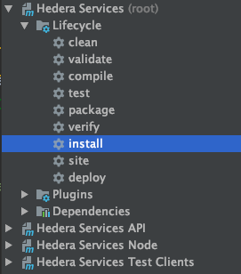
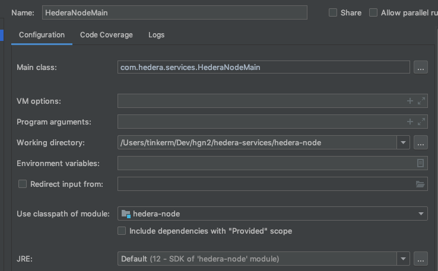
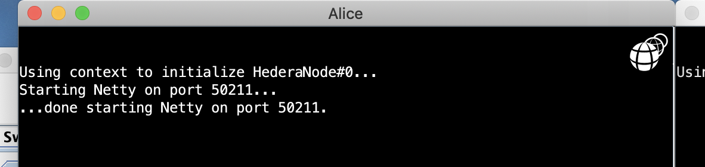
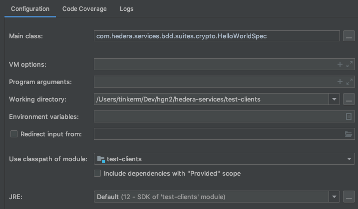

[](https://circleci.com/gh/hashgraph/hedera-services/tree/master)
[](https://codecov.io/gh/hashgraph/hedera-services)

# Hedera Services 

The child modules in this repository define and implement the API to the 
services offered by the nodes in the Hedera public network, which is built 
on the Swirlds Platform.

## Overview of child modules
* _hapi-proto/_ - protobuf defining the Hedera API.
* _hedera-node/_ - implementation of Hedera services on the Swirlds platform.
* _evm-adapter/_ - library adapting `ethereumj` components for use with Hedera.
* _test-clients/_ - client libraries for end-to-end testing of the Hedera network.

## JVM
OpenJDK12 is strongly recommended.

## PostgreSQL dependency
The current implementation of Swirlds Platform has a non-negotiable dependency
on PostgreSQL. Use the included
[Docker-based PostgreSQL setup guide](docs/POSTGRESQL_SETUP_GUIDE.md)
to ensure your local environment includes an appropriately configured
PostgreSQL instance.

## Solidity 
Hedera Contracts support `pragma solidity <=0.5.9`.

## Docker Compose quickstart 

The [Docker quickstart](docs/docker-quickstart.md) covers how to 
start a local network of Hedera Services nodes using Docker Compose.

## Developer IntelliJ quickstart 

*[This section presupposes basic familiarity with IntelliJ and Maven.]*

### Preliminaries

First, open the top-level *pom.xml* in IntelliJ as a new project.  Then 
run `mvn install` in the root:

<p>
    
</p>

This will both, 
<ol>
  <li>Build the <i>hedera-node/data/apps/HederaNode.jar</i>; and,
  <li>Populate your <i>hedera-node/data/config</i> directory with 
  default versions of the <i>application.properties</i> and 
  <i>api-permission.properties</i> files that are used to bootstrap 
  a new Hedera Services network.
</ol>

### Starting a local three-node network

Now browse to `com.hedera.services.HederaNodeMain`. Its
`main` method starts a network of Hedera Service nodes by 
calling `com.swirlds.platform.Browser#main`, which is the
entrypoint to bootstrap any Swirlds Platform apps.

Run `HederaNodeMain#main` with an IntelliJ configuration whose working 
directory is the _hedera-node/_ directory of your clone of this repo:

<p>
    
</p>

You will see three black panes appear, including:

<p>
    
</p>

This node's name is "Alice" because of [Line 26](hedera-node/config.txt#L26)
in the _config.txt_ present in your working directory. (This file determines the 
Swirlds Browser's startup sequence.) 

In fact, looking closer at _config.txt_, you can see that you are indeed running
Hedera Services (and not some other Swirlds app) because 
[Line 12](hedera-node/config.txt#L12) points to the JAR file you just built; 
and there are three nodes in your network because you specified "Bob" and "Carol" 
as well as "Alice".

In fact Alice, Bob, and Carol are all running on your local machine; and 
communicating via the loopback interface. But each still has a private 
instance of the Swirlds Platform, and keeps its own state, just as it would in a 
true distributed network.

### Submitting transactions to your local network

The _test-clients/_ directory in this repo contains a large number of 
end-to-end tests that Hedera engineering uses to validate the behavior of 
Hedera Services. Many of these tests are written in the style of a BDD 
specification. For example, browse to 
`com.hedera.services.bdd.suites.crypto.HelloWorldSpec`, which makes some minimal
assertions about the effects of a crypto transfer.

Run `HelloWorldSpec#main` with an IntelliJ configuration whose working 
directory is the _test-clients/_ directory of your clone of this repo:

<p>
    
</p>

Because [`node=localhost`](test-clients/src/main/resource/spec-default.properties)
in the _spec-default.properties_ controlling the `HelloWorldSpec` test, this
will run against your local network, culminating in logs similar to:

```
2020-01-31 15:42:21.299 INFO   170  HapiApiSpec - 'BalancesChangeOnTransfer' finished initial execution of HapiCryptoTransfer{sigs=2, payer=GENESIS, transfers=[0.0.1002 <- +1, 0.0.1001 -> -1]}
2020-01-31 15:42:21.302 INFO   80   HapiGetAccountBalance - 'BalancesChangeOnTransfer' - balance for 'sponsor': 999999999
2020-01-31 15:42:21.304 INFO   170  HapiApiSpec - 'BalancesChangeOnTransfer' finished initial execution of HapiGetAccountBalance{sigs=0, account=sponsor}
2020-01-31 15:42:21.307 INFO   80   HapiGetAccountBalance - 'BalancesChangeOnTransfer' - balance for 'beneficiary': 1000000001
2020-01-31 15:42:21.308 INFO   170  HapiApiSpec - 'BalancesChangeOnTransfer' finished initial execution of HapiGetAccountBalance{sigs=0, account=beneficiary}
2020-01-31 15:42:21.310 INFO   190  HapiApiSpec - 'BalancesChangeOnTransfer' - final status: PASSED!
2020-01-31 15:42:21.311 INFO   128  HelloWorldSpec - -------------- RESULTS OF HelloWorldSpec SUITE --------------
2020-01-31 15:42:21.311 INFO   130  HelloWorldSpec - Spec{name=BalancesChangeOnTransfer, status=PASSED}
``` 

### Helpful Maven goals
 The app writes a significant amount of audit and configuration data to the
local filesystem. This will, at best, lead to a noticeable amount of clutter 
over time; and, at worst, cause inconsistencies with the PostgreSQL state.  
Use the Maven `antrun:run@app-clean` goal in the `hedera-node` project
to delete the files generated by running local networks and tests.

