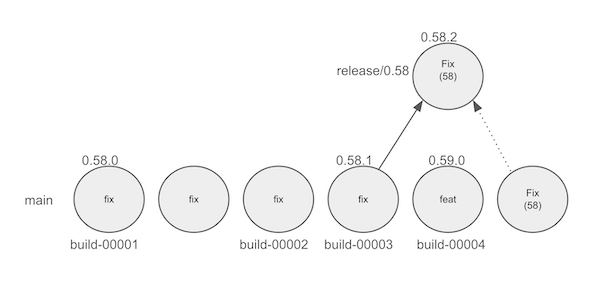

# Continuous Release Process

:construction: This process is under development. It will change concurrently as the various phases of CITR complete.

## Background

The Release Process within Hedera-Services will be changing beginning with Release 0.61. This will be the first step in
migrating to a fully automated release process with CITR.

### Historical Process

The release process within Hedera-Services has been using a release branching strategy that follows
a set development cycle:

| Stage                               | Duration        |
|-------------------------------------|-----------------|
| Planning                            | 12d             |
| Development                         | 26d (2 sprints) |
| **milestone** Create release branch | 0d              |
| Bugs & Fix                          | 12d             |
| **milestone** Create alpha tag      | 0d              |
| **milestone** Create final tag      | 0d              |
| **milestone** Deploy to previewnet  | 12d             |
| **milestone** Deploy to testnet     | 1d              |
| Perform migration testing           | 22d             |
| **milestone** Deploy to mainnet     | 7d              |
| Release Retrospective               | 1d              |

Each release takes approximately one calendar quarter to complete (from planning to retrospective).

### Relevant CITR Background

The continuous integration test and release (CITR) process has been being executed within Hedera-Services since Q3-2024.
As part of this process there is a minimal acceptable test suite (MATS) that runs against every pull request. Further,
there is an extended test suite (XTS) that runs on each commit to the `default branch` in Hedera-Services (`main`).
After MATS and XTS complete successfully the commit is tagged with a **build** tag (`build-XXXXX`). This tag is the
crux of the new release process and dictates what commit will be attached to a released build.

The changes being made to the release process will enable the build-number-driven release approach that will be
introduced in the later stages of CITR development.

Additional testing requirements will be added to the CITR process which will improve the confidence in quality
of the selected build. These include single day performance & single day longevity testing, as well as multi-day
longevity testing.

## CITR Release Process

The release process will be changing in the following areas beginning with `Release 0.61`:

| Stage                                                   | Duration |
|---------------------------------------------------------|----------|
| Planning                                                | 12d      |
| Development                                             | 26d      |
| [DEL] ~~**milestone** Create release branch~~           | ~~0d~~   |
| Bugs & Fix                                              | 12d      |
| [NEW] **milestone** Select candidate commit for release | 0d       |
| [NEW] Run the `[Main] Create New Release` workflow      | 0d       |
| **milestone** Deploy to preview net                     | 12d      |
| [DEL] ~~**milestone** Create alpha tag~~                | ~~0d~~   |
| [DEL] ~~**milestone** Create final tag~~                | 0d       |
| **milestone** Deploy to test net                        | 1d       |
| Perform migration testing                               | 22d      |
| **milestone** Deploy to main net                        | 7d       |
| Release Retrospective                                   | 1d       |

### Selecting a build candidate

The XTS workflow will tag a commit with a `build-xxxxx` tag upon successful completion.

The release managers will pull a release candidate from this set of tags.

The release managers will run the workflow `[Main] Create New Release`, specifying the build number, in order to
create the release tagged commit (v0.61.0 or similar)

**Note:** The build number is the actual number described in the build tag. The tag `build-00025` has a build number `25`.

This release tag (v0.61.0 or similar) is the tag that will be deployed to preview-net, test-net, and main-net.

If bugs are discovered in the build during release testing we can run `[Main] Create New Release` on a new build
candidate, as determined by the release managers.

**Note:** We can continue to select release candidates from the build candidates during this cycle
up to and until the `version.txt` files version is rolled to the next minor version (via the `[Main] Prepare Next
Release Version` workflow).

## Impacts for Developers

**Beginning with release 0.61**:

- The following items will be restricted:
  - Creating release branches in Hedera-Services (like release/0.61)
  - Creating versioned tags like (v0.61.*)
- The following workflows will be added:
  - `[Main] Create New Release` - Generate a release tag given an XTS passing build id.
  - `[Main] Prepare Next Release Version` - Roll the version specified in `version.txt` for the current development cycle on the default
    branch.
  - **Note**: Executing the `[Main] Prepare Next Release Version` workflow will modify the development state (ie: 0.61-SNAPSHOT to 0.62-SNAPSHOT)
    - To support executive vision, hedera-services developers should choose an internal version (different from the
      release version number) to determine when to migrate state.
- Release managers will need to choose a build candidate from a list of associated builds (recommendation will be the
  latest `build-xxxxx` tag).

**Implementing fixes after main rolls to the next version**:

| *Release Versioning Example*                                                     |
|----------------------------------------------------------------------------------|
|  |

During the standard development cycle candidate release builds will run through the CITR extended test suite. The latest passing build
every day is selected as a build candidate (`build-00003` in the above image). These tagged commits are the `release candidates` that the 
release managers will choose from when selecting which build number to run through the new release process.

When the release development cycle enters the bug & fix period:

- The `release candidate` commit will be running through performance testing.
- Developers will be working on both `release.current` and `release.next` efforts

In the above image, for example, `build-00004` is a build candidate under `release.next` that has major changes compared to `release.current`.
The commit `Fix(58)` is made to fix an issue discovered in perf testing. That commit contains code built on top of the `build-00004` commit and
cannot be included directly as a new release candidate as it contains features for `release.next`.

At this point `build-00004` would be the new `release.current` and `build-00003` becomes `release.previous`

In this scenario, we will need to [create a patch bump](#creating-a-patch-bump). The developers would need to reach out to `@hashgraph/platform-ci`
or `@hashgraph/release-engineering-managers` in order to facilitate adding a new release branch and for manual tagging efforts.

**Note**: Development would split into a `release.previous` line with patch bumps and `main` (the new `release.current`).

## Creating a patch bump

:warning: Contact `@hashgraph/platform-ci` or `@hashgraph/release-engineering-managers` prior to attempting to create a 
patch bump release.

:rotating_light: Attempting to cut a patch release where the history from the prior release contains a feature or 
breaking change will result in an unintentional minor bump. This could take several days to redact the incorrect release
and will prevent the next minor release from shipping. Requires intervention from `@hashgraph/platform-ci` and
`@hashgraph/release-engineering-managers`.

It is possible to create a patch bump after a build candidate has been released via the `[Main] Create New Release`
workflow. The release managers will need to select a new build candidate from the list of available builds. The selected
commit would need to match the [semantic release](https://semantic-release.gitbook.io/semantic-release) requirements for a
patch bump.

| Commit message                                                                                                 | Release Type                                                                                                     |
|----------------------------------------------------------------------------------------------------------------|------------------------------------------------------------------------------------------------------------------|
| fix(pencil): stop graphite breaking when too much pressure applied                                             | Patch/Fix Release                                                                                                |
| fix: stop graphite breaking when too much pressure applied                                                     | Patch/Fix Release                                                                                                |
| feat(pencil): add 'graphiteWidth' option                                                                       | Minor/Feature Release                                                                                            |
| feat: add 'graphiteWidth' option                                                                               | Minor/Feature Release                                                                                            |
| fix: remove graphiteWidth option  BREAKING CHANGE: The graphiteWidth option has been removed.          | Major/Breaking Release  (Note that the BREAKING CHANGE: token must be in the commit message description) |
| fix(pencil)!: remove graphiteWidth option  BREAKING CHANGE: The graphiteWidth option has been removed. | Major/Breaking Release  (Note that the BREAKING CHANGE: token must be in the commit message description) |
| feat!: remove graphiteWidth option                                                                             | Major/Breaking Release                                                                                           |
[Sourced from [semantic release gitbook](https://semantic-release.gitbook.io/semantic-release#commit-message-format)]

The CI workflows use [conventional commits](https://www.conventionalcommits.org/en/v1.0.0/) and semantic release to
determine the version to roll to when the `[Main] Create New Release` workflow is called. What this means is that
the commits on `main` between build-XXXXX (the selected build candidate) and build-YYYYY (the new build) must be `fix:`
commits so that a new patch bump version would be triggered.

There are also commit types that will not affect the version at all. These commit categories are:

- `chore:`
- `docs:`
- `ci:`

**Note**: If any `feat` commits or breaking change indicators have been added between passing builds the 
@hashgraph/release-engineering-managers and @hashgraph/platform-ci teams must be contacted and coordinated with in order
to generate a new patch release.
