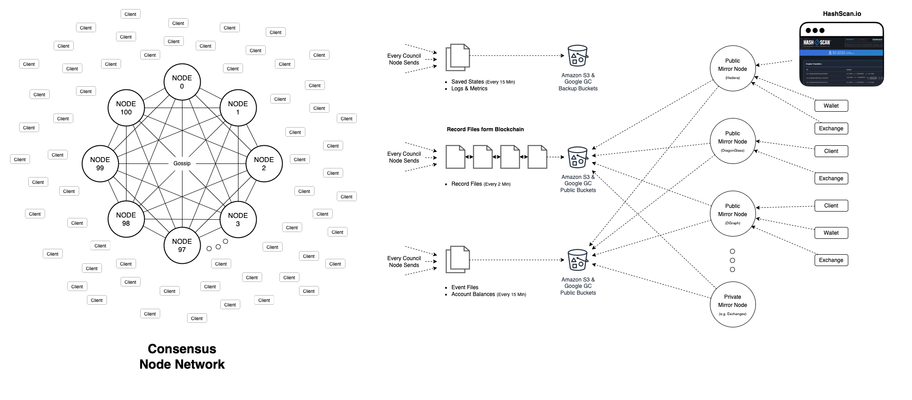

# System Design

This document details the system design for the Hedera Consensus Node software.

**WARNING: This document is a WIP and main contain inaccuracies, and is certainly not up to normal
standards for documentation.**

The Consensus Node is broadly made up of a collection of modules that form the "platform", and a collection of modules
that form the "application". Right now, this document is only going to cover the application modules, but in a more
complete set of documentation, it would also link to and cover the platform modules, and the interaction between
the platform and the application.


From a modularity perspective, the application modules depend upon the platform modules, and the platform modules
**do not** depend on the application modules. In some cases, there may be application modules that replace platform
modules, but as that is speculative and not currently implemented, no further mention is made of that here.

The application modules include the following:
 - `hedera-app`: The main application module. This is the entry point to the app. It ultimately depends on all modules
   that make up the Consensus Node, and no other modules depend on it. It is at the top of the dependency tree.
 - `hedera-app-spi`: This is the SPI for service modules. It defines APIs that are either implemented by the service
   module, or are implemented by the `hedera-app` module and passed to the service modules. In this way, code can be
   implemented by the app module and yet the service modules don't have to depend on that module, and they are isolated
   from the implementation details.
 - Service modules: for example `hedera-token-service` and `hedera-file-service`. Each service module is actually made
   up of two modules, its API module (for example `hedera-token-service-api`) and its implementation module
   (for example `hedera-token-service`). This is done to break circular dependencies and enforce strong API boundaries
   between the services, and to make it easy to have multiple implementations of any module.

The `hedera-app` module implements all core services and interfaces required by service modules to function properly.
It is broadly responsible for:
 - Networking and gRPC
 - Protobuf
 - Interfacing with the Hashgraph Platform
 - State management
 - Principle workflows (transaction ingestion, query handling, pre-consensus, handle-transaction)
 - Record stream management
 - Throttling
 - Fee handling
 - etc.

Each service module is broadly responsible for:
 - Defining APIs for working with the service at a POJO level, including any entities (for example *Account*)
 - Implementing logic for persisting entities into a Merkle tree (typically by `MerkleMap` or `VirtualMap`)
 - Implementing the service-specific query logic and transaction handling logic

**By design**, it is possible to completely and thoroughly test each service instance without running the entire
consensus node. Each service can be completely tested for all possible input and for the correct generation of
transaction records, and for all error conditions, without needing any of the actual functionality implemented by
`hedera-app`, or standing up a complete network.

## High Level Architecture



Our system comprises "Consensus Nodes" and "Mirror Nodes". A consensus node is responsible for gossiping with all other
consensus nodes to "come to consensus" on which transactions should be executed, and the order in which they should
be executed. Consensus nodes also maintain the current state of all entities (accounts, tokens, files, topics, etc.)
and execute transactions, in their consensus order, to mutate the state.

Clients use the Hedera API (HAPI) to submit transactions to the network. Periodically, the consensus nodes write their
entire state to S3 compatible buckets. They also make available logs and metrics. They also upload account balance
files. They also produce and upload two different blockchains -- the chain of "event" files (the raw events produced
by the hashgraph algorithm in consensus order), and the chain of "record" files (the raw transactions and their
computed impact on state -- did the transaction complete successfully, did it change the balance, etc).

Mirror nodes download the record files and index them into their own internal databases. They then make this state
available to clients through some kind of API. It may be a REST API, a GraphQL API, a Rosetta API, or some other API.

## The Service Provider Interface

`hedera-app-spi` defines the SPI (service provider interface) for service modules. This section gives a brief outline
of what each of the different APIs are intended for.

### Service

The `Service` interface is implemented by each service module, for each conceptual "service" it provides. Typically, a
service module has a single implementation of `Service`, but the `hedera-token-service` is more complicated and may have
several services. For example, it may have a `TokenService` and a `CryptoService`. For simplicity in mapping concepts to
code, we have a `Service` subtype for each different *service* in our protobuf schema definitions.

The actual implementation class for a service is in the corresponding implementation. For example, the
`hedera-token-service-api` module defines an `AccountService` interface that extends from `Service`, while the
`hedera-token-service` implementation module defines an implementation class such as `AccountServiceImpl`.

The `hedera-app` module has access to all modules, including implementation modules, and uses this ability to create,
at construction time, instances of each service implementation. We could have instead used a reflection-based approach
with `ServiceLoader` to try to load services dynamically, but we found the resulting code to be difficult to understand.
By design, we strive for simple code that we can easily debug with stack traces that are short and obviously meaningful.
The downside to this design is that it requires changes to code to add or remove new service module implementations.
We accept this downside for the time being. A future revision may institute a **simple** DI solution that does not
depend on reflection, outside from what the `ServiceLoader` does.

Each `Service` implementation takes in its constructor a `StateRegistry` which is used for setting up the service state
in the merkle tree. The `Service` also acts as a factory for `TransactionHandler`s, `PreTransactionHandler`s, and
`QueryHandler`s, and the main entrypoint into all API provided by the service module.

### State

The `com.hedera.node.app.spi.state` package contains APIs for a service module to interact with state. It was our
objective to limit, as much as reasonable, the information the service module has about the actual underlying merkle
tree. This was done for two reasons. First, access to the full merkle tree allows a service to "dig around" in the tree
and learn about other state and possibly depend on other state, outside its own *namespace*. For example, it would be
awful for service "A" to find and depend upon state of service "B" by going through the merkle tree itself. The proper
way to do this is to use the public API available on service "B". The second reason we try to abstract the details of
the underlying merkle implementation is to give us a greater degree of flexibility for re-entrant cases like when the
`hedera-smart-contract-service` uses a system contract to make a call to another service like `hedera-token-service`.

The final and strongest reason for introducing the classes in the `state` package is that it solves several of the
more challenging problems in the services code base: deciding which copy of the merkle tree state to use, buffering
all modifications the merkle tree, and keeping track of all state read from the merkle tree. Let's go through each
of these different core use cases and describe how the classes in `state` help with them.

#### Merkle Trees

All persistent state is stored in a "merkle tree". A merkle tree is simply a tree structure used to reduce the amount
of work needed to produce a "root hash" of all state in the tree (the tree caches the hashes of each node in the tree,
so when a single leaf changes, we only have to compute the new hash of the leaf and the hash of each parent node in
the tree to compute the new root hash). Performance can be improved by recomputing the root hash for multiple
modifications: that is, re-hashing the tree after every modification is slower than re-hashing every N modifications,
where N is a reasonably large value. We haven't empirically found the optimal number of N, but we have found that
when N is 10,000, it is faster than when N is 1.

We also need to periodically compare "root hashes" of the state with all nodes in the network, so make sure that
all node have matching state. Divergent state is a **very bad thing**, because it could mean that in the database
of one machine you have an hbar balance of X, while on another machine you have an hbar balance of Y! Differences in
the "state signature" of different machines is known as an ISS (inconsistent state signature).

The hashgraph algorithm works on `Event`s, sorting them and bundling them together into `Round`s. Each `Event` has
zero or more `PlatformTransaction`s. As each `Round` is produced, it is sent to the Hedera application to be handled.
On `Round` boundaries, the platform makes a "fast copy" of the merkle tree. A "fast copy" allows the application to
continue processing the next `Round`, while the `Round` that was just completed is hashed, signed, and gossiped with
all other nodes to compare signatures. Since hashing, signing, and gossiping takes time, this is done asynchronously.
Most of the tree is treated as copy-on-write for a fast-copy, but some parts of the tree are deep-copied.

At any given time, we may have a few 10's of "fast copies" in memory. The most recent is the "working" or "mutable"
state. This is the copy of the tree used by the handle-transaction thread and to which all modifications are made.
All other copies are immutable, and will throw exceptions if you attempt to modify them (actually, there is one
modification to the tree permitted after the fast copy is made, and that is to apply the hashes to the nodes in
the tree during the hash phase).

The next-most recent version of the tree is the "latest immutable state". This is the state used for answering queries
made by customers of the consensus nodes. It is also the state used in `pre-handle` (more on this later) for preparing
asynchronously, and ahead of time, transactions for processing.

Another older state is the one currently being gossiped to all other nodes in the network. And finally, if the node
is helping to "reconnect" another node, it will keep a copy of state in memory from which it "teaches" the other node
about the state.

Finally, while the "merkle tree" is a complex data structure, the service implementations actually don't need to know
or care about it at all. The merkle tree is an implementation detail of the application, not of the services. If each
service had to know about all these different states and which state it should use for which code path, the code would
become quite complex and prone to mistakes! Instead, we let the Hedera application be responsible for understanding this
complexity. Each service needs only a simple key-value store for storing data. So we created the `State` class as a
simple key-value store API which services can work with, and let the Hedera application implement this interface over
the right version of the merkle tree for the right calls. From the Service's perspective, it doesn't know anything
about any of these `Round`s or `Event`s or `PlatformTransaction`s or fast copies or mutable and immutable states. It
is simply given, by the application, the `State` to use for reading or writing.

#### States

`State` is a simple interface for a key-value data store. Each Service implementation may have one or more `State`s.
Each `State` is scoped to a particular Service implementation. They are never shared across Service implementations.
In fact, the `State` of a service **MUST NOT** be exposed as public API by any Service API. The state of a Service
is strictly an implementation detail of the Service.

From the `State` a Service implementation can:
 - `get` values from the k/v store
 - `getForModify` if it is reading the value for the purpose of subsequently modifying it (there is an optimized code
   path for this case)
 - `put` a new value
 - `remove` a value
 - get keys of all modified values with `modifiedKeys`

#### State Registry

When a Service instance is created, it is given a `StateRegistry`. Through this interface, the Service is able to manage
its `State`s. It can create and register new `State`s, and decide whether that state should reside in memory, or on
disk. It can also migrate state, or even delete state. The `StateRegistry` given to the Service instances is scoped to
that Service. It is not possible for one Service to look up `State` for another Service through the `StateRegistry`.
Each `State` is referenced by a "state key", which is likewise scoped to the `StateRegistry`. Two different Service
instances could use the same "state key" without naming collisions. Each `StateRegistry` is thus a unique namespace.

The following code is an example of a Service which makes use of the `StateRegistry` to create a new `State`. It makes
use of the `StateBuilder` to do so.

```java
public class MyService implements Service {
    public MyService(final StateRegistry registry) {
        // This call will either _get_ the state associated with MY_STATE, or it will _register_ the new state
        final var myState = registry.getOrRegister(
                "MY_STATE",
                (builder, existingStateOpt) -> {
                    if (existingStateOpt.isEmpty()) {
                        // This is a genesis condition -- the state does not already exist
                        return builder.inMemory("MY_STATE")
                                .build();
                    } else {
                        // Not genesis. If I needed to do a migration, I could do it here. For example, I could
                        // move from in-memory to on-disk by creating a new on-disk version and moving data over,
                        // or I could walk through my state and make necessary modifications.
                        return existingStateOpt.get();
                    }
                });
    }
}
```

The `StateRegistry`, `StateRegistryCallback`, and `StateBuilder` are used together to create and manage the state for
the service. A service may have multiple states. Maybe the `hedera-token-service` has a state for `Account` entities,
and another for `Token`s, and another for `AccountNft`s, and so on.

### Handling Transactions

As consensus nodes receive new transactions, they bundle them up in an `Event` and gossip this event with the network,
so they may eventually come to consensus and each node may then handle the transactions in a fair, deterministic
order. Each node gossips events asynchronously and in parallel, with the hashgraph algorithm sorting them into fair
order. Once a `Round` of `Event`s is produced, nodes can begin processing those `Event`s and their transactions in
order.

Each `Service` implementation provides three "handlers": a `QueryHandler`, a `PreTransactionHandler`, and a
`TransactionHandler`. Each of these handlers define a concrete set of methods for handling different types of queries,
for handling different types of transactions. For example, `ConsensusPreTransactionHandler` (for the Hedera Consensus
Service) might have a method `TransactionMetadata preHandleCreateTopic(TransactionBody txn)` which is called to
pre-handle a "create topic" transaction. Likewise, the `ConsensusTransactionHandler` may have a method called
`handleCreateTopic` for handling the "create topic" transaction after it has come to consensus.

The application module invokes these handlers with the correct arguments at the correct time and on the correct
thread, depending on the workflow. A query is initially handled by gRPC logic in the application module, which then
looks up the appropriate service module based on the URL of the request. It then finds the `QueryHandler` for the
service, and looks up the appropriate method (based on the gRPC request), and invokes it. The application has error
handling for many kinds of exceptions, and is responsible for marshalling the response.

**Crucially**, the service module knows **nothing** about gRPC! The service module wants to live at the level of simple
POJOs and business logic, without any knowledge or concern about how it was invoked or who invoke it. It just does its
business, throws exceptions if needed, and otherwise lives in blissful ignorance. This philosophy applies to all code
in the service, including the other handlers, and not only the `QueryHandler`.

The methods in `QueryHandler`s, `PreTransactionHandler`s, and `TransactionHandler`s need some contextual information
to perform their work. For example, some queries are paid queries, and need a way for the query transaction to be
submitted to the hashgraph platform for consensus so the query can be paid. All transaction handlers need to be given
some state to work with (sometimes this state will be the latest immutable state, sometimes the current mutable state),
a simple API to work with the throttle engine, and a way to accumulate fees to be paid upon success of the transaction.
They also need some way to create records to be added to the record stream. APIs for these components are defined in the
SPI module, and implemented by the application, and supplied to the handlers at the time they are invoked.

##### RecordBuilder

When a service handles a transaction, or a paid query, it must construct a `TransactionRecord` to be collected and sent
to mirror nodes. We handle this by passing a `RecordBuilder` to the handle methods for transactions and paid queries.
They can then store the necessary state that gets turned into a `TransactionReceipt` and `TransactionRecord`. You may
be surprised to find that `RecordBuilder` itself is marker interface with no methods on it! This is intentional.
Each API in `hedera-app-spi` **only exposes the API needed to interface between the app and service modules**. There
is no `build` method on `RecordBuilder`, because the implementation of `RecordBuilder` lies with `hedera-app` and
services never have a need to build and inspect the resulting `TransactionRecord`. So we don't provide a build method
as part of that API (you will note that the `RecordBuilderImpl`, which is private to the `hedera-app` module, does
in fact provide such an API).

**By design**, we limit the SPI to just the minimal necessary.

One problem that we had to deal with comes from the protobuf definition for `TransactionRecord`. It (and
`TransactionReceipt`) has a hodgepodge of fields from different services mushed into one interface. If `RecordBuilder`
had exposed all those APIs, it would have broken all kinds of module boundaries and created circular dependencies.
Instead, each service module can define its own `RecordBuilder` subclass, adding just the API that it needs to be able
to add to a record. For example, the `hedera-token-service-api` defines the following records:
 - `CreateAccountRecordBuilder`
 - `CreateTokenRecordBuilder`
 - `TokenRecordBuilder`
 - `TokenTransferRecordBuilder`
 - `TransferRecordBuilder`

Different transaction or query handling methods take different builders. (In actuality our single `RecordBuilderImpl`
implements all these interfaces and can produce a single `TransactionRecord`). The reason we break these builders down
in such a granular way, is to make it as *foolproof* as possible to implement the handle transaction methods. The
builder exposes just the amount of API that it should, and no more.

##### FeeAccumulator

The `FeeAccumulator` interface is implemented by `hedera-app` and passed to the service in the `HandleContext`. The
service module must `accumulate` its fees in the accumulator. This is trivial to do:

```
feeAccumulator.accumulate(HederaFunctionality.CRYPTO_CREATE_ACCOUNT);
```

In some cases it may be necessary for a service to accumulate fees and only "apply" them to the main accumulator on
some criteria (such as success). When a smart contract needs to call a system contract for token create, it needs to
buffer its own fee accumulator in case the token create call fails. This can be accomplished by using a simple
buffering implementation of the `FeeAccumulator` interface.

##### EntityIdGenerator

Some transactions result in the creation of new entities. All entities get an entity ID from the same pool of
numbers (we do not have a separate namespace for entity IDs for accounts and files and contracts -- we always use
the same incrementing long value for all entities). The `EntityIdGenerator`, passed to handlers, gives the
service the ability to generate new sequential IDs for use with new entities. The value is trivially rolled back
in case of an error (in fact, we simply don't commit the new `nextEntityId` unless we have success. On failure, we
just throw it away and start over with the last good value).

##### ThrottleAccumulator

TBD: I'm not sure that `ThrottleAccumulator` belongs in the SPI at all. It may be that we can let this be an
implementation detail of the `HandleTransactionDispatcherImpl`. The key thing is that we must be able to throttle during
the handle-transaction phase on the handle-transaction thread, and we must be able to do this in a re-entrant way
if a Smart Contract calls, for example, Token Create or some other operation. Maybe every single handle method should
check the throttle, or maybe not. I kind of think it should, which is why I have it here. But maybe not, maybe that
is a function the app can provide (i.e. maybe services can be implemented without having to think about throttles).

##### TransactionMetadata

Transactions are first handled as part of "pre-handle". This happens with multiple background threads. Any state read
or computed as part of this pre-handle, including any errors, are captured in the `TransactionMetadata`. This is then
made available to the transaction during the "handle" phase as part of the `HandleContext`.

#### HandleTransactionDispatcher

This interface allows a service to dispatch a transaction to another service in an automated way. The utility of this
interface is somewhat suspect. It would be very helpful for something like a *BatchTransaction* (which doesn't exist
but is under discussion). It is probably not particularly useful for Smart Contracts, because each system contract
can just directly call the service that it wants to use.

#### TransactionHandler and QueryHandler

These two interfaces are simple marker interfaces with no methods on them. Sub interfaces of `Service` define more
specific subtypes of `TransactionHandler` and `QueryHandler` with concrete method definitions. In general, each
of these handlers should define the full set of methods defined on the protobuf service definitions corresponding
to either a transaction or query. They may implement additional methods.

For example, the `CryptoTransactionHandler` defines `createAccount`, `updateAccount`, `cryptoTransfer` and so on.
But it also defines `createGenesisAccount` which is a special method called during the genesis workflows for creating
initial genesis accounts, and `finalizeTransfers` which is used as part of the handle-transaction workflow. A service
may implement *ANY* public API that is appropriate for the service.

There are a couple key concepts:
 1. A single instance of `TransactionHandler` or `QueryHandler` is tied to a single version of merkle state. It is
    possible for a handler to be reused for multiple calls, or it may be created fresh for each call -- the exact
    semantics are an implementation detail and not something the service should depend on. What the service *can*
    depend on, is that the handler instance is always tied to single version of the merkle tree.
 2. A single instance of `TransactionHandler` or `QueryHandler` will only ever be accessed from a single thread. There
    is no need for any volatile or thread safe code. This is done to reduce the number of potential bugs.

## The Application Module

The main entrypoint of the application is the `Hedera` class. This class is not set up the way it should be, based on
today's Platform APIs, but shows a little of what it should look like once we are able to create a `Platform` object
directly instead of using the `Browser`.

The ideal situation is for `Hedera` to have a main method that is used to launch the app (and not `Browser`). In our
tests, we should be able to create multiple `Hedera` instances with different configuration, so we can fire up a
network right within our test code, if we wanted to, and provide other kinds of configuration changes as we need.

The `Hedera` class would therefore take a `Platform`, and have the code needed to configure and setup all the other
workflows and components.

The follow subpackages contain implementation details:
 - `fee`: An implementation of `FeeAccumulator` and other fee engine components go here (mostly not there yet)
 - `grpc`: Components for handling gRPC. An example is there now, which is disabled because `Netty` isn't JPMS friendly
 - `record`: The `RecordStreamManager` is here, along with an implementation of the `RecordBuilder` interfaces
 - `state`: Classes that implement the SPI interfaces for `State` and `StateRegistry`, etc., and the `SwirldsState2`
 - `throttle`: The implementation of the `ThrottleAccumulator` and the throttle engine (most of which isn't there yet)
 - `workflows`: Classes for the various workflows such as `HandleTransactionWorkflow`, `QueryWorkflow`, `IngestWorkflow`

### Fee

This package would contain code related to the fee engine. The `FeeSchedule` is defined in the protobuf, and in theory
saved in some file on the ledger. Code in the `fee` package would pay attention to changes to this file and use it
for implementing the `FeeAccumulator`. The code in this package right now is just a placeholder.

### gRPC

gRPC is a simple protocol built on top of HTTP/2. The typical way of working with gRPC is to use the `protoc` compiler
to generate stubs for each method in a gRPC service. The stubs take pre-parsed protobuf objects and return protobuf
objects and all serialization is handled by the framework. This doesn't work all that well for us.

When we receive a gRPC request for paid queries or for any transaction, we need the raw bytes to send to the hashgraph
platform for consensus. We would like to get the raw bytes from the gRPC request, not pre-parsed objects. We also have
our own highly tuned protobuf parsing library that generates nearly no garbage, and we would like to use it for parsing
rather than the code generated by `protoc`. For these reasons, the built-in gRPC frameworks are of little to use to us.

It turns out that gRPC is an extremely simple API built on top of HTTP/2, and we can therefore have our own simple gRPC
framework built on top of an HTTP/2 server (like Netty) and get everything we want.

### Record

The `RecordStreamManager` is not implemented in this POC, but has a simple method that it exposes:
`submit(TransactionRecord)`. Internally it keeps track of last-consensus-time and can see in the transaction record what
the consensus time is, and therefore knows deterministically when to produce a record file. The entire process of
batching them together and sending records is handled by the `RecordStreamManager` (implementation TBD).

The `RecordBuilderImpl` implements all known `RecordBuilder` subtypes. The implementation you see there is a stub,
but you can easily imagine the implementation.

### State

This package defines an interface, `HederaState`, which represents the root of the merkle tree. This interface does
**not** expose its "merkle-ness", nor does it implement any Hashgraph Platform APIs. It is a simple conceptual
interface. This helps to isolate merkle-tree concepts and keep things simple for testing code. The implementation of
`HederaState` is `HederaStateImpl`, and it actually implements `SwirldsState2`. The current implementation is a farce,
it needs to handle pre-handle and handle, but that will all change as the platform is updated, until it is eventually
very similar in concept to what I have here.

This package also has implementations of `State`, `States`, `StateRegistry`, and so forth. It supports both an
in-memory state (based on `MerkleMap`) and an on-disk state (based on `VirtualMap`).

### Throttle

The throttle package would contain the implementation of the Throttle system, including an implementation of the
`ThrottleAccumulator`.

### Workflows

This package and subpackages contain the workflows that are implemented by the application. The other packages
contain libraries and utilities, but this package contains all the actual workflows. If you want to know how the
application implements pre-handle, or handle, or queries, or auto-renew and expiry, or transaction ingestion, then
you have found the right place.

**By design** the workflows are set up to be trivial to walk through and understand, and to align almost 1-1 with
drawn diagrams. They are designed to be easily testable in isolation of a full working system, including all error
conditions and other situations. A real implementation would have hundreds of tests of every conceivable input.

#### Ingest

The `ingest` package contains the workflow utilized for submitting transactions to a consensus node. There is
quite a lot of documentation on the classes, and I hope they are still mostly accurate! You will notice that these
classes, like almost **all** classes in this code base, use *final* fields and constructors given all the required
args.

#### Query

The `query` package contains the workflow for handling queries. I don't know how accurate this package is right now,
a lot has changed and I haven't looked at it recently.

#### Pre-Handle

The `prehandle` package contains the workflow for pre-handling transactions. This hasn't been updated recently, so
take the implementation as a rough sketch. An `Event` at a time is sent to the `prehandle`, and then it iterates through
each transaction, possibly using multiple threads. Each transaction gets its own `TransactionMetadata` which ends up
being set on the `SwirldsTransaction` object. Later, when we do handle-transaction, we can access this metadata.

#### Handle

The `handle` package is where the handle-transaction logic lives. This is also not fully fleshed out as of right now,
but has enough to give the general feeling for how it would work.

For each transaction, we create:
1. A new `FeeAccumulator` from a factory method supplied by the `Hedera` object when it created this workflow. We need
   a factory because we need a new instance each time, but want one associated with the current working state. Because
   the concrete implementation should not be created by this code directly, and because the fee schedule may change
   periodically based on some other transaction, we delegate to a factory to create these instances.
2. A new `RecordBuilderImpl`.
3. An `AtomicLong` of the `nextId` for entities. This is used to implement the lambda for `EntityIdGenerator`.
4. An internal helper class, `StatesAccessor`, which is basically a map of all `States` accessed during the transaction.
   This is critical, because during transaction handling we need to buffer up all changes in the `State` objects that
   are retrieved by `States`, so at the end if everything goes well, we can commit it all.
5. A new `HandleContext`

Now that we have a `HandleContext`, we will dispatch it to the appropriate service to handle. The service will use
the `FeeAccumulator` and `States` and other information to execute the transaction. If something goes wrong with the
transaction, it is expected to throw an exception. If no exception is thrown, then the transaction has completed
correctly.

The next step is to "finalize" the transaction fees, transfers, and rewards. A special method in
`CryptoTransactionHandler` called `finalizeTransfers` is handed the `FeeAccumulator` and a `TransferRecordBuilder`
(this is the same record builder we created at the start of the transaction, since among all other types, it
implements `TransferRecordBuilder`). The `CryptoTransactionHandler` we use has the same state as the handle transaction,
so if any accounts were touched, it will know about them.

The implementation of `finalizeTransfers` asks the `AccountStore` (and implementation detail of `hedera-token-service`)
for all `Account`s that were modified during the transaction. It has these, because the `AccountStore` is backed by
`States`, which buffer changes and have not yet been merged back into the merkle tree. Given this list of modified
`Accounts` and the `FeeAccumulator`, `finalizeTransfers` will compute all fees and rewards and modify all accounts
appropriately, and write all transfer details into the `TransferRecordBuilder`.

After this call completes, every change has been made that should be made. We can now flush all changes that have
been buffered up into the merkle tree, and submit the `TransactionRecord` to the `RecordStreamManager`.

Should anything go wrong along the way, we will take appropriate action. I do not have all those error paths stubbed
out yet. If the transaction handling fails, we still want to charge accounts in some ways and produce a record. If it
fails in other ways (for example, if we fail to update the merkle state or produce a transaction record or something
strange like that) then we have an unhandled error which can be fatal. Great care is taken in these code paths and
a great deal of testing to make sure they are rock solid.

## Note on Pre-Handle and Handle

One of the design discussions that we had was how to design pre-handle in a way that we could potentially do everything
in a multithreaded way. Although the `TransactionMetadata` would support an architecture like that, I explicitly 
**DID NOT** design the rest of the system to support this. We may be able to do so, but I was worried about memory,
locking, and thread synchronization becoming bottlenecks. I'm still fairly unhappy with the amount of garbage I'm
generating per transaction, but I believe the current architecture does have opportunity for re-use, which we lose if
we do everything a multithreaded way. However, I tried to keep an architecture loosely coupled enough that we
maybe be able to pull it off, if we so desire.