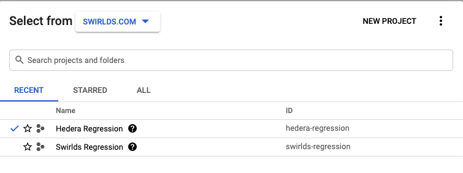

# GCP SetUp for JRS Testing
# **Table of Contents**

- [Pre set up](#pre-setup)
- [Initial set up](#initial-setup)
- [Gcloud set up](#gcloud-setup)
- [Personal JSON set up for regression](#json-setup)
- [Creating instances manually](#manual-creation)
- [Deleting instance manually](#delete-manually)

# **Pre set up**
1. Follow directions in e-mail `Welcome to your new Google Account for Hashgraph` from `google workspace team`. You will need either a physical security or google to use your cell phone for 2FA.
2. Send your public key you are planning to use to GCP admin in order to make sure you can access all machines.

# **Initial set up**
1. Go to `console.cloud.google.com`.
2. Login with your `hedera.com` email address to use.
3. Agree to the terms. 
   

4. Click on `Select a Project` on the top most menu. 
   

5. Select `Swirlds.com -> Hedera Regression`. If you do not see `Hedera Regression` click on the “ALL” tab and follow the folders down till you find `Hedera Regression`.

# **Gcloud set up**
To run regression from your computer you will need to install gcloud on your computer

1. Follow the instructions to install the sdk for your OS at [LINK](https://cloud.google.com/sdk/docs/install).
2. After successful installation, open terminal or command prompt and  run `gcloud init`.
3. When asked to login agree: `Y`.
4. It provides a link to login. Follow the link in browser (make sure you are logged into browser with your hedera.com gmail account).
    - Click Allow, if `Google Cloud SDK wants to access the Google Account`. 
    - Copy Code you are given.
    - Paste into the waiting field on command prompt.

5. Pick the cloud project to use as `hedera-regression`.
6. Configure default compute region, by selecting `Y` and pick `us-east1-c`.

# **Personal JSON set up for regression**
As defined in the example below, set up your personal JSON with the following details.
1. `name` should be GCP-Personal-<USER_NAME>.
2. `keyLocation` provide the location of `pem` file. Please ensure the `.pem` extension is added to your private key.
3. `login` should match your hedera email address prefix.

# **Creating instances manually**

JRS provisions instances for the regression tests. If in any case, we need to create instances manually follow the steps below.
1. Go to `console.cloud.google.com`. From the main menu `Google Cloud Platform` go to `Compute Engine -> Instance Groups`.
2. Click `Create instance group` at the top.
3. Select the following options:
    - Name: `<username>-<branchname>-<year><month><day><militarytime>`.
    - Select Single Zone.   
    - Region: select the region eg: us-east1.
    - Instance template:  select the highest numbered `atf-node-instance-template`. 
        - Currently `atf-node-instance-template-9-256hd` is used for servers.
        - Currently `atf-node-instance-template-9-10hd-4cpu-8mem` is used for clients.
    - Autoscaling mode: select `Don’t autoscale`.
    - Number of Instances: Depending on the instance group being created for servers or clients, select the number of instances to be provisioned. This option can’t be set until autoscale is turned off.
      - Provide number of server nodes + zero stake nodes for server instance group.
      - Provide number of test clients for client instance group.
        
 

4. Click on Create.
5. Click on `VM Instances` on left-hand menu to see individual instances and get IP addresses.
   
**NOTE:** Two separate instance groups should be created for servers and clients for services regression.

**NOTE:** Individual instances inside an instance group can't be deleted. You must delete the group from `Instance Groups` page.

# **Deleting instances manually**

JRS shuts down the instances provisioned at the end of test. Sometimes if the user kills the test run in the middle or if the controlling machine loses connection, google cloud instances are not shut down. In this scenario delete the instances manually by following the steps below.

1. From the main menu in `Google Cloud Platform` go to ` Compute Engine -> Instance Groups`.
2. Select the groups with your name that should not be running.
3. Click `Delete` on the top menu.