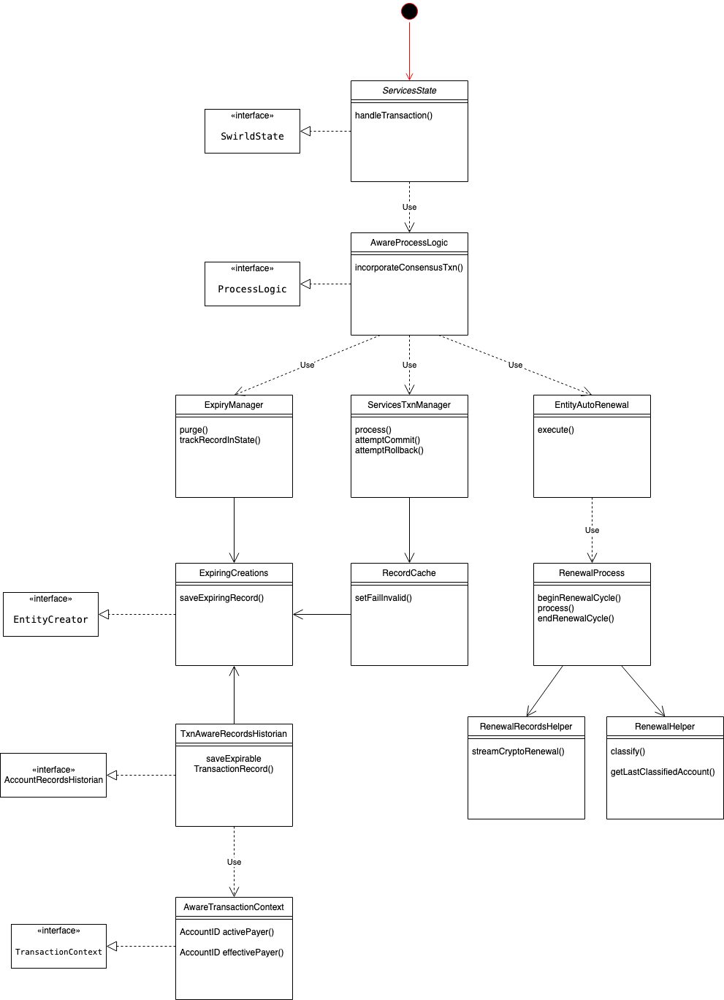
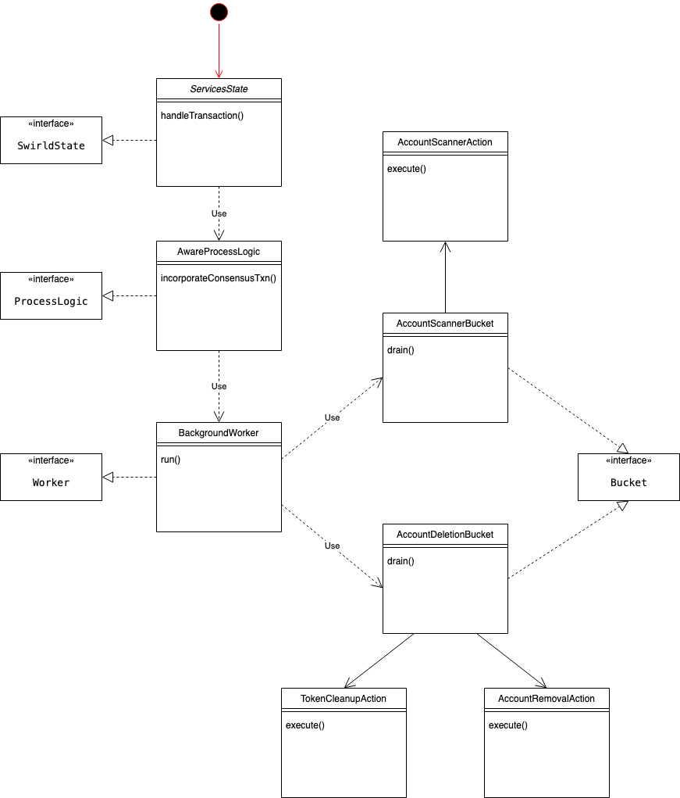
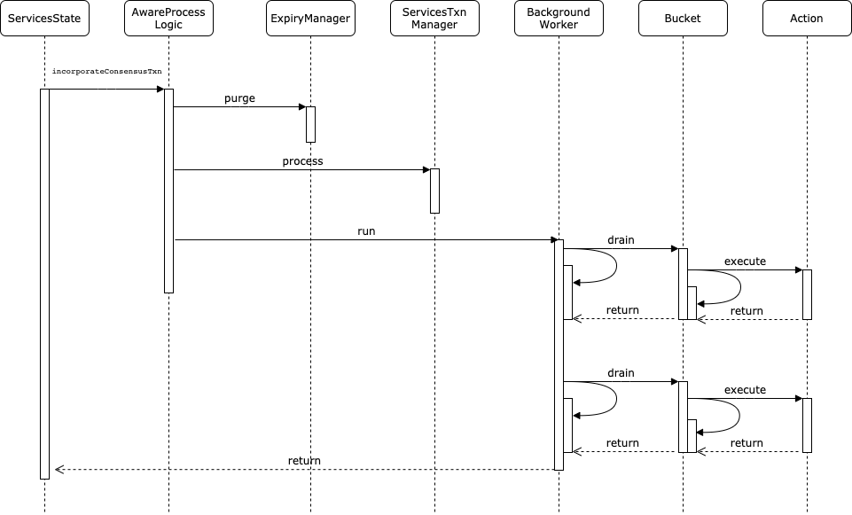

# Entity Renewal and Expiry Design

## Overview

Currently, Hedera services node has one way of expiring/renewing entities, which is not flexible. At the moment of
writing, it supports records, scheduled transactions and account expiration/renewal. During the process of transaction
handling there are two business logics that currently happen before and after the actual transaction processing:

- `Before`: Purging any references to expired entities (records and schedules)
- `After`: AutoRenewal execution of accounts

From design point of view there are no issues reported during the purging phase of Hedera transaction handling process.
However there is no expiration for tokens/topics and proper handling of NFTs. This proposal design shows the new
architecture behind AutoRenewal of accounts and its capabilities to be used for tokens (fungible and non-fungible)
expiry and auto renewal. We're considering the following logical framework in order to support a more generic expiration
handling, with those **main** elements:

-------------

### Worker

The worker is Hedera's vision of a background process - a process which is executed often enough. The current
expiries/renewals for accounts are triggered on each transaction. The background worker is responsible for executing all
actions during the post-transaction phase. This is possible because of the bucket abstraction implied.

Below is `Worker` functional interface:

```java
interface Worker {
	boolean run(long consensusTimeStamp);
}
```

This method implementation will iterate over all buckets and execute the determined actions. The worker will also pass
the available network capacity through the Throttling system to each bucket.

-------------

### Bucket

The bucket is a logical group of executable actions, grouped by common functionality. A bucket's responsibility may be
account scanner and deletion. New buckets can be introduced in future for token scanning and removal.

For migrating the current expiry/renewal account implementation, we might consider 2 types of buckets
- `AccountScannerBucket` and `AccountDeletionBucket`.

Below is `Bucket` functional interface:

```java
interface Bucket {
	/* Returns the capacity used by this work. */
	Capacity drain(long consensusTimeStamp, Capacity available);
}
```

The implementation `AccountScannerBucket` will be responsible for:

- iteration over all merkle accounts
- for every iteration (entity touch) the capacity will be depleted
- determination of action for each account loaded from state. The returned actions must be only for scanning purposes.
  For instance if account must be renewed, `Renew` action will be returned
- action execution

Pseudo code of the drain method:

````java
class AccountScannerBucket {
	public Capacity drain(long consensusTimeStamp, Capacity available) {
		while (hasEnoughCapacity(available)) {
			MerkleAccount account = loadAccount(++lastScannedEntity);
			Option<Action> action = determineAction(account, now);

			if (!action.isEmpty() && hasAvailableCapacity(availability, action.requiredCapacity())) {
              			action.execute();
              			availability -= action.requiredCapacity() + action.requiredCapacity() * throttleLoad();
              			lastScannedEntity = accountNum;
			}
		}

		return available;
	}
}
````

The implementation of `AccountDeletionBucket` will be responsible for:

- iteration over all account relations
- for every iteration (entity touch) the capacity will be depleted
- determination of action for each merkle account loaded from state
- action execution
- removal of account from `MerkleNetworkContext` queue

Pseudo code of the drain method:

````java
class AccountDeletionBucket {
	public Capacity drain(long consensusTimeStamp, Capacity available) {
		while (hasEnoughCapacity(available)) {
			EntityId accountId = getNextRelationForProcessing();
			MerkleAccount merkleAccount = accounts.get(accountId);
			Action action = determineAction(merkleAccount);

			if (hasAvailableCapacity(availability, action.requiredCapacity())) {
				action.execute();
				available -= action.requiredCapacity();
			}
		}

		return available;
	}
}
````

-------------

### Action

An action is an abstraction of an executable task (business logic) which should be performed in order to expire/renew an
account in atomic way. Each action should be scoped to a single entity. Some actions will be too time consuming to be
executed as part of Hedera transaction. An example for that is an account that has expired and the grace period has
passed.

For migrating the current expiry/renewal account implementation, we might consider 3 types of actions
- `AccountScannerAction`, `AccountRemovalAction` and `TokenCleanupAction`.

Below is `Action` functional interface:

```java
interface Action {
	/* Returns the required capacity of the Action */
	Capacity requiredCapacity();

	/* Performs the action */
	void execute();
}
```

The implementation `AccountScannerAction` will be responsible for:

- add account for reletationship removal to `MerkleNetworkContext` new `Queue<AccountNum>`

Pseudo code of execute method:

````java
class AccountScannerAction {
	public execute() {
		merkleNetworkContext.addAccountForRelRemoval(accountNum);
	}
}
````

The implementation `AccountRemovalAction` will be responsible for:

- removal from `FCMap<MerkleEntityId, MerkleAccount> accounts`
- remove account from `MerkleNetworkContext` new `Queue<AccountNum>`

Pseudo code of execute method:

````java
class AccountRemovalAction {
	public execute() {
		FCMap<MerkleEntityId, MerkleAccount> accounts = getAccounts();
		accounts.remove(accountNum);
		merkleNetworkContext.removeAccountForRelRemoval(accountNum);
	}
}
````

The implementation `TokenCleanupAction` will be responsible for:

- iterate over account tokens while checking for available capacity
- retrieving Merkle token
- send token from account to treasury
- remove account to token association
- delete token from FCMap

Pseudo code of execute method:

````java
class TokenCleanupAction {
	public execute() {
		while (hasEnoughCapacity(available)) {
			long tokenId = merkleAccount.tokens().getRawIds()[0];
			MerkleToken token = tokens().get(tokenId);
			transferToken(accountId, treasury);
			MerkleEntityAssociation mea = new MerkleEntityAssociation(accountId, tokenId);
			tokenAssociations().remove(mea);
          merkleAccount.tokens().remove(0);
        }
      FCMap<MerkleEntityId, MerkleAccount> accounts = getAccounts();
      accounts.remove(accountNum);
      merkleNetworkContext.removeAccountForRelRemoval(accountNum);
    }
}
````

-------------

### Capacity

The throttling system provides information on the current Hedera transaction load of the network. We can assume what's
left from the throttle is related to the worker capacity. When the usage of the throttle increases, the worker's
capacity should decrease accordingly. The capacity of the worker should be split into the buckets. It's important to
note some buckets should have more capacity than others.

Below is `Capacity` functional interface:

```java
interface Capacity {
  long available();
}
```

This data represented as long value can be utilized during Hedera transaction and passed to the worker for
re-calculation. This availability number must be the same for both reads and writes. Different fractions of this number
will be assigned to all buckets. Each specific action is going to provide a long availability number based on the
steps/work it needs to process. Once action completes, this number is going to be substracted from the overall worker
capacity.

As global dynamic properties we'll have two weights:

- touch/read
- update/write

Update is a manipulation which changes the state, thus it should be more expensive compared to reading.

MAX_CAPACITY integer is always required for the worker. It may be depicted as 100% or just integer MAX_CAPACITY with
value 100

Options for translating the throttling load to worker capacity are:

1. Reduce MAX_CAPACITY
2. Increase action's required capacity

Update operations should have higher execution priority. Given the opposite, we will clog the system with operations, as
the amount of work generated would never be finished in single Hedera transaction.

#### Bucket capacity metrics

| bucket                | description                                              | capacity            |
|-----------------------|----------------------------------------------------------|---------------------|
| AccountScannerBucket  | Bucket for account search and last scanner entity update | 30% worker capacity |
| AccountDeletionBucket | Bucket for account deletion and token cleanup            | 70% worker capacity |

#### Action capacity metrics

| action               | bucket                | description                                                                                                                               | capacity |
|----------------------|-----------------------|-------------------------------------------------------------------------------------------------------------------------------------------|----------|
| AccountScannerAction | AccountScannerBucket  | 1.Add account for relationship removal to MerkleNetworkContext queue                                                                      | 1% bucket capacity      |
| AccountRemovalAction | AccountDeletionBucket | 1.Get all accounts; 2.Remove account from FCMap; 3.Delete account relation from MerkleNetworkContext queue                                | 5% bucket capacity      |
| TokenCleanupAction   | AccountDeletionBucket | 1.Retrieve MerkleToken; 2.Transfer token from expired account to treasury; 3.Remove token associations; 4.Delete token from MerkleAccount | 7% bucket capacity      |

-------------

### Events, which require actions:

* `Account Expiration` - expired accounts are classified as renewable or not. The second type should be handled by
  clearing all relations to tokens, returning balances to treasuries and finally deleting the account.

* `Account Renewal` - expired accounts with balance - Renewable accounts. If the balance is sufficient, the account is
  enabled again.

-------------

### Current UML class diagram



-------------

### New Design UML class diagram



-------------

### UML sequence diagram


