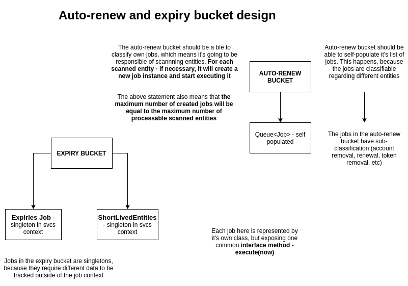
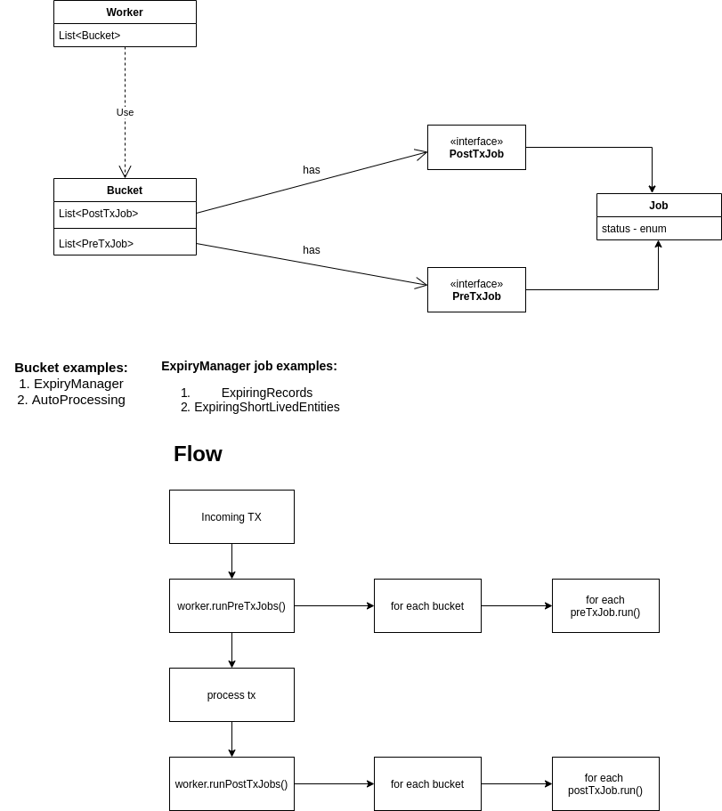
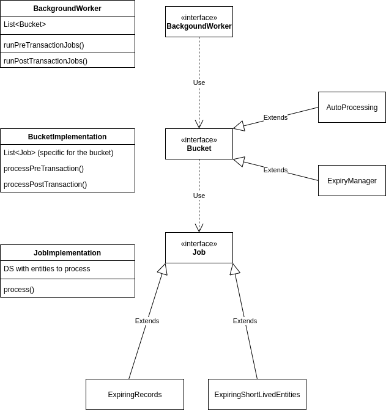

# Entity Renewal and Expiry Framework

Currently, the hedera services node has one way of expiring/renewing entities, which is not flexible. At the moment of writing, it supports records, scheduled transactions (lightweight entities) and account expiration/renewal. There is no expiration for tokens/topics, etc.

We're considering the following logical framework in order to support a more generic expiration handling, with those **main** elements: 

## Background Worker:

The background worker is hedera's vision of background process - a process which is executed often enough. The current expiries/renewals are triggered on each transaction. They can be split into 2 types - atomic  and non-atomic.
The background worker is responsible for executing each set of jobs pre- and post-transaction. This is possible because of the bucket abstraction.
The `HederaBackgroundWorker` will be a singleton, and will have 2 important methods:
- `executePreTransactionJobs` - where the jobs are atomic. We can also prepare other jobs before the actual transaction processing, and process them after the transaction.
- `executePostTransactionJobs` - where the jobs are not atomic, and may span in multiple transactions.
Both methods will iterate over the buckets and execute the said jobs in the bucket.

## Bucket:
The bucket is a logical group of executable tasks - jobs, grouped by common functionality. A bucket's responsibility may be lightweight entities, or heavyweight.

For migrating the current expiry/renewal, we must consider 2 types of bucket - `ExpiryManager` and `AutoProcessing` . The expiry bucket will be responsible of handling scheduled txns and txn records, while the auto-processing - expiry/renewal of tokens and accounts.
By having the bucket abstraction, it is possible to define expiration or renewal for more entities - we're not limited to tokens/accounts.
Each bucket should also be a singleton, but it's implementation regarding `job` organization and execution may vary a bit.

## Job:
A job is an abstraction of an executable task which should be performed in order to expire/renew an entity. The `Job` interface exposes a single method:
```java
interface Job {
	boolean execute(long now);
}
```
which is responsible of handling all the business logic of the job.
Each job should be scoped to a single entity, or a set of **related** entities. We can assume there are 2 types of jobs - atomic and non-atomic. 

**Each job should be represented by a different class, with it's business logic located in the `execute` method**.

The atomic jobs can be handled in the scope of a single consensus transaction. They represent `lightweight` entities, which  the system no longer required - transaction records and expired scheduled transactions.

The non-atomic jobs represent a heavy operation, or an operation cast upon a `heavyweight` entity. This operation may span in multiple transactions. Example of such scenario - removing an expired account, which owns 10k unique tokens.

It's important to note that jobs should be classifiable by more than 1 criterion. Each job should:
- have a progress status - like `Completed`, `Failed`, `New`, `Paused` (open for suggestion)
- have a classification, regarding the entity - `Lightweight` or `Heavyweight`

By implementing the `Job` interface properly, we are given absolute freedom to expire/renew/execute whatever "background" operation we need in the future.

## Configuration:

Again, here we have a lot of flexibility regarding job configuration. We can setup, for example, a list of heavyweight jobs which can be spawned, and block the initialization of others (for example, we don't want to start expiring tokens right away if there's no need for that).


## Specific documentation of current buckets:
- `ExpiryManager` -  responsible of executing jobs, related to lightweight expiry (pre-transaction jobs). The jobs of the `ExpiryManager` are singletons, as those jobs need to track entities - they are required in other scopes, except for the bucket.

- `AutoProcessing` - responsible of executing jobs, related to heavyweight entities - renewal/expiration of accounts and tokens (and possibly more).
The jobs here are not singletons, but rather instantiated for a single entity by the bucket itself. They are instantiated upon scanning, where entities are classified based on their expiration status - `DETACHED_ACCOUNT_GRACE_PERIOD_OVER` or `EXPIRED_ACCOUNT_READY_TO_RENEW`. A separate job class will represent each entity handling operation. After scanning, jobs are queued and later executed. **Currently, there is no job pausing/resuming implemented**.

## Specific documentation of current jobs:
- ### Light:
    - `ExpiringRecords` - singleton. Responsible of handling old transaction records. Tracks entities in `InitializationFlow` and `ExpiringCreations`. Holds a `MonotonicFullQueueExpiries<Long>` data structure for records.
    - `ExpiringShortLivedEntities` singleton. Responsible of handling expiration of scheduled transactions. Tracks entities in `InitializationFlow` and `TxnAwareRecordsHistorian`. Holds a `PriorityQueueExpiries` for expirable entities.
- ### Heavy:
    - `DetachedAccountRemoval` - instantiated by `AutoProcessing` bucket. Gets all the data structures it requires to from the bucket. It gets assinged a classified entity to work on. Utilizes `RenewalRecordsHelper` to export transaction records. Responsible for removing an expired account, removing token relationships and returning balance to treasury. **Only fungible tokens are considered at the time of writing**.
    - `DetachedAccountRenewal` - instantiated by `AutoProcessing`, the same way as `DetachedAccountRemoval` Responsible of the renewal process for an expired account. Calculates fees for renewal, as well as doing checks on whether the renewal is possible (sponsor acc may not have balance, for example).


## Diagrams and visual documentation:

### Bucket design:



### Expiry flow:


### Object relations:
