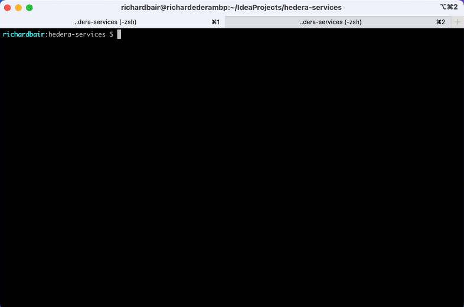
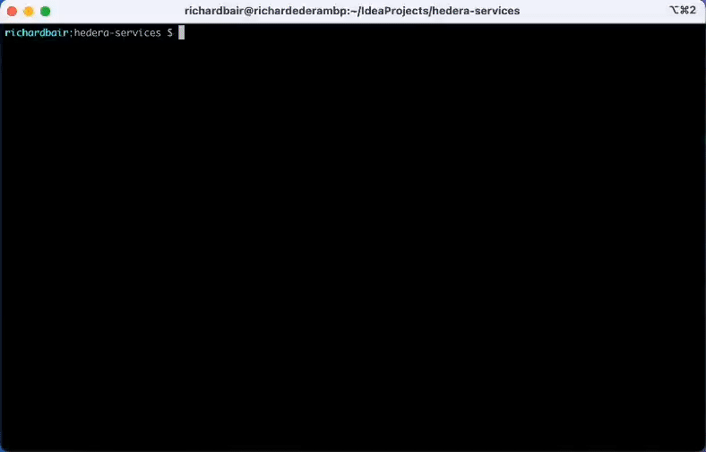

# Gradle quickstart

## Installation

The repo contains a shell script called gradlew (or gradlew.bat on windows). This script will automatically download the
right version of Gradle for this project, scoped to this project. This means you never need to have Gradle installed
manually on your computer. It also means, as the project updates to newer versions of Gradle, you will pick them up
automatically. And, the version of Gradle is checked in, meaning you will always have the right version for whatever
commit you are building from.

Further, Gradle has the concept of a "toolchain". In our case, this toolchain is Java. Each individual developer needs
some semi-recent version of Java installed for running Gradle itself, but within the Gradle build it defines what
version of Java to download and use for building the project (compile, test, etc). This means you do not have to have a
specific version of Java pre-installed on your machine, but will always get the right version for the commit/branch you
are working on.

## Libraries and Dependencies

The `settings.gradle.kts` file in the root of the repo defines the "library catalog" -- the set of libraries from which
subprojects should select. By rule (which is not enforceable in Gradle itself), we should never declare a dependency for
the first time in a subproject. Instead, we first define the library, its version, and any library bundles in
`settings.gradle.kts`. Each subproject then declares its dependencies based on those libraries. In this way, we have a
single master-list of all libraries that have been approved for the project, including their versions.

## Versions

Our Gradle build has a single version number for all projects. It is defined in gradle.properties. Changing this version
number will automatically apply to every subproject.

## buildSrc

Gradle has plugins. One type of plugin is the "convention plugin". A convention plugin is a plugin that applies a
certain set of defaults to all builds that include that convention. We define one such `hedera-convention` in buildSrc.
It is then used by each of the subprojects to reduce the amount of boilerplate. We can create additional conventions in
the future if need be. buildSrc is a special directory in Gradle for hosting custom project plugins.

## Sub Projects

Each subproject has its own `build.gradle.kts` where the dependencies for that project are defined. Some subprojects (
like `hedera-node`) have additional build logic.

## Usage

### Running an Instance

To run an instance, you can use `./gradlew run`. It will compile (but not test) if needed before running the project.
This is the simplest way to get started. Try it out! After you finish the run, you can clean up all the files produced
by the run with the `./gradlew cleanRun` command.

### Basic Build & Unit Test

To build, simply `./gradlew build`. This is the most comprehensive task. It will compile, assemble, and test the
project. If you only want to test a specific subproject, you can do `./gradlew hedera-node:build` for example, or if you
are in the hedera-build subdirectory you can use `../gradlew build`. Gradle is smart and builds everything your project
depends on before building your project, but doesn't rebuild anything it doesn't need to. You can use
`./gradlew assemble` if you just want to compile and not test. The `test` task is for running unit tests.

### Cleaning

Gradle projects put all build artifacts into `build` directories (whereas Maven put things into `target`). To clean
your workspace of all these build artifacts, use `./gradlew clean`.

### Testing

#### Unit Tests

The Gradle build supports our different types of tests, including unit, integration, hammer, micro-benchmark, and
end-to-end. You can use `./gradlew test` if you want to test (it will also compile things if needed). The `test` task is
for unit tests. Each subproject also supports integration tests. Unit tests will **always** be executed and must pass
before merging into **main**. The vast majority of our tests should be unit tests (measured in the 10's of thousands).
These tests are never flaky and should avoid arbitrary waits and timeouts at all costs. The full body of unit tests
should execute in roughly 5 minutes.

#### Integration Tests

We define integration tests as those that involve several components, but not an entire working instance. These use
JUnit. Integration tests take longer to execute than unit tests. These should be the second most plentiful type of test.
They are designed to ensure two or more components work together. We recommend
using [Testcontainers](https://www.testcontainers.org/) for databases, mirror nodes, explorers, or other components that
live in different repos. These tests should be written carefully to avoid flakiness. If a test fails, it should
**always** mean that there is a real problem. Per module or subproject, integration tests should take no more than 10
minutes to execute. Across the entire repo, there should be thousands of integration tests.

Integration tests must **all pass** before merging to **main**, so they must be fast and reliable.

Integration tests can be executed with the `itest` task. You can run all integration tests by `./gradlew itest` or run a
specific module's integration tests by scoping it like `./gradlew hedera-node:itest`. The source code for integration
tests are found in the `src/itest/java` and `src/itest/resources` directories within the subproject.

#### Hammer Tests

Each subproject also supports "hammer" tests. A hammer test is a unit test that "hammers" the code. A more common and
less visceral name for this type of test is a "fuzzing" test. These usually take the form of pseudo-random tests that
run for an extended period of time and attempt to use a component in as many ways as possible. These can be run for all
subprojects with `./gradlew hammer` or run for a specific subproject. Hammer tests are JUnit tests and can be found
in `src/hammer/java` and `src/hammer/resources`.

Hammer tests by their nature take longer to execute. These are run on a nightly basis. They have concrete pass/fail
behavior. If any hammer test fails, this should mean there is **definitely** a bug that needs to be triaged.

#### Micro-benchmarks

Micro-benchmarks are like the unit-tests of performance testing. They should be used liberally for establishing
metric-driven decisions about different designs. The specific numbers produced by a microbenchmark are not themselves
very useful because different hardware under different conditions can give different numbers. But they are useful when
comparing A/B implementations on the same hardware. These tests also take a significant amount of time to execute,
and are not very good at giving pass/fail criteria after execution.

Rather, micro-benchmarks exist to help developers verify the impact of their changes in a particular part of the system.
Appropriate benchmarks should be run prior to creation of a PR. These are run nightly, and we record the results, so
we can do trend analysis over time.

We use the [Java Micro-benchmarking Harness](https://github.com/openjdk/jmh), or JMH, for writing and executing our
micro-benchmarks. These benchmarks are found with subprojects in `src/jmh/java`. They can be run simply by using
`./gradlew jmh`. But if you do run it this way, be prepared for a long wait while all benchmarks are executed!
You may rather want to supply an "includes" flag to only include the benchmark of your choosing. See the docs
for the [JMH plugin](https://github.com/melix/jmh-gradle-plugin) for details. 

#### End-to-End Tests

Finally, end-to-end tests (defined in `test-clients`) can be run with `./gradlew eet`. These tests need a running
instance. You can start one in one terminal with `./gradlew run` and then execute the tests from a second terminal with
`./gradlew eet`. Or you can use JRS to start an instance, or use some existing environment.

### SonarQube

We use SonarCloud (cloud hosted SonarQube) for performing code quality checks. This is a gate that must be passed
before a PR can be merged into **main**. With Gradle, you can run this check from your machine without having to first
commit your code to Github 🤩. First, define an environment variable called `SONAR_TOKEN` with the value of a token
created within SonarCloud for an account with 'Execute analysis' permission. Then simply run `./gradlew sonarqube`.
