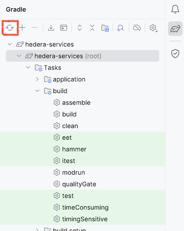
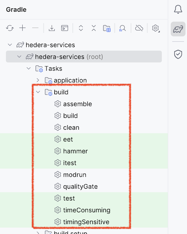
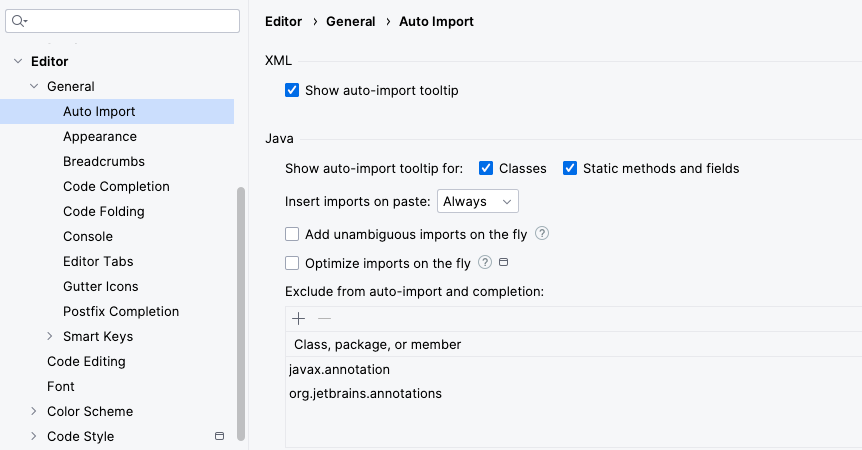

# IntelliJ quickstart

## Preliminaries

Clone this repository:

```
git clone https://github.com/hashgraph/hedera-services.git
```

From IntelliJ, choose `File -> Open` the _hedera-services/_ directory you just cloned.

For more information, also refer to the
[documentation of the Hiero Gradle Conventions](https://github.com/hiero-ledger/hiero-gradle-conventions#build)
which this project uses.

### (optional) IntelliJ plugins

The following plugins add comfort features for working with certain parts of the code base:

- [Android IntelliJ plugin](https://plugins.jetbrains.com/plugin/22989-android) adds additional
  code navigation capabilities for Dagger2 annotated interfaces.
- [JMH IntelliJ plugin](https://plugins.jetbrains.com/plugin/7529-jmh-java-microbenchmark-harness)
  allows running selected JMH benchmarks directly from the IDE.

## Configure the JDK used by Gradle

The project is imported as a Gradle project. Before you can use all features reliably, make sure
that Gradle is started with the JDK we use in the project, which currently is: **Eclipse Temurin,
21.0.1**

You can use IntelliJ to download the JDK if you do not have it installed.

<p>
    
</p>

## Reload Project with Gradle

After everything is configured, and everytime you change something in the project setup, you should
press the **Reload All Gradle project** in IntelliJ.

Changes to the project setup include,

- Changing `build.gradle.kts` files
- Changing dependencies in `src/main/java/module-info.java` files
- Changing build configuration in `gradle/plugins/src/main/kotlin`

<p>
    
</p>

See [gradle-quickstart](gradle-quickstart.md) for more details on modifying the project setup.

## Build, test, run through Gradle tasks

You can run all tasks described in [gradle-quickstart](gradle-quickstart.md) from the Gradle tool
window.

<p>
    
</p>

## Running a services instance or example apps

### Starting a local single-node network

You can start the `ServicesMain` process via the `modrun` Gradle task. You will see an output like
the following:

```
2024-04-25 11:00:26.066 INFO  169  NettyGrpcServerManager - Starting gRPC server on port 50211
2024-04-25 11:00:26.118 INFO  292  NettyGrpcServerManager - Epoll not available, using NIO
2024-04-25 11:00:26.172 INFO  172  NettyGrpcServerManager - gRPC server listening on port 50211
2024-04-25 11:00:26.172 INFO  180  NettyGrpcServerManager - Starting TLS gRPC server on port 50212
2024-04-25 11:00:26.172 INFO  292  NettyGrpcServerManager - Epoll not available, using NIO
2024-04-25 11:00:26.172 WARN  325  NettyGrpcServerManager - Specified TLS cert 'hedera.crt' doesn't exist!
2024-04-25 11:00:26.173 WARN  187  NettyGrpcServerManager - Could not start TLS server, will continue without it: hedera.crt
```

This node's name is "Alice" because of [Line 25](../hedera-node/config.txt#L25) in the _config.txt_
present in your working directory.

Looking closer at _config.txt_, you can see you are running Hedera Services (and not some other app)
because [Line 11](../hedera-node/config.txt#L11) points to the JAR file you just built; and there
are three nodes in your network because you specified "Bob" and "Carol" as well as "Alice".

If multiple nodes Alice, Bob, and Carol are set up to run locally by uncommenting lines
[26](../hedera-node/config.txt#L26) and [28](../hedera-node/config.txt#L28), they will all be
running on your local machine; and communicating via the loopback interface. But each still has a
private instance of the Platform, and keeps its own state, just as it would in a true distributed
network.

During the initial startup, the network creates system accounts `0.0.1` through `0.0.1000`. It sets
the key for each account to a `KeyList` of size one with a well-known Ed25519 keypair. The network
reads the keypair in a legacy format from [here](../hedera-node/data/onboard/StartUpAccount.txt),
but the same keypair is available in PEM format using the PKCS8 encoding
[here](../hedera-node/data/onboard/devGenesisKeypair.pem) (the passphrase is `passphrase`).

Even more explicitly, the 32-byte hex-encoded private and public keys of the Ed25519 keypair are:

```
Public: 0aa8e21064c61eab86e2a9c164565b4e7a9a4146106e0a6cd03a8c395a110e92
Private: 91132178e72057a1d7528025956fe39b0b847f200ab59b2fdd367017f3087137
```

### Submitting transactions to your local network

The _test-clients/_ directory in this repo contains a large number of end-to-end tests that Hedera
engineering uses to validate the behavior of Hedera Services. Many of these tests are written in the
style of a BDD specification.

Run `HelloWorldSpec` with the following Gradle command:

```
./gradlew runTestClient -PtestClient=com.hedera.services.bdd.suites.crypto.HelloWorldSpec
```

Because [`node=localhost`](../test-clients/src/main/resources/spec-default.properties) in the
_spec-default.properties_ controlling the `HelloWorldSpec` test, this will run against your local
network, culminating in logs similar to:

```
2020-01-31 15:42:21.299 INFO   170  HapiApiSpec - 'BalancesChangeOnTransfer' finished initial execution of HapiCryptoTransfer{sigs=2, payer=GENESIS, transfers=[0.0.1002 <- +1, 0.0.1001 -> -1]}
2020-01-31 15:42:21.302 INFO   80   HapiGetAccountBalance - 'BalancesChangeOnTransfer' - balance for 'sponsor': 999999999
2020-01-31 15:42:21.304 INFO   170  HapiApiSpec - 'BalancesChangeOnTransfer' finished initial execution of HapiGetAccountBalance{sigs=0, account=sponsor}
2020-01-31 15:42:21.307 INFO   80   HapiGetAccountBalance - 'BalancesChangeOnTransfer' - balance for 'beneficiary': 1000000001
2020-01-31 15:42:21.308 INFO   170  HapiApiSpec - 'BalancesChangeOnTransfer' finished initial execution of HapiGetAccountBalance{sigs=0, account=beneficiary}
2020-01-31 15:42:21.310 INFO   190  HapiApiSpec - 'BalancesChangeOnTransfer' - final status: PASSED!
2020-01-31 15:42:21.311 INFO   128  HelloWorldSpec - -------------- RESULTS OF HelloWorldSpec SUITE --------------
2020-01-31 15:42:21.311 INFO   130  HelloWorldSpec - Spec{name=BalancesChangeOnTransfer, status=PASSED}
```

(This client uses account `0.0.2` as the default payer, and is aware of the above keypair via its
configuration in
[_spec-default.properties_](../test-clients/src/main/resources/spec-default.properties) under the
`startupAccounts.path` key).

### Stopping/restarting the network

Stop the `ServicesMain` process by stopping the `modrun` Gradle run.

When you restart `ServicesMain`, the nodes will attempt to restore their state from the
_hedera-node/data/saved_ directory tree. In general, for this to work correctly, you should precede
shutting down the network by submitting a `Freeze` transaction; e.g. via the
[`FreezeIntellijNetwork`](../test-clients/src/main/java/com/hedera/services/bdd/suites/freeze/FreezeIntellijNetwork.java)
client.

:information*source:&nbsp; In case of an unclean shutdown, or unwanted accumulation of logs and
audit data in the local workspace, use the Maven `antrun:run@app-clean` goal in the `hedera-node`
project to get a clean state. (Or simply delete \_rm -rf hedera-node/data/saved* for a quick reset.)

## Recommended IDE Settings

### Spotbugs annotations

Hedera Services uses Spotbugs annotations everywhere and to help ensuring this as standard practice,
we recommend adding both `javax.annotation` and `org.jetbrains.annotations` to the IntelliJ setting
Editor/General/Auto Import/Exclude from auto-import and completion.


