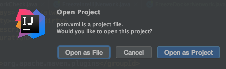
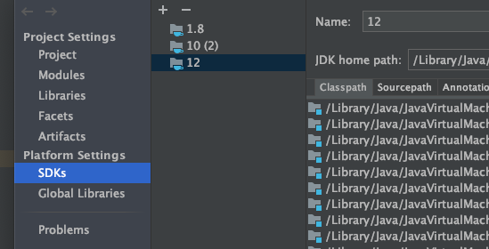
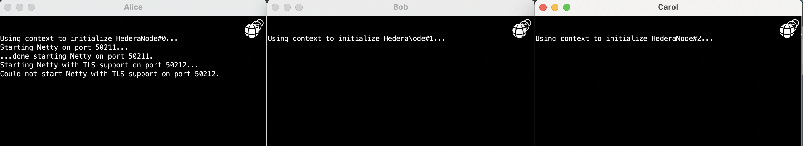
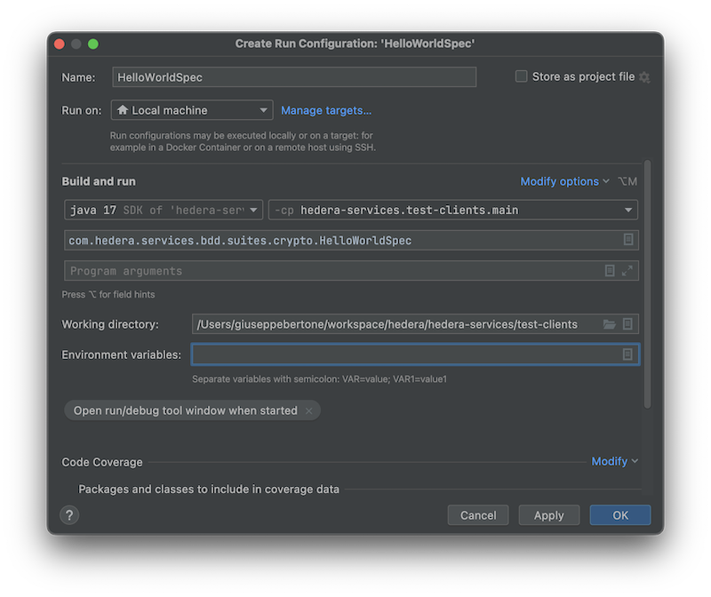

# IntelliJ quickstart

**IMPORTANT** The current implementation of Platform has a non-negotiable dependency
on PostgreSQL. Use the included [Docker-based PostgreSQL setup guide](./postgresql-setup-guide.md)
to ensure you have an appropriately configured PostgreSQL instance before continuing.

## JVM
OpenJDK12 is strongly recommended. You can [download it from IntelliJ](https://www.jetbrains.com/help/idea/sdk.html)
if you don't have it already. 

## Preliminaries

Clone this repository:
```
git clone git@github.com:hashgraph/hedera-services.git
```

From IntelliJ, choose `File -> Open` and navigate to the the top-level _pom.xml_ 
under the _hedera-services/_ directory you just cloned. Open it as a project:

<p>
    
</p>

Make sure you are using OpenJDK12 as the project SDK:

<p>
    
</p>

Open the Maven tool window, and run `mvn install` in the root project:

<p>
    
</p>

This will both, 
<ol>
  <li>Build the <i>hedera-node/data/apps/HederaNode.jar</i>; and,
  <li>Populate your <i>hedera-node/data/config</i> directory with 
  default versions of the <i>application.properties</i> and 
  <i>api-permission.properties</i> files that are used to bootstrap 
  a new Hedera Services network.
</ol>

## Starting a local three-node network

Now browse to `com.hedera.services.ServicesMain`. Its
`main` method starts a network of Hedera Service nodes by 
calling `com.swirlds.platform.Browser#main`, which is the
entrypoint to bootstrap any Platform apps.

Run `ServicesMain#main` with an IntelliJ configuration whose working 
directory is the _hedera-node/_ directory of your clone of this repo:

<p>
    
</p>

You will see three black panes appear, similar to:

<p>
    
</p>

This node's name is "Alice" because of [Line 26](../hedera-node/config.txt#L26)
in the _config.txt_ present in your working directory. (This file determines the 
Browser's startup sequence.) 

Looking closer at _config.txt_, you can see you are running Hedera Services 
(and not some other app) because [Line 12](../hedera-node/config.txt#L12) 
points to the JAR file you just built; and there are three nodes in your 
network because you specified "Bob" and "Carol" as well as "Alice".

In fact Alice, Bob, and Carol are all running on your local machine; and 
communicating via the loopback interface. But each still has a private 
instance of the Platform, and keeps its own state, just as it would in a 
true distributed network.

During the initial startup, the network creates system accounts `0.0.1` through `0.0.100`. 
It sets the key for each account to a `KeyList` of size one with a well-known Ed25519 
keypair. The network reads the keypair in a legacy format from [here](../hedera-node/data/onboard/StartUpAccount.txt), 
but the same keypair is available in PEM format using the PKCS8 encoding 
[here](../hedera-node/data/onboard/devGenesisKeypair.pem) (the passphrase is `passphrase`).

Even more explicitly, the 32-byte hex-encoded private and public keys of the Ed25519 keypair are:
```
Public: 0aa8e21064c61eab86e2a9c164565b4e7a9a4146106e0a6cd03a8c395a110e92
Private: 91132178e72057a1d7528025956fe39b0b847f200ab59b2fdd367017f3087137
```

## Submitting transactions to your local network

The _test-clients/_ directory in this repo contains a large number of 
end-to-end tests that Hedera engineering uses to validate the behavior of 
Hedera Services. Many of these tests are written in the style of a BDD 
specification. For example, browse to 
`com.hedera.services.bdd.suites.crypto.HelloWorldSpec`, which makes some minimal
assertions about the effects of a crypto transfer.

Run `HelloWorldSpec#main` with an IntelliJ configuration whose working 
directory is the _test-clients/_ directory of your clone of this repo:

<p>
    
</p>

Because [`node=localhost`](../test-clients/src/main/resource/spec-default.properties)
in the _spec-default.properties_ controlling the `HelloWorldSpec` test, this
will run against your local network, culminating in logs similar to:

```
2020-01-31 15:42:21.299 INFO   170  HapiApiSpec - 'BalancesChangeOnTransfer' finished initial execution of HapiCryptoTransfer{sigs=2, payer=GENESIS, transfers=[0.0.1002 <- +1, 0.0.1001 -> -1]}
2020-01-31 15:42:21.302 INFO   80   HapiGetAccountBalance - 'BalancesChangeOnTransfer' - balance for 'sponsor': 999999999
2020-01-31 15:42:21.304 INFO   170  HapiApiSpec - 'BalancesChangeOnTransfer' finished initial execution of HapiGetAccountBalance{sigs=0, account=sponsor}
2020-01-31 15:42:21.307 INFO   80   HapiGetAccountBalance - 'BalancesChangeOnTransfer' - balance for 'beneficiary': 1000000001
2020-01-31 15:42:21.308 INFO   170  HapiApiSpec - 'BalancesChangeOnTransfer' finished initial execution of HapiGetAccountBalance{sigs=0, account=beneficiary}
2020-01-31 15:42:21.310 INFO   190  HapiApiSpec - 'BalancesChangeOnTransfer' - final status: PASSED!
2020-01-31 15:42:21.311 INFO   128  HelloWorldSpec - -------------- RESULTS OF HelloWorldSpec SUITE --------------
2020-01-31 15:42:21.311 INFO   130  HelloWorldSpec - Spec{name=BalancesChangeOnTransfer, status=PASSED}
``` 
(This client uses account `0.0.2` as the default payer, and is aware of the above
keypair via its configuration in [_spec-default.properties_](../test-clients/src/main/resource/spec-default.properties)
under the `startupAccounts.path` key). 

## Stopping/restarting the network
Stop the `ServicesMain` process in IntelliJ to shut down the network.

When you restart `ServicesMain`, the nodes will attempt to restore their
state from the _hedera-node/data/saved_ directory tree. 
In general, for
this to work correctly, you should precede shutting down the network
by submitting a `Freeze` transaction; e.g. via the 
[`FreezeIntellijNetwork`](../test-clients/src/main/java/com/hedera/services/bdd/suites/freeze/FreezeIntellijNetwork.java)
client.

## Helpful Maven goals
In case of an unclean shutdown, or unwanted accumulation of logs and audit
data in the local workspace, use the Maven `antrun:run@app-clean` goal 
in the `hedera-node` project to delete the files generated by running 
local networks and tests.
