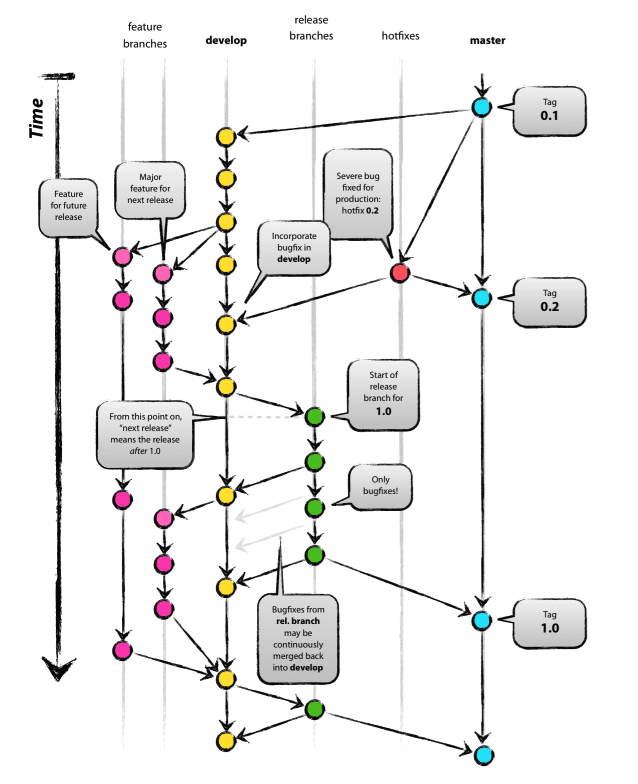
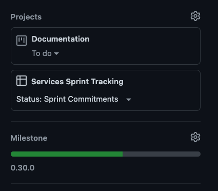

# Maintainers Guide

This document outlines the process and keynotes for the core maintainers of this repository .

## IntelliJ set up

IntelliJ is used for most of the development lifecycle. Install IntelliJ using the
[Jetbrains toolbox](https://www.jetbrains.com/lp/toolbox/), instead of installing directly. If you
are on an M1/M2 chipset, select **.dmg (macOs Apple Silicon)**. Once you have the jetbrains toolbox
installed, open it and Install **Intellij IDEA Ultimate**.

## Cloning repository

Clone this repository using:

```
git clone git@github.com:hashgraph/hedera-services.git
```

## Work with the project

Follow the [gradle-quickstart.md](gradle-quickstart.md) and
[intellij-quickstart.md](intellij-quickstart.md).

## GPG set up

Every commit being pushed to the repository should be verified and [signed off](#dco-sign-off). So
it is important to set up GPG keys before contributing to the repository.

Use the following tutorials to set up a GPG key.

**Be sure to enable Vigilant Mode and adding GPG key in GitHub**.

- **Github**
  - [Github - Generating a new GPG key](https://docs.github.com/en/authentication/managing-commit-signature-verification/generating-a-new-gpg-key)
  - [Github - Adding a GPG key to your Github account](https://docs.github.com/en/authentication/managing-commit-signature-verification/adding-a-gpg-key-to-your-github-account)
  - [Github - Configuring your Git CLI for GPG commit signing](https://docs.github.com/en/authentication/managing-commit-signature-verification/telling-git-about-your-signing-key)
  - [Github - Signing Commits with the Git CLI](https://docs.github.com/en/authentication/managing-commit-signature-verification/signing-commits)
  - [Github - Vigilant Mode](https://docs.github.com/en/authentication/managing-commit-signature-verification/displaying-verification-statuses-for-all-of-your-commits)
    ‼️
- **IntelliJ IDEA (if you use IntelliJ to interact with git)**
  - [IntelliJ - Signing Commits with GPG Keys](https://www.jetbrains.com/help/idea/set-up-GPG-commit-signing.html)
  - [IntelliJ Official YouTube - GPG Commit Signing (10:59)](https://youtu.be/RBhz-8fZN9A?t=659)

## Development Model

:warning: This section is out of date and will be updated soon:tm:

The Git Source Code Management(SCM) system treats branches as one of the fundamental constructs for
supporting concurrent development and assisting with merge conflict resolution. Due to the
fundamental nature and flexibility offered by Git branches, it is critical to have a consistent
branching workflow in order to reduce merge conflicts and support automation.

Git commit tags play a critical role in Release Management strategies and automated releases. Tags
are affected by branches and branch related operations; therefore, it is critical that the branching
workflow incorporates a consistent tagging strategy.

[GitFlow branching model](https://nvie.com/posts/a-successful-git-branching-model/) is elected
pattern for the development life cycle.



Note especially the roles of the `main` branch:

- `main` is the default branch, the target of active development, and should at all times
  should be a viable candidate for the next release.

### Creating issues on GitHub

GitHub's [issues](https://github.com/hashgraph/hedera-services/issues) are used as the primary
method for tracking project changes. Any actionable item that need to be addressed, should be
associated to an issue in GitHub.

There are three types of issues:

- **Bug**: These track issues with the code
- **Documentation**: These track problems or insufficient coverage with the documentation
- **Enhancement**: These track specific feature requests and ideas until they are complete. This
  should only be for trivial or minor enhancements. If the feature is sufficiently large, complex
  or requires coordination among multiple Hedera projects, it should first go through the Hedera
  Improvement Proposal process.

Any issue created should be added to
[Services Sprint Tracking](https://github.com/orgs/hashgraph/projects/13) (if it is targeted to be
addressed in the current sprint)and the associated project type in `Projects` tab. It should also
have the targeted milestone set on it.

For example, a documentation change targeted for the current sprint in 0.30.0 release should be
associated to [Services Sprint Tracking](https://github.com/orgs/hashgraph/projects/13) and
[Documentation](https://github.com/hashgraph/hedera-services/projects/32#card-85521291) projects,
with 0.30 milestone on it.



### Platform-CI Responsibilities

The Platform-CI team will handle the following:

- Will provide automated release processes and coordinate release schedules
- Will handle production releases
- Note: no release branch will be created

### Github CI Workflow Naming Conventions

- `node-*` and `platform-*` prefix is a legacy carryover because node repo and platform repo were merged together.
- `flow-*` is a standalone workflow that can be executed by a user (should have a workflow-dispatch trigger). It can also be a PR target. Anything the user interacts with starts with flow.
- `z` is used to force everything to sort to the bottom of the view in the Actions tab of github. We can now pin these.
- `x` means a workflow is not user facing.
- `f` means the workflow can be triggered directly by other workflows (or by users). Ex: `workflow_dispatch`.
- `c` means the file contains a reusable workflow, called a workflow component, triggered by `workflow_call`. 
- `cron` indicates a workflow has a time-based trigger.

### User Stories

#### As a developer, I would like to create a branch to work on the feature for the upcoming release

As per the development model, every developer should create a feature branch from `main` branch
for working on a change targeted for the current release. The created branch should follow
[naming conventions](branch-naming-conventions.md).

The `main` branch should be up-to-date with all the features going into the next release.

#### As a developer, I would like to create a branch to work on the feature NOT targeted for upcoming release

As per the development model, every developer should create a feature branch to work from `main`
branch. The created branch should follow [naming conventions](branch-naming-conventions.md). But,
the feature branch should NOT be merged into `main` until the decision is made if the feature is
going into upcoming release.

#### As a developer, I would like to merge my feature branch or bug fix for the upcoming release

Open a pull request (PR) from the feature branch to `main` branch and add
`hashgraph/hedera-services-team` as reviewers.

Also add the following labels on the PR :

- `CI:UnitTests` - Initiates PR UnitTests needed for the PR to merge
- `CI:FullStackTests` - Initiates full stack PR checks needed for PR to merge
- `CI:FinalChecks` - Initiates final checks required for the PR to merge

PR should be merged after an approving review and all the checks are passed.

NOTE:

1. Any feature that is not going into the upcoming release should stay in the feature branch and
   should not be merged to `main`.
2. Please use either the Gradle command line `./gradlew qualityGate` or the
   [Google Java Format IntelliJ Plugin](https://github.com/google/google-java-format#intellij-android-studio-and-other-jetbrains-ides)
   to format your code to avoid failing checks in CI pipeline.
3. The linked issues should be automatically closed when a PR is merged or closed manually.

#### As a developer, I would like to merge a bugfix/hotfix after release branch is created

Once the release branch is created, only bugfixes or hotfixes should be merged into release branch.
To do that, create a `hotfix` from the `release` branch. The created branch should follow
[naming conventions](branch-naming-conventions.md). Once the fix is in the branch, open a PR to the
release branch. Once the fix is merged into `release` branch, it should be cherry-picked into the
`main` branch.

#### As a developer, I would like to merge a bugfix/hotfix from the production code

To fix a bug from one of the previous releases(production code), create a hotfix branch from `main`.
Once the fix is in the branch, create a PR targeting to `main`. Once bugfix is merged into `main`and
it should be cherry-picked back into the current `release` branch(if the release branch is still
open).

### DCO Sign Off

The sign-off is a simple line at the end of a commit message. All commits need to be signed. Your
signature certifies that you wrote the code or otherwise have the right to contribute the material.
First, read the [Developer Certificate of Origin (DCO)](https://developercertificate.org/) to fully
understand its terms.

Contributors sign-off that they adhere to these requirements by adding a Signed-off-by line to
commit messages (as seen via git log):

```
Author: Joe Smith <joe.smith@example.com>
Date:   Thu Feb 2 11:41:15 2018 -0800
    Update README
    Signed-off-by: Joe Smith <joe.smith@example.com>
```

Use your real name and email. Notice the Author and Signed-off-by lines match. If they don't your PR
will be rejected by the automated DCO check.

If you set your `user.name` and `user.email` git configs, you can sign your commit automatically
with `-s` or `--sign-off` command line option:

```
$ git config --global user.name "Joe Smith"
$ git config --global user.email "joe.smith@example.com"
$ git commit -s -m 'Update README'
```
