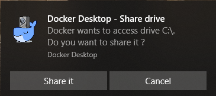

# PostgreSQL Setup Guide

This document describes the standard Swirlds/Hedera configuration for the PostgreSQL local development environment.

## PostgreSQL Setup for Local Development
### Download and Install Docker CE [Windows](https://hub.docker.com/editions/community/docker-ce-desktop-windows) or [MacOS X](https://hub.docker.com/editions/community/docker-ce-desktop-mac)
1. If prompted, choose to use Linux Containers during installation.
2. On Windows, you may be forced to log off after the installation completes.
3. On Windows, if Hyper-V and Containers features are disabled, you will see the prompt below. Save your work, press Ok, and wait for your computer to restart.


### Run PostgreSQL image as a container
Execute the following docker commands from the CLI:
```
# MacOS / Linux
docker run --name postgres -d -p 5432:5432 \
--env POSTGRES_PASSWORD=password --env POSTGRES_USER=swirlds \
--env POSTGRES_DB=fcfs \
--env PGDATA=/var/lib/postgresql/data/pgdata \
postgres:10.9-alpine

# Windows
cd “%USERPROFILE%” 
docker run --name postgres -d -p 5432:5432 ^
--env POSTGRES_PASSWORD=password --env POSTGRES_USER=swirlds ^
--env POSTGRES_DB=fcfs ^
--env PGDATA=/var/lib/postgresql/data/pgdata ^
postgres:10.9-alpine
```
Notes:
1. The version of PostgresSQL that is currently used: **postgres:10.9-alpine**
2. On Windows, you may be asked to authorize the drive sharing as shown below. Press the “Share It” button to allow access.



### Control your PostgresSQL container
```
# Start Postgres
docker start postgres

# Stop Postgres
docker stop postgres

# List Running Containers
docker ps

# List all Containers
docker ps -a
```
