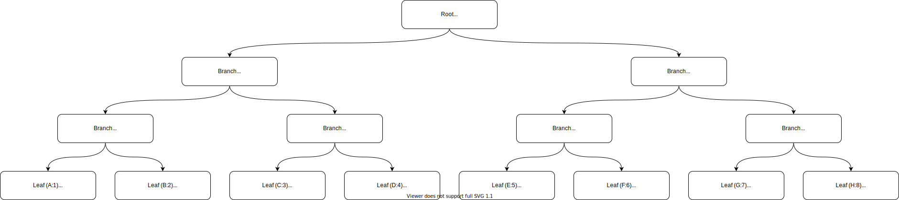
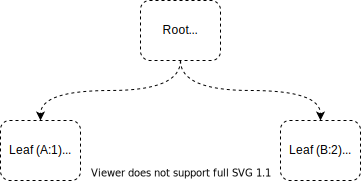
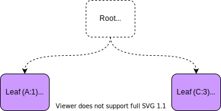
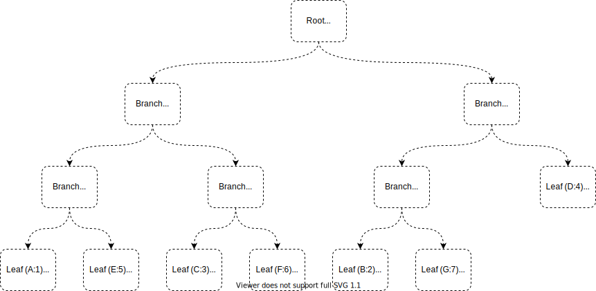
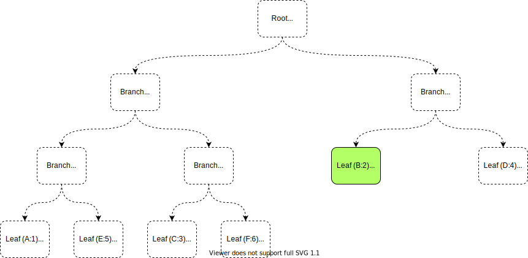
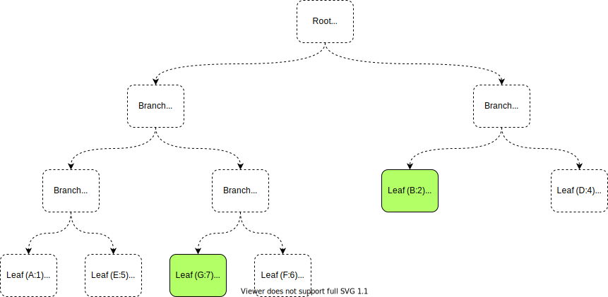
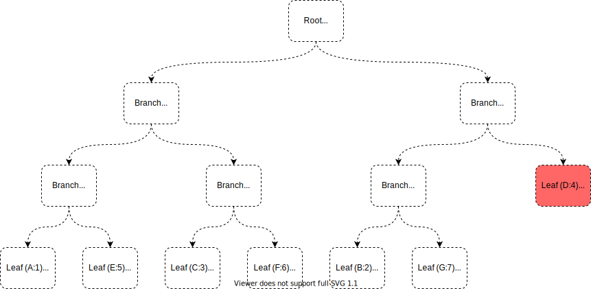
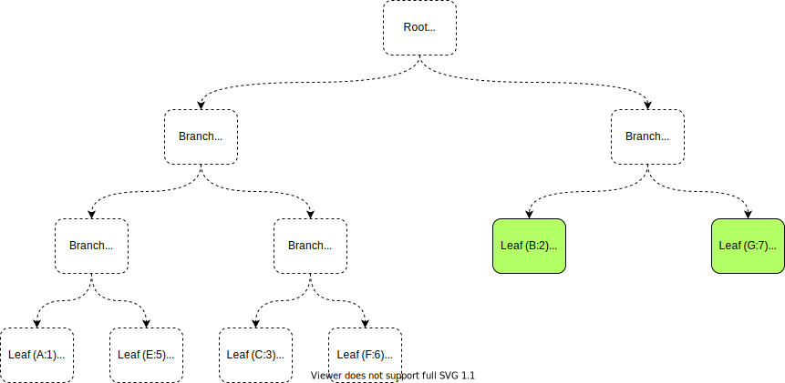

# Virtualized Merkle Trees

Smart Contracts are a key feature of distributed ledgers. Introduced by Ethereum, the idea is to enable developers to
build on top of distributed ledgers by supplying their own code (layer-2) rather than building all functionality into
the ledger code itself (layer-1). Each Smart Contract may have storage, handled as key/value pairs. Each key and each
value are an unsigned 256-bit word.

Smart Contracts present some particular design challenges:
 - Many contracts require non-trivial storage. ERC-20 contracts may require megabytes of storage
 - Due to gas limits, only about 25 SSTORE (put) operations are supported in a single contract call
 - Contracts may read state from anywhere within their megabytes of storage
 - Contracts need very fast TPS or excessive contract usage will cripple the network
 - A hash of the entire blob must be stored with the signed-state in the "real" merkle tree

While many excellent solutions exist for reading and writing binary data, without a Merkle-tree like structure it is
not possible to efficiently hash the data. While a Merkle-tree like data structure is excellent for hashing, we cannot
possibly represent the entire contract state as a Merkle tree due to the costs in storing it in memory long-term, or
in reading it all from disk just for a single contract execution. The solution therefore is quite natural, we need a
virtual Merkle tree where nodes are stored on disk and `realized` into memory on demand.

In other words, we need a solution that scales with the number of get/put operations and not with the size of the data 
storage. A memory-mapped virtual merkle tree is a good fit.

The challenge with this solution is in reducing the cost of reading and writing individual nodes so that we can handle
many thousands of contract executions per second. The first key is to use an efficient memory-mapped file solution.
Java has supported memory-mapped files since at least Java 1.4. While not perfect, it is well known and very fast. The
second key is to "realize" only those nodes that are necessary. In practice, this means we only need ot realize the
leaves, until the moment we hash, at which point we need to read any saved hashes for parent nodes as well. This design
leads to incredibly efficient use of memory and a very high TPS.

## Design

The system has two principal components: the VirtualMap and the VirtualDataSource. The VirtualMap implements all the
logic for representing the merkle tree and manipulating it, while presenting to the user a simple get/put Map-like API.
The VirtualDataSource is an internal API used by the VirtualMap to read/write data persistently to/from disk.

The VirtualMap is map-like but does not implement `java.util.Map`. It has `get`, `put`, and `remove` methods. It
is `FastCopyable`. It buffers changes in memory and writes them to disk on `commit`. Commits are intended to happen
on a background thread, and not to be part of `handleTransaction`. The VirtualMap is a proper Swirlds MerkleNode and
FCMValue, so it can be placed directly into an FCMap. It is an external merkle node, and so it saves its data off
heap.

Internally, a VirtualMap maintains a "virtual" merkle tree, used for computing the hash for the overall tree. This
tree has branches and leaves. Leaves have data, branches do not. This virtual merkle tree is binary. Each branch has
1 or 2 children (only the root branch may have 1 child, all other branches always have 2 children). A "child" is either
another branch or a leaf. A branch could have a child branch, and a leaf branch, at the same time. Colloquially,
a "node" in the tree is the name given to a single element in the tree, either a branch or a leaf. A leaf exists for
every key in the VirtualMap.

The VirtualMap has a cache of `dirtyLeaves`. New leaves are dirty by definition and included in `dirtyLeaves`. Any key
with a changed `value` is also dirty. A branch cannot, of itself, become dirty. When leaves are added or removed, the
virtual tree structure is modified which causes a subset of the branches to become dirty. When a leaf value is modified,
the direct lineal parent branches of the leaf become dirty. This is a key insight. It means that we do not need to keep
track of dirty branches because we can compute them trivially at the time that we process the dirtyLeaves. We do need
to keep track of branches that have been *deleted*.

### VirtualTreePath

Each node in the virtual merkle tree has a *path* that uniquely identifies the location of the node in the tree. We
store the path along with the hash, key, and value in the leaf data store. We represent a path as a `long`. The high
byte is used to represent the `rank` of the node in the tree, where the root node is at rank 0, its children at rank 1,
and so on. The remaining seven bytes are dual purpose. They represent both the `index` of the node within its rank
(that is, its position from left-to-right within the rank) and the `breadcrumbs` that an algorithm can use to walk down
the tree from the root branch to find the node.

For example, the path `0b00000000_00000000_00000000_00000000_00000000_00000000_00000000_00000000` is the special path
of the root branch. It is the only valid value at rank 0. Each child of the root branch will be at rank 1. The child
on the left will have its bit set to 1, while the one on the right will have its bit set to 0. So for example, the
left child of the root has `0b00000001_00000000_00000000_00000000_00000000_00000000_00000000_00000001` as its path,
and the one on the right has `0b00000001_00000000_00000000_00000000_00000000_00000000_00000000_00000000`. At the next
level down, the `breadcrumb` bits are shifted once left, and the least significant bit is again used to indicate whether
the node is the left or right child of its parent branch.

This arrangement has some very valuable properties:
 - Since the path is a `long`, there is no garbage generated for paths, and they can be trivially stored and read
   from disk.
 - The algorithms for tree manipulation and hash computation need a fast way to determine the sibling of a node.
   Finding the sibling is as simple as flipping (xor) the last bit. This is trivially fast.
 - Determining the parent of any leaf simply requires decrementing the `rank` portion of the path and right shifting
   the `breadcrumbs` portion.
 - The `index` of the node within the `rank` is simply the lower 7 bytes. While not immediately obvious, it turns out
   that the lower seven bytes are exactly the `index` if measured from right to left. To return an index that goes from
   left to right, we can do some simple math to convert the index to be left to right.
 - Determining the children of any branch is trivial. Increment the `rank` and left shift.
 - Determining whether a specific node is on the left or right of its parent is trivial, simply check the last bit.

Some things are not easy:
 - It is impossible, based on the path alone, to know whether a node is a branch or a leaf. (We could sacrifice the
   highest bit for this purpose, which may be a really good idea... (it means a negative long is a leaf, and a positive
   long is a branch)).

The VirtualTreePath class cannot be instantiated, it only contains helper methods, and a ROOT_PATH constant.

### Implementation

The above diagram shows what a virtual merkle looks like in reality. Of the 7 leaves in this tree, three of them have
been modified. The purple nodes were modified and the green node was added. For clarity in the diagram the keys are
simple alphabet letters and the values are numbers. The "Virtual Map" table shows what conceptually exists in the map,
although only the items in the Dirty Leaf Cache are actually in memory. All other reads go directly to the memory
mapped files that are represented by "Leaves on Disk". No branch or unmodified leaf is in memory.

#### Accessing a Key/Value Pair

Initially, a VirtualMap is completely empty. This is true whether the map is completely new, or if it represents a
completely clean tree, which is one where all data has been written to disk and the tree itself is unmodified. When
a user calls `get("A")` to get the value of the key "A", the VirtualMap checks the dirty cache first, and not finding
"A" there, it reads from the VirtualDataSource. Reading from a memory mapped file is extremely fast. When already memory
mapped, it is as fast as any other pure memory access, and the OS does a very good job of loading the data when needed
and managing hot caches in memory, etc. Even in the pathological case, our tests in the cloud with network attached SSD
showed very fast access rates for random data selections across multiple-gigabyte files.

#### Modifying a Key/Value Pair

When `put("A", 100)` is called on an existing key, the implementation first checks the dirty leaf cache to see if the
leaf is already dirty. If it is, we simply update the value. If it was not already dirty, we read the leaf data from the
data source, update the value, and insert it into the map. The hash of the value is computed asynchronously and stored
in a `Future` to save time during hashing later.

#### Adding a Key/Value Pair

When a `put` call is made to a key that doesn't currently exist, we need to add a new leaf record. It turns out, we do
**not** need the branches in memory to know what changes need to be made to the leaves. The first item ever added to the
VirtualMap always ends up as the left node on a root node. The second child always ends up as the right child on the
root node. All other additions always expand the tree at the *first* leaf node slot.

This diagram shows the state of the tree with two leaves. Both A and B are direct children of the Root node. When we add
C to the tree, the slot currently occupied by A becomes a Branch. A is made the left child of the branch, and C is added
as the right child. Notice how the *path* of A has changed. A is now dirty, because it's path as changed, even though
its value has not changed. This is because the path of a leaf node is part of the state we store to disk, otherwise we
would not be able to reconstruct the tree later. C itself is dirty in all ways.

Conceptually, the new branch and the root node are both also dirty, but this only needs to be considered at commit when
we recompute the hashes for all dirty branches, and can be determined completely based on the set of dirty leaves.

As can be seen in this second diagram, we now have a situation where some leaves are in one rank and some on the
previous rank. In the first diagram, Leaf A was the "firstLeaf". Now, Leaf B is the "firstLeaf". In the first diagram,
Leaf B was the "lastLeaf", but now Leaf C is the "lastLeaf". As the tree is modified, we keep track of the first and
last leaves, so that adding and removing nodes can be done in constant time. Because each leaf can be uniquely
identified by its path, and since the path is just a simple long, we have two state variables also stored to disk called
`firstLeafPath` and `lastLeafPath`. We don't actually need to load the leaves themselves proactively, we just need the
paths to those leaves.

When `firstLeafPath` referred to leaf A and `lastLeafPath` referred to leaf B and we added Leaf C, the algorithm had to
load leaf A from disk so we could mark it as dirty and update its path, and it needed to create leaf C and mark it
dirty. But we didn't need to load leaf B. We needed to transition `firstLeafPath` to the **next** leaf, and set
`lastLeafPath` to the newly added leaf.

All nodes in the tree have the concept of `before` and `after` and relative order of nodes. A node is considered to come
"before" if it has a lesser rank, or if it has a lesser index (is closer to the left). A node is considered "after" if
it has a greater rank or has a greater index.

#### Deleting a Key/Value Pair

Deleting a key can be done efficiently. When a leaf is deleted, its path is added to the set of leaf nodes to be
deleted. We don't need to read the leaf into memory for this to happen (of course, if the leaf was modified and in
the dirty leaves map, then it must be removed from there). If the leaf happened to be the very last leaf, then the tree
is now empty and on `commit` we can trivially clean up the leaf and the root. If the leaf to be deleted happens to be
the `lastLeafPath` leaf, then we know it was the right child, and all we need to do is add its path to the set of
deleted leaves and set the `lastLeafPath` to the left-side sibling. On `commit`, we know the parents of this deleted
leaf are dirty and need their hashes recomputed and saved.

If the deleted leaf is any other leaf, then we will add the leaf to the set of deleted leaves and move the
`lastLeafPath` leaf from the end of the tree to the slot just vacated. This moved leaf is now dirty. It had to be read
from disk and modified with a new path and added to the map of dirty leaves. The parent of the moved leaf now has to
be restructured because it no longer has two children.

This diagram shows the initial clean state of our tree.

We will delete the "B" leaf.

If we were to just remove B, we would have an imbalanced tree. Instead, we will move C to take the place of B. When we
do that, we end up with A alone on a branch. Since this violates one of the tenants of our binary tree (that any branch
other than root will always have two children), we move the remaining leaf to take its place.

Let's explore a few other delete scenarios to see how things behave. Below is the tree that we will use for these
examples. The `firstLeafPath` refers to leaf D, while the `lastLeafPath` refers to Leaf G.

For the first case, lets imagine deleting the `lastLeafPath`, Leaf G. We don't need to bring this node into memory so we
continue to diagram it with a dashed outline.

When we remove Leaf G, the parent branch now has a single leaf. This violates our definition of our binary tree, so we
need to remove this branch also and move the orphan leaf, Leaf B, to take the place of the removed branch. Since the
branch we removed may have a hash stored on disk, we need to remember this removed branch so we can delete its state on
disk during `commit`.

Now let's consider what happens if we delete a different node. Let's select one from the middle of the rank. Let's
remove leaf C.

When were remove C, it doesn't need to be brought into memory, but it has left a hoel that must be filled. So we will
take the last leaf, leaf G, and move it into this slot. Leaf G is read from disk, and its path updated, and it is added
to the dirty node map. The old parent of Leaf G is now unbalanced with only a single child, so we can delete that branch
and move the other child, Leaf B, to its slot.

Let's consider a final use case, where we delete the node that is the `firstLeafPath`. Let's delete leaf D. 

In this case, we again take the node at `lastLeafPath` and move it to the slot left vacant by the deleted node. When we
do so, we again find that the parent of Leaf B is no longer needed and we can remove it and move Leaf B into that
slot.

From the scenarios we can see that deletions to the tree can be done efficiently and without reading any branch state
from disk. We do need to keep track of deleted branches so we can remove them from disk later, and if we were to remove
and then add the branch may become needed again, in which case we need to remove it from the list of branches to delete
during commit. The trickiest part of this implementation is getting the details right on the state and testing different
scenarios, but from a performance perspective all work can be done efficiently and from a security perspective all
modifications are completely deterministic in their outcomes.