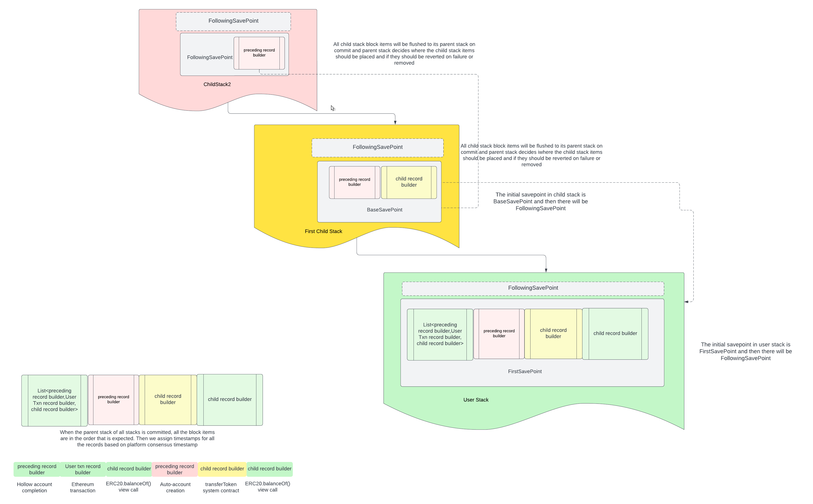

# `SavepointStackImpl`

A new `SavepointStackImpl` is created once for user transaction and each time a child transaction is dispatched.

The `SavepointStackImpl` manages a stack of `Savepoint` objects.  It also has,
- The root `HederaState` used to create the stack.
- For the user transaction, the final `BuilderSink` that accumulates all builders created while handling the user
transaction, including builders for any system or scheduled work.
- A base `SingleTransactionRecordBuilder` that corresponds to the transaction that triggered the dispatch.

Note that `AbstractSavepoint` which extends `BuilderSinkImpl` implements almost the entire `Savepoint` interface. The
only abstract method in `AbstractSavepoint` is `commitBuilders()` which determines how builders are flushed to a parent
sink when the savepoint is committed or rolled back.

There are three concrete `Savepoint` implementations, which differ in how they enforce limits on the number of
preceding and following builders that can be added to the savepoint; and how they flush builders to a parent sink.
- `FirstRootSavepoint` - The very first savepoint in the stack, constructed once stack is created; flushes
preceding/following builders in order around the user transaction builder and has separate preceding/following
limits based on configuration.
- `FirstChildSavepoint` - The first savepoint in any child stack created via dispatch; flushes all builders to
parent's preceding/following builders list depending on dispatch category.
- `FollowingSavepoint` - Created for all other savepoints; flushes all builders to its parent's following builders.

The initial save point in a stack is created when constructing the stack. The following save points are created
everytime a new message frame is created in EVM stack while handling user transaction.

At construction, a `SavepointStackImpl` creates an initial save point and an appropriate base stream builder, depending
on whether it is constructed by the `newRootStack()` or the `newChildStack()` factory. For a root stack for a user
transaction, the first savepoint is a `FirstRootSavepoint`. For a child transaction, the first savepoint is a
`FirstChildSavepoint`. There might be `FollowingSavepoint` created after the initial savepoint in the stack, if the
transaction being handled is for a contract operation and if there are any new message frames created in the EVM stack.
Each message frame creates a new `FollowingSavepoint` in the stack.

### `commit()`

When commit is called by `HandleWorkflow` on the `SavepointStackImpl`, all the state changes of that particular stack
are committed to the parent stack. The record builders are also pushed to a `BuilderSink` based on the type of savepoint.
- If the savepoint is of type `FirstRootSavepoint` all the final record builders are stored in the `BuilderSink` of user
`SavepointStackImpl`, since there is no parent stack for the user stack. The stream items are exactly what is produced
by these builders in order.
- If the savepoint is of type `FirstChildSavepoint`, the builders are flushed to either the preceding or following
builder list of the savepoint at the top of the parent stack. The choice of list depends on the type of transaction
dispatched, whether its category is `PRECEDING` or `CHILD`/`SCHEDULED`.
- And If the savepoint is of type `FollowingSavepoint`, all the builders are flushed to the parent savepoint's following
builders list.

### `commitFullStack()`

When `commitFullStack()` is called by `HandleWorkflow` on the `SavepointStackImpl`, commit is called on all the
savepoints. All the state changes of all the stacks are committed to root state. If the stack is the root stack, this
is when stream builders are also pushed to `BuilderSink` that contains the final stream items produced by the user
transaction. At the end of `commitFullStack()` a new first savepoint is created as appropriate.

### `rollback()`

When rollback is called by the contract service, all the state changes of the top `Savepoint` are rolled back. But
unless they are `REMOVABLE`, the record builders are not deleted from the savepoint. They will be "reversed" instead
and flushed to the parent sink based on the type of savepoint as above.
- Any successful record builders will have their side effects cleared and status set to `REVERTED_SUCCESS`; with the
single exception that a failure of type `IDENTICAL_SCHEDULE_ALREADY_CREATED` will keep information in its receipt
about the schedule that already existed.
- Any failed record builders will have their status untouched.

### `rollbackFullStack()`

When `rollbackFullStack` is called by `HandleWorkflow` on the `SavepointStackImpl`, rollback is called on all savepoints
in the stack and a new first savepoint created as appropriate.

**NEXT: [Signatures](signatures.md)**
