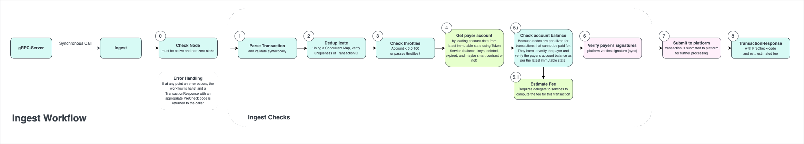
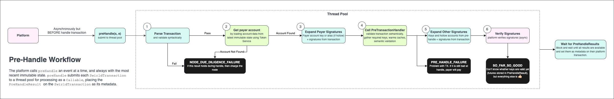
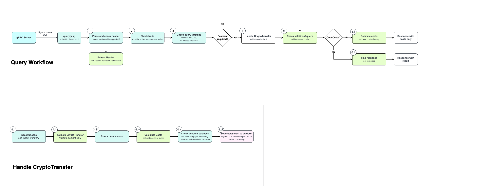
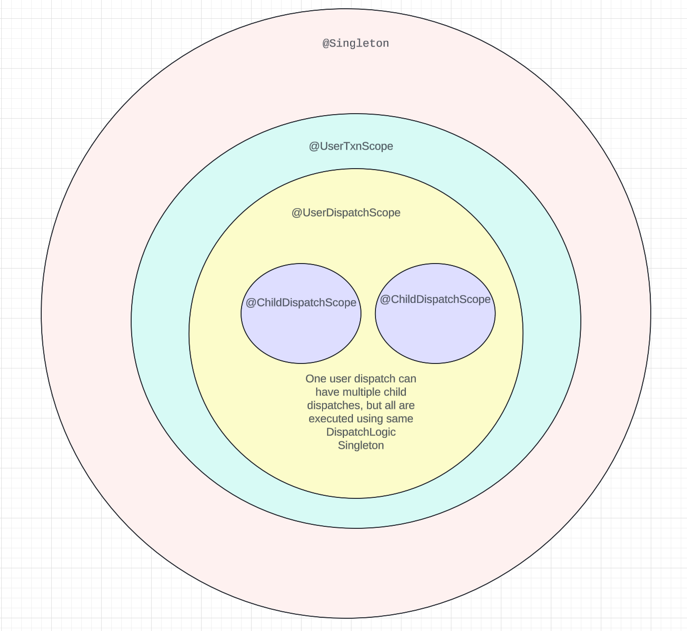
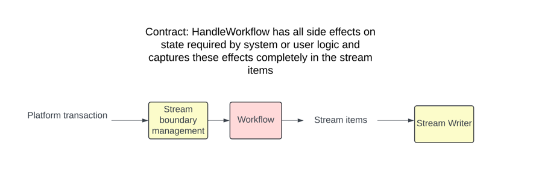
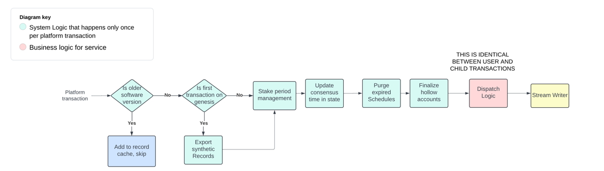
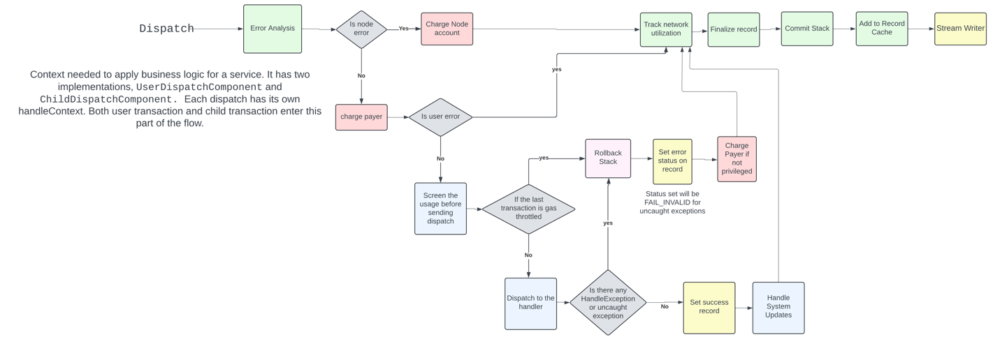

## Workflow Onset

At the beginning of each workflow, a `Transaction` has to be parsed and validated.
As these steps are the same for all workflows, this functionality has been extracted and made available independently.
All related classes can be found in the package `com.hedera.node.app.workflows.onset`.
Details about the required pre-checks can be found [here](transaction-prechecks.md).

## Ingest Workflow

The package `com.hedera.node.app.workflows.ingest` contains the ingest workflow. A rough overview can be seen in the diagram below.

When a new message arrives at the HAPI-endpoint, the byte-buffer that contains the transaction is sent to the ingest workflow.
The gRPC-server is responsible for `Thread`-Management.
The ingest-workflow is single-threaded, but multiple calls can run in parallel.

The ingest workflow consists of the following steps:

1. **Check node** The node is checked to ensure it is not in a state that prevents it from processing transactions.
2. **Parse Transaction** Parse and check the transaction if it is valid and is not larger than allowed size.It also checks
   if there are unknown fields set in the transaction.
3. **Check Syntax** The transaction arrives as a byte-array. The structure and syntax are validated.
4. **Validate Submitted Node** Checks if the transaction is submitted to this node.
5. **Check timeBox** Checks whether the transaction duration is valid as per the configuration for valid durations
   for the network, and whether the current node wall-clock time falls between the transaction start and the transaction end (transaction start + duration)
6. **Deduplicate** The transaction is checked to ensure it has not been processed before.
7. **Check Throttles** Throttling must be observed and checked as early as possible.
8. **Pure Checks** Calls `pureChecks` method that does validations based on the respective handler's transaction body
   The checks performed here are independent of the state and configuration.
   This check will be removed in the future from IngestWorkflow. It is important to note that `pureChecks`
   and `Transaction Prechecks` found [here](transaction-prechecks.md) are different.
9. **Get payer account.** The account data of the payer is read from the latest immutable state.
10. **Verify payer's signature.** The signature of the payer is checked. (Please note: other signatures are not checked here, but in later stages)
11. **Estimate fee** Compute the fee that is required to pay for the transaction.
12. **Payer Solvency*** Check the account balance of the payer to ensure it is able to pay the fee.
13. **Submit to platform** The transaction is submitted to the platform for further processing.
14. **TransactionResponse** Return `TransactionResponse`  with result-code.

If all checks have been successful, the transaction has been submitted to the platform and the precheck-code of the returned `TransactionResponse` is `OK`.
Otherwise, the transaction is rejected with an appropriate response code.
In case of insufficient funds, the returned `TransactionResponse` also contains an estimation of the required fee.

## Pre-Handle Workflow

The `com.hedera.node.app.workflows.prehandle` package contains the workflow for pre-handling transactions. A rough overview can be seen in the diagram below.

An `Event` at a time is sent to the `prehandle` with a reference to the latest immutable state.
It iterates through each transaction and initiates the pre-handle workflow in a separate thread.
The workflow consists of the following steps:

1. **Parse Transaction.** The transaction arrives as a byte-array. The required parts are parsed and the common information is validated.
2. **Call PreTransactionHandler.** Depending on the type of transaction, a specific `PreTransactionHandler` is called.
   It validates the transaction-specific parts and pre-loads data into the cache. It also creates a `TransactionMetadata` and sets the required keys.
3. **PureChecks** `pureChecks` method does validations based on the respective handler's transaction body.
   The checks performed are that are independent of the state and configuration.
4. **Prepare Signature-Data.** The data for all signatures is loaded into memory. A signature consists of three parts:
   1. Some bytes that are signed; in our case, either the `bodyBytes` for an Ed25519 signature or the Keccak256 hash of the `bodyBytes` for an ECDSA(secp256k1) signature.
   2. An Ed25519 or secp256k1 public key that is supposed to have signed these bytes (these public keys come from e.g. the Hedera key of some `0.0.X` account).
   3. The signature itself---which comes from the `SignatureMap`, based on existence of a unique `SignaturePair` entry whose `pubKeyPrefix` matches the public key in (ii.).
5. **Verify Signatures.** The information prepared in the previous step is sent to the platform to validate the signatures.
6. **Transaction Metadata.** The `TransactionMetadata` generated by the `PreTransactionHandler` is attached to the `SwirldsTransaction`.

If all checks have been successful, the status of the created `TransactionMetadata` will be `OK`.
Otherwise, the status is set to the response code providing the failure reason.
If the workflow terminates early (either because the parsing step (1.) fails or an unexpected `Exception` occurs) an `ErrorTransactionMetadata` is attached to the `SwirldsTransaction` that contains the causing `Exception`.

## Query Workflow

The query workflow is quite complex.
Unlike transaction processing, it is not split into several phases, but covers the whole query from receiving the request until sending the response.
Also, a query typically contains a `CryptoTransfer` to cover the costs.

When a query arrives at the HAPI-endpoint, the byte-buffer that contains the query is sent to the query workflow.
The gRPC-server is responsible for `Thread`-management.
The query-workflow is single-threaded, but multiple calls can run in parallel.

The query workflow consists of the following steps:

1. **Parse and check header.** The query arrives as a byte-array. The required parts are parsed and the type of the query (header) is extracted and validated.
2. **Check node.** The node is checked to ensure it is not in a state that prevents it from processing transactions.
3. **Check query throttles.** Throttling must be observed and checked as early as possible.
4. If a payment is required:
   1. **Ingest checks.** Run all checks of the ingest workflow on the `CryptoTransfer`.
   2. **Validate the CryptoTransfer.** The contained `CryptoTransfer` is validated.
   3. **Check permissions.** It is checked, if the requester is actually allowed to do the query.
   4. **Calculate costs.** The costs of the query are calculated.
   5. **Check account balances.** The accounts of all payers are checked.
5. **Check validity.** The query is checked semantically.
6. **Submit payment to platform.** If a payment is required, the contained `CryptoTransfer` is submitted to the platform.
7. The last step depends on what was requested
   1. **Estimate costs.** If only the costs are requested, they are estimated. (Requests for costs are free, therefore the costs have not been calculated in step 3.)
   2. **Find response.** If the result of the query is expected (and not only the costs), the actual query is performed.

Depending on what was requested, either the result of the query or the expected costs are returned to the caller.
If at anytime an error occurs, a response with the error code is returned.

## Handle Workflow

When a platform transaction reaches consensus and needs to be handled, the `HandleWorkflow.handlePlatformTransaction()`
is called.
Few terms that will be used in the following sections:
1. **Dispatch**: The context needed for executing business logic of a service.
All the transactions are handled by creating a Dispatch and executing business logic. This has two implementations
- user transactions scope called `UserTxnDispatch`
- child transactions scope called `ChildDispatch`

#### Dagger Scopes

All the objects used while handling the transaction belong to one of the following Dagger scopes.
- **Singleton** - Objects that are created once and used for the entire lifecycle of the application.
Examples include the `NodeInfo` and `WorkingStateAccessor`.
- **UserTxnScope** - Objects that are created once for platform transaction.
Examples include the `Configuration`, `RecordListBuilder` and `TokenContext`.
Dagger provides all the objects that can be constructed in this scope [here](https://github.com/hashgraph/hedera-services/tree/main/hedera-node/hedera-app/src/main/java/com/hedera/node/app/workflows/handle/flow/txn/modules)
and [UserTxnComponent](https://github.com/hashgraph/hedera-services/blob/main/hedera-node/hedera-app/src/main/java/com/hedera/node/app/workflows/handle/flow/txn/UserTransactionComponent.java)
takes all the inputs that are needed to execute the user transaction.
- **UserDispatchScope** - Objects that are created once for each user transaction that will be dispatched.
Examples include the `SingleTransactionRecordBuilder` for user transaction and `FeeContext`.
Dagger provides all the objects that can be constructed in this scope in [UserDispatchModule](https://github.com/hashgraph/hedera-services/blob/main/hedera-node/hedera-app/src/main/java/com/hedera/node/app/workflows/handle/flow/dispatch/user/modules/UserDispatchModule.java) and `UserDispatchComponent`.
and [UserDispatchComponent](https://github.com/hashgraph/hedera-services/blob/main/hedera-node/hedera-app/src/main/java/com/hedera/node/app/workflows/handle/flow/dispatch/user/UserDispatchComponent.java)
takes all the inputs that are needed to create the user dispatch.
- **ChildDispatchScope** - Objects that are created once for each child transaction dispatch.
Examples include the `ReadableStoreFactory` and `ChildFeeContext`.
Dagger provides all the objects that can be constructed in the [ChildDispatchModule](https://github.com/hashgraph/hedera-services/blob/main/hedera-node/hedera-app/src/main/java/com/hedera/node/app/workflows/handle/flow/dispatch/child/modules/ChildDispatchModule.java)
and [ChildDispatchComponent](https://github.com/hashgraph/hedera-services/blob/main/hedera-node/hedera-app/src/main/java/com/hedera/node/app/workflows/handle/flow/dispatch/child/ChildDispatchComponent.java)
takes all the inputs that are needed to create the child dispatch.

#### HandleWorkflow overview:

The `HandleWorkflow` class is responsible for handling the platform transaction and providing the record stream.
The overall high level steps are as follows:

1. Calls `BlockRecordManager` to update the new consensus time for the user transaction, puts the lastBlockInfo in state if needed.
2. `UserTxnWorkflow` is called to handle the transaction and provide record stream
3. Externalizes the record stream items
4. Update metrics for the handled user transaction

#### UserTxnWorkflow overview:

1. **SkipHandleWorkflow**: If the transaction is from older software, the transaction not be handled.
   A record with `BUSY` status is added to record cache by calling `SkipHandleWorkflow`.
2. **DefaultHandleWorkflow**: If the transaction is from a valid software version, we call `DefaultHandleWorkflow`. This workflow
   handles valid user transaction. It has the following steps:
   - Exports synthetic records of system accounts creation that need to be externalized on genesis start
   - Process staking period hook that is responsible for staking updates and staking rewards distribution
   - Advances consensus clock by updating the last consensus time that node has handled
   - Expire schedules if any
   - Creates a `Dispatch` for the user transaction
   - Finalizes hollow accounts
   - Gives the created dispatch to the `DispatchProcessor` to process it.
     The `DispatchProcessor` will execute the business logic for the dispatch. This is common logic that
     is executed for all user and child transactions, since the user dispatch child dispatches are
     treated the same way to avoid duplicating any logic.

#### DispatchProcessor overview:

The `DispatchProcessor.processDispatch` will be called for user and child dispatches. This avoids duplicating
any logic between user and child transactions, since both are treated as dispatches.
For the child transactions, when a service calls one of the [dispatchXXXTransaction](https://github.com/hashgraph/hedera-services/blob/main/hedera-node/hedera-app/src/main/java/com/hedera/node/app/workflows/handle/flow/DispatchHandleContext.java#L459)
methods in `DispatchHandleContext`, a new child dispatch is created and `DispatchProcessor.processDispatch` is called.

1. **Error Validation:** Checks if there is any error by node or user by re-assessing preHandleResult. It validates the following:
   - Checks the preHandleStatus is `NODE_DUE_DILIGENCE_FAILURE`.
     If so, creates an error report with node error. So, node pays the fees and returns.
   - Verifies payer signature. If it is invalid or missing, creates an error report with node error where
     node pays the fee and returns.
   - Checks if the transaction is duplicate. If the transaction is duplicate on same node,
     creates error report with node error where node pays the fee. If it is duplicate from other node,
     creates an error report with payer error where payer pays the fee and returns.
2. If there is node error report in 1, charges the node. Steps 3-5 are skipped.
3. Else, charges the payer for the transaction.
4. **Handling Transaction:** If it has not already failed in steps 2 and 3 the transaction is handled.
   The following steps are executed:
   - Checks if there is capacity to handle the transaction. This is only used for contract operations.
     If the previous transaction is gas throttled, this throws a `ThrottleException` and next steps
     under 4 are skipped.
   - Dispatches the transaction to the appropriate handler with appropriate handleContext constructed
     based on the transaction scope. The handler will execute the business logic of the transaction.
   - Updates the record to SUCCESS status
   - If it is a user transaction, notifies if system file is updated and platform state is modified to
     the appropriate facilities
5. **Exception Handling:** When any exception is thrown in the steps under 4, the following steps are executed:
   - If any HandleException is thrown, rolls back the complete stack and
     charges the payer. The payer is charged again because when stack is rolled back the previous
     charges to the payer are rolled back as well.
   - If there is a `ThrottleException` thrown, stack is rolled back and payer is charged without serviceFee.
   - If there is any unhandled exception, stack is rolled back and payer is charged. The record is set to
     `FAIL_INVALID` status.
6. **Track Utilization:** Tracks network utilization for the transaction handled
7. **Record Finalization:** Finalizes the record from state changes
8. **Commit:** Commits all the changes to the state
9. **Metrics Update:** Updates any metrics that need to be updated
10. **Record Stream:** Adds all the records to the record cache
