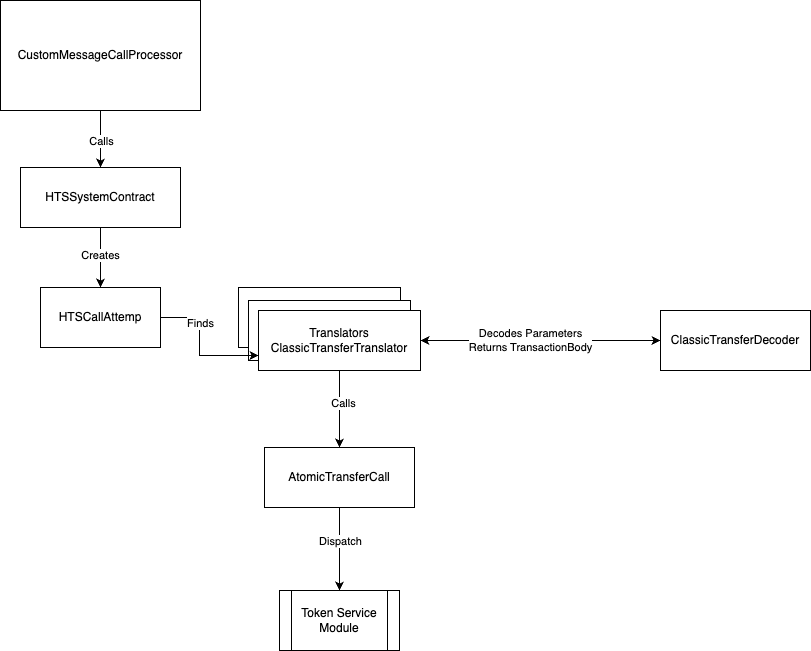
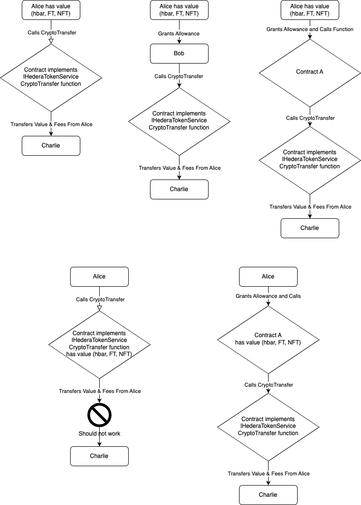

# Atomic Crypto Transfer

## Purpose

[HIP-206](https://hips.hedera.com/hip/hip-206) defines functionality to perform atomic crypto transfers of value - hbar and tokens - between accounts using the IHederaTokenService interface. This document will define the architecture and implementation of this functionality.

## Goals

Describe the implementation of the atomic crypto transfer functionality in the Hedera Smart Contract Service.  

## Non Goals

- The implementation of the atomic crypto transfer functionality in the mono service codebase will not be discussed.
- The implementation details of crypto `allowance` and `approvals` for hbar from within smart contracts is outside the scope of this document and will be described in a separate document.

## Architecture

The architecture for atomic crypto transfer follows the existing framework defined for handling all calls to the HederaTokenService system contract in the modularization services and is described in more detail in the `Implementation` section below.

## Implementation
Handling token related functionality is generally cooperatively performed by the smart contracts service module and the token service module.  The following classes are used to handle the call to the atomic crypto transfer function:

### Smart Contract Service Module
1.  The smart contract service implements a `CustomMessageCallProcessor` class which overrides the Besu `MessageCallProcessor` class in order to potentially intercept calls to system contract addresses.
If the contract address of the current call is determined to be the contract address for the HederaTokenService (0x167), the call is redirected to the `HtsSystemContract` class for processing. 
2.  The `HtsSystemContracts` creates an instance of the `HtsCallAttempt` class from the input bytes and the current message frame to encapsulate the call.
3.  The `HtsCallAttempt` class iterates through a list of `Translator` classes (provided by Dagger) in order to determine which translator will be responsible for processing the call by attempting to match the call's 
function signature to a signature known by the translator.  In the case of atomic crypto transfer calls, the `ClassicTransferTranslator` class will be responsible for processing the calls which has the following function signature: \
```cryptoTransfer(((address,int64,bool)[]),(address,(address,int64,bool)[],(address,address,int64,bool)[])[])```
4.  The `ClassicTransferTranslator` class will call the `ClassicTransferDecoder` class to decode the parameters of the call and translating the encoded parameter into a `TransactionBody` object.
5.  A class called  `ClassicTransfersCall` will then take the created `TransactionBody` object and dispatches a new transaction to the Token Service Module for processing.  
- Before dispatching the relevant feature flag `contracts.precompile.atomicCryptoTransfer.enabled=true` will be checked.
- A `VerificationStrategy` class will be provided to the token service during dispatch in order to ensure that the security model is adhered to.
- It is also responsible for other miscellaneous tasks such as checking for sufficient gas and encoding the response.



### Token Service Module

Once the smart contract service dispatches the transaction to the Hedera Token Service the following steps are performed:

1. Validate the semantic correctness of the transaction.
2. Handle any aliases found and potentially create hollow accounts as necessary.
3. Handle auto associations
4. Add transfers to the transfer list
5. Handle custom fees and add the resulting transfers to the transfer list
6. Perform the transfers between accounts using the transfer list
7. Create the resulting record and return to the caller. 

The implementation can be found starting in the `CryptoTransferHandler` class.

## Acceptance Tests

As outlined above most of the implementation of the atomic crypto transfer functionality has already been completed.  What remains is to write acceptance tests
to validate the functionality with a particular emphasis on security and edge cases and fixing issues as they arise. Below is a diagram that enumerates various transfer scenarios that need to be tested.




### BDD Tests

BDD tests are required to cover security concerns which require complex signing scenarios.  Many of these tests
are already implemented and need not be repeated as XTests.

#### Positive Tests
- Successful transfer of hbars only and HTS tokens only between accounts from sender account via contract.
- Successful transfer of hbars and HTS tokens with a custom fees (including fallback fee scenarios).
- Successful transfer of hbars and HTS tokens with available auto token association slots on the receiver.
- Successful transfer of hbars and HTS tokens from EOA account given approval to another EOA.
- Successful transfer of hbars and HTS tokens from EOA account given approval to a caller contract.
- Successful transfer of hbars and HTS tokens from owner contract via transfer contract.

#### Negative Tests

- Failure when attempting to transfer from special system accounts.
- Failure when receiver signature is required and not provided.
