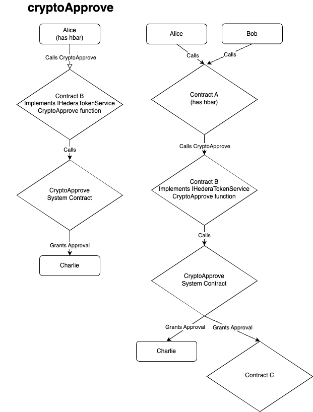

# Crypto Allowance and Approval

## Purpose

Currently, the IHederaTokenService interface in the Hedera Smart Contract Service offers support for approving an allowance to a `spender` account for tokens.
Document the implementation of the crypto allowance and approval functionality in the Hedera Smart Contract Service which extends this functionality to an account's hbars.

## Goals

Define the classes necessary to complete implementation of the crypto allowance and approval functionality in the Hedera Smart Contract Service.  Only the implementation in the modularized code will be described in this document.

## Non Goals

The implementation for crypto allowance and approval in the Token Service Module will only be described at a high level as this implementation is already complete.

## Architecture

The architecture for atomic crypto transfer will follow the framework defined for handling all calls to the HederaTokenService system contract and described in more detail in the `Implementation` section below.

## Implementation

### CryptoAllowance

The `cryptoAllowance` function will be used to retrieve information about allowance granted to a spender and will have the following signature:

| Hash       | Signature                                       | Response                                                  | Implementation Classes                   |
|------------|-------------------------------------------------|-----------------------------------------------------------|------------------------------------------|
| 0xf9bf3300 | cryptoAllowance(address owner, address spender) | (ResponseCode, amount of hbar allowances for the account) | GetAllowanceCall, GetAllowanceTranslator |

- The `GetAllowanceTranslator` class will be responsible for recognizing the `cryptoAllowance` function signature and processing the call.  It will call the `GetAllowanceCall` class to decode the parameters of the call and translate the encoded parameter into a `TransactionBody` object.  
- The `GetAllowanceCall` class will look up the allowance for the owner to the spender and return the amount of hbars allowed. No dispatch to the Hedera Token Service is necessary.

### CryptoApprove

The `cryptoApprove` function will allow the sender to grant to the `spender` an allowance of `amount` hbars and will have the following signature:

| Hash       | Signature                                     | Response     | Implementation Classes                                                       |
|------------|-----------------------------------------------|--------------|------------------------------------------------------------------------------|
| 0x91649ae5 | cryptoApprove(spender address, amount int256) | ResponseCode | GrantApprovalTranslator, GrantApprovalDecoder, ClassicGrantCryptoAppovalCall |

- The `GrantApprovalTranslator` class will be responsible for recognizing the `cryptoApprove` function signature and processing the call.  It will call the `GrantApprovalDecoder` class to decode the parameters of the call and translate the encoded parameter into a `TransactionBody` object.
- The `ClassicGrantCryptoAppovalCall` class will be responsible for dispatching the transaction to the Token Service Module for processing.  It will also be responsible for checking for sufficient gas and encoding the response.

### Hedera Token Service

Once the smart contract service dispatches the transaction to the Token Service Module it performs the following steps:

1. Validate semantic correctness of the transaction.
2. Extracts the crypto allowances into a local list.
3. Grant approval to the spender for the allowance amount from the effective owner.

Most of the implementation can be found int the `CryptoApproveAllowanceHandler` class.

## Acceptance Tests

### XTests

#### Positive Tests

#### Negative Tests

### BDD Tests

#### Positive Tests

#### Negative Tests

