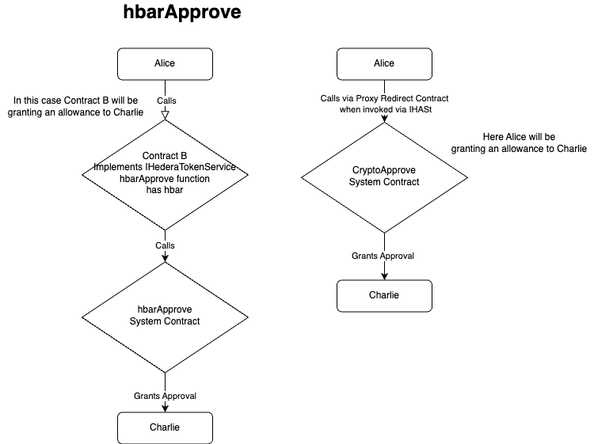

# hbar Allowance and Approval

## Purpose

Currently, the IHederaTokenService interface in the Hedera Smart Contract Service offers support for approving an allowance to a `spender` account for tokens.
Document the implementation of the hbar allowance and approval functionality in the Hedera Smart Contract Service which extends this functionality to an account's hbars.

## Goals

Define the classes necessary to complete implementation of the hbar allowance and approval functionality in the Hedera Smart Contract Service.  Only the implementation in the modularized code will be described in this document.

## Non Goals

The implementation for crypto allowance and approval in the Token Service Module will only be described at a high level as this implementation is already completed.

## Architecture

In order to support both EOA and contract callers to these functions, a new interface `IHRC632` will be supported and implemented using the pattern established for token proxy contracts as discussed in the `Specification` section of [HIP-719](https://hips.hedera.com/hip/hip-719). 
The difference is that `IHRC632` will act on an account address rather than a token address will be the account in view with respect to the allowance to the `spender` account for the specified amount.  
A new proxy contract and a new system contract to handle these transaction requests will be implemented similar to the logic for tokens described in HIP-719.
For security purposes, an EOA account sender must also sign the transaction.  If the sender is a contract that supports this interface then **any** caller will be able to grant an allowance to the contract's hbars.

## Implementation

### hbarAllowance

The `hbarAllowance` function will be used to retrieve information about allowance granted to a spender and will have the following signature:

| Hash       | Signature                      | Response                                                                   | Implementation Class       |
|------------|--------------------------------|----------------------------------------------------------------------------|----------------------------|
| 0xbbee989e | hbarAllowance(address spender) | (ResponseCode, uint256 - amount of hbar allowances granted to the spender) | GetHbarAllowanceTranslator |

- The `GetHbarAllowanceTranslator` class will be responsible for recognizing the `hbarAllowance` function signature and processing the call.  It will decode the parameters and look up the allowance information from the Account store and return the requested information.  

### hbarApprove

The `hbarApprove` function will allow the sender to grant to the `spender` an allowance of `amount` hbars and will have the following signature:

| Hash       | Signature                                    | Response     | Implementation Classes                             |
|------------|----------------------------------------------|--------------|----------------------------------------------------|
| 0x76f17392 | hbarApprove(spender address, amount uint256) | ResponseCode | GrantHbarApprovalTranslator, GrantHbarApprovalCall |

- The `GrantHbarApprovalTranslator` class will be responsible for recognizing the `hbarApprove` function signature and processing the call.  It will decode the parameters and create a `TransactionBody` object to be used by the `GrantHbarApprovalCall` class.
- The `GrantHbarApprovalChbar_approveall` class will be responsible for dispatching the transaction to the Token Service Module for processing.  It will also be responsible for miscellaneous tasks such as checking for sufficient gas and encoding the response.

### Hedera Token Service

Once the smart contract service dispatches the transaction to the Token Service Module it performs the following steps:

1. Validate semantic correctness of the transaction.
2. Grant approval to the spender for the allowance amount from the effective owner.

The implementation can be found in the `CryptoApproveAllowanceHandler` class.

## Acceptance Tests

### BDD Tests

#### Positive Tests
- Test that an EOA can call the `hbarApprove` function and grant an allowance to another account.
- Test that a contract can call the `hbarApprove` function and grant an allowance to another account.
- Test that an EOA can call the `hbarAllowance` function and retrieve the allowance granted to another account.
- Test that a contract can call the `hbarAllowance` function and retrieve the allowance granted to another account.

#### Negative Tests
- Test that an EOA calling the `hbarApprove` function without the correct signature will fail.
- Test that a contract calling the `hbarApprove` function without the correct contract key will fail.
- Test that an attempt to transfer more hbars that the spender has been granted will fail.

