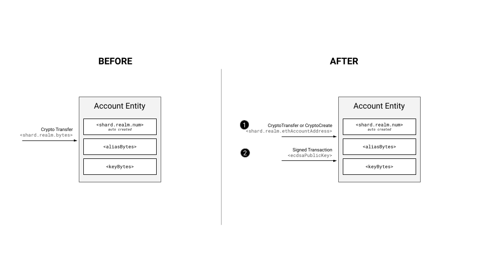

# Alias Configuration

## Purpose

Account aliases allow an account to be referenced via a different id than the `<shard>.<realm>.<num>` account ID format which is native to the Hedera ledger.
As part of [HIP-32](https://hips.hedera.com/hip/hip-32) the functionality was made available via the auto-create flow in which an `ED25519` or `ECDSA` public key was provided and used as the alias.

To support greater scenarios, especially smart contract related scenarios for ECDSA-based key, the ledger needs to support additional ways of setting the alias at creation.

This document explains how additional crypto and smart contract service transaction flows may be used to create an account with an alias.

## Prerequisite reading

* [HIP-32](https://hips.hedera.com/hip/hip-32)
* [HIP-583](https://hips.hedera.com/hip/hip-583)

## Goals

- Update the `CryptoCreate` transaction to support the provision of an account with `evm address alias`
- Update the `CryptoTransfer` transaction to support auto creation via `evm address alias`
- Support the `Lazy Account Creation Flow`
  - Contrary to the _normal_ account creation flow, the _lazy_ account creation flow consists of two phases:
    - Phase 1: Provision of an initial transaction that creates an account with an alias and **no public key** - a `hollow account`
      - Support the receiving of value by the new account (hbars or tokens)
      - Prevent the success of transactions requiring the account's signature
    - Phase 2: Extract the ECDSA public key from a future signed transaction for which the account is the payer or some of the required accounts participating in the transaction, and finalize the account by setting the key in state - `hollow account` finalization
- Support the `Lazy Account Creation Flow` via the EVM
- Update alias specification to support `evm address alias` values

## Non-Goals

- Updating existing accounts' alias fields
- Updating the logic of account deletion to include clearing up the aliases of deleted accounts

## Architecture

### Alias to Public Key Validation

The alias validations described in [HIP-583](https://hips.hedera.com/hip/hip-583) should be implemented for:
- `CryptoCreate` transactions in `CryptoCreateChecks.cryptoCreateValidation()`
- `CryptoTransfer` transactions in `AliasResolver.resolve()` and `TransferPrecompile.replaceAliasWithId()`

### Lazy Account Creation Flow

Usually, accounts are created with the provision of the public key.
However, in other ledgers where accounts are `ECDSA` based (mostly EVM chains) it is possible to reference an account via its EVM address.
This is the rightmost 20 bytes of the 32-byte `Keccak-256` hash of the `ECDSA` public key of the account. This calculation is in the manner described in the Ethereum Yellow Paper.

To support the use of this format as an alias the `Lazy Account Creation Flow` may be adopted.

In this flow
- An initial transaction may supply an accountId using the `<shard>.<realm>.<evmAddressAlias>`
- The ledger should create the account using the given alias without the public key
- The ledger should support the receiving of value (hbars or tokens) but prevent the account from taking part in transactions it needs to sign
- The ledger should extract the public key from a future transaction for which the account is the payer or some of the required accounts participating in the transaction and verify it maps to the alias on the account
- The ledger should complete the account creation process by setting the key value of the account

For more details about the completion of hollow accounts please refer to [Hollow Account Finalization](./hollow-finalization.md) document.

### Lazy Account Creation Fee Charging

- All lazy account creation fees (a `CryptoCreate` fee for the creation, and a `CryptoUpdate` for the finalization) are to be charged upon **creation**
- `AbstractAutoCreationLogic.create()` will need to be updated to charge additional `CryptoUpdate` fees, separate from the already charged `CryptoCreate` fees

### CryptoCreate Transaction with EVM address alias

- Extend the `CryptoCreateTransactionBody` protobuf definition with new `alias` field
- Extract the `alias` from `CryptoCreateTransactionBody` and validate in `CryptoCreateChecks`:
  - ensure that the `alias` is has the size of an EVM address
  - ensure that it is not possible to specify an `account-num alias`
  - ensure the given `alias` is not already linked to another account
- All supported `key/alias` combinations for creating a new account via `CryptoCreate` are denoted in the table below. A couple of scenarios, which should be paid more attention to:

|        CryptoCreateTransactionBody        |     Resulting account in the consensus node state      | Resulting entries in consensus node in-memory map |                                                                                Expected transaction record entries                                                                                |
|-------------------------------------------|--------------------------------------------------------|---------------------------------------------------|---------------------------------------------------------------------------------------------------------------------------------------------------------------------------------------------------|
| `key` =  ED key   `alias` = -         | `admin key` = ED key   `alias` = -                 | -                                                 | `transaction_record.alias` = -   `transaction_record.evm_address` = -     The key is present in the transaction body and not present in the transaction record.                       |
| `key` = EC key  `alias` = -           | `admin key` = EC key   `alias` = -                 | -                                                 | `transaction_record.alias` = -   `transaction_record.evm_address` = -   The key is present in the transaction body and not present in the transaction record.                         |
| `key` = EC key  `alias` = EVM Address | `admin key` = EC key   `alias` = EVM Address alias | EVM Address alias → hedera id                     | `transaction_record.alias` = -   `transaction_record.evm_address` = -    The key and EVM address alias are present in the transaction body and not present in the transaction record. |

### CryptoTransfer Transaction to EVM address alias

- For `CryptoTransfer` we already support auto creation with a public key alias
- To support auto creation with EVM address alias for `CryptoTransfer` we will need to:
  - Change the implementation in the `AliasResolver.resolveInternalFungible` method, it already has some EVM address handling
  - Change the `AbstractAutoCreationLogic.create` to expect an alias that might not be key but an EVM address, and to charge all related hollow account creation fees
- The following table sums up all the ways a user will be able to create an account via `CryptoTransfer` with an alias (the last row is the newly added way of creating `hollow account`s, i.e. phase 1 of lazy account creation):

|   CryptoTransfer target    |  Resulting synthetic CryptoCreateTransactionBody  |    Resulting account in consensus node state     |   Resulting entries in consensus node in-memory map    |                                                                                                                                 Expected transaction record entries                                                                                                                                  |
|----------------------------|---------------------------------------------------|--------------------------------------------------|--------------------------------------------------------|------------------------------------------------------------------------------------------------------------------------------------------------------------------------------------------------------------------------------------------------------------------------------------------------------|
| `ED25519` public key alias | `admin key` = ED key  `alias` = ED key alias  | `admin key` = ED key  `alias` = ED key alias | ED key alias → hedera id                               | `transaction_record.alias` = -   `transaction_record.evm_address` = -    The `key` and `alias` are externalized in the `CryptoCreateTransactionBody.key` and `CryptoCreateTransactionBody.alias` fields and not present in the transaction record.                                       |
| `ECDSA` public key alias   | `admin key` = EC key  `alias` = EC key alias  | `admin key` = EC key  `alias` = EC key alias | EC key alias → hedera id EVM Address alias → hedera id | `transaction_record.alias` = -   `transaction_record.evm_address` = EVM address alias     The `key` and the `ECDSA public key alias` are externalized in the `CryptoCreateTransactionBody.key` and `CryptoCreateTransactionBody.alias` fields and not present in the transaction record. |
| `EVM Address` alias        | `admin key` = -   `alias` = EVM Address alias | `admin key` = -  `alias` = EVM Address alias | EVM Address alias → hedera id                          | The `evm address` is externalized in the `CryptoCreateTransactionBody.evm_address` field and not present in the transaction record.                                                                                                                                                                  |

### Lazy Account Creation Phase 1 Through the EVM

- Implement a new version of the EVM (see [the evm versioning design doc](../smart-contract-service/evm-versioning.md)) that will allow transfers of value to non-existing addresses. In this way, instead of halting the execution frame with `INVALID_SOLIDITY_ADDRESS`, the transfer will be considered a lazy account creation attempt.
- The account creation fees must be charged from the available gas in the frame
  - Any EVM execution that cannot pay for a lazy account creation through the available gas will halt with `INSUFFICIENT_GAS` exceptional halt reason
- The EVM can plug into the pre-existing logic in `AbstractAutoCreationLogic.create()` in order to create the hollow accounts.
- The EVM module's `HederaEvmMessageCallProcessor` will be extended with a `executeLazyCreate()` method, implemented by the service's `HederaMessageCallProcessor`
- Supported scenarios will include:
  - Top-level `EthereumTransaction` crypto transfers
    - `ContractCallTransitionLogic` will need to be updated to allow such transactions to pass, instead of failing with `INVALID_CONTRACT_ID`
  - Nested EVM calls with value via `.call()`
    - Will require a new implementation of `HederaCallOperation` which will consider value transfers to non-existing addresses as a lazy creation attempt
    - `.send()`, `.transfer()` can also be used for value transfers in smart contracts. However, they cap their `gasLimit` at 2300, which won't be sufficient for a lazy creation, and are considered bad practice, so we won't add any specific logic in order to support them.
  - `TransferPrecompile` will also need to be altered to allow transfers to a non-existing address. All of the following precompile functions must be supported:
    - `cryptoTransferV1`
    - `cryptoTransferV2`
    - `transferToken`
    - `transferTokens`
    - `transferNFT`
    - `transferNFTs`
    - `ERC20.transfer`
    - `ERC20.transferFrom`
    - `ERC721.transferFrom`
    - `IHederaTokenService.transfer`
    - `IHederaTokenService.transferFrom`

### Lazy Account Creation Phase 2 (finalizing a `hollow account`)

- For details about the completion of hollow accounts please refer to [Hollow Account Finalization](./hollow-finalization.md) document.
- `CREATE2` contract creation to an address already occupied by a hollow account must finalize it:
  - `AbstractRecordingCreateOperation` must be altered to check whether the targeted address is occupied by a `hollow account`, allow the creates in those cases, and, upon completion, convert the hollow account into a contract, setting its key to the default `JContractIDKey`.

## Non-Functional Requirements

- Support lazy account create initialization and completion TPS (100)

## Open Questions

## Acceptance Tests

## Cases

See the scenarios described in the [HIP-583 test plan](../../../test-plans/hip-583.md)

### Notes

- For the EVM address cases we should store the alias value in the state not only in the memory structure
- It is OK for different accounts to have the same key
- For accounts with non-empty aliases if we have a key that is set, it is not required for the key to match the alias
