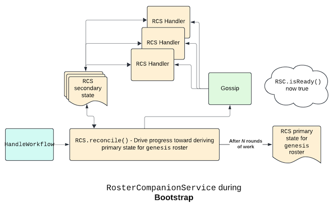
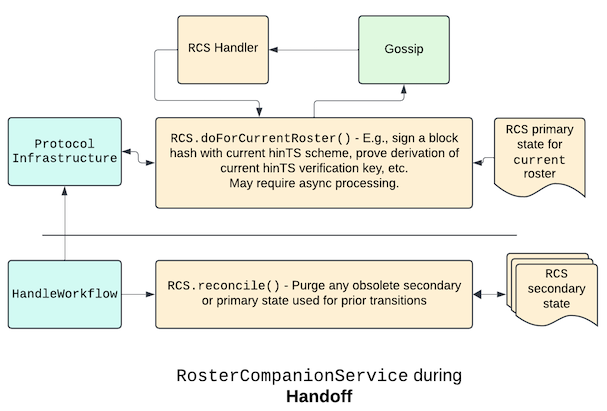
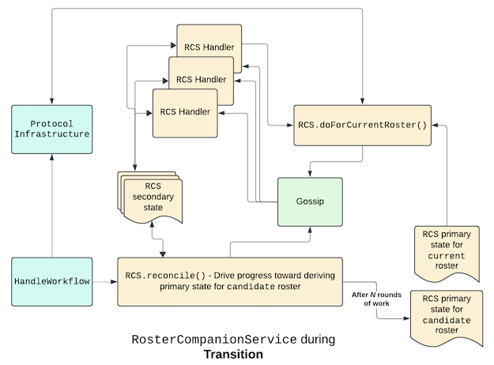

## Exact-weight TSS

A **threshold signature scheme (TSS)** lets a group of parties collectively sign a message by aggregating their
partial signatures. The **access structure** of a TSS is the set of subsets of the parties whose partial signatures
can be combined to form a valid signature. For an aBFT proof-of-stake blockchain, the ideal access structure at any
point in the protocol includes any set of nodes holding at least 1/3 of the total consensus weight. In a Hiero network,
consensus weights are the whole number of HBARs staked to each node, and hence require 64-bit precision since each
network has a fixed supply of 50B HBAR.

Ignoring the amount of work and party interactions required of a verifier, it is relatively straightforward to design
such a TSS. It is much harder to design an **efficient** TSS with this property. Efficiency demands,
- A stable, succinct **ledger identity** that verifiers can trust during any period since adoption of the TSS in which
the network's aBFT properties are not compromised; no matter how many nodes are added or removed, or change their
signing keys.
- **Concise signatures** whose length is independent of the size of the network.
- **Fixed-cost, non-interactive verification** that is again independent of the size of the network.

Hiero uses an efficient exact-weight TSS where signing works via the **hinTS** scheme published in [1], and the
ledger's identity is the hash of the ids, weights, and Schnorr public keys of the permissioned nodes in the network
at the time the TSS was adopted.

This document provides the high-level design of how Hiero TSS is implemented.

### Relation to the `RosterService` lifecycle

Since the very identity of the ledger in Hiero TSS depends on the ids, weights, and Schnorr keys of the nodes in
the network roster at the time of adoption, the TSS implementation is naturally guided by the lifecycle of the
`RosterService`. This lifecycle has three phases:
1. **Bootstrap**: Only a genesis roster exists, and although the nodes have secure communication channels,
there is no consensus state with the Schnorr or hinTS public keys of the nodes. In this phase, the TSS system must
derive this state from gossip; finish preprocessing for the hinTS scheme; and prove the initial hinTS verification
key and weight threshold are embedded as metadata at the start of the chain of rosters blessed by Schnorr signatures
from nodes in the previous roster with at least 1/3 of the weight. (Since bootstrap begins the chain, verifiers must
trust the genesis roster's members for prior reasons.)
2. **Transition**: The current roster is fully active; the TSS state includes a consensus proof that the roster,
its hinTS verification key, and minimum weight threshold were all blessed by a previous roster. There is also a
candidate roster that reflects the latest dynamic address book changes and HBAR stake adjustments. In this phase, the
TSS system must repeat hinTS preprocessing for the candidate roster; and collect enough Schnorr signatures from the
current roster to (recursively) prove _that_ roster's hinTS construction and minimum weight threshold.
3. **Handoff**: The current roster is fully active, but there is no candidate roster because the network has just
replaced its current roster with the candidate roster. In this phase, the TSS system may, for example, purge any
obsolete state accumulated during its previous transition phases; but it has no urgent responsibilities besides, of
course, providing ledger signatures.

### The `RosterCompanionService` abstraction

We structure the TSS system as two services with distinct responsibilities:
1. The `HintsService`, which implements the six main hinTS algorithms that function given the **common reference
string (CRS)** grounding the protocol; that is, preprocessing, key generation, hint generation, partial signing,
partial verification, and signature aggregation.
2. The `HistoryService`, which is unaware of its role in specifically TSS, and implements a more general function of
proving via recursive SNARK that a set of node ids, weights, Schnorr keys; and some arbitrary metadata, were derived
from the ledger id with each transition in the derivation having valid Schnorr signatures from nodes with at least 1/3
of the weight in the source roster.

The node software combines these services to achieve TSS by setting the metadata in the `HistoryService` proof
for each roster to the concatenation of two items:
1. The verification key computed by the `HintsService` for that roster.
2. The minimum threshold weight that a verifier should accept for a signature by this
verification key; in particular, 1/3 of the total weight in the roster, which is _not_ necessarily 1/3 of
50B HBAR---unless all HBAR were staked to nodes in the roster.

(Note the full message that nodes sign with their Schnorr keys in each `HistoryService` proof is the concatenation of
the above metadata with the hash of a canonical serialization of the list of `(node id, weight, Schnorr key)` triples
defining the next roster.)

Despite their separate responsibilities, both the `HintsService` and `HistoryService` share a high-level design that
we call the `RosterCompanionService`. This abstraction is a service whose goal is to derive some **primary state** for
each roster used by the `RosterService`, and that progresses, round by round, toward this goal by a **reconciliation
loop** driven by the `HandleWorkflow`. It uses whatever **secondary state** it needs and gossips any
**node transactions** required to implement this reconciliation loop.

A `RosterCompanionService` is **ready** when it has derived its primary state for the current roster. Becoming ready is
the prime objective of any `RosterCompanionService` during the bootstrap phase.

Completing bootstrap is equivalent to starting in a handoff phase, where a `RosterCompanionService` (`RCS`) has no
primary state to derive. Its only required function is to do **roster-scoped work** for the current roster on behalf of
other protocol infrastructure components; though it may also use the reconciliation loop to purge obsolete state.

At distinguished points (e.g., at a stake period boundary), the Hiero protocol creates a candidate roster that reflects
dynamic address book changes and HBAR stake adjustments. This initiates a transition phase, where the `RCS` must use the
reconciliation loop to derive its primary state for the candidate roster, at the same time it is doing tasks scoped to
the current roster.

#### A note on performance

In the first release of Hiero TSS, revisions to the candidate roster only happened at consensus midnight; and roster
handoffs only happened at upgrade boundaries scheduled 12 or more hours after UTC midnight. So new nodes after a handoff
had an entire release to successfully gossip their hinTS and Schnorr keys; and there were many hours between the latest
revision to the candidate roster and the next handoff to complete the work for each transition.

If Hiero networks move to a much more compressed schedule for roster revisions and transitions, `RCS` implementations
may want to do some transition phase work preemptively, even before the next revision to the candidate roster.For
example,
- A node new to the network could estimate the size of the next candidate roster and preemptively publish its hinTS
key for that size.
- A node new to the network could immediately publish its Schnorr key when going `ACTIVE`.

But these optimizations were not necessary in the first release of Hiero TSS.

### The `HintsService` as a `RosterCompanionService`

We first map the `HintsService` to the `RCS` abstraction. Its **primary state** for each roster is a
**hinTS construction** with everything needed for deterministic progress toward the hinTS scheme for that roster.
The main features of a hinTS construction are items such as,
1. A unique numeric id $c$ for the construction to help connect related hinTS state like votes to the construction.
2. The source roster hash.
3. The target roster hash (needed by a reconnecting node to recover weight information for nodes, and hence parties,
in the ongoing construction).
4. If the construction is complete, the hinTS aggregation and verification keys for the scheme.
5. If the construction is complete, the final mapping of node ids to hinTS party ids in the target roster.
6. If the construction is still collecting hinTS keys, the consensus time for the next aggregation attempt (an
**attempt** is a deterministic point in consensus time at which honest nodes pause and evaluate if they have enough
hinTS keys to satisfy the weight inequalities discussed in the [section](#implied-limitations-on-the-transition-phase)
below and begin the hinTS preprocessing algorithm).
7. If the construction has stopped accepting hinTS keys, the adoption time of the last accepted hinTS key.

Note that despite the strong functional analogy between the constructions that make up the roster-scoped primary state
for the `HintsService` and `HistoryService`, they have quite distinct goal states and need not have a one-to-one
correspondence. In particular, even if the Hiero signing mechanism were to change from hinTS to something else, this
would not require any change to the structure of a `HistoryService` proof construction.

The `HintsService` **secondary state** is everything else needed to facilitate deterministic progress on a
construction; in particular, for nodes that reconnect during the construction. Main types of secondary state are
items such as,
1. _Per construction size `M = 2^k`_ : For as many parties as possible, for a party with id $i \in [0, M)$, the
party's hinTS key; the node id that submitted that hinTS key; the consensus time the hinTS key was adopted in the
ongoing construction; and, if applicable, a revised hinTS key the same node wishes to use in subsequent constructions
of size $M$. (A node operator might wish to rotate their key for security reasons and trigger such a revision.)
Note that a node's assigned party id for a particular construction size never changes; so this implies such secondary
state is fully purged before reusing a party id for a new node id.
2. _Per construction id `c`_ : For a subset of node ids $\{ i_1, \ldots, i_n \}$ in the source roster of
construction $c$ accounting for at least 1/3 of its weight, their consensus vote for a particular preprocessing
output with aggregation and verification keys for construction $c$.

The **reconciliation loop** of the `HintsService` evolves this secondary state by a combination of scheduling
expensive cryptographic operations to run off the `handleTransaction` thread, and gossiping the results of these
operations (or votes on those results) to other nodes. These node operations likely include,
1. `HintsKeyPublication` - a transaction publishing the node's hinTS key for a particular construction size for
use in the next construction of that size (or an ongoing construction of that size, if this is the first such
publication for the node). In general, storing node's hinTS keys for multiple party sizes may lead to some mild
duplication of information about the node's public BLS key; but this will be rounding error compared to the size of
the hints, which are proportional to the number of parties.
2. `HintsPreprocessingVote` - a transaction publishing the node's vote for a particular preprocessing output for
a certain construction id; that is, the `(aggregation key, verification key)` output of the hinTS preprocessing
algorithm.

The `HintsService` is **ready** when it has completed a hinTS construction for the current roster.

The **roster-scoped work** of the `HintsService` is to accept a message (generally a block hash) and return a
future that resolves to the hinTS signature on the message. This will require gossiping partial signatures via
a `HintsPartialSignature` node transaction so the node can run the hinTS aggregation algorithm to produce a succinct
signature for a set of partial signatures whose parties are nodes with at least 1/3 weight in the current roster.

### The `HistoryService` as a `RosterCompanionService`

Next we map the `HistoryService` to the `RosterCompanionService` abstraction. Its **primary state** has one global
entry, the ledger id. Its roster-scoped primary state is a **proof construction** with everything needed for
deterministic progress toward the proof that this roster extends the chain of trust, incorporating any requested
metadata for the roster. The main features of a proof construction are items such as,
1. An id $c$ for the construction to help connect related proof state like votes to the construction.
2. The source roster hash; and if this is not the ledger id, the proof from the ledger id to the source roster.
3. The target roster hash.
4. If the construction is complete, the proof that the target roster and metadata belong to the chain of trust.
5. If the construction is waiting on Schnorr keys, the consensus time for the next attempt to assemble the next
`(roster, metadata)` pair in the chain of trust.
6. If the construction is no longer accepting Schnorr keys, the consensus final assembly time for the next
`(roster, metadata)` pair in the chain of trust.
7. If the construction is complete, the proof extending the chain of trust to the target roster and metadata.

The **secondary state** of the `HistoryService` is everything needed to facilitate deterministic progress on a
construction; in particular, for nodes that reconnect during the construction. This includes items such as,
1. _Per node id `i`_ : The node's Schnorr key; the node's consensus time for the Schnorr key; and, if applicable, a
revised Schnorr key the same node wishes to use in subsequent constructions.
2. _Per construction id `c`_ : For a subset of node ids $\{ i_1, \ldots, i_n \}$ in the source roster of construction
$c$ accounting for at least 1/3 of its weight, their signatures on a particular metadata and roster derivation for
construction $c$.
3. _Per construction id `c`_ : For a subset of node ids $\{ i_1, \ldots, i_n \}$ in the source roster of construction
$c$ accounting for at least 1/3 of its weight, their consensus vote for a particular proof output for construction $c$.

The **reconciliation loop** of the `HistoryService` evolves this secondary state by a combination of scheduling
expensive cryptographic operations to run off the `handleTransaction` thread, and gossiping the results of these
operations (or votes on those results) to other nodes. These node operations likely include,
1. `HistoryProofKeyPublication` - a transaction publishing the node's Schnorr key for use in the next construction.
2. `HistoryProofSignature` - a transaction publishing the node's signature for the proof of a particular history (that
is, address book and associated metadata).
metadata and roster concatenation for a certain construction id.
3. `HistoryProofVote` - a transaction publishing the node's vote for a particular proof output for a certain
construction id.

The `HistoryService` is **ready** when it has completed a proof that the current roster and metadata were derived from
the ledger id.

The **roster-scoped work** of the `HistoryService` is to accept a byte string which must match the metadata of the
current roster, and return the proof that this `(roster, metadata)` pair belongs to the chain of trust starting with
the ledger id.

### Integration with protocol components

The TSS system is then just the combination of the `HintsService` and `HistoryService` with the `RosterService`; with
the `HistoryService` metadata always set to the verification key of the `HintsService` for the current roster,
concatenated to the weight threshold $T$ required for signatures with that key. The complete ledger signature
$S_L$ on a message $\textrm{msg}$ thus combines a hinTS signature $S_h$ with proven threshold $\mathcal{T_S}$ at
least a claimed minimum threshold $\mathcal{T}$ on $\textrm{msg}$ with a proof $P_{\textrm{vk},\mathcal{T}}$ that
the pair $(\textrm{vk}, \mathcal{T})$ is exactly the metadata in a chain of trusted `(roster, metadata)` pairs
extending from a well-known ledger id `I`. That is,

$$ S_L[\textrm{msg}] = (S_h[\textrm{msg}], P_{\textrm{vk},\mathcal{T}})$$

An verifier of the signatures of a Hiero network will then,
- Validate out-of-band through some means that `I` is, in fact, the ledger id of the Hiero network in question.
- Deploy a generic hinTS verifier, *extended with* the ability to verify proofs asserting a chain-of-trust from `I`.
- Given a signature $S_L$ on $\textrm{msg}$ message $\textrm{msg}$, first check that $P_{\textrm{vk},\mathcal{T}}$ is
valid, and hence the hinTS scheme producing $S_h$ was in fact produced by nodes inheriting a chain of trust starting
from the nodes that established the trusted ledger id. Second, verify that $S_h$ is a valid hinTS signature on
$\textrm{msg}$.

There are only a few other details; namely,
- The `HandleWorkflow` is responsible for driving the reconciliation loops of both companion services.
- The `IngestWorkflow` must reject user transactions during the bootstrap phase.
- The `BlockStreamManager` must include every round in the genesis block until the TSS system is ready. (And thus it
must be possible to tell the platform not to use any of these rounds for state saving or reconnect.)

#### Implied limitations on the transition phase

Consider a transition from roster $A$ with nodes $\{A_1, \ldots, A_n\}$ and hinTS aggregation key $\textrm{ak}_A$ to
a candidate roster $B$ with nodes $\{B_1, \ldots, B_m\}$ and hinTS aggregation key $\textrm{ak}_B$.

Furthermore, let
$$w_A = \sum_{i=1}^n w(A_i)$$
be the total weight of roster $A$, and similarly for $B$. Also,
- Let $SA \subset A$ be the set of nodes in $A$ that have a Schnorr signature on the
pair $(B, \textrm{ak}_B)$.
- Let $SB \subset B$ be the set of nodes in $B$ that have a Schnorr key in $B$.
- Let $HB \subset B$ be the set of nodes in $B$ that have a hinTS key in $\textrm{ak}_B$.

Now, to preserve aBFT security, we must have Schnorr signatures on the pair $(B, \textrm{ak}\_B)$ from at least 1/3 of
the weight in $A$. That is,
$$w\_{SA} = \sum\_{A\_i \in {SA}} w(A\_i) \geq \frac{1}{3} w\_A$$

This implies that at least one honest node with non-zero weight signed off on the transition.

However, there are two further conditions that `(B, m)` must satisfy for the network to remain operational after
adopting it.

First, $HB$ must contain strictly more than 2/3 of the weight in $B$, so that even if just less
than 1/3 of the weight in $B$ is malicious, there will remain 1/3 honest weight that can construct hinTS signatures
and keep signing blocks.

$$w_{HB} = \sum_{B_i \in HB} w(B_i) > \frac{2}{3} w_B$$

Second, we must again have

$$w_{SB} = \sum_{B_i \in SB} w(B_i) > \frac{2}{3} w_B$$

so that again, even if just less than 1/3 of the weight in $B$ is malicious, there will remain at least 1/3 honest weight that
can sign off on the next transition. (It is, of course, not necessary that $SB = HB$; only that these weight conditions
are satisfied.)

**Important:** Given the current set of Hiero admin transactions, and the requirement that staking elections be
done to only active nodes, it is not possible to satisfy the above inequalities on $SB$ and $\mathbb{B}$
while changing more than 1/3 of the weight in the network in a single transition.

## References

1. Garg, S., Jain, A., Mukherjee, P., Sinha, R., Wang, M., & Zhang, Y. (2023). *hinTS: Threshold Signatures with Silent
   Setup*. Cryptology ePrint Archive, Paper 2023/567. Retrieved from [https://eprint.iacr.org/2023/567](https://eprint.iacr.org/2023/567)
