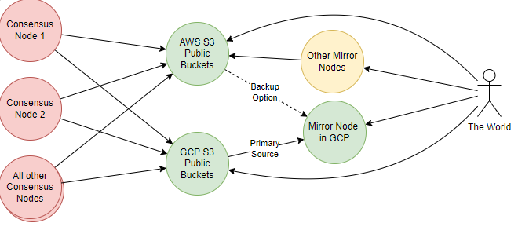

# Block Stream Bucket Upload Design Document

## Summary

In order for consensus nodes to upload block files to public cloud buckets, this proposal extends the existing block streaming capabilities to support uploading blocks to cloud storage buckets (AWS S3 and GCP Cloud Storage) while maintaining local copies for redundancy.

|      Metadata      | Entities    |
|--------------------|-------------|
| Designers          | Derek Riley |
| Functional Impacts | Services    |
| Related Proposals  | None        |
| HIPS               | None        |

---

## Table of Contents

1. [Summary](#summary)
2. [Context](#context)
3. [Requirements](#requirements)
4. [Dependencies](#dependencies)
   - [Rationale for Using MinIO](#rationale-for-using-minio) 
5. [Core Components](#core-components)
   - [Directory Structure](#directory-structure)
   - [Extended BlockStreamWriterMode](#extended-blockstreamwritermode)
   - [Configuration Classes](#configuration-classes)
      - [Network Properties](#network-properties)
      - [Credentials Configuration](#credentials-configuration)
   - [Cloud Storage Interface and Implementations](#cloud-storage-interface-and-implementations)
   - [BucketUploadListener Interface](#BucketUploadListener-Interface)
   - [BucketUploadManager](#BucketUploadManager)
   - [BlockReuploadManager](#BlockReuploadManager)
   - [BlockRetentionManager](#BlockRetentionManager)
   - [Metrics](#metrics)
6. [Flow Sequences](#flow-sequences)
   - [Happy Path](#happy-path)
   - [Error Handling](#error-handling)
   - [Hash Mismatch](#hash-mismatch)
7. [Testing Strategy](#testing-strategy)


### Context

The following image depicts how multiple consensus nodes will be attempting to upload to the same bucket. Only the first node to upload the block will succeed, and the others will check if the block is already available. If the block is available, the node will check if the block is the same by comparing the MD5 hash. If the hashes are different, the block will be moved to a hash mismatch directory, and an alert will be triggered. If the upload fails, the block will remain in the original directory for retry, and an alert will be triggered.

</img>

### Requirements
The following requirements have been identified for this proposal:
- We need a third BlockStreamWriterMode, which sends the blocks to one or more buckets.
- The buckets must be configurable.
- Both the writer mode and the addresses of the buckets must be configurable during runtime (i.e., the node must not be restarted to take the changes into effect).
- Blocks will be written to a local file initially and uploaded once done.
- We want to upload only one instance of a block. All consensus nodes will try to upload the same block to a bucket, and therefore only the first one can succeed.
- If a consensus node notices the block is already available, it should check if the blocks are the same (via MD5 hash). If they are different, the block should be moved to a hash mismatch directory, and an alert must be triggered.
- If uploading a block fails, it should remain in the original directory for retry, and an alert needs to be triggered.
- If the upload was successful, the block file will be moved to an uploaded directory.

### Dependencies

This proposal uses the MinIO Java SDK to provide a unified interface for cloud storage operations, supporting both AWS S3 and GCP Cloud Storage:

```xml
<dependencies>
    <dependency>
        <groupId>io.minio</groupId>
        <artifactId>minio</artifactId>
        <version>8.5.9</version>
    </dependency>
</dependencies>
```

#### Rationale for Using MinIO

- **Unified API**: MinIO provides a single S3-compatible API that works with multiple cloud storage providers, simplifying the integration process.
- **Flexibility**: Supports both AWS S3 and GCP Cloud Storage, allowing for easy configuration and management of multiple cloud providers.
- **Scalability**: MinIO's client is designed to handle large-scale storage operations efficiently, making it suitable for high-throughput environments.
- **Community and Support**: MinIO is a widely used open-source project with a strong community and commercial support options.

By leveraging the MinIO SDK, we can streamline the process of uploading block files to cloud storage, ensuring compatibility and performance across different providers.

## Core Components

### Directory Structure

Current directory in which blocks are written:

`@ConfigProperty(defaultValue = "/opt/hgcapp/blockStreams") @NodeProperty String blockFileDir`

Directory structure:
```
<blockFileDir>
├── ./             # Current blocks being processed/uploaded
├── /uploaded/     # Successfully uploaded blocks
└── /hashmismatch/ # Blocks with hash validation failures
```

### Extended BlockStreamWriterMode

```java
public enum BlockStreamWriterMode {
    GRPC,   // Stream blocks via gRPC
    FILE,   // Write blocks to local files
    BUCKETS // Write blocks to cloud storage buckets
}
```

### Configuration

The configuration is split into two parts:
1. Network properties that can be updated at runtime
2. Secure credentials stored locally

#### Network Properties
`@NetworkProperty` Are network-wide properties that can be dynamically updated via file 0.0.121.
The `writerMode` node property exists to support the ability for each node to be able to choose which modes it will use to write blocks.

```java
@ConfigData("blockStream")
public record BlockStreamConfig(
    // ... existing code ...
    // New Network Properties
    @ConfigProperty(defaultValue = "3") @NetworkProperty int uploadRetryAttempts,
    @ConfigProperty(defaultValue = "168") @NetworkProperty int localRetentionHours,
    @ConfigProperty(defaultValue = "data/config/bucket-credentials.json") @NetworkProperty String credentialsPath,
    // Bucket configurations with default AWS and GCP public buckets
    @ConfigProperty(defaultValue = """
        [
            {
                "name": "default-aws-bucket",
                "provider": "aws",
                "endpoint": "https://s3.amazonaws.com",
                "region": "us-east-1",
                "bucketName": "hedera-mainnet-blocks"
            },
            {
                "name": "default-gcp-bucket",
                "provider": "gcp",
                "endpoint": "https://storage.googleapis.com",
                "region": "",
                "bucketName": "hedera-mainnet-blocks"
            }
        ]
        """) @NetworkProperty List<BucketNetworkConfig> buckets,
    // Updated Node Property for writerModes
    @ConfigProperty(defaultValue = "[FILE, BUCKETS]") @NodeProperty List<BlockStreamWriterMode> writerModes,
    // ... existing code ...
) {}

public record BucketNetworkConfig(
    @ConfigProperty String name,
    @ConfigProperty String provider,  // "aws" or "gcp"
    @ConfigProperty String endpoint,
    @ConfigProperty String region,    // required for AWS only
    @ConfigProperty String bucketName
) {
    public BucketNetworkConfig {
        Objects.requireNonNull(name, "Bucket name cannot be null");
        Objects.requireNonNull(provider, "Provider cannot be null");
        Objects.requireNonNull(endpoint, "Endpoint cannot be null");
        Objects.requireNonNull(bucketName, "Bucket name cannot be null");
        
        if ("aws".equals(provider)) {
            Objects.requireNonNull(region, "Region is required for AWS buckets");
        }
    }
}
```

#### Credentials Configuration
The credentials are stored in a separate JSON file on disk for security:

```json
{
  "credentials": {
    "default-aws-bucket": {
      "accessKey": "YOUR_AWS_ACCESS_KEY",
      "secretKey": "YOUR_AWS_SECRET_KEY"
    },
    "default-gcp-bucket": {
      "accessKey": "YOUR_GCP_ACCESS_KEY",
      "secretKey": "YOUR_GCP_SECRET_KEY"
    }
  }
}
```

#### Credentials Records
```java
public record BucketCredentials(
    String accessKey,
    String secretKey
) {
    public BucketCredentials {
        Objects.requireNonNull(accessKey, "Access key cannot be null");
        Objects.requireNonNull(secretKey, "Secret key cannot be null");
    }
}

public record BucketCredentialsConfig(
    Map<String, BucketCredentials> credentials
) {
    public BucketCredentialsConfig {
        Objects.requireNonNull(credentials, "Credentials map cannot be null");
    }
}
```

#### Configuration Loading and Updates
The configuration system needs to handle both network properties and local credentials in a secure and maintainable way.

**BucketConfigurationManager Requirements**
- Singleton class managing both network properties and local credentials
- Load credentials from the JSON file specified in the configuration
- Provide methods to get complete bucket configurations by combining network properties with credentials
- Handle credential file reload if needed
- Log appropriate warnings/errors when credentials are missing or invalid
- Validate that all required bucket configurations have matching credentials

**CompleteBucketConfig Requirements**
- Immutable record combining network configuration with credentials
- Include all necessary fields for bucket connection:
  - name
  - provider type (AWS/GCP)
  - endpoint
  - region (if applicable)
  - bucket name
  - credentials (access key and secret key)
- Include validation to ensure all required fields are present
- Provide a clean interface for the MinioClientFactory to create new clients

### Cloud Storage Interface and Implementations

#### CloudBucketUploader Interface
The base interface defining operations for uploading blocks to cloud storage providers.

Key Operations:
- Upload a block file with associated metadata asynchronously
- Check if a block exists in cloud storage
- Retrieve MD5 hash of a stored block
- Get the provider identifier

#### MinioBucketUploader Implementation
Implementation of CloudBucketUploader for MinIO/S3-compatible storage.

Key Responsibilities:
- Initialize MinIO client with provider configuration
- Handle block uploads with retry logic and MD5 validation
- Check for existing blocks and validate hashes
- Manage concurrent uploads using executor service
- Format object keys using standardized naming
- Handle provider-specific errors and exceptions

Required Features:
- Configurable retry attempts for failed uploads
- Exponential backoff with jitter between retries
- Hash validation before and after uploads
- Asynchronous operations using CompletableFuture
- Structured logging of operations and errors

#### RetryUtils Helper
Utility class providing standardized retry logic for operations.

Key Features:
- Configurable maximum retry attempts
- Exponential backoff with random jitter
- Exception handling and propagation
- Operation timeout management
- Detailed logging of retry attempts
- Support for operations that can throw checked exceptions


### BucketUploadListener Interface
Interface for components that need to be notified when block files are closed and ready for upload.

Key Operations:
- `onBlockClosed(Path blockPath)` - Called when a block file is closed and ready for upload

#### FileBlockItemWriter Updates
The FileBlockItemWriter class needs to be enhanced to support notifying listeners when blocks are closed.

Required Changes:
- Add list of registered BucketUploadListener instances
- Add methods to register/unregister listeners
- Update closeBlock() to notify listeners after successful block closure
- Handle errors during block closure and notify listeners

### BucketUploadManager

The BucketUploadManager is responsible for coordinating block uploads to multiple cloud storage providers. It listens for block closure events and manages the asynchronous upload process, including directory management and metrics collection.

Key Implementation Details:
- Implements BucketUploadListener interface to receive block closure notifications
- Manages concurrent uploads to multiple cloud providers using an ExecutorService
- Manages block files by moving them to appropriate directories based on upload status:
  - Successful uploads: moved to `/uploaded` directory
  - Hash mismatches: moved to `/hashmismatch` directory
  - Failed uploads: remain in original directory for retry
- Performs hash validation to detect corrupted or incomplete uploads
- Collects detailed metrics on upload operations including:
  - Success/failure counts per provider
  - Upload latency measurements
  - Hash mismatch detection
  - Skipped upload tracking
- Handles upload failures with proper error logging and metrics
- Uses CompletableFuture for non-blocking asynchronous operations


### BlockReuploadManager
The BlockReuploadManager is responsible for initiating re-uploads of failed block uploads after node restarts or re-uploading blocks that were attempted to be uploaded more than the configured retry limit.

##### Key Responsibilities
- Managing retry attempts for failed uploads while respecting configured retry limits
- Coordinating with the BucketUploadManager to re-attempt uploads
- Handling error scenarios gracefully with appropriate logging and failure reporting

##### Startup Operations
- Scan block directory on node startup
- Identify blocks that need to be uploaded (files in the current directory)
- Build recovery queue

##### Recovery Processing
- Initiate recovery of incomplete uploads
- Track recovery progress
- Report recovery metrics

### BlockRetentionManager

The BlockRetentionManager is responsible for managing the lifecycle of block files in the `/uploaded` directory after a configurable retention period.

Key Implementation Details:
- Manages block file retention based on configurable retention period
- Performs asynchronous cleanup of expired block files from the `/uploaded` directory
- Uses non-blocking CompletableFuture operations for cleanup tasks
- Leverages shared executor service for background operations
- Maintains metrics for deleted blocks and cleanup operations
- Implements proper error handling and logging
- Supports both raw (.blk) and compressed (.blk.gz) block files

Required Configuration:
- Block retention period duration
- Block storage directory path
- Cleanup schedule interval
- Thread pool configuration for cleanup operations

### Metrics

The following metrics will be tracked with prefix `hedera.blocks.bucket.<provider>.<nodeId>`:

- `uploads.success` (Counter) - Number of successful block uploads per provider per node
- `uploads.failure` (Counter) - Number of failed block uploads per provider per node
- `hash.mismatch` (Counter) - Number of hash validation failures per provider per node
- `blocks.retained` (Gauge) - Current number of blocks retained on disk per node

## Flow Sequences

### Happy Path

1. Block is written to disk using FileBlockItemWriter
2. On closeBlock():
   - FileBlockItemWriter notifies registered BucketUploadListeners
   - BucketUploadManager receives notification and:
     - Validates block file exists and is readable
     - Launches parallel uploads to each configured bucket provider
     - Each provider:
       - Uploads block file
       - Validates uploaded file hash matches local hash
   - After all uploads complete successfully:
     - Block file is moved to the `/uploaded` directory
     - BlockRetentionManager will eventually delete the block file based on retention policy
     - Metrics are updated to reflect successful upload

### Error Handling

- Upload Failure:
  - Retry with exponential backoff up to configured max attempts
  - Keep file in current directory until successful upload or manual intervention
  - Emit upload failure metrics per provider
  - Log error details including:
    - Provider name
    - Block file path
    - Error message and stack trace
    - Retry attempt number

### Hash Mismatch
- When hash validation fails:
  - Move file to `/hashmismatch` directory
  - Emit hash mismatch metric per provider
  - Log error details including:
    - Provider name
    - Block file path 
    - Expected vs actual hash values

## Testing Strategy

1. Unit tests for each component
2. Integration tests with mocked cloud services
3. End-to-end tests with real cloud services