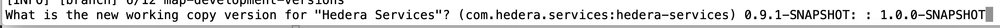

# Release automation 

This document covers the steps to perform a release of Hedera Services. 
Most of the automation is built around the `maven-release-plugin` but 
remains platform-specific due to a handful of supporting Bash scripts. 
It has only been tested on macOS; and needs Maven version 3.5.4 or 
later, as well as Docker. 

The target audience consists of core committers to Hedera Services. 
Certain steps require additional privileges, such as write access to the 
`com.hedera.hashgraph` Nexus repository or admin privileges for the 
GitHub repository. 

## Preliminaries

We must prepare our _~/.m2/settings.xml_ with appropriate credentials 
and properties.

```
<settings>
  <servers>
    <server>
      <id>ossrh</id>
      <username>[SONATYPE_OSSRH_USERNAME]</username>
      <password>[SONATYPE_OSSRH_PASSWORD]</password>
    </server>
  </servers>
  <profiles>
    <profile>
      <id>git-signoff</id>
      <activation>
        <activeByDefault>true</activeByDefault>
      </activation>
      <properties>
        <git.signoff>Signed-off-by: [GITHUB_USERNAME] &lt;[GITHUB_EMAIL]&gt;</git.signoff>
      </properties>
    </profile>
    <profile>
      <id>ossrh</id>
      <activation>
        <activeByDefault>true</activeByDefault>
      </activation>
      <properties>
        <gpg.passphrase>[GPG_KEY_PASSPHRASE]</gpg.passphrase>
      </properties>
    </profile>
  </profiles>
</settings>
```

## Creating a release branch

This step should be performed from `master`, and hence requires
admin privileges for the Hedera Services GitHub repository. It
creates a branch named `release/[MAJOR_VERSION].[MINOR_VERSION]`.
Releases candidates will be tagged from this branch.

For illustration, suppose we are create the release branch for
`v0.9` candidates. Then,
```
$ run/new-release-branch.sh 0 9
```

This will run `mvn release:branch -DbranchName=release/0.9` and
then `git commit --amend --signoff` followed by `git push -f`
to ensure the commit preparing the next development iteration is
signed off. (Unfortunately `maven-release-plugin` seems to ignore
its `scmDevelopmentCommitComment` config during `release:branch`.)

The first action is to choose the next working version; for example,
`1.0.0-SNAPSHOT`:
<p>
    
</p>

The next action is to accept the commit signoff amendment in your
default editor:

<p>
    
</p>

## Creating a release candidate

When it is time to create a release candidate, switch to the
release branch, for example `release/0.9` as above, and then 
prepare for the next release:
```
$ git checkout release/0.9
$ mvn release:prepare
```

When prompted for the release version, use the version suffixed
with available `-rc1` and accept the resulting :

<p>
    
</p>

This step will take some time. After it finishes, you can perform the release:

```
$ mvn release:perform
```

There may be a number of warnings during `javadoc` execution for the _hapi-proto/_ 
child module, but these do not require immediate attention. When the release has
been performed successfully and you wish to release the 
`com.hedera.hashgraph:hedera-protobuf-java-api` artifact to Maven Central, you 
should log in to [Sonatype OSSRH](https://oss.sonatype.org/index.html#stagingRepositories)
and release the closed staging repository. 
