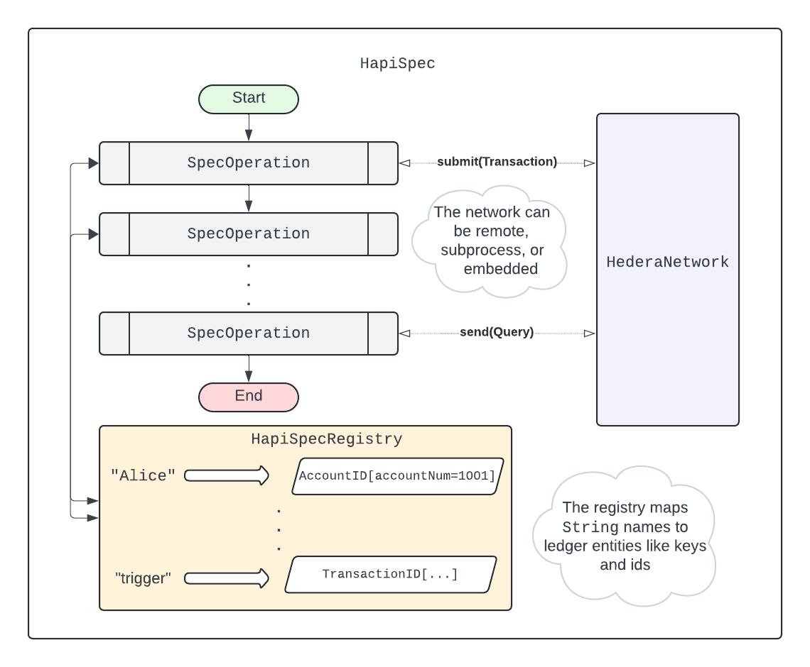

# Testing Hedera

These tests specify the behavior of the Hedera network as outlined in HIPs approved
by the governing council.

They are primarily black box tests that interact with the consensus node public API, which consists of
the gRPC services and block stream. White box testing is also crucial, utilizing an embedded mode that
allows test code to directly access the node's internal state and file system; manipulate virtual time;
and submit transactions that would otherwise be rejected at ingest.

Developers write tests as instances of the `HapiSpec` Java class. Although it is possible to run a `HapiSpec`
directly against a remote network, this is uncommon. Typically, developers execute `HapiSpec`s as dynamic
tests on the JUnit platform using JUnit Jupiter, against a four-node network whose lifetime is scoped to
the JUnit `LauncherSession`. Such tests are marked with the `@HapiTest` meta-annotation, as correct
execution requires registering Jupiter extensions to manage the test network lifecycle and make it the
target of each `HapiSpec`.

The default Gradle `test` task instructs these extensions to create the target network by spawning four
child subprocesses as nodes. Meanwhile, the `testEmbedded` and `testRepeatable` tasks instruct the
extensions to embed a single `Hedera` instance in the test process, invoking its workflows directly.
In embedded mode, there is no hashgraph consensus because the `Platform` is replaced with a simple mock,
and the `HederaState` implementation uses in-memory data structures instead of a Merkle tree.

**Table of contents**

1. [Structure of a `HapiSpec`](#structure-of-a-hapispec)
2. [`HederaNetwork` implementations](#hederanetwork-implementations)
3. [`@HapiTest` style guide](#style-guide)
4. [JUnit Jupiter extensions](#junit-jupiter-extensions)
5. [Comparisons to other tests](#comparison-to-other-tests)

## Structure of a `HapiSpec`

A `HapiSpec` groups a sequence of `SpecOperation`'s and provides them shared infrastructure and context.
When the spec is executed against a target `HederaNetwork`, it runs each operation in sequence.

Most operations are subclasses of `HapiSpecOperation`, which provides implementation support for submitting
transactions and sending queries to the target network. The below diagram is a schematic of a `HapiSpec`.

Operations share context through their spec's `HapiSpecRegistry`. The registry maps from `String` names to
arbitrary values; which are themselves usually references to entities on the target network. For example,
after a `HapiCryptoCreate` operation submits a transaction that creates a new account, it stores the new
account's id (say, `AccountID[accountNum=1001]`) in the registry with the name given by the test author
(say, `"Alice"`). The test author can then write a following `HapiCryptoUpdate` operation that references
the account by its stable name, and not worry that the next time the spec runs the created account might
actually have a different id on the target network.

Besides providing the context of its registry and target network, a `HapiSpec` also supports its operations
with some useful infrastructure components. The four most important components are,
1. A `TxnFactory` that helps with constructing valid `TransactionBody` and `TransactionID` messages.
2. A `KeyFactory` for generating and signing with cryptographic keys.
3. A `FeeAndRatesProvider` with up-to-date fee schedules and exchange rates for the target network.
4. A `HapiSpecSetup` with properties used to configure the spec; most important of these are the
   id and private key of the spec's default payer account.

## `HederaNetwork` implementations

There are four implementations of the `HederaNetwork` interface, as follows:
1. `RemoteNetwork` - a proxy to a remote Hedera network, supporting only gRPC access to the nodes without
    access to their block streams, internal state, or file system.
2. `SubProcessNetwork` - a managed network of four child processes, each running a Hedera node. This
    implementation supports starting and stopping nodes, and provides access to each node's block stream,
    logs, and upgrade artifacts. However, it does not support direct access to working state.
3. `ConcurrentEmbeddedNetwork` - a simulated network that instantiates a single `Hedera` instance
   directly in the test process. The internal state is a `FakeHederaState` implementation whose data
   sources are collections from the `java.util.concurrent` package. This allows direct access to, and
   modification of, the network's state.
4. `RepeatableEmbeddedNetwork` - an embedded variant automatically selected when running a
   `HapiSpec` in repeatable mode. This implementation requires single-threaded test execution and uses
   virtual time to ensure the same consensus times every test run.

Examining the differences between these implementations as we move from black box testing to increasingly
white box testing provides valuable insights into the key architectural elements of a Hedera network.
Let’s take a closer look.

### The `RemoteNetwork`

A `HapiSpec` executing against a `RemoteNetwork` behaves like any other client of that network. It sends
transactions and queries to the network’s gRPC services and receives responses as protobuf messages.
While the `RemoteNetwork` provides the most realistic testing environment for a spec, it is also the
most limited in terms of what the test can observe and manipulate. Network latency also makes it the
slowest way to execute a spec.

### The `SubProcessNetwork`

When a `HapiSpec` executes as a `@HapiTest` in a JUnit test executor, the default network is a
`SubProcessNetwork`. This network starts four child processes of the test executor process, each running
a Hedera node. Gossip and consensus happen over the loopback interface, as does gRPC communication
between the `HapiSpec` and its target network.

A significant advantage is the spec now has complete visibility into each node's logs, block stream, and
upgrade artifacts. Even more importantly, because the nodes are child processes, the spec can stop and
restart them. This capability allows us to test every phase of the network lifecycle, including upgrades
and reconnects. Subprocess networks are the core of Hedera testing, as they provide a good balance between
realism and control.

Running a spec against an active subprocess network is much faster than running it against a remote network.
However, spawning the child processes and waiting for platform startup means it takes tens of seconds before
a subprocess network _is_ active, making it unsuitable for test-driven development. Debugging is also awkward,
since it requires attaching a debugger to a process other than the JUnit test executor.

Even with a subprocess network, the spec's view of each node's working state is still limited to what is
returned from gRPC queries. For example, the spec cannot validate the linked lists that nodes maintain to
iterate the storage slots owned by an expired contract, as this data is not exposed through gRPC queries.

Another weakness of testing against both remote and subprocess networks is that the consensus time is tightly
coupled to real time. This means the resulting state and streams are always different, even if the semantics
of the spec are deterministic. It also means that behavior dependent on the passage of consensus time, such
as the expiration of a contract, cannot be tested without allowing real time to pass.

Finally, because there is no way to submit invalid transactions through the gRPC services, a spec running
against a remote or subprocess network cannot test how the network would respond to misbehaving nodes which might
submit duplicate or malformed transactions.

### The `ConcurrentEmbeddedNetwork` and `RepeatableEmbeddedNetwork`

We can address the testing deficiencies of a subprocess network by trading off the realism of a live network for
greater control. Maximum control is achieved by directly instantiating a `Hedera` instance in the test process, and
initializing it with fake `Platform`, `ServicesRegistry`, and `HederaState` implementations that are created
and managed by the testing framework. Instead of submitting transactions through gRPC, we can call the ingest,
query, pre-handle, and handle workflows directly.

At this point, the main tradeoff is between supporting concurrent test execution and achieving repeatable
results. The `ConcurrentEmbeddedNetwork` supports concurrent test execution, but the consensus time is still tied
to real time. The `RepeatableEmbeddedNetwork` achieves repeatable results by instead using virtual consensus time;
but this requires single-threaded execution and exclusive use of Ed25519 keys, since the ECDSA signing process has
inherent randomness.

Either way, we can now directly access and manipulate the network's internal state; and we can submit transactions
that would be rejected by a real network. Furthermore, in repeatable mode, `SpecOperation`'s that would normally
sleep in real time switch to immediately advancing virtual time the requested amount. This lets us test staking
rewards, contract expiration, and other time-dependent behaviors orders of magnitude faster than we could otherwise.

