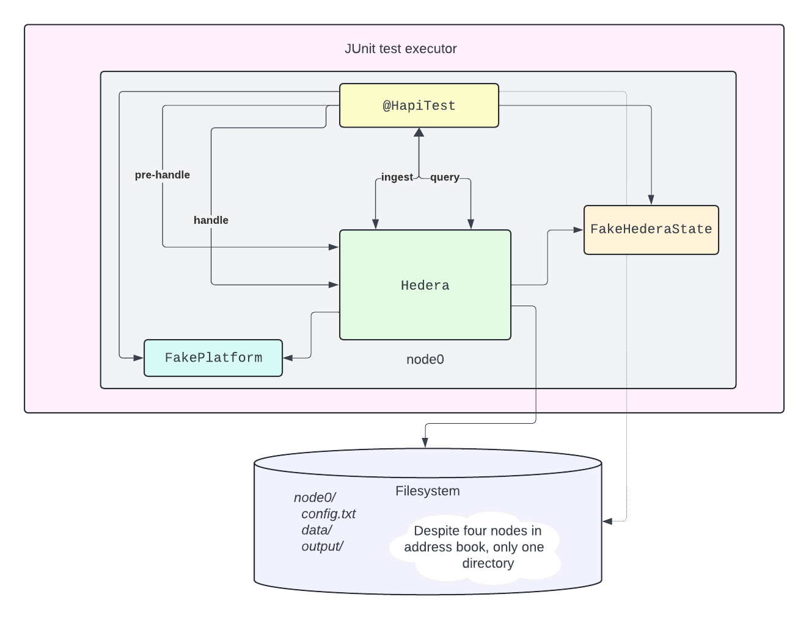
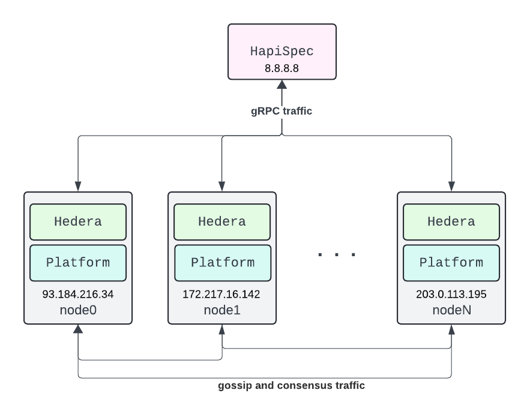
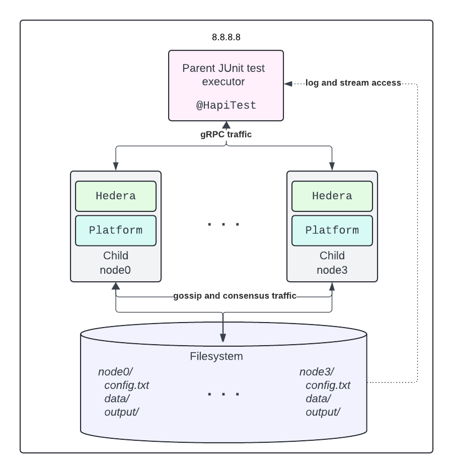

# Testing Hedera

These tests specify the behavior of the Hedera network as outlined in HIPs approved by the governing
council.

They are primarily black box tests that interact with the consensus node public API, which consists
of the gRPC services and block stream. White box testing is also crucial, utilizing an embedded mode
that allows test code to directly access the node's internal state and file system, manipulate
virtual time, and submit transactions that would otherwise be rejected at ingest.

Developers write tests as instances of the `HapiSpec` Java class. Although it is possible to run a
`HapiSpec` directly against a remote network, this is uncommon. Typically, developers execute
`HapiSpec`s as dynamic tests on the JUnit platform using JUnit Jupiter against an ephemeral
four-node network whose lifetime is scoped to the JUnit `LauncherSession`. Such tests are marked
with the `@HapiTest` meta-annotation, as correct execution requires registering Jupiter extensions
to manage the test network lifecycle and make it the target of each `HapiSpec`.

The default Gradle `test` task instructs these extensions to create the target network by spawning
four child subprocesses as nodes. Meanwhile, the `testEmbedded` and `testRepeatable` tasks instruct
the extensions to embed a single `Hedera` instance in the test process, invoking its workflows
directly. In embedded mode, there is no hashgraph consensus because the `Platform` is replaced with
a simple mock, and the `MerkleState` implementation uses in-memory data structures instead of a
Merkle tree.

## Table of contents

- [Structure of a `HapiSpec`](#structure-of-a-hapispec)
- [`HederaNetwork` implementations](#hederanetwork-implementations)
  - [`RemoteNetwork`](#remotenetwork)
  - [`SubProcessNetwork`](#subprocessnetwork)
  - [Embedded networks](#embedded-networks)
- [Style guide](#style-guide)
  - [The `@HapiTest` checklist](#the-hapitest-checklist)
- [JUnit Jupiter integrations](#junit-jupiter-integrations)
  - [Meta-annotations](#meta-annotations)
  - [`SharedNetworkLauncherSessionListener`](#sharednetworklaunchersessionlistener)
  - [`NetworkTargetingExtension`](#networktargetingextension)
  - [`SpecNamingExtension`](#specnamingextension)
  - [`SpecManagerExtension`](#specmanagerextension)
  - [`SpecEntityExtension`](#specentityextension)

## Structure of a `HapiSpec`

A `HapiSpec` groups a sequence of `SpecOperation`s and gives them shared infrastructure and context.
When the spec is executed against its target `HederaNetwork`, it runs each operation in sequence,
and terminates with an exception if any operation fails. This is consistent with JUnit test
semantics, where a test passes as long as no exception is thrown.

Most operations are subclasses of `HapiSpecOperation`, which provides implementation support for
submitting transactions and sending queries to the target network. The below diagram is a schematic
of a `HapiSpec`.

Operations share context through their spec's `HapiSpecRegistry`. The registry maps from `String`
names to arbitrary values; which are themselves usually references to entities on the target
network. For example, after a `HapiCryptoCreate` operation submits a transaction that creates a new
account, it stores the new account's id (say, `AccountID[accountNum=1001]`) in the registry with the
name given by the test author (say, `"Alice"`). The test author can then write a following
`HapiCryptoUpdate` operation that references the account by its stable name `"Alice"`, and not worry
that the next time the spec runs the created account may have a different id on the target network.

Besides providing the context of its registry and target network, a `HapiSpec` also supports its
operations with some useful infrastructure components. The four most important components are,

1. A `TxnFactory` that helps with constructing valid `TransactionBody` and `TransactionID` messages.
2. A `KeyFactory` for generating and signing with cryptographic keys and complex key structures.
3. A `FeeAndRatesProvider` with up-to-date fee schedules and exchange rates for the target network.
4. A `HapiSpecSetup` with properties used to configure the spec; the most important of these being
   the id and private key of the spec's default payer account.

## `HederaNetwork` implementations

There are four implementations of the `HederaNetwork` interface, as follows:

1. `RemoteNetwork` - a proxy to a remote Hedera network, supporting only gRPC access to the nodes
   without access to their block streams, internal state, or file system.
2. `SubProcessNetwork` - a managed network of four child processes, each running a Hedera node. This
   implementation supports starting and stopping nodes, and provides access to each node's block
   stream, logs, and upgrade artifacts. However, it does not support direct access to working state.
3. `ConcurrentEmbeddedNetwork` - a simulated network that instantiates a single `Hedera` instance
   directly in the test process. The internal state is a `FakeMerkleState` implementation whose data
   sources are collections from the `java.util.concurrent` package. This allows direct access to,
   and modification of, the network's state.
4. `RepeatableEmbeddedNetwork` - an embedded variant automatically selected when running a
   `HapiSpec` in repeatable mode. This implementation requires single-threaded test execution and
   uses virtual time to ensure the same consensus times every test run.

Examining the differences between these implementations as we move from black box testing to
increasingly white box testing provides valuable insights into the key architectural elements of a
Hedera network. Let’s take a closer look.

### `RemoteNetwork`

A `HapiSpec` executing against a `RemoteNetwork` behaves like any other client of that network. It
sends transactions and queries to the network’s gRPC services and receives responses as protobuf
messages. While the `RemoteNetwork` provides the most realistic testing environment for a spec, it
is also the most limited in terms of what the test can observe and manipulate. Network latency also
makes it the slowest way to execute a spec.

### `SubProcessNetwork`

When a `HapiSpec` executes as a `@HapiTest` in a JUnit test executor, the default network is a
`SubProcessNetwork`. This network starts four child processes of the test executor process, each
running a Hedera node. Gossip and consensus happen over the loopback interface, as does gRPC
communication between the `HapiSpec` and its target network.

A significant advantage is the spec now has complete visibility into each node's logs, block stream,
and upgrade artifacts. Even more importantly, because the nodes are child processes, the spec can
stop and restart them. This capability allows us to test every phase of the network lifecycle,
including upgrades and reconnects. Subprocess networks are the core of Hedera testing, as they
provide a good balance between realism and control.

Running a spec against an active subprocess network is much faster than running it against a remote
network. However, spawning the child processes and waiting for platform startup means it takes tens
of seconds before a subprocess network _is_ active, making it unsuitable for test-driven
development. Debugging is also awkward, since it requires attaching a debugger to a process other
than the JUnit test executor.

Even with a subprocess network, the spec's view of each node's working state is still limited to
what is returned from gRPC queries. For example, the spec cannot validate the linked lists that
nodes maintain to iterate the storage slots owned by an expired contract, as this data is not
exposed through gRPC queries.

Another weakness of testing against both remote and subprocess networks is that the consensus time
is tightly coupled to real time. This means the resulting state and streams are always different,
even if the semantics of the spec are deterministic. It also means that behavior dependent on the
passage of consensus time, such as the expiration of a contract, cannot be tested without allowing
real time to pass.

Finally, because there is no way to submit invalid transactions through the gRPC services, a spec
running against a remote or subprocess network cannot test how the network would respond to
misbehaving nodes which might submit duplicate or malformed transactions.

### Embedded networks

We can address the testing deficiencies of a subprocess network by trading off the realism of a live
network for greater control. Maximum control is achieved by directly instantiating a `Hedera`
instance in the test process, and initializing it with fake `Platform`, `ServicesRegistry`, and
`MerkleState` implementations that are created and managed by the testing framework. Instead of
submitting transactions through gRPC, we can call the ingest, query, pre-handle, and handle
workflows directly.

At this point, the main tradeoff is between supporting concurrent test execution and achieving
repeatable results. The `ConcurrentEmbeddedNetwork` supports concurrent test execution, but the
consensus time is still tied to real time. The `RepeatableEmbeddedNetwork` achieves repeatable
results by instead using virtual consensus time; but this requires single-threaded execution and
exclusive use of Ed25519 keys, since the ECDSA signing process has inherent randomness.

Either way, we can now directly access and manipulate the network's internal state; and we can
submit transactions that would be rejected by a real network. Furthermore, in repeatable mode,
`SpecOperation`'s that would normally sleep in real time switch to immediately advancing virtual
time the requested amount. This lets us test staking rewards, contract expiration, and other
time-dependent behaviors orders of magnitude faster than we could otherwise.

## Style guide

As with any test, a `@HapiTest` should be clear, concise, and focused. The main challenge is when
the `SpecOperation` DSL does not make it easy to isolate the behavior being tested. For example, say
we want to validate that the fee for an auto-account creation triggered by a `ScheduleSign`
transaction is charged to the payer account of the scheduled `CryptoTransfer` and not the
`ScheduleSign` payer. That intent could easily be obscured by the boilerplate needed to create the
schedule, sign it, get the records involved, and perhaps even check the balances of the payer
accounts involved before and after the `ScheduleSign`.

There are many ways to manage such complexity. We could,

- Extend the DSL, especially the object-oriented DSL in the `c.h.s.bdd.spec.dsl` package, to
  encapsulate the boilerplate and expose only the intent.
- Extract the setup into a `@BeforeAll` method, using an injected `SpecManager` to create
  prerequisite entities needed by this and other `@HapiTest` methods in the test class.
- Write a helper method that returns a grouped `SpecOperation` to encapsulate the setup
  operations.
- Accept a slightly more verbose test method, but add rigorous comments to explain each step.

There is no "best" approach. For example, the effort of extending the DSL is probably only justified
when the new constructs will apply to many tests. But it is essential to achieve a final result that
meets two criteria:

1. Any qualified PR reviewer can understand the behavior being asserted **in a single reading**;
   and,
2. The `@HapiTest` javadoc links any context necessary to understand the motivation for the test.

### The `@HapiTest` checklist

To help consistently meet these criteria, we use the following minimum checklist for every
`@HapiTest`:

- [x] The `@DisplayName`, when combined with the display names of any enclosing test classes,
  forms a single, clear phrase that fully summarizes the behavior being tested.
- [x] If the test specifies behavior from a HIP, its javadoc links to the section in the markdown
  file in the
  [`hedera-improvement-proposal` repo](https://github.com/hashgraph/hedera-improvement-proposal)
  outlining the behavior.
- [x] The test includes no more than seven (7) `SpecOperation`'s.
- [x] Any lambda injected into the operation chain is at most three (3) lines long; and there is
  no more than one (1) such lambda.
- [x] Boilerplate needed to set up the test does not repeat in any other `@HapiTest` in the same
  class.
- [x] If the test includes a contract call, the semantics of the function being called are
  described in a single sentence comment that directly precedes the call, even if that comment
  appears in other test in the same class.
- [x] If the test uses `@LeakyHapiTest`, it specifies the reason for the link in the annotation
  attribute; for example, `@LeakyHapiTest(NO_CONCURRENT_CREATIONS)` if the test depends on no
  other entities being created while it executes.
- [x] If the test leaks property overrides, there is no other `@LeakyHapiTest` **in the entire
  module** that leaks the exact same property overrides; if so, all such tests are grouped in
  a single test class that uses `@BeforeAll` and `@AfterAll` to manage the shared overrides
  and replaces the leaky annotations with `@HapiTest`.
- [x] Each test class and utility method must have javadoc that briefly sums up the reason for the
  test or method.

## JUnit Jupiter integrations

It is outside our scope to cover the JUnit Jupiter programming and extension model, which already
has excellent documentation [here](https://junit.org/junit5/docs/current/user-guide/). Furthermore,
the extensions we use to make a `HapiSpec` an executable JUnit5 test and manage the target network
lifecycle are not particularly polished and will not reward careful examination by anyone not
motivated by necessity to change their behavior.

We only mention a a few things here to avoid giving the reader a sense of excessive "magic" beyond
what is already built in to JUnit Jupiter.

### Meta-annotations

The main annotation is, of course, `@HapiTest`. It registers the `NetworkTargetingExtension` and
`SpecNamingExtension` extensions described below, and adds a `@ResourceLock` to ensure tests do not
run concurrently with other tests that "leak" side effects visible outside themselves. Such tests
are annotated with `@LeakyHapiTest`, and have a matching `@ResourceLock` with access mode
`READ_WRITE`. The `ContextRequirement` type enumerates many of the ways that a test can leak side
effects.

Two other trivial meta-annotations are `@HapiTestLifecycle`, which registers the
`SpecManagerExtension`; and `@OrderedInIsolation`, which both isolates a test class and orders its
method executions by `@Order` attribute.

The object-oriented DSL in the `c.h.s.bdd.spec.dsl` package works via a family of annotations that
include `@AccountSpec`, `@ContractSpec`, `@KeySpec`, and so on. These annotations register the
`SpecEntityExtension`, which then allows the test author to inject `SpecEntity` types such as
`SpecAccount` into test methods and static fields on the test class. These entities are created
automatically, which can greatly reduce the boilerplate needed to set up a test.

### `SharedNetworkLauncherSessionListener`

This `LauncherSessionListener` implementation does nothing but register a `TestExecutionListener`.
When the `TestPlan` execution is starting, the listener chooses a `HederaNetwork` implementation
based on the values of the system properties `hapi.spec.embedded.mode` and
`hapi.spec.repeatable.mode`. It creates an instance of this type, calls its `start()` method, and
sets it in a `SHARED_NETWORK` static field of the `NetworkTargetingExtension`. When the `TestPlan`
execution is finished, the listener calls `stop()` on the shared network.

### `NetworkTargetingExtension`

This `BeforeEachCallback` and `AfterEachCallback` implementation binds the shared network to the
thread before a `@HapiTest` test factory is invoked, and unbinds it after the test factory
completes. The result is that the factory creates a `HapiSpec` with the shared network as its
target.

In the future, we may enhance this extension to support targeting networks other than the shared
network.

### `SpecNamingExtension`

This `BeforeEachCallback` binds the name of the `@HapiTest` factory method to the thread before the
test factory is invoked. This lets the created `HapiSpec` choose a reasonably descriptive name if no
`@DisplayName` is provided.

### `SpecManagerExtension`

This class implements several extensions, including `ParameterResolver`, to support doing shared
property overrides and entity creations in a `@BeforeAll` method via an injected `SpecManager`. It
is more involved than the other JUnit5 integrations, and the most likely to be refactored in the
future.

### `SpecEntityExtension`

This `ParemeterResolver` and `BeforeAllCallback` implementation supports `SpecEntity` injection.
