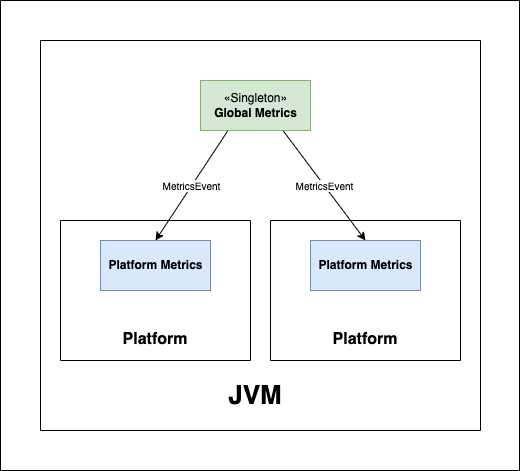
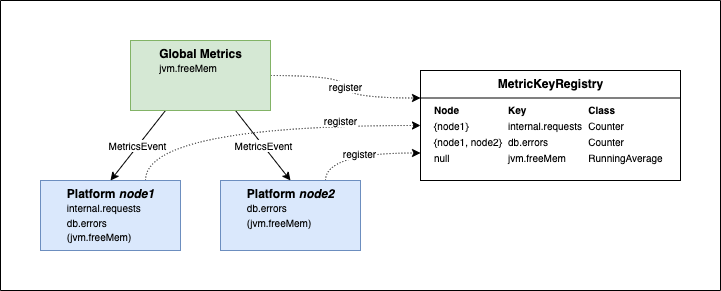
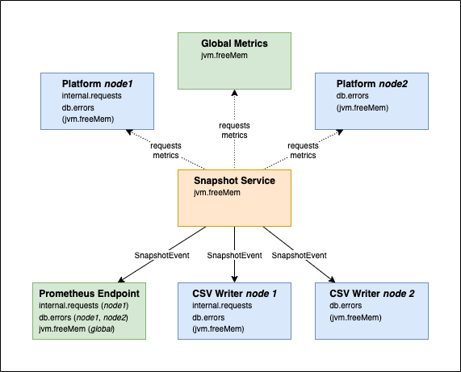

[⇧ Platform Base](../base.md)

# Metrics Design

This document describes the general design of the main metrics functionality.

## The Metrics interface

_TBD_

### Communication of changes

When a metric is added or removed, some components need to react.
In the default implementation, the notification mechanism is implemented via the Observer pattern.
Each `DefaultMetrics` contains a method `subscribe()` that allows to register an Observer.
The moment an Observer subscribes, it will receive `ADDED`-events for all metrics, that are currently registered.
It will continue to receive `ADDED` and `REMOVED` events until unsubscribed.

## Global and platform metrics

There are two types of metrics: global metrics, which exists only once per JVM, and platform metrics, each of which are present per platform.

### Global metrics

During regular execution, there is only one `Metrics` object for global metrics per JVM.
It allows to add, remove, and query global metrics only.

Typical examples of global metrics are all crypto metrics (as crypto is a Singleton), as well as JVM and OS specific metrics (e.g. free memory).
(Please note, that JVM and OS specific metrics are currently NOT defined as global metrics, but they should.)

There is only one default implementation of the `Metrics` interface (`DefaultMetrics`), i.e. there is no special implementation for global metrics.
The global uniqueness is not enforced technically (e.g. by implementing Singleton), to allow multiple global `Metrics` objects in special scenarios like tests.

### Platform metrics

Each instantiated platform will have its own set of metrics managed by a `Metrics`.
It allows to add, remove, and query metrics for that particular platform.
In addition, it allows to query global metrics.
It is not possible though to add and remove global metrics via a platform `Metrics`.

All metrics, that measure the behavior of platform code, are typical examples of platform metrics.

Each platform `Metrics` is implemented by `DefaultMetrics`.

## Metric Registry

When metrics are output, the metrics from several `Metrics` instances need to be merged and therefore must not conflict.
Two metrics with the same `category` and `name` are conflicting, if they are implemented by different classes or if one of them is a platform metric and the other global.
To ensure this, the `MetricRegistry` was introduced.

Before a new metric is added (via one of the `Metrics`-instances), it needs to be registered with the `MetricRegistry`.
The registration is successful, if there is no conflicting configuration stored.
Only if the registration succeeded, is it possible to create the metric.

## Snapshot Service

The `SnapshotService` creates snapshots of all metrics and sends them to the classes, which are responsible for output.
It iterates through all `Metrics` instances, requests all registered metrics and creates snapshots.

Once the snapshots of a `Metrics` have been created, all interested components are notified.
The notification is implemented with the Observer-pattern.
The snapshots of a platform `Metrics` also contain snapshots for all global metrics.
