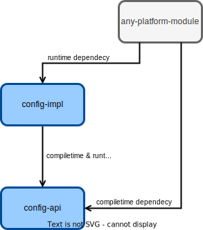

# Swirlds Configuration

This documentation gives an overview to the config API of [SwirldsLabs](https://swirldslabs.com). The API is used
internally to configure the
platform and any services. Next to this the API can be used to configure an application that is using the platform.

## Overview of the general architecture and modules

The config API is defined in the `swirlds-config-api` module. This module has zero dependencies and provides the public
API of the configuration. The implementation of the configuration is defined in the `swirlds-config-impl` module. This
module has dependencies to some low level modules like `swirlds-common`. The `swirlds-config-impl` module should not be
added to other modules as compile time dependency. The code of the implementation is only needed as runtime and should
be treated as private API.



Internally the Java SPI is used to use the implementation at runtime. By doing so the implementation could even be
changed without changing any code. The SPI entry point can be found in the `com.swirlds.config.api.spi` package of
the `swirlds-config-api` module.

## The lifecycle of the configuration

A configuration is defined by the `com.swirlds.config.api.Configuration` interface. A new instance is always created by
a builder (`com.swirlds.config.api.ConfigurationBuilder`). Such builder can be used to define the sources and other
parameters of a configuration. By calling the `com.swirlds.config.api.ConfigurationBuilder#build` method a configuration
instance is created based on the builder. That call will perform a validation run for the configuration (how validation
can be defined will be described later). The setup of the configuration needs to be done before the `build()` method
is called. If any setup (like adding a config source) is done after the `build()` method is called an
`IllegalStateException` will be thrown. The following code snippet shows an example how the configuration can be setup,
initialized and used:

```
//setup of config
final Configuration config = ConfigurationBuilder.create()
                .withSource(new PropertyFileConfigSource(configFile))
                .build();

//usage of config
final String name = config.getValue("app.name");
```

## Accessing properties by the low level config API

Since the values of all configuration properties are stored as String values the most easy way to access a config
property is by calling `configuration.getValue("property.name")`.The method will return the raw `String` value of the
property or throw a `NoSuchElementException` if the property by the given name is not defined. The
`config.exists("property.name")` method can be used to check if a property exists. The method will return true if a
property with the given name exists. Next to this the API provides a method that supports a default value that is used
instead of throwing an exception if the property does not exist. This can be achieved by calling
`configuration.getValue("property.name", "DEFAULT")`. The following code snippet makes use of the described APIs:

```
if(config.exists("app.name")) {
    final String name = configuration.getValue("app.name");
    final String version = configuration.getValue("app.version", "UNKNOWN");
    System.out.println("Starting application " + name + " with version " + version);
}
```

Since the use of `String` values is quite limited the config API supports reading different data types. To do so the
config API use converters internally that converts the raw String values to values of specific data types. The converter
API will be described later.

Whenever you need to access data of a specific type the API usage is quite similar to getting raw `String` data. The
only difference is that the data type need to be specified. If you want to get the `boolean` value from a config
property you need to call `configuration.getValue("property.name", Boolean.TYPE)`. As the basic version the call will
throw a `NoSuchElementException` if the property by the given name is not defined. In such case you can specify a
default like shown before. When working with specific data type the default value must be given in the specifc type
instead of using a raw `String` default value. The following code snippet makes use of the described
APIs:

```
final boolean debug = config.getValue("app.debug", Boolean.TYPE, false);
if(debug) {
    System.out.println("Application is running in DEBUG mode");
}
```

Single typed property lists are also supported. Here the `java.util.List` interface is supported and lists
of any supported value type can be used. The `com.swirlds.config.api.Configuration` interface provides similar methods
as the shown ones for single value properties for lists. The following code snippet makes use of the described
APIs:

```
final List<Integer> errorCodes = config.getValues("app.errorcodes", Integer.TYPE);
```

Raw String values and default values are supported too.

```
final List<String> errorCodes = config.getValues("app.errorIds");

final List<Integer> defaults = List.of(404, 500)
final List<Integer> errorCodes = config.getValues("app.errorcodes", Integer.TYPE, defaults);
```

### Handling of null values

The config API defined `null` as a valid value. The following rules define the difference between an undefined config
property and a config property with a `null` value:

- If you want to access the value of a not defined property a `NoSuchElementException` is thrown.
- If you want to access the value of a property that has defined `null` as its value `null` is returned.
- A default value will never be returned if a property value is defined as `null`. A default value will only be returned
  for not defined properties.
- Next to normal values list values will be `null`, too.

The following code snippet shows an example of the rules:

```
//setup of config
final Configuration config = ConfigurationBuilder.create()
                .withSource(new SimpleConfigSource("app.var", null))  // provides the property with name "app.var" and null value
                .withSource(new SimpleConfigSource("app.vars", null)) // provides the property with name "app.vars" and null value
                .build();

String value1 = config.getValue("app.var");                                   // value1 will be null
String value2 = config.getValue("app.var", "default");                        // value2 will be null
String value3 = config.getValue("app.var", String.class);                     // value3 will be null
String value4 = config.getValue("app.var", String.class, "default");          // value4 will be null            
            
String value5 = config.getValue("app.foo");                                   // expression will throw a NoSuchElementException
String value6 = config.getValue("app.foo", "default");                        // value6 will be "default"
String value7 = config.getValue("app.foo", String.class);                     // expression will throw a NoSuchElementException
String value8 = config.getValue("app.foo", String.class, "default");          // value8 will be "default"            
            
List<String> value9 = config.getValues("app.vars");                           // value9 will be null
List<String> value10 = config.getValues("app.vars", List.of());               // value10 will be null
List<String> value11 = config.getValues("app.vars", String.class);            // value11 will be null
List<String> value12 = config.getValues("app.vars", String.class, List.of()); // value12 will be null            
            
List<String> value13 = config.getValues("app.foos");                          // expression will throw a NoSuchElementException
List<String> value14 = config.getValues("app.foos", List.of());               // value14 will be the empty default list    
List<String> value15 = config.getValues("app.foos", String.class);            // expression will throw a NoSuchElementException
List<String> value16 = config.getValues("app.foos", String.class, List.of()); // value16 will be the empty default list                   
```

**Note:** if you want to define an empty list as a value for a property you should define it by
using `SimpleConfigSource("app.var", List.of())`. Internally `[]` is used as the raw string value for the property. It
can be found as a constant at `Configuration.EMPTY_LIST`. This raw value can be used in the `defaultValue` attribute of
the `@ConfigProperty` annotation (will be described later), too.

### Supported datatypes

The config API supports several datatypes for reading config properties. The following types are supported:

- `int`
- `long`
- `float`
- `double`
- `byte`
- `short`
- `boolean`
- `String`
- `Integer`
- `Long`
- `Float`
- `Double`
- `Byte`
- `Short`
- `Boolean`
- `BigDecimal`
- `BigInteger`
- `URL`
- `URI`
- `Path`
- `File`
- `ZonedDateTime`: the conversion is based on `java.time.format.DateTimeFormatter.ISO_DATE_TIME`, for example "
  1994-11-05T08:15:30-05:00"
- `Duration`: the custom format from the old settings is supported; examples are "2ms" or "10s"
- `ChronoUnit`: examples are "millis" or "seconds"

The support for all data types is done by using the `com.swirlds.config.api.converter.ConfigConverter` API. The
`com.swirlds.config.api.ConfigurationBuilder` must be used to add support for custom datatypes. The following code
snippet makes use of the described APIs:

```
//setup of config
final Configuration config = ConfigurationBuilder.create()
                .withConverter(new UuidConverter())
                .build();

//usage of config
final UUID id = config.getValue("app.id");
```

### Supported config sources

The configuration can support multiple sources for config properties. How such sources can be defined and added will be
described in a following chapter. By default, the config is using the legacy `settings.txt` file and read all config
properties that are defined in that file. In the future we will support regular property files and the system
environment
for example. The config API already provides a set of config source implementations that are not used by default but
can be simply added to the config API:

- `com.swirlds.config.impl.sources.SystemPropertiesConfigSource`: This source provides all system properties as a config
  properties
- `com.swirlds.config.impl.sources.SystemEnvironmentConfigSource`: This source provides all environment properties as a
  config properties
- `com.swirlds.config.impl.sources.PropertyFileConfigSource`: This source provides the content of 1 property file as a
  config source. Multiple can be added, one for each file

The uniqueness of property names across configuration sources is not enforced by the configuration API. If multiple
properties with the same name are loaded by different sources, the latest properties will overwrite the previous value.
Based on that a hierarchy of config sources must be defined. To do so the `com.swirlds.config.api.source.ConfigSource`
interface provides the `int getOrdinal()` method. The method returns an ordinal number that is used internally to sort
all config sources. Here a config source with a higher ordinal number will overwrite properties of all config sources
with a smaller ordinal number. The internal class `com.swirlds.config.impl.sources.ConfigSourceOrdinalConstants`
provides constant ordinal numbers for all default implementations of config sources.

The support for all data types is done by using the `com.swirlds.config.api.source.ConfigSource` API. The
`com.swirlds.config.api.ConfigurationBuilder` must be used to add support for custom sources. The following code
snippet makes use of the described APIs:

```
//setup of config
final Configuration config = ConfigurationBuilder.create()
                .withSource(new PropertyFileConfigSource(file))
                .build();

//usage of config
final String id = config.getValue("app.id");
```

## Using config data records

Next to the low level API the config API provides a way to access configuration properties in a more structured manner.
To do so the config API introduces config data records that are Java records that hold configuration properties. Such
config data records can be defined individually. By doing so you can define individual records to configure a specific
module. The config API provides the 2 annotations `com.swirlds.config.api.ConfigData`
and `com.swirlds.config.api.ConfigProperty` to define config data record types. Using the config data records is the
preferred way to use the config API. The following code snippet shows a sample definition of a config data record type:

```
@ConfigData("endpoint")
public record EndpointConfig(
    @ConfigProperty(defaultValue = "8080") int port,
    @ConfigProperty(value="host", defaultValue = "localhost") String server,
    @ConfigProperty(defaultValue = "404,500") List<Integer> errorCodes) {}
```

The given snippet defines a configuration for a socket based endpoint and defines the host, the port and a list of error
codes. The `value` of the `ConfigData` annotation defines the prefix of the property names that will be followed by
a `.` if the value is not blank. The name of the components of the records define the name of properties. That name can
be overwritten by the `value` of the `@ConfigProperty` annotation. For the given sample the 3 properties that are part
of the record have the names:

- `endpoint.port`
- `endpoint.host`
- `endpoint.errorCodes`

This names can be used to provide values of the properties by any config source. While `int`, `String`
and `List<Integer>` are used in the given sample all data types that are supported by the config API can be used for
components in config data records.

In the sample default values are provided for all properties by setting the `defaultValue` of the `ConfigProperty`. The
default value of this parameter is defined by `ConfigProperty.UNDEFINED_DEFAULT_VALUE`. If a default value is not
specified by the ConfigProperty annotation a config source must specify the value. If no value is specified the
configuration will fail on init (see the configuration lifecycle).

**Note:** Since Java does not allow to set `null` as a value of an annotation attribute the `@ConfigProperty` annotation
provides the constant `NULL_DEFAULT_VALUE` that can be used as a default value for the unusual use case that you want to
have a config data record property with `null` as a default value. If you want an empty list as the default value for a
list property you need to define `[]` as the default value (or use the constant `Configuration.EMPTY_LIST`).

It is optional to annotate components of the record with the ConfigProperty annotation. The following code snippet shows
another example of a config data record:

```
@ConfigData
public record AppConfig(
    String name,
    String version) {}
```

The given snippet defines 2 configuration properties with the names `name` and `version`.

To use config data records types the records need to be registered to the configuration. This must be done by
calling `ConfigurationBuilder.withConfigDataType(Class<T> type)`.

Once a config data record type is added to the configuration it can be used. The config creates a single instance for
each record that can be accessed by calling `com.swirlds.config.api.Configuration.getConfigData(Class<T> type)`. The
following snippet shows how a config data record can be accessed:

```
//setup of config
final Configuration config = ConfigurationBuilder.create()
                .withConfigDataType(AppConfig.class)
                .build();

//usage of config
final AppConfig appConfig = config.getConfigData(AppConfig.class);
System.out.println("Starting " + appConfig.name() + " version " + appConfig.version());
```

### Validating values of a config data record

The config API provides some annotations that can be used to validate values of properties that are defined in a config
data record. Currently, the following annotations are provided by the config API:

- `@com.swirlds.config.api.validation.annotation.Min`
- `@com.swirlds.config.api.validation.annotation.Max`
- `@com.swirlds.config.api.validation.annotation.Negative`
- `@com.swirlds.config.api.validation.annotation.Positive`
- `@com.swirlds.config.api.validation.annotation.ConstraintMethod`

The general definition and validation options can be found in the Javadoc of the annotation. The following example shows
how the annotations can be used to define constraints for config properties:

```
@ConfigData
public record AppConfig(
    String name,
    @Positive int version,
    @Min(0) @Max(100) int percentageDone) {}
```

The given code defines that the `version` value must always be a positive value (`version > 0`) and the `percentageDone`
value must be in the range 0 to 100 (`0 <= percentageDone <= 100`).

All the constraint annotations are checked when the `com.swirlds.config.api.Configuration` is created. At
that moment a complete validation run is executed that contains all constraint annotations for all registered config
data record types next to all registered `com.swirlds.config.api.validation.ConfigValidator` implementations. Like the
validators, a violation of a constraints annotations will end in a `com.swirlds.config.api.validation.ConfigViolation`
that can be accessed by the `com.swirlds.config.api.validation.ConfigViolationException` that is thrown at runtime when
creating the `com.swirlds.config.api.Configuration` instance.

Internally, the support for constraint annotations is created by providing specific implementations of
the `com.swirlds.config.api.validation.ConfigValidator` interface. The current implementations can be found in
the `com.swirlds.config.impl.validators.annotation.internal` package of the `swirlds-config-impl` module and used as
reference for custom or future constraints annotations.

## Customizing the configuration

As already mentioned the configuration API provides several points that can be customized. To do this, API provides the
following 3 interfaces:

- `com.swirlds.config.api.source.ConfigSource`
- `com.swirlds.config.api.converter.ConfigConverter`
- `com.swirlds.config.api.validation.ConfigValidator`

The `swirlds-config-impl` module contains several implementations of those interfaces that are used for support, such as system properties, `BigDecimal` values and constraints annotations for validation.

Implementations of all 3 interfaces must be registered before a configuration has been created. 
The `swirlds-config-impl` module already does this for several of the internal implementations. Custom implementations
can easily be registered when creating a `com.swirlds.config.api.Configuration` instance:

**IMPORTANT:** _By [introducing the platform context](https://github.com/swirlds/swirlds-platform/issues/5852) the API
that is used to setup the config API will change. Therefore I will add the documentation of that
point later._

### Adding custom sources to the configuration

The config API provides the functionality to add custom sources of configuration properties.
To add a new config source an implementation of the `com.swirlds.config.api.source.ConfigSource` interface must be
provided. The interface defines a new source that provides a set of configuration properties. A source can be a file,
static properties or maybe even the result of a REST call. A simple implementation of a source might look like this:

```
public class MyConfigSource implements ConfigSource {

    public Set<String> getPropertyNames() {
        return Set.of("app.MagicNumber");
    }

    public String getValue(String propertyName) {
        return "42";
    }

}
```

Internally the config API will call the `getPropertyNames()` method first to get a set of all property names that are
provided by the given config source. Afterwards `getValue(propertyName)` is called for each of the property names. By
doing so the config API extracts all config properties that are provided by the source.

When creating a new config source it often makes sense to overwrite the default implementation of the `int getOrdinal()`
method. The method returns an ordinal number that is used internally to sort all config sources. Here a config source
with a higher ordinal number will overwrite properties of all config sources with a smaller ordinal number. The internal
class `com.swirlds.config.impl.sources.ConfigSourceOrdinalConstants` provides constant ordinal numbers for all default
implementations of config sources and can be used as a reference for custom ordinals.

### Adding custom converters to the configuration

As already mentioned, the config API supports several data types by default. In addition, converters for
custom data types can be created. By doing so values can be directly accessed in a custom data type. For creating custom
converters the config API provides the generic interface `com.swirlds.config.api.converter.ConfigConverter<T>`.
Implementations of that interface provide the support to convert the raw string values of config properties to custom
data types. Instances can easily be registered when creating a `com.swirlds.config.api.Configuration` instance. The
following example shows how an implementation of the `com.swirlds.config.api.converter.ConfigConverter<T>` can look
like:

```
public class FruitConfigConverter implements ConfigConverter<Fruit> {

    public Fruit convert(String value) throws IllegalArgumentException, NullPointerException {
        if(value == null) {
            throw new NullPointerException("value must not be null");
        }
        if(Objects.equals("Apple", value) {
            return new Apple();
        }
        if(Objects.equals("banana", value) {
            return new Banana();
        }
        throw new IllegalArgumentException(value + " is not a valid fruit type");
    }

}
```

**IMPORTANT:** _By [introducing the platform context](https://github.com/swirlds/swirlds-platform/issues/5852) the API
that is used to add custom config converters to the config will change. Therefore I will add the documentation of that
point later._

Once the converter is registered and we have created the config object we can directly get `Fruit` values for config
values:

```
//setup of config
ConfigurationProvider.addConverter(new FruitConfigConverter());
ConfigurationProvider.init();

//usage of config
final Configuration config = ConfigurationProvider.getConfig();
final Fruit fruit = config.getValue("app.fruit");
```

### Adding custom validators to the configuration

The config API supports validating a complete configuration at creation time. This can be used to check that values are
defined or that a value is defined in a specific range. To do so the config API provides the
`com.swirlds.config.api.validation.ConfigValidator` interface. Implementations of the interface can be registered when
creating a config and will be called at the creation time of the config automatically. The
`com.swirlds.config.api.validation.ConfigValidator` interface is defined as a functional interface that gets the
configuration as an input parameter and checks the validity of the configuration. The return value of the method
is `Stream<ConfigViolation>`. A `com.swirlds.config.api.validation.ConfigViolation` defines a validation violation and
since a single validator can create several violations a stream is used as a result value. A simple validation
implementation that checks if a string based config value has a minimal length can be done like this:

```
public class AppNameValidation implements ConfigValidator {

    public Stream<ConfigViolation> validate(final Configuration configuration) {
        if(!configuration.exists("app.name")) {
            return Stream.of(new DefaultConfigViolation("app.name", null, "app.name must not be null"));
        }
        final appName = configuration.getValue("app.name");
        if(appName.length() < 3) {
            return Stream.of(new DefaultConfigViolation("app.name", appName, "app.name must have min 3 chars"));
        }
    }
}
```

## Usage of the config API in the platform project

While the API has no dependency to any platform code and can easily be used as described for any project we have some
special use cases in the platform that will be described in this chapter.

### The settings.txt and config.txt files

Today the platform is configured by the 2 files `settings.txt` and `config.txt`. Both files are specified in a project
specific format. The `com.swirlds.common.config.sources.LegacyFileConfigSource` config source supports that format and
is used in the platform to read the 2 files and extract configuration properties out of them. The `config.txt` file has
a higher priority than the `settings.txt` file. Based on that the `config.txt` can overwrite properties that are already
defined in the `settings.txt` file.

Next to this the `config.txt` has some special properties (`app` and `address`) that will not be handled by the config
API today. For this 2 properties a custom parser exists (see
`com.swirlds.platform.config.legacy.LegacyConfigPropertiesLoader` for more details)

### Support for aliases

The platform contains the `com.swirlds.common.config.sources.AliasConfigSource` that will help to migrate all the config
properties to individual config data records. Having the properties separated by topics in records will make the code of
the platform much cleaner. By doing so configuration property names will change since topic based prefixes will be
added. If the property `csvOutputFolder` is, for example, only relevant for the metrics module of the platform it should
be migrated to a `MetricsConfig` record in the metrics module. By doing so the name of the property might change
to `metrics.csvOutputFolder`. Since such change will affect all installations of the platform we introduced the support
for aliases. In the `com.swirlds.platform.Browser` class an alias can be registered. For the given example we can create
the alias `metrics.csvOutputFolder->csvOutputFolder`. By doing so the property names in the config files do not need to
be changed directly.

### Initialization of the config

For the platform the config is provided by the `com.swirlds.common.context.PlatformContext`. Like the context the config
is defined in the `com.swirlds.platform.Browser` class.

