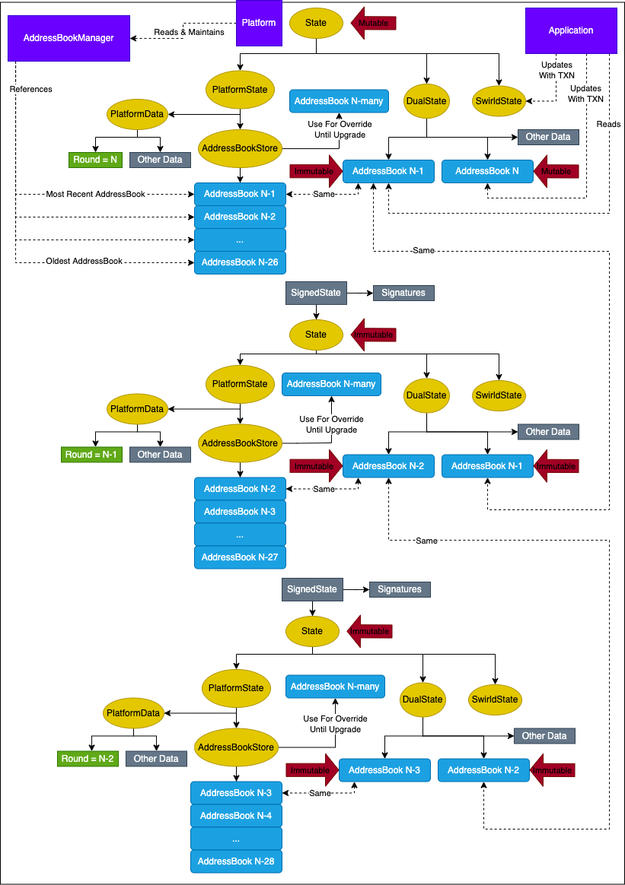

# Address Book Management

## WIP

The address book management pipeline is currently a work in progress. 
This document reflects the address book pipeline as we want it to be, not necessarily as it is in `main` today.

## Summary

This document describes how nodes keep track of other nodes that are currently participating in the network.

## Address

An `Address` describes a single node in the network.

An `Address` is not a merkle node. If it needs to be stored within a state, it should be embedded within an
`AddressBook` or some other merkle leaf.

### Address Fields

- long id
- String nickname
- String selfName
- boolean ownHost <---------- we will probably delete this
- long stake
- byte[] addressInternalIpv4
- int portInternalIpv4
- byte[] addressExternalIpv4
- int portExternalIpv4
- byte[] addressInternalIpv6
- int portInternalIpv6
- int portExternalIpv6
- byte[] addressExternalIpv6
- SerializablePublicKey sigPublicKey
- SerializablePublicKey encPublicKey
- SerializablePublicKey agreePublicKey <---------- we will probably delete this
- String memo

### Address Immutability

An `Address` is always immutable after creation. Due to this immutability, it is legal for an `Address` to appear
in different `AddressBooks` even if those `AddressBooks` are mutable.

For convenience, an `Address` has methods that allow it to
be copied but with a field replaced. For example, the following code creates a copy of `foo` but with a different
nickname without modifying the original.

```
final Address foo = ...;
final Address bar = foo.copySetNickname("bar");
```

### Address Thread Safety

An `Address` is immutable, and so there is no need for synchronization if it is accessed from multiple threads.

## AddressBook

An `AddressBook` is a collection of `Address` objects. Within a single `AddressBook`, each address's node ID will
be unique.

An `AddressBook` is a merkle node and can be stored directly in a state.

### Gaps In the AddressBook

In old versions of the code, addresses within an address book were required to have node IDs that started at 0 and
increased monotonically without skipping any values. This is no longer a requirement.

### AddressBook Round

An address book has an associated round number. This round number is equal to the round that performed
transactions to build the address book. If an address book is created by transactions during round N,
the round of the address book is N. An understandable misconception is that the address book for round N is the
address book present at the beginning of round N. In actuality, the address book for round N is not available until
the beginning of round N+1.

### AddressBook Index

Within an `AddressBook`, each node/address is considered to have an "index". The index of a node can be found by
creating a sorted list of all addresses in the address book based on node ID (least to greatest). The index is the
position of a node in that list.

A node's index is useful when data is being stored in an array. An index can be used to map each node to a position
within an array.

### AddressBook Queries

The `AddressBook` supports the following queries:

- `long getRound()`: returns the round that was responsible for creating this `AddressBook`
- `int getNumberWithStake()`: get the total number of nodes with stake greater than 0
- `long getTotalStake()`: get the sum of the stake of all `Address` objects within this `AddressBook`
- `long getId(String publicKey)`: given a public key, look up the node ID that has the public key
- `long getId(int index)`: find the ID of the node that has the given index within this address book
- `int getIndex(long id)`: get the index in this address book for a given node ID
- `Address getAddress(long id)`: given a node ID, return that node's address

FUTURE WORK

### AddressBook Mutability

An `AddressBook` starts out as mutable. When it is copied, the new copy is mutable. The mutability of the old copy
is not changed: if it was mutable before it remains mutable, if it was immutable before it remains immutable.

To make a mutable address book into an immutable one, call `AddressBook.seal()`.

### AddressBook Thread Safety

An `AddressBook` has no internal locks or other thread safety mechanisms. It is therefore not thread safe
to read to or write from an `AddressBook` at the same time another thread is writing to the same address book.

There are no restrictions between reading/writing different copies of an address book. It is safe to read/write
one copy of an address book while another thread is reading/writing another.

### Updating An AddressBook

If an `AddressBook` is mutable, it can be updated via the following methods:

- `add(Address address)`
  - If there is not an address with this node ID then the address is added
  - If there is already an address with this node ID then the old address is replaced
- `remove(long id)`
- `clear()`

## AddressBookStore

An `AddressBookStore` is a collection of `AddressBook` instances from a sequence of recent rounds. 

`AddressBookStore` is a merkle node and is stored as a part of the platform's state.

### Number Of AddressBooks in an AddressBookStore

The number of address books stored in an `AddressBookStore` is dependent on system settings. The primary
need to store old address books comes from consensus and gossip. If an event is not ancient, then these
components need to be able to look up the address book from when that event was created.

### No Gaps In AddressBookStore

It does not matter if the address book does not change in a round, an `AddressBookStore` will contain a copy
of the address book for each round. If the lowest round contained by an `AddressBookStore` is 100 and the highest
round is 125, then there will be an address book for each round between 100 and 125.

### AddressBookStore Mutability

The most recent copy of an `AddressBookStore` is always mutable.

- If SS1 (aka SwirldState aka SwirldStateSingle) is being used, then all copies are mutable.
- If SS2 (aka SwirldState2 aka SwirldStateDouble) is being used, then each copy becomes immutable after it
  is copied.

### AddressBookStore Thread Safety

`AddressBookStore` is not thread safe. If a copy is being updated, it is not safe to read/write that copy on
another thread.

### AddressBookStore Queries

- `long getLatestRound()`: get the round number of the latest address book added to the store
- `AddressBook getLatest()`: get the latest address book added to the store
- `long getEarliestRound()`: get the round number of the oldest address book currently in the store
- `AddressBook getEarliest()`: get the oldest address book currently in the store
- `AddressBook get(final long round)`: get the address book for a particular round
- `boolean hasRound(final long round)`: check if an address book for a given round is in the store

### AddressBookStore Override

In the current code base it is not possible to change the address book except during an upgrade window.
In order to compensate for this, `AddressBookStore` has the ability to store an "overriding address book".
The address book store still stores each round's address book like it normally would, but when you query it
for a particular address book it always returns the overriding address book. When there is a software upgrade window,
the most recent address book in the address book store becomes the new overriding address book.

## AddressBookManager

An `AddressBookManager` is similar in some ways to an `AddressBookStore`, but it serves a different purpose.

Like an `AddressBookStore`, an `AddressBookManager` contains a collection of address books from recent rounds.

Unlike `AddressBookStore` instances which are stored in each copy of the state, there is exactly once instance of an
`AddressBookManager` for each platform.

Components that need to access the address book -- especially components that care about a changing address book --
are free to query the `AddressBookManager` at any time.

### AddressBookManager Mutability

The `AddressBookManager` is always mutable, but only platform code is permitted to make changes. The ability to make
changes is restricted by giving most code a limited interface that does not contain methods for updating the
`AddressBookManager`.

### AddressBookManager Thread Safety

`AddressBookManager` is fully thread safe. It is always safe to read from the `AddressBookManager`, and from
a thread safety perspective there is no unsafe time to write to it.

### AddressBookManager Queries

The `AddressBookManager` supports the following queries:

- `AddressBook get(final long round) throws InterruptedException`: get an address book for a particular round.
  If the address book requested is for a very old round then this method will throw an exception. If the address
  book requested is for a round that currently exists then the address book will be immediately returned. If the
  address book is for a round that hasn't been completed yet then this method will block until that address book
  becomes available.
- `AddressBook getLatest()`: get the latest address book. Depending on when this is called, it may very quickly
  become "not the latest" address book.

### AddressBookManager Initialization

When a node boots up, it uses the `AddressBookStore` in the signed state to initialize the `AddressBookManager` with
all of the rounds that it will need.

## State Organization

Each copy of the state contains an `AddressBookStore` in the platform state.

Each copy of the state has a mutable copy of the address book inside the dual state. This mutable copy
may be updated by the application by transactions.

There is another copy of the address book inside the dual state. This copy is immutable, and reflects the value
of the address book when the round started.

## Data Flow



Each round, the application is free to make any modifications it wishes to the mutable copy of the address book
in the dual state. These modifications must be made by transactions on the transaction handling thread.

At the end of the round, the platform does basic validation on the mutated address book. If the mutated
address book is valid then it is accepted, if it is not valid then it is replaced by a copy of the previous
address book. (Note: nothing changes if the address book does not change, it is still ingested in the same way.)

The resulting address book for the round is then inserted into the state's address book store for the next round. 
It is also inserted into the address book manager. This may cause an old version of the address book to be 
removed from both the address book manager and from address book store of the next round.

When the dual state for the next round is created, a mutable copy of the address book is made so that the application
can make address book modifications during that round.

## Node Startup

When a node starts up (after reconnect or after an actual reboot), the address book store from the initial state
is injected into the address book manager. The main purpose of the address book store is to do this initialization
of the address book manager.
