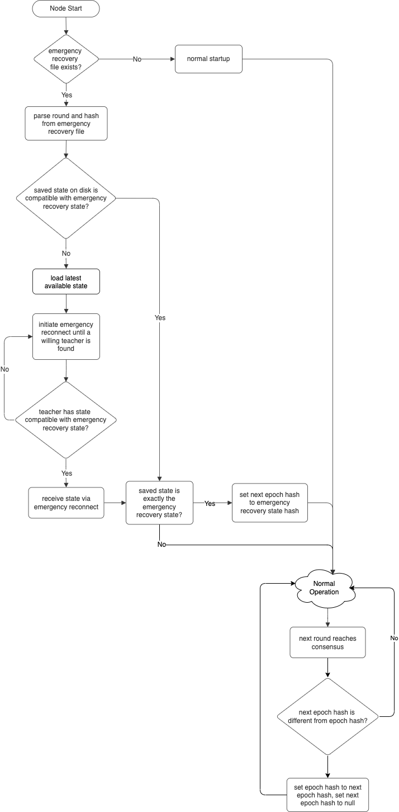
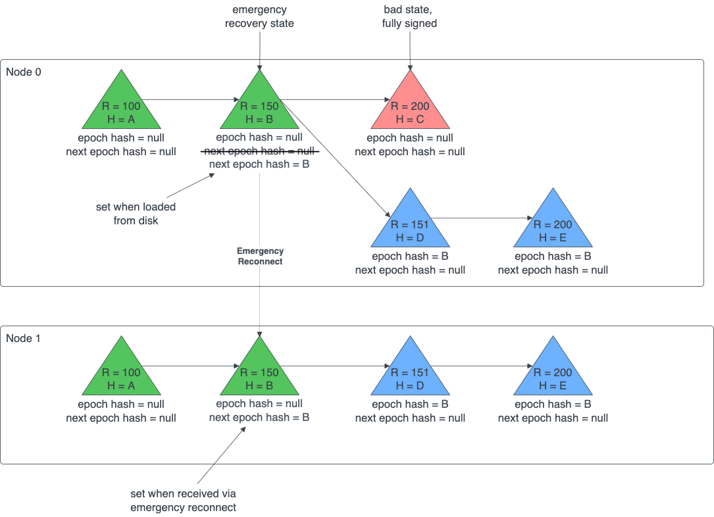

# Disaster Recovery

## Overview

This document describes the process by which an extreme disaster can be recovered from, such as from a bug that for a
given round causes half the nodes to have one state, and the other half to have a different state. This situation
requires human intervention, but this process aims to make it as easy as possible for those humans.

## Description

### Saving States

Every time a state is written, a csv file with a similar filename is also written. It contains the round and hash. That
way, if we decide to recover from that state, we rename a copy of that file, and send it to everyone.

### Restart

There is a special file `emergencyRecovery.csv` in the top-level sdk directory. If that file is missing, then a restart
proceeds normally. If it is present, then the following steps are taken.

* The file contains a round number then the SHA384 hash in hexadecimal of the state for that round (separated by a
  comma). If the local node can load a state with that round number and hash, then restart normally, loading that state,
  not an earlier or later state.
* If there is no local state for that round, or there is one for that round with a different hash, then ignore the
  state, and do a restart followed immediately by a reconnect.
* For that reconnect, repeatedly call other nodes at random until one is found that is willing to reconnect as a
  teacher, and has one of these two:
    * A state with the given round and hash (even if it isn’t fully signed)
    * A state with a later round and correct [epoch hash](#epoch-hash), which is signed by more than half the stake

In an extreme emergency, the state from one node can be declared to be the standard, and its round and hash put into the
recovery file (or use the existing file). The recovery file is sent to the owner of each node, with sufficient
authentication to convince them that this is valid. If they independently see that the entire network has actually
crashed, and their own node has shut itself down, then they upload the recovery file to their node, and restart it. As
this happens to each node, it will join the set of recovered nodes. Eventually, all nodes will recover.

### Restart Flow

### Epoch Hash

There may be cases in which a disaster recovery must be performed using am emergency recovery state, but a later, fully
signed state is not desired. This is where the epoch has comes in. The epoch hash is part of the platform state and
starts as `null`. Each time a disaster recovery is performed, the epoch hash is updated with the hash of the emergency
recovery round once the next round reaches consensus. During an emergency reconnect, a later fully signed state is only
accepted if it contains the proper epoch hash, meaning that it was created by the network after enough nodes recovered
using the emergency recovery state.

## Migration

If migrating the state is required to fix the cause of the disaster, some extra steps are necessary because
migrating the state changes the hash of the state and the existing emergency recovery files will no longer have the
correct round/hash combination. There are two options which require no code changes to the platform which are described
below.

### Option 1: Acquire State from Friendly Node

If a friendly node (e.g. the Swirlds node) is able and willing to provide a state that is deemed the "good" state to use
for emergency reconnect, get that state. The Swirlds Labs development team will migrate the state offline
and write the new state back out to disk. The migrated state is provided back to the friendly node and the hash of the
migrated state is used as the emergency recovery hash.

This option has the benefit of allowing the Swirlds Lab development team to verify that the migration was successful and
fixed the root cause of the disaster, but there must be a node with the "good" state who is willing to provide it.

### Option 2: Custom Upgrade Code

Add code in the new software version that migrates the state at a hard coded round some number of rounds after the
emergency recovery round (possibly 0 rounds). When that round reaches consensus, perform migration on the state prior to
applying that round's transactions. The migration might take some time, and if some nodes take long enough that they
fall behind, they will reconnect as usual, in which case there is no harm. Nodes that come back online later and perform
an emergency reconnect in which they receive a state for a round after the migration round, no migration is necessary
because it was already performed.