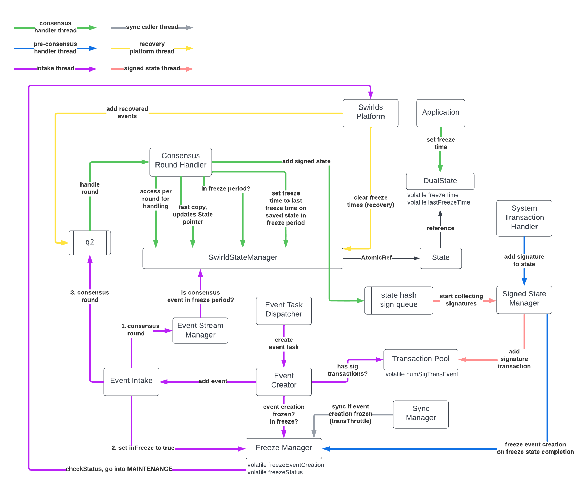

# Freeze Process

## Overview

Freeze is the process by which all nodes in the network arrive at the exact same state before shutting down. A freeze is
executed prior to migrating the network to a new version of software.

## Terminology

**Freeze Time:** The time at which a freeze takes effect. Stored in the `DualState`.

**Freeze Transaction:** An application transaction that defines the freeze time.

**Freeze Period:** The period of time between the freeze time and node restart. When consensus time advances past the
freeze time, the freeze period has started.

**Freeze State:** The freeze state is the last signed state each node creates, hashes, collects signatures on, and
writes to disk before shutting down. The freeze state must be the same on every node.

**Freeze State Signature:** A system transaction that contains a node's signature for the freeze state.

**Freeze Round:** The first round whose last event's consensus time is equal to or after the freeze time.

**Consensus Round Queue:** Also referred to as `q2` or `consRounds`, it is a queue of rounds that have reached consensus
but have not yet had their transactions handled by the `SwirldState`.

**Platform Status:** The current status of the platform. Various actions are taken when the status changes, both in the
platform and the application. Regression tests also look for certain status transaction. Nodes are `ACTIVE` in normal
operation.

**MAINTENANCE:** The status of the platform once consensus time has advanced into the freeze period. User transactions
are rejected when this is the platform's status.

**FREEZE_COMPLETE:** The status of the platform once a freeze state has been written to disk. Once all nodes have
reached transitioned to this status, the nodes can safely be shut down.

## Event Creation and Syncing

There are several key concepts related to freeze that impact event creation and sync rules:

* Enough events must be created leading up to the freeze time to ensure that consensus time advances to the freeze time.
  If consensus time does not advance to the freeze time, the freeze cannot occur.
* The freeze state signature must be included in an event so that other nodes can record it on their freeze states.
* Syncing must continue in the freeze period in order for nodes to send their own freeze state signature and to receive
  freeze state signatures from other nodes.

## Freeze Process

1. The application submits a freeze transaction to a platform node, including the time at which to set the freeze time.
   The freeze time must be some amount of time in the future.
2. The platform node gossips that transaction out to the network.
3. Each node reaches consensus on the event containing the special transaction and passes it to `handleTransaction(...)`
4. The `SwirldState` instance handles the freeze transaction by setting the freeze time in `DualState`.
5. 1 minute before the freeze period, (according to the wall clock), `transThrottle` is turned off to ensure the node
   reaches the freeze time in consensus time even if there is no traffic.
6. Consensus advances. Rounds continue to reach consensus.
7. Once the freeze round reaches consensus, the platform goes into `MAINTENANCE`. The freeze round is added to the
   consensus round queue.
8. Consensus rounds in the consensus round queue continue to be handled. When the freeze round is done being handled,
   the freeze state is created, hashed, signed by self, and added to a queue for collecting signatures from other nodes.
   No more rounds are handled and no more signed states are created.
9. A state signature transaction is created for the freeze state and added to the transaction pool so that it can be
   gossiped out to other nodes.
10. Once the event stream has handled the last event in the freeze round, the stream closes.
11. Once enough signatures are collected on the freeze state, write the state to disk and transition
    to `FREEZE_COMPLETE`.
12. When all nodes have transitioned to `FREEZE_COMPLETE`, the nodes can safely be shut down and restarted via an
    external command.

## Diagram

