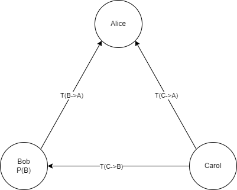
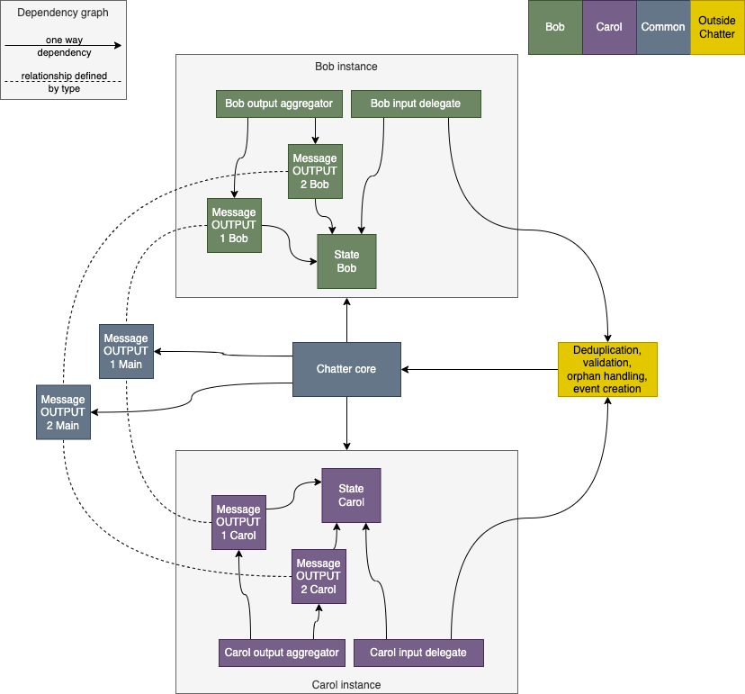

# Out-of-order gossip protocol

OOG is an asynchronous message protocol that aims to ensure that all nodes in the network receive
all events that they need in order to reach consensus. It runs on a bidirectional
[network](../../network/network.md) and sends various types of messages including events themselves.
The other message types are mostly sent to support efficient event sharing. The different message types are described
below.

Currently, OOG is only designed for a fully connected network. All nodes need to be connected to each other. Nodes
can receive events out of order because of the [orphan buffer](orphan-buffer.md). So the typical scenario is
very simple, when a node creates an event, it just sends it to everyone else. This ensures all nodes will get all events
and no duplicates are sent.

### Other events (events created by other nodes)

Because of potential connection or other types of issues, or malicious nodes, we also sometimes have to send events
created by others, in case the creator did not send someone their event. The method by which we determine if an
other-event needs to be sent is the following:

- when a node receives an event, it first sends it to validation
- only if an event is valid, this event's descriptor is sent to all other nodes ASAP, to inform them that we have this
  event
- each node tracks the descriptors of all its neighbors
- if a node receives an event, and it doesn't receive a descriptor for that event from a neighbor within a certain
  period of time, it sends that neighbor that event

Determining this period of time is crucial, for more details see [versions](#protocol-versions)

## Message type summary

- **Events** - the main payload, the purpose of the protocol is to ensure all nodes receive all events needed for
  consensus. stale events do not need to be sent.
- **Event descriptors** - also called hashes sometimes, since this is the main part of the descriptor. sent to
  inform our peer that we have an event and the peer does not need to send it to us. the main goal is to reduce the
  number of duplicate events each node receives to a minimum
- **Generations** - informing our peer which events I consider ancient and do not need to be sent to me.
- **Heartbeat** - see [heartbeats](#heartbeats)

### Heartbeats

A type of OOG message used to:

- determine if the peer is responsive
- track the response time of a peer
- keep the connection alive

Heartbeat messages are sent periodically with a unique ID. ATM, heartbeats are only used for tracking the response time
of a peer.

## Protocol versions

ATM, we are still experimenting with different rules for sending and receiving messages. The previous versions are
listed [here](OOG-legacy-versions.md).

### Version 0.6 (proposal)

The main point of this version is to try and address the way to determine the other-event delay. Let's start with a
diagram:

A few notes about the diagram:

- It displays a 3 node network, where Alice has to decide whether to send Bob an other-event created by Carol
- The arrows show delays in one node sending another messages. The delay includes a network delay, but also any other
  delays in transmission. These include bandwidth delays and read delays. This means that it can change from one moment
  to the next, even if the underlying network is the same.
- Due to what is explained above, `A->B` does not have to equal `B->A`.
- `P(B)` is Bob's processing delay. It is the time between bob reading an event and validating it.

So lets imagine a scenario from Alice's perspective:

- Carol creates an event `E`
- Carol send it to both Bob and Alice
- When Alice receives it, she has to wait before deciding whether to send it to Bob
- When Bob receives it, he sends `D(E)` to Alice, descriptors of the event
- When Alice receives `D(E)`, she knows she does not have to send `E` to Bob

So Alice needs to decide how long she will wait. In theory, it should be the following:
`delay = T(C->B) - T(C->A) + P(B) + T(B->A)`
Note: The delay is based on the time Alice received `E`, that is why this equation does not include any processing time
by Alice.

- For simplicity's sake, lets assume that `T(C->B) == T(C->A)`, then our equation becomes `delay = P(B) + T(B->A)`
- So Alice needs to know how long it takes Bob to process an event. There is no other way of knowing this but for Bob to
  inform her with a special message type.
- Alice can approximate `T(B->A)`. She can measure `T(A->B) + T(B->A)` with a heartbeat.
- Since a lot of this can be inaccurate because of a bad approximation or because the information is out of date, it
  might be wise to add a fixed amount `F` to the delay.

So the proposal for the delay is: `delay = P(B) + T(B->A) + F`

### Version 0.5 (current)

- Send side (messages in order of priority)
  - Heartbeats - they are first because delaying a heartbeat response would distort the ping time
  - Descriptors - one queue per neighbor. sent for all other-events
  - Self-events - one queue per neighbor.
  - Other-events - one queue per neighbor. if the peer does not know this event, wait for a maximum of `N`
    milliseconds before sending it
- Receive side
  - when receiving a descriptor, remember that this peer knows this event
  - when receiving an event, validate it. after validation, but before looking for its parents, add its descriptor to
    the queues and add the event to the other-event queues

The main problem with this approach is that the other-event delay is based on a fixed value and does not work well in
performance tests for 2 reasons:

- If a node is slow in processing events, it will fail to send a descriptor in time. This makes the node slow down event
  validation even more
- The connections to the slow nodes will be cluttered with events, thus delaying descriptors. This will cause the slow
  node itself to start sending other events to faster nodes.

## Implementation

Example implementation of a 3 node network, showing Alice's instances:

- `Peer state`
  - keeps a track of which messages the peer has and which he needs
  - makes sending decisions based on this information
- `Message output`
  - responsible for managing messages that need to be sent to peers
  - has a main instance and an instance per peer
- `Output aggregator`
  - manages all peer outputs
  - provides messages to be sent
  - decides the priority of messages
- `Input delegate`
  - determines the message type
  - passes the messages to the appropriate handler based on the type
  - before validation, messages received by the peer should only affect the state of that peer. any other approach
    would be a potential attack vector.
- `ChatterCore`
  - manages peer instances
  - forward messages to output
