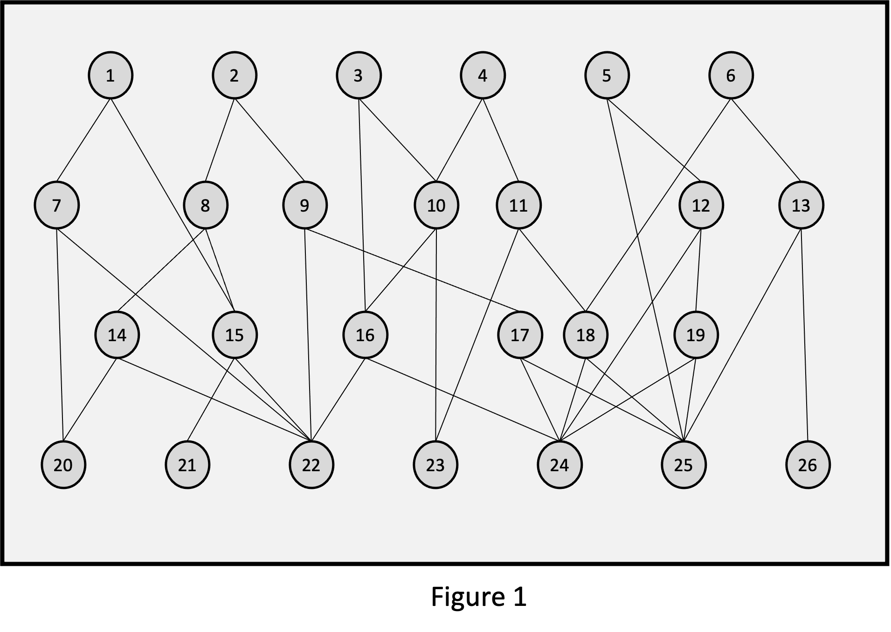
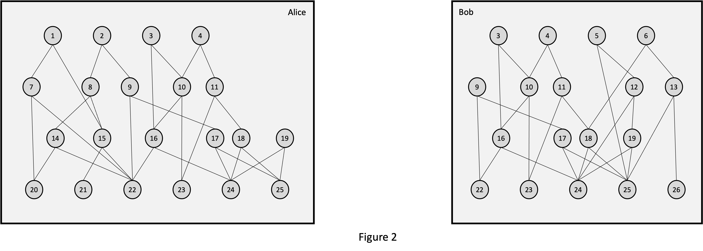
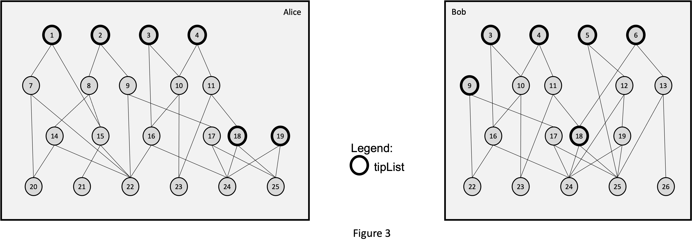
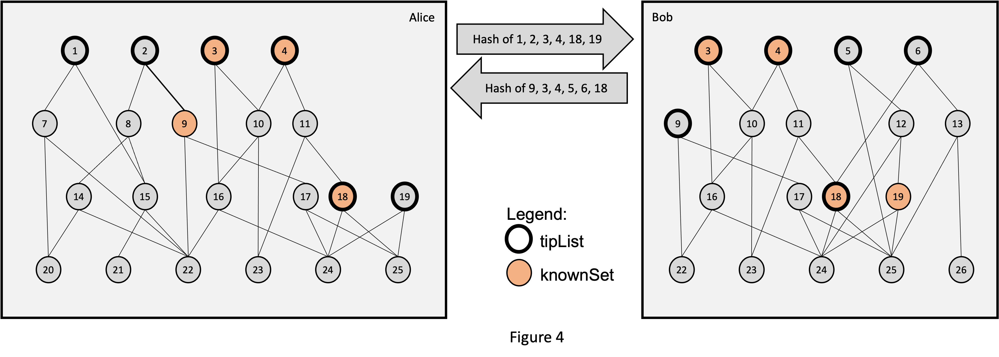
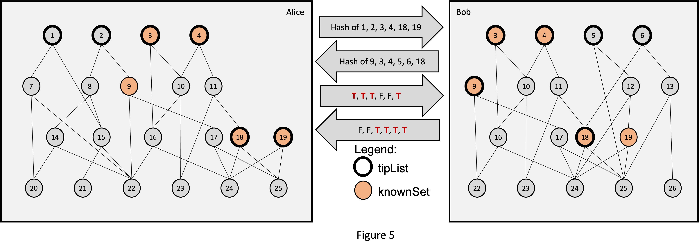
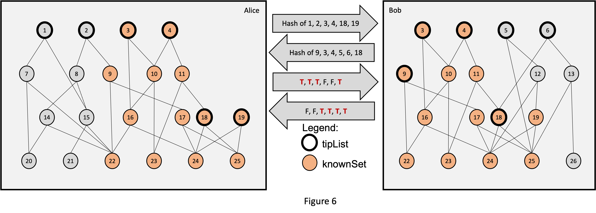
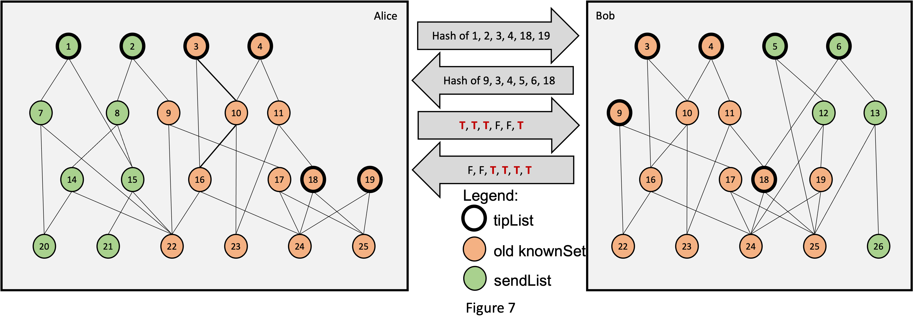
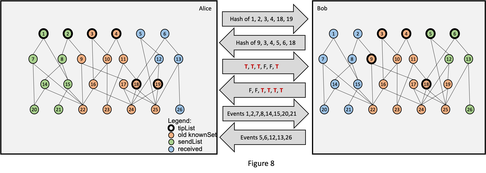
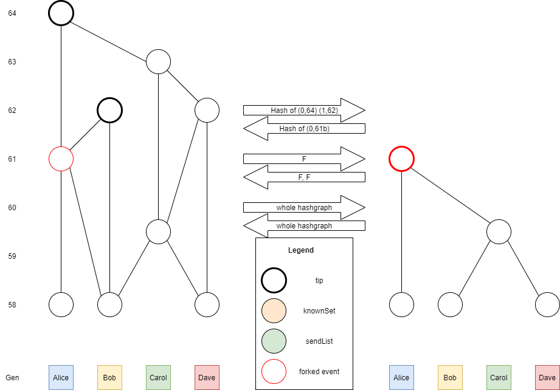

# Sync Protocol Design Document

This document describes a proposal for how the sync protocol should work. The current code (2021-10-01) has a large
number of differences.

### Protocol

The following is the complete sync protocol:

```
//////////////// PHASE 1 ////////////////

Make an immutable snapshot of the current graph, and use it for everything below

tipList = all tips            // all of my tips. A "tip" is an event with no self-child
knownSet = empty set          // events that I know they already have
sendList = empt list          // events to be sent

do this
   send maxRoundGen, minGenNonAncient, minGenNonExpired, tipList
in parallel with this
   receive otherMaxRoundGen, otherMinGenNonAncient, otherMinGenNonExpired, otherTipHashList

if otherMaxRoundGen < minGenNonExpired
    abort the sync, and return
if maxRoundGen < otherMinGenNonExpired
    record that they consider me to have fallen behind
    abort the sync, and return

for each x in otherTipHashList
    if x is the hash of an event y in the graph
        add y to knownSet

//////////////// PHASE 2 ////////////////

do this
    for each x in otherTipHashList (in the order they were received)
        send the boolean (x is the hash of an event in the graph)
in parallel with this
    for each y in tipList (in the order they were sent)
        receive boolean b
        if b
            add y to knownSet

//////////////// PHASE 3 ////////////////

// add to knownSet all the ancestors of each known event
todoStack = stack containing all elements in knownSet (in an arbitrary order)
while todoStack is not empty
    pop x from todoStack
    push each parent of x onto todoStack (in an arbitrary order)
    if (x.generation >= otherMinGenNonAncient) AND (x not in knownSet)
        add x to knownSet

// tips might have changed since the beginning of the sync, get the latest
tipList = get latest tips
// set sendList to all ancestors of tips that are not known
todoStack = stack containing all elements in tipList (in an arbitrary order)
while todoStack is not empty
    pop x from todoStack
    push each parent of x onto todoStack (in an arbitrary order)
    if (x.generation >= otherMinGenNonAncient) AND (x not in knownSet)
        add x to knownSet //prune duplicate searches by acting as if this is known
        add x to sendList

sort sendList ascending by generation   // this will be in topological order
do this
    send sendList
in parallel with this
    receive otherSendList

add all of otherSendList to the queue of events to verify and add to the hashgraph
```

In this, `maxRoundGen` is the maximum round generation (the min judge generation in the latest consensus round)
, `minGenNonAncient` is the minimum generation of all the judges that are not ancient, and `minGenNonExpired` is the
minimum generation of all the judges that are not expired. All of these variables are clipped to always be 0 or greater.
If there are no events known, then all of them are set to 0. And similarly if there are no judges yet for a round, or if
an event has a generation of 0. In all those cases, the variables are set to 0. The
line `record that they consider me to have fallen behind` means to consider this as one vote that I have fallen behind.
It is described elsewhere how those votes are collected, and how, when a sufficient number are found, they trigger a
reconnect.

The immutable snapshot ensures that no events expire and disappear during the sync. It also ensures that
`maxRoundGen`, `minGenNonAncient`, and `minGenNonExpired` do not change during the sync. It's actually ok if it changes
during the sync by having additional events added, which can affect the booleans that are sent. But no events can be
removed, and the 3 generation variables must not change.

### Example

Suppose there is a complete hashgraph that looks like this, where events 1-6 and 18 are the tips (events with no
self-child):



Two nodes, Alice and Bob, each have a subset of that graph:



The two nodes will now sync. The following shows the above pseudocode broken into sections of pseudocode, each of which
is followed by an image of the state after completing that section.

```

//////////////// PHASE 1 ////////////////

Make an immutable snapshot of the current graph, and use it for everything below

tipList = all tips            // all of my tips. A "tip" is an event with no self-child
knownSet = empty set          // events that I know they already have
sendList = empt list          // events to be sent

```



```

do this
   send maxRoundGen, minGenNonAncient, minGenNonExpired, tipList
in parallel with this
   received otherMaxRoundGen, otherMinGenNonAncient, otherMinGenNonExpired, otherTipHashList

if otherMaxRoundGen < minGenNonExpired
    abort the sync, and return
if maxRoundGen < otherMinGenNonExpired
    record that they consider me to have fallen behind
    abort the sync, and return

for each x in otherTipHashList
    if x is the hash of an event y in the graph
        add y to knownSet

```



```

//////////////// PHASE 2 ////////////////

do this
    for each x in otherTipHashList (in the order they were received)
        send the boolean (x is the hash of an event in the graph)
in parallel with this
    for each y in tipList (in the order they were sent)
        receive boolean b
        if b
            add y to knownSet

```



```

//////////////// PHASE 3 ////////////////

// add to knownSet all the ancestors of each known event
todoStack = stack containing all elements in knownSet (in an arbitrary order)
while todoStack is not empty
    pop x from todoStack
    push each parent of x onto todoStack (in an arbitrary order)
    if (x.generation >= otherMinGenNonAncient) AND (x not in knownSet)
        add x to knownSet

```



```

// tips might have changed since the beginning of the sync, get the latest
tipList = get latest tips
// set sendList to all ancestors of tips that are not known
todoStack = stack containing all elements in tipList (in an arbitrary order)
while todoStack is not empty
    pop x from todoStack
    push each parent of x onto todoStack (in an arbitrary order)
    if (x.generation >= otherMinGenNonAncient) AND (x not in knownSet)
        add x to knownSet //prune duplicate searches by acting as if this is known
        add x to sendList

```



```

sort sendList ascending by generation   // this will be in topological order
do this
    send sendList
in parallel with this
    receive otherSendList

add all of otherSendList to the queue of events to verify and add to the hashgraph

```



### Tip update note

In phase 3, before creating the `sendList`, we update the tips in case they have changed since the last time we checked.
This is done in order to improve the `C2C` value (the amount of time it passes between event creation and that event
reaching consensus). This is especially important in high latency networks.

### Tip definition note

The definition of a tip must be an event with no self child. If a tip were defined as an event with no children (no self
or other child) and there are very few tips, and the tips for Alice and Bob were unknown to the other, each node would
send all non-ancient events in the hashgraph. Another example of when Alice and Bob would send all non-ancient events to
each other is in the case of a split fork graph as shown below.



### Tips increase explanation

It is possible that we have more tips than nodes even if there is no fork. Here is how:
Suppose we have an event 3 who has a self parent 2 who has a self parent 1. Once we receive 1, it becomes a tip. 2 is
created, but not gossiped out, because the creator is under load. Once it starts syncing again, 2 is ancient for the
other nodes, so they never receive it. They don't need to, because its a stale event. Now we receive 3 and it becomes a
tip, but 1 is still also a tip, because it has no descendants that we know of. So we end up with more tips then nodes.
