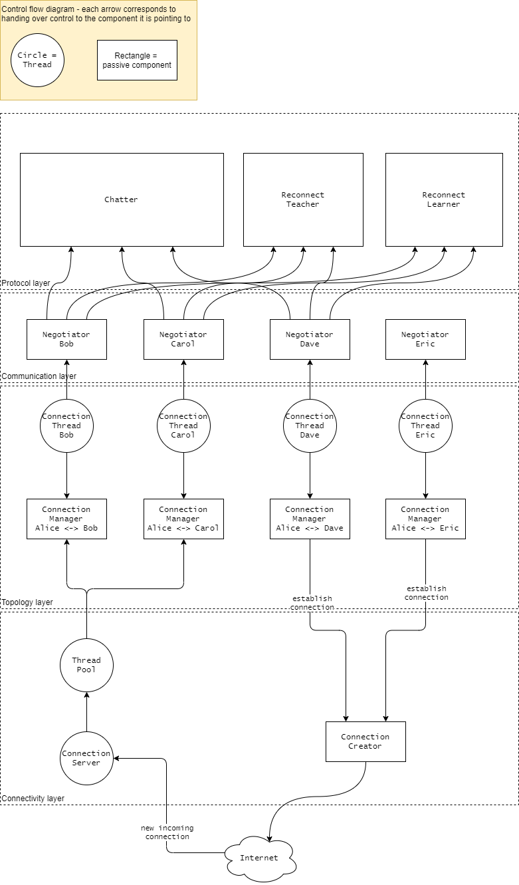

# Bidirectional network

A network where we have 1 connection per neighbor, that can be either inbound or outbound, depending on the topology.

## Communication

Both nodes can initiate a protocol over the same connection. This can occur in parallel so an extra step might be needed
to determine which protocol to run. This is done by a [protocol negotiator](negotiator.md).

The protocols that can run on this type of network are:
- [Sync](../gossip/syncing/sync-protocol.md)
- [Chatter sync](../gossip/OOG/OOG-sync.md)
- [Chatter](../gossip/OOG/OOG-protocol.md)
- Reconnect

## Implementation overview

