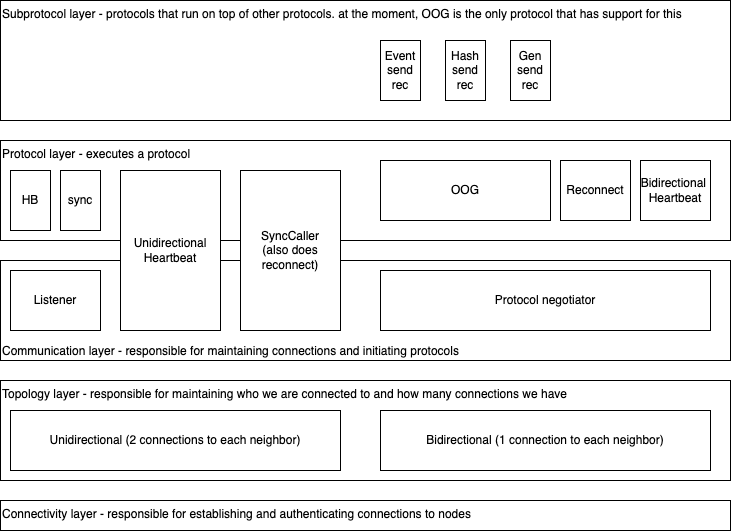

# Platform networking

## Intro
As a decentralized system, one of the core features of the Swirlds platform is communicating with other platforms in the
network. The platform networking functionality aims to accomplish these goals:
- establish and maintain secure, authenticated connections to other nodes in the network
- be resilient to various attacks (this requires additional work)
- re-establish connections transparently
- ensure all unused connections are properly closed
- allow different protocols to run over the same connection
- provide a smooth transition between gossip and chatter
- adapt to changes in network topology at runtime (this requires additional work)
- is designed with clear separation of concerns
- has simple, loosely coupled, unit tested components

## Design
- [Bidirectional](bidirectional.md)

## Definitions
- **Node** - a Swrilds platform that is part of the network and is connected to other nodes
- **Neighbor** - a node which I have a direct connection to. For larger networks, the intent is that we will limit the
number of connections each node has. So a node will not be directly connected to each other node on the network, but it
will receive events from non-neighbors through neighbors
- **Outbound connection** - a connection to a neighbor that has been initiated by me
- **Inbound connection** - a connection to a neighbor that has been initiated by the neighbor
- **Bidirectional network** - a network where we have 1 connections per neighbor, that can be either inbound or 
outbound, depending on the topology. In this type of network, both nodes can initiate a protocol over the same 
connection. This means that both sides could initiate a protocol in parallel, so it is slightly more complex to decide
which protocol to run