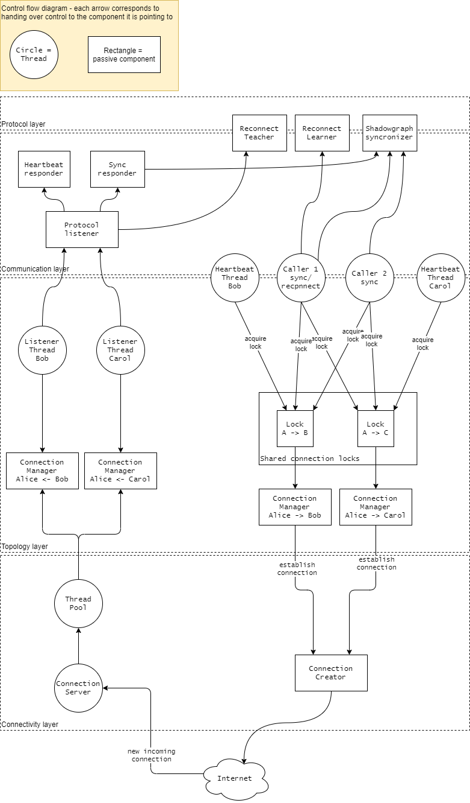

# Unidirectional network
A network where we have 2 connections per neighbor, 1 inbound and 1 outbound. A node can only initiate a protocol 
request through its outbound connection. Each peer in a connection has a role:
- **Caller** - initiated the connection, outbound for him
- **Listener** - accepted the connection, inbound for him

## Communication
A protocol is always initiated by the caller, the listener only responds:

### Listener state diagram

## Implementation overview
