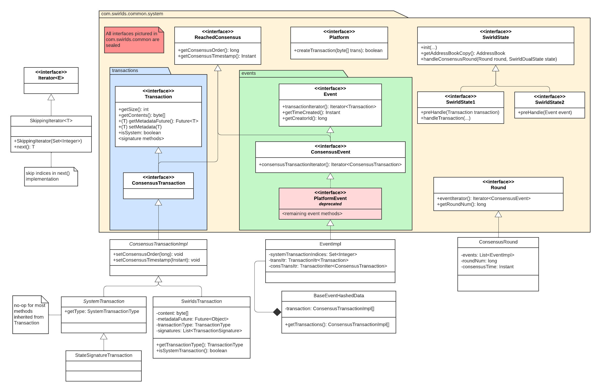

# Transaction Handling

## Overview

Transactions update the state of the system in a manner defined by the application. The platform provides transactions
to the application at various stages. This document describes how transactions are provided to enable the application to
parallelize transaction processing and provide transaction to event and round linkage information.

### Pre Handle

Transactions are provided to the application via `SwirldState.preHandle()` once, globally, regardless of the number of
working states in memory. The method allows the application to expand signatures, attach metadata, or perform other
one-time only operations on transactions.

### Consensus Handling

`SwirldState` is modified by consensus transactions, so all consensus transactions are provided to the consensus state.

## Details

### Class Diagram

### Round Based Transaction Handling

Consensus transactions are sent to the application in the form of a round. Entire rounds reach consensus at once, so it
makes sense to provide them to the application in the same way. Each round provides iterators for its events. Each event
provides an iterator for its transactions.

### System Transactions

System transactions are not sent to the application. The `TransactionIterator` provided to the application
via `ConsensusEvent` and `Round` only iterates over user transactions. The iterator simply skips over any transactions
that are system transactions, so they are not provided to the application.

Some system transactions should be handled prior to consensus, such as state signature transactions. There will be some
in the future that must be handled after reaching consensus, like BLS transactions. For now, the behavior will remain
the same: all system transactions will be handled twice, once pre-consensus and once post-consensus.

Each event knows the set (an ordered set) of indices of its system transactions. Calculating the list of system
transaction indices is done by iterating through every transaction in the event on creation or deserialization. Handling
of system transactions pre-consensus is done on the pre-consensus handle thread.

### Consensus Handler Thread Changes

The consensus handle thread sets the value of `consensusOrder` and `consensusTimestamp` on every transaction prior to
invoking `handleConsensusRound(...)`. This process is single threaded today, but does not need to be done on a single
thread. Each event can set these values independently and on separate threads for increased speed if needed. Once
set, `handleConsensusRound(...)` is invoked. Events are then iterated in consensus order and system transactions that
must be handled after consensus are handled. Currently, state signature transactions are the only system transactions
for which action is taken. They can be handled before, after, or in parallel with the user transactions.

### Transactions

Applications submit transactions as raw byte arrays. The platform wraps the byte array in a `SwirldTransaction` class
not visible to the application. Transactions are exposed to the application later as a `Transaction` interface that
provides all necessary information. This approach keeps the interface simple and exposes required transaction
information to the application while hiding methods it shouldn't have access to methods such as `setConsensusOrder()`
and `setConsensusTimestamp()`.

The application may optionally attach an object for storing metadata to the `Transaction`. This object is not serialized
and is not persisted across restarts. The data must be recalculated by the application after a restart. Consensus member
variables in `SwirldTransaction` are not serialized as part of gossip or event stream writing because they are
calculated by each node individually.

All methods for adding, removing, and extracting signatures are available at the `Transaction` interface for use by the
application to associate signatures with a transaction. The `bytes[] getContents()` method returns the reference to the
byte array instead of returning a clone.
