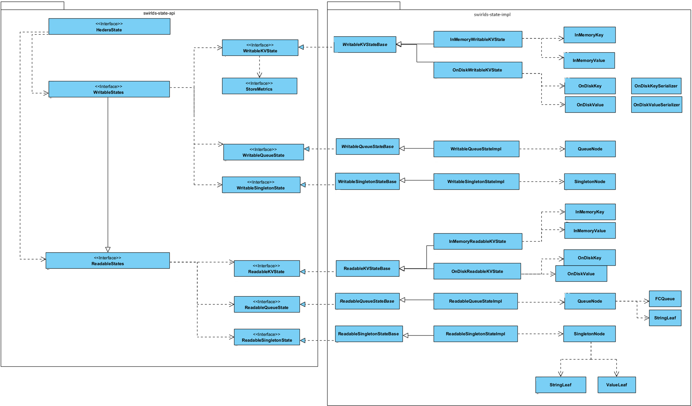

# Merkle State API

## Summary

Refactor the Merkle tree so that it can be fully represented by the State API objects.
Create a module that will provide a simple and easy-to-use API for the Merkle tree.

## Purpose and Context

### Why?

The Merkle tree is a rather complex data structure, and to make interaction easier, we need to hide this complexity behind the API.
Another reason to have this API is to provide additional flexibility in changing the implementation details of the Merkle tree.
As long as they are hidden, we are free to change them.

Note that this API is already implemented as a part of the Service Modularization project, but these classes will be moved
to a separate module as a part of this proposal.

### Context

There are two issues that need to be addressed:

* We need to have a public API for the Merkle tree that is simple and easy to use, residing in a separate module with a minimal set of dependencies.
* The Merkle tree has to be fully expressed in terms of State API. Currently, `PlatformState` stands out and needs to be refactored.

## Requirements

- `PlatformState` should be refactored to a singleton object as defined by the State API.
- there should be a new module - `swirlds-state-api` - to host a set of interfaces, records, and abstract classes that represent the Hedera state.
  This module should have a minimal set of dependencies. The Block Node should not have a compile-time dependency
  on any other modules but this one to interact with the state.
- there should be a new module - `swirlds-state-impl` module to host the implementation of these interfaces and helper classes.

## Changes

### Public API

State API classes and interfaces will migrate to a designated module. The classes themselves will not change. `PlatformState` class will become a part of the public API. 

### Modules and Repos

Two new modules are added as a part of this proposal:

Note that the `swirlds-state-api` is already created and has a set of classes by [this PR](https://github.com/hashgraph/hedera-services/pull/12570). There is also one [more PR](https://github.com/hashgraph/hedera-services/pull/13331) related to this change.

## Components and Architecture

### Platform State

Currently `PlatformState` is a special case node of the merkle tree. That is, it doesn't conform to State API. As a part of the simplification effort **it should be refactored to a singleton state**.

## Test plan

Migration testing:

- we need to make sure that the data of the current platform state migrates properly to a platform state represented by a singleton node.
- we need to test that `PlatformState` can be properly migrated to protobuf format

## Implementation and delivery plan

- Move State API implementation classes from `swirlds-platform-core` to `swirlds-state-impl`.
- Refactor `PlatformState` into a singleton. This depends on [migrating PlatformState to protobuf](https://github.com/hashgraph/hedera-services/pull/13694). Migrate the data.
- Move `MerlkeHederaState` to `swirlds-state-impl`
