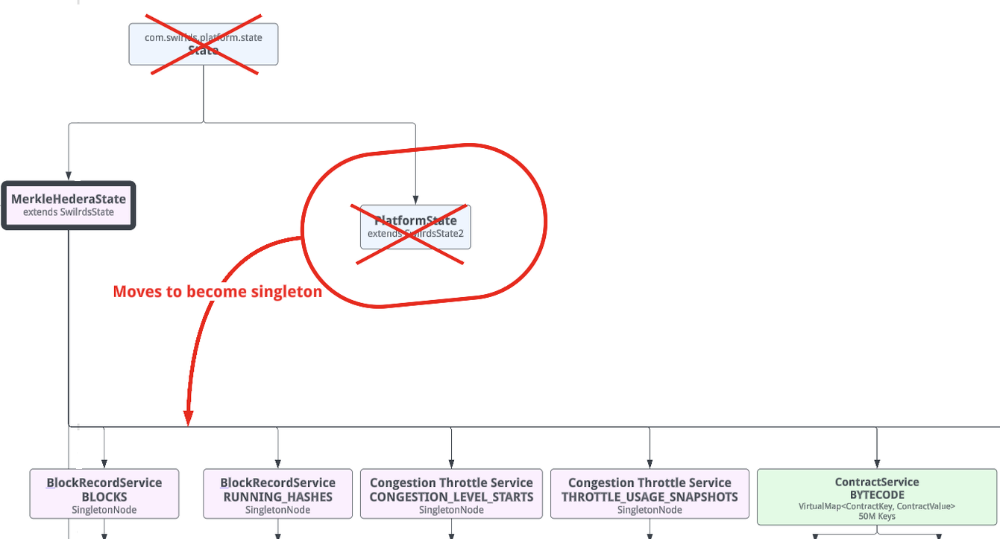

# Merkle State API

## Summary

Refactor the Merkle tree so that it can be fully represented by the State API objects. Create a module that will provide simple and easy-to-use API for the Merkle tree.

## Purpose and Context

There are two issues that need to be addressed:

* We need to have a public API for the Merkle tree that is simple and easy to use, residing in a separate module with a minimal set of dependencies.
* The Merkle tree has to be fully expressed in terms of State API. Currently, `PlatformState` stands out and needs to be refactored.

The goal of this design proposal is to ensure that one can interact with all the objects in the Merkle tree using the newly introduced State API.

This refactoring will enable optimized state proof, as it will be possible to represent an n-ary root node as a virtual binary tree.
Therefore, the number of hashes in the state proof will be minimized.

## Requirements

- `PlatformState` should be refactored to a singleton object as defined by the State API.
- the Merkle tree should be reshaped so that `MerkleHederaState` becomes the root of the tree and `PlatformState` becomes its child.
- there should be a new module - `swirlds-state-api` - to host a set of interfaces, records, and abstract classes that represent the Hedera state.
  This module should have a minimal set of dependencies. Ideally, the Block Node should not have a compile-time dependency
  on any other modules but this one to interact with the state.
- there should be a new module - `swirlds-state-impl` module to host the implementation of these interfaces and helper classes.

## Changes

### Public API

State API classes and interfaces will migrate to a designated module. The classes themselves will not change.

### Modules and Repos

Two new modules are added as a part of this proposal:

Note that the `swirlds-state-api` is already created and has a set of classes by [this PR](https://github.com/hashgraph/hedera-services/pull/12570). There is also one [more PR](https://github.com/hashgraph/hedera-services/pull/13331) related to this change.

There is one more change that can be relevant in the context of public APIs. This is the proposed change to the Merkle tree structure.

## Components and Architecture

### Platform State

Currently `PlatformState` is a special case node of the merkle tree. As a part of the simplification effort **it should be refactored to a singleton state**.

### KV Node

We need to have a class that represents key-value node in the tree, as we have it for singleton and queue nodes. Currently, this class is missing. 

### Merkle state refactoring

- Move `PlatformState` from the root to `MerkleHederaState`
- Replace usage of existing root of `State` type with `MerkleHederaState`
  - It would be much easier to do, if they implemented the same interface (e.g. `RootNode`). Currently, there is now direct relation between these classes.
- Make sure that the state migration happens properly during the version update

## Test plan

This design doesn't add any new functionality. Therefore, the assumption is that as long as all existing tests are passing (unit tests, integration tests, and performance tests), the change is considered to be tested.

## Implementation and delivery plan

- Move State API implementation classes from `swirlds-platform-core` to `swirlds-state-impl`.
- Add common interface for `MerkleHederaState` and `State` to make the migration easier.
- Make `MerkleHederaState` a root of the Merkle tree.
- Implement a class that represents KV node.
- Refactor `PlatformState` into a singleton. This depends on [migrating PlatformState to protobuf](https://github.com/hashgraph/hedera-services/pull/13694). Migrate the data.
- Move `MerlkeHederaState` to `swirlds-state-impl`
