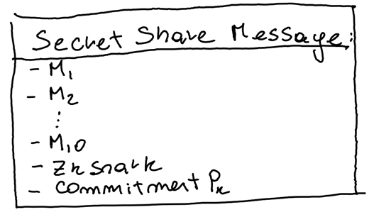

# 0X - Tss block signing - Cryptography APIs

## Summary

Provide necessary pieces for signing blocks with TSS

| Metadata           | Entities                                               | 
|--------------------|--------------------------------------------------------|
| Designers          | Austin, Cody, Edward, Rohit, Maxi, <br/> Platform team | 
| Functional Impacts | Platform team. Release engineering. Devops             |
| Related Proposals  | TSS                                                    |
| HIPS               | ?                                                      |


## Purpose and Context
The goal of a threshold signature scheme is to enable a group of participants (shareholders) to securely and efficiently perform signature generation while preserving security when assuring the presence of up to a threshold number of honest parties.

This proposal covers the implementation of all necessary pieces to provide the consensus-node and block-node, the functionality to sign and verify blocks using a Threshold Signature Scheme (TSS), and EC Cryptography.

The overview of the process and background for TSS and how it impacts functionally of the platform can be found in the related proposal: [TODO Add Ed's Proposal].

The proposal assumes no relation with the platform and defines a generic solution that can be adopted by any consumer, the only assumption the proposal is making is that there exists a channel to connect each participant where the identity of the sender of a message has been previously validated.

Additionally, participants will need access to each other's public key. While the generation of the public/private keys is included in this proposal, the distribution aspect, the loading and in memory interpretation from each node is also outside the scope of this proposal. 

### Glossary
- **TSS (Threshold Signature Scheme)**: A threshold-based signing where a minimum number of parties (threshold) must collaborate to produce an aggregate signature that can be used to sign messages and an aggregate public key that can be used to verify that signature.
- **Groth 21**:publicly verifiable secret sharing and resharing schemes that enable secure and efficient distribution and management of secret shares, with many possible uses cases supporting applications in distributed key generation and threshold signatures. Uses Shamir's secret sharing and ElGamal.
- **Shamir’s Secret Sharing**: In Shamir’s SS, a secret s is divided into n shares by a dealer, and shares are sent to shareholders secretly. The secret "s" is shared among n shareholders in such a way that
(a) t or more than t shares can be used to recover the secret, and
(b) fewer than t shares are not sufficient to obtain the secret
Shamir’s (t, n) SS is based on a linear polynomial and is unconditionally secure.
- **ElGamal**: On a message and a random number chosen by a signer, ElGamal signature scheme produces a signature consisting of two numbers (r, s),
where r is computed from a random number regardless of a message and then s is computed from a message,
a signer's secret key, a chosen random number, and r.
- **EC (Elliptic Curve)**: "Elliptic" is not elliptic in the sense of an "oval circle". In the field "Fp", an EC is like a non-connected cloud of points. All points satisfy an equation and all operations are performed modulo p. Some elliptic curves are pairing-friendly.
- **Bilinear Pairings**: Are mathematical functions used in cryptography to map two elements of different groups (in EC, the group is an elliptic curve) to a single value in another group in a way that preserves certain algebraic properties.
- **Fields**: Mathematical structures where addition, subtraction, multiplication, and division are defined and behave as expected (excluding division by zero).
- **Groups**: Sets equipped with an operation (like addition or multiplication) that satisfies certain conditions (closure, associativity, identity element, and inverses).
- **Share**: Represents a piece of the public/private necessary elements to create signatures. In TSS, a threshold number of shares is needed to produce an aggregate signature that can be then verified by the ledger public key.
- **Polynomial Commitment**: A polynomial commitment is a cryptographic commitment to a polynomial. It enables a committer to commit to a polynomial such that the commitment allows verifying evaluations of the polynomial at specific points without revealing the entire polynomial.

### Goals
- **Usability:** Design a user-friendly library with a public API that is easy to integrate with other projects like consensus-node and block-node.
- **EVM support:** Generated signature and public keys should be compatible with evm precompiled functions so that signature validation can be done on smart contracts without incurring in excessive gas cost. 
- **Security:** Our produced code should use audited code and be able to pass security audits both internal and external.
- **Flexibility**: Minimize the impact of introducing support for other elliptic curves. 
- **Independent Release:** Design release cycle independent components that can be used both in the consensus node and in the future block node.

### Non-Goals
- Completely implement our own cryptography support/primitives/library implementation that supports EC-curves in Java.
- Support any other different system/architecture other than: Windows amd64, Linux amd64 and arm64, and MacOS amd64 and arm64.
- Make the library externally available and accessible.


## Changes

### Core Behaviors

The proposed TSS solution is based on Groth21 

#### Description of the Scheme

An external operator will generate a persistent EC private/public key pair for each participant of the scheme.
Each external operator will distribute the key of the participant to the other participants in the scheme.

The following section describes the process from a particular participant's point of view after the key distribution happened:

##### Input
* Participant's persistent EC private key (Private to each participant)
* Number of participants (Public)
* Number of shares per participant (Public)
* All participants' persistent EC public key (Public)
* A threshold value
* A predefined `SignatureSchema` that defines the type of Curve to use, and which Group of the Pairing is used for PublicKey Generation (Public)

```
`Share`: An abstract concept having a unique identifier and an owner
|_  `ProprietaryShare`: Represents a share owned by the executor of the scheme. Contains a secret value (Ec Private key) used for signing.
|_  `ExternalShare`: Represents a share owned by other participants.
```

#####  Bootstrap Stage
E.g: In a scheme distributing 10 shares over 4 participants

Assuming Current Participant: (P₁;  P₁_EC_PrivateKey)

Given

The current participants' directory:
```
P   # shares
-----------------------------
P₁  5        P₁_EC_PublicKey
P₂  2        P₂_EC_PublicKey
P₃  1        P₃_EC_PublicKey
P₄  2        P₄_EC_PublicKey

```
A threshold: 
```
 t = 5
```

And an ownership map: `ShareId`->`Participant`:

```
sid₁	sid₂	sid₃	sid₄	sid₅	sid₆	sid₇	sid₈	sid₉	sid₁₀
P₁  	P₁  	P₁  	P₁  	P₁  	P₂  	P₂  	P₃  	P₄  	P₄  
```

###### 1. Create TssMessage 
`TssMessage`: A data structure for distributing encrypted shares of a secret among all participants in a way that only the intended participant can see its part of the share, and includes validation information like a commitment to `Pₖ` and a zk-SNARKs proof that can be used to verify the validity of the message and assemble an aggregate public key (referred as ledgerId).

In the bootstrap process we create a random EC_PrivateKey out of the FieldElement of the `SignatureScheme` (the secret being shared).

Then, each shareholder will produce `n` (n=total number of shares) values `xₛ` by evaluating a polynomial Pₖ at each `ShareId`: `sidₛ` in the ownership map

```
   xₛ=Pₖ(sidₛ) for privateKey: k and each ShareId: sidₛ
```
Each `xₛ` constitutes points on the polynomial.

The polynomial `Pₖ` is a polynomial with degree `t-1` (t=threshold) created with random coefficients from `SignatureScheme.publicKeyGroup` and `k`'s EC field element in `aₒ` and `x` each `sidₛ`

Once the `xₛ` value has been calculated for each `ShareId`: `sidₛ`, the value: `Mₛ` will be produced by encrypting `xₛ` using `sidₛ` owner's publicKey.


A TssMessage:



After created using a channel established outside the scope of the library, each participant will broadcast a single message to be received by all participants.
While waiting for other participants' messages to arrive for a limited amount of time.

###### 2. Validation of TssMessage
Each participant will validate the received message against the commitment and the zk-SNARKs proof. Invalid messages will be discarded.
The validation is produced over the content of the message and does not include the sender's identity which is assumed to be provided by the external channel.

###### 3. Processing of TssMessage
Given Participant's persistent EC PrivateKey, `n` number of validated messages (n=threshold), and the list of all validated `TssMessage`s,
each participant will decrypt all `Mₛ` to generate an aggregated value `xₛ` that will become a  `ProprietaryShare(sidₛ, xₛ)` for each `ShareId`: `sidₛ` owned by the participant.


At this point, the participant executing the scheme is able to start signing.
Synchronization between all participants will be needed in order to determine if all of them have received and processed enough messages and determined each owns ProprietaryShares,
but that is not covered by this library and should be done outside.

#####  Sign Stage

###### 1. Sign
Using each `ProprietaryShare` owned by the participant, a message can be signed producing a `TssSignature`
Using a channel established outside the scope of the scheme and a message also created outside the scope of the library, each participant will broadcast a `TssSignature` per `ProprietaryShare` to the other participants.

###### 2. Aggregate Signature
Once the participant has received a number of messages `n` (n=threshold), validate them (?) and process them in sequence (?).
Extract the signature and aggregate the signature for all messages.
(?)Synchronization between all participants will be needed in order to determine if all of them have received and processed enough messages and determined the AggregatedSignature,

###### 3. Persist
The aggregate signature can be persisted.

#####  Rekey Stage
The rekeying process is similar to the bootstrap process 

.g: In a scheme distributing 10 shares over 4 participants

Assuming Current Participant: (P₁;  P₁_EC_PrivateKey)

Given

The current participants' directory:
```
P   # shares
-----------------------------
P₁  3        P₁_EC_PublicKey
P₂  2        P₂_EC_PublicKey
P₃  1        P₃_EC_PublicKey
P₄  2        P₄_EC_PublicKey
P₅  1        P₅_EC_PublicKey
P₆  1        P₆_EC_PublicKey
```
A threshold: 
```
5
```

An old ownership map: `ShareId`->`Participant`:
```
sid₁	sid₂	sid₃	sid₄	sid₅	sid₆	sid₇	sid₈	sid₉	sid₁₀
P₁  	P₁  	P₁  	P₁  	P₁  	P₂  	P₂  	P₃  	P₄  	P₄  
```

And a new ownership map: `ShareId`->`Participant`:
```
sid₁	sid₂	sid₃	sid₄	sid₅	sid₆	sid₇	sid₈	sid₉	sid₁₀
P₁  	P₁  	P₁  	P₂  	P₂  	P₃  	P₄  	P₄  	P₅  	P₆  
```

but instead, each participant will generate a `TssMessage` out of each `ProprietaryShare` owned by the participant.
Once finished, the list of ProprietariesShares will be updated 


### Architecture


1. **TSS Library**: Consensus node will use the TSS library to create shares, create TSS messages to send to other nodes, assemble shared public keys (ledgerId), and sign the block-node merkle tree hash.
2. **Bilinear Pairings Signature Library**: Provides cryptographic objects (PrivateKey, PublicKey, and Signature) and operations for the block-node and consensus-node to sign and verify the signatures in the block. Consensus-node uses this library indirectly through the TSS Library.
3. **Bilinear Pairings API**: Generalization to be included at compilation time providing the cryptography primitives and the arithmetic operations for working with a specific EC curve and the underlying Groups, Fields, and Pairings.
4. **Bilinear Pairings Implementation**: Java underlying implementation of the previous API, that will be loaded at runtime using Java's SPI. Multiple implementations can be provided for supporting different types of curves.
5. **Native Support Library**: Provides a set of generic functions loading native libraries in different system architectures when packaged in a jar using a predefined organization, so they can be accessed with JNI.
6. **Arkworks Rust Library**: arkworks is a Rust ecosystem for zkSNARK programming. Libraries in the arkworks ecosystem provide efficient implementations of all components required to implement zkSNARK applications, from generic finite fields to R1CS constraints for common functionalities.
7. **EC-Key Utils**: Utility module to enable the node operator to generate pre-genesis initial public/private Key pair

### Module Organization and repositories

1. **hedera-cryptography**: This is a separate repository for hosting cryptography-related libraries. This repository is necessary as a means of facilitating our build process that includes Rust libraries. Also provides independent release cycles between consensus node code and block node code.
2. **swirlds-native-support**: Gradle module that enables loading into memory compiled native libraries, so they can be used with JNI.
3. **swirlds-cryptography-tss**: Gradle module for the TSS Library. This library-only client is the consensus node, so will remain close to it in `hedera-services` repository under `platform-sdk` folder.
4. **swirlds-cryptography-signatures**: Gradle module for the Bilinear Pairings Signature Library.
5. **swirlds-cryptography-pairings-api**: Gradle module for the Bilinear Pairings API. Minimizes the impact of adding or removing implementations.
6. **swirlds-cryptography-alt128**: Gradle module that will provide the implementation for the Bilinear Pairings API using alt-128 elliptic curve. That curve has been chosen in accordance with EVM's support of it. Support for that curve will be provided by arkworks rust library. The module will include Java code, and rust code that will be compiled for all possible system architectures, and distributed in a jar under a predefined structure.


### Libraries Specifications

#### Swirlds Native support
##### Overview
Our implementation of the `swirlds-cryptography-pairings-api` will use native compiled libraries under the hood accessed with JNI.

There are two possible ways of making the library accessible to Java code, so it can be accessed through JNI:
1. Make it available in the classpath: The library would need to be previously installed in the executing environment and reference its location in the classpath env variable.
2. Distribute it as an application dependency. The caveat here is that:

    a. The distributed library needs to be compiled in every possible architecture the application is going to be executed on.

    b. The library needs to be unpackaged from the jar as it cannot be accessed while it's compressed.


The native-support library will help with the loading of the native library by implementing option 2.
for this to work, the Java native libraries need to be included in the jar running the JNI wrapping code under the following structure:

```
 native-library-client.jar
 |_WEB-INF
    |_arch64
      |_macos
        |_libhedera_bls_jni.dylib
    |amd64
      |_macos
        |_libhedera_bls_jni.dylib
      |_linux
        |_libhedera_bls_jni.so
      |_windows
        |_libhedera_bls_jni.dll
    |x-86
      |_linux
        |_libhedera_bls_jni.so
      |_windows
        |_libhedera_bls_jni.dll
  ...
```

lib folder is organized in subfolders by the platform identifier, as returned by `System.getProperty("os.arch")` and `System.getProperty("os.name")` 

##### Constraints
This module will not depend on hedera-services artifacts, so cannot include logging, metrics, configuration, or any other helper module from that repo.

##### Public API
###### `LibraryDescriptionEntry`
**Description**: Given that the compilation of a native library produces files with different names under different OS and architectures, we need a way to assemble a catalog for all possible forms our library will take.

A record of 3 elements that defines the name of the binary file of the library to load in a specific system architecture and OS.

**Example**: 
```java
    new LibraryDescriptionEntry("macos", "aarch64", "libhedera_bls_jni.dylib");
```
###### `LibraryDescription`
**Description**: A description of the library in all possible systems.
```java
    static final LibraryDescription LIB_HEDERA_BLS = new LibraryDescription(new LibraryDescriptionEntry("macos", "aarch64", "libhedera_bls_jni.dylib"), new LibraryDescriptionEntry("linux", "amd64", "libhedera_bls_jni.so"), ...);
```
If the library name is the same for all system architectures with the only change of the extension one can configure:
```java
  //For any system architecture load libhedera_bls_jni.dylib, libhedera_bls_jni.so or libhedera_bls_jni.dll depending on the os  
  static final LibraryDescription LIB_HEDERA_BLS = new LibraryDescription("libhedera_bls_jni");
```


###### `LibraryLoader`
**Description**: Helper class that will load a library for the correct system:

```java
class AnySystemReferencedClass{
    static {
        LibraryLoader.load(LIB_HEDERA_BLS);
    }
}
```
if there is no description matching the current system architecture the method will fail with runtime exception.


#### Swirlds Cryptography Pairings Signature Library
##### Overview
This module provides cryptography primitives to create EC PublicKeys, EC PrivateKeys, and Signatures.


##### Public API
###### `SignatureSchema`
**Description**: A pairings signature scheme can be implemented with different types of curves and with different group assignment configurations.
E.g.: BLS_12_381 curve using Group1 of the Pairing for generating public key elements. A different result will be produced  if we configure
the same curve but group 2 for public key elements.
###### `PairingPrivateKey`
**Description**: A private key generated using the pairings API
###### `PairingPublicKey`
**Description**: A public key generated using the pairings API
###### `PairingSignature`
**Description**: A signature generated with the private key that can be verified with the public key

##### Implementation Note
The serialization of the elements in this module adds a byte to represent the combination of Curve type and group assignment.


##### Examples
###### Generating a SignatureSchema
```java
SignatureSchema signatureSchema = SignatureSchema.from(Curve.ALT_BN128, GroupAssignament.G1_PUBLIC_KEYS);
```
###### Generating a Private Key
```java
   import java.security.SecureRandom;

   PairingPrivateKey pk = PairingPrivateKey.create(signatureSchema, new SecureRandom());
   
```
###### Generating a Public Key
```java
   PairingPublicKey pbk = PairingPublicKey.create(pk);
   
```
###### Generating a Signature
```java
    byte[] message = new byte[]{};
    PairingSignature s = PairingSignature.sign(pk, message );
   
```
###### Verifying a Signature
```java
    s.verify(pbk, message);
```
##### Constraints
This module will not depend on hedera-services artifacts, so cannot include logging, metrics, configuration, or any other helper module from that repo.
##### Dependencies
swirlds-cryptography-pairings-API and runtime implementation
##### Other considerations
Analyzed the possibility of implementing [JCA](https://docs.oracle.com/en/java/javase/11/security/java-cryptography-architecture-jca-reference-guide.html#GUID-9A793484-AE6A-4513-A603-BFEAE887DD8B) (Java-Cryptography-architecture).
There were unknowns that are worth investigating in a follow-up task:
 * Should we parametrize the EC curve with: [`java.security.spec.EllipticCurve`](https://docs.oracle.com/javase/1.5.0/docs/api/java/security/spec/EllipticCurve.html)? Implications?
 * What is the serialization format supported by arkworks?  Raw Key Bytes are formatted with PKCS#8 for private keys and X.509 for public keys. Should we define a custom format for bytes serialized with arkworks? Should we reformat? What do we do with our custom content.


#### Swirlds Threshold Signature Scheme (TSS) Library 
STILL WIP
##### Overview
##### Constraints
##### Public API
###### `Tss`
**Link**: [Tss](tss-library%2FTss.java)

##### Example


#### Swirlds Cryptography Pairings API
##### Overview
This API will expose general arithmetic operations to work with Billinear Pairings and EC curves that implementations must provide.

##### Public API

###### `Curve`
**Description**: Represents the different types of elliptic curves. Implementations of this api should decide if they provide any, one or many curves.

**Link**: [Curve.java](pairings-api%2FCurve.java)

**Note**: This enum should list all possible types so changes in the implementation don't change the API, but as of now, the number is limited.

###### `BilinearPairing`

**Description**: This class provides access to each of the groups (G₁, G₂) for a specific Pairing and the FiniteField associated with the curve.

**Link**:  [BilinearPairing.java](pairings-api%2FBilinearPairing.java)

###### `Field`
**Description**: This is a factory interface, responsible for creating FieldElement which are scalars belonging to the field represented by this instance.

**Link**: [Field.java](pairings-api%2FField.java)

###### `FieldElement`

**Description**: An interface representing an element within a field, providing methods for basic arithmetic operations.

**Link**: [FieldElement.java](pairings-api%2FFieldElement.java)

###### `Group`

**Description**: This class provides methods to obtain elements belonging to the group represented by the instance.

**Link**: [Group.java](pairings-api%2FGroup.java)

###### `GroupElement`

**Description**: An interface representing an element within a group, providing methods for basic group operations.

**Link**: [GroupElement.java](pairings-api%2FGroupElement.java)

###### `PairingResult`

**Description**: An interface representing the result of a pairing operation, with methods to compare it to other group elements.

**Link**: [PairingResult.java](pairings-api%2FPairingResult.java)


## Test Plan
Since cryptographic code is often difficult to test due to code complexity and lack of a test oracle, we should design our test cases based on cryptographic properties that these implementations should satisfy.


**Properties**:

Protection of private keys. Our scheme protects the secrecy of private keys of the group and members; otherwise, private keys can be used to generate only one group signature.

Unforgibility of group signature. Our scheme ensures that (a) any t or more than t members can work
together to generate a valid group signature, and (b)fewer than t members cannot generate a valid group signature.

Fixed length of threshold signature. Our scheme ensures that the length of a threshold signature is  fixed (i.e., not depending on the number of signers).

Efficiency of verification. The verification of a group signature is based on the group public key.


**Questions**:
 * What are those properties? 
 * what is the adversary model (e.g., honest-but-curious, halting or malicious; static or adaptive) for this solution? How to validate for that?

Some ideas:
* [Cryptographic-Algorithm-Validation-Program](https://csrc.nist.gov/CSRC/media//Projects/Cryptographic-Algorithm-Validation-Program/documents/dss/ECDSAVS.pdf):
* https://csrc.nist.gov/CSRC/media/Events/lightweight-cryptography-workshop-2019/documents/papers/systematic-testing-of-lightweight-crypto-lwc2019.pdf


* Generation of Private and Public Key Pairs: Tests the generation of key pairs for correctness by having the IUT produce 10 key
  pairs. The private key provided is used to compute the public key, Q’. The computed value Q’ is then compared to the supplied public key, Q.
* Public Key Validation: Generate 12 key pairs for each supported curve, modify some of the public keys to introduce errors, and determine whether or not can detect these errors.
* Signature Generation: 10 preconfigured known messages per curve supported are supplied. Generate a signature for each of the messages. The message, public key, and signature components are returned. 
The signatures are compared against previous known signatures.
* Signature Verification: For each curve supported, 15 pseudorandom messages, a public key, Q, and a signature components (r, s) supplied, if some of the supplied values are modified so that signature verification should fail.


The proposal is to move forward with the implementation while at the same time creating a work group to discuss and collect ideas for testing and validating these features.

### Unit Tests
Some of the components that can be unit-tested: native-support. SPI loading and failing. JNI wrapping.
Limitations: native-support-library tests will need to be executed in different environments to provide a comprehensive code validation.

### Performance Testing
WIP

## Security Audit
TBD

## Implementation and Delivery Plan

1. Stage 1
    * Preconditions
      * A new repository
      * CI/CD pipelines to reference built artifacts in hedera-services
    * Implementation of the public interface for the TSS library
    * Implementation of the public API for Pairings API
    * Implementation of native-support library
    * Work in the test plan and validation
    * Enable a mock implementation for TSS library so it can be used on the platform side 
2. Stage 2
   * Preconditions
     * gradle multilanguage module with rust compilation plugin
   *  Implementation of Pairings API using JNI, arkworks, and alt-bn1238
   *  Implementation of EC-key utility.
3. Stage 3
   * Enable dynamic loading of Pairings API implementation using SPI.

## External References
- https://eprint.iacr.org/2021/339
- https://crypto.stanford.edu/pbc/notes/elliptic
- https://andrea.corbellini.name/2015/05/17/elliptic-curve-cryptography-a-gentle-introduction/
- https://www.iacr.org/archive/asiacrypt2001/22480516.pdf
- https://hackmd.io/@benjaminion/bls12-381#Motivation
- https://www.johannes-bauer.com/compsci/ecc/