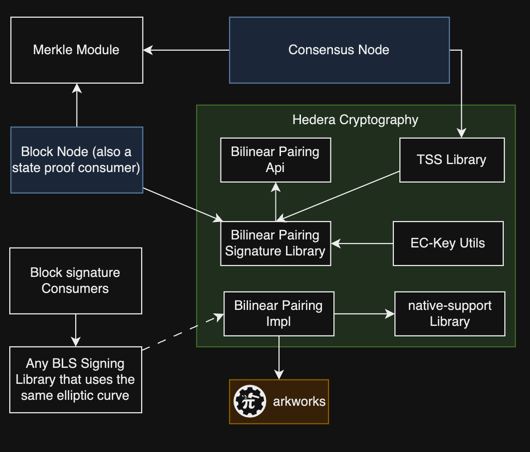
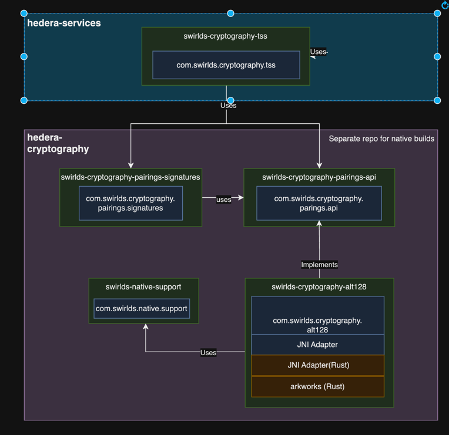

# Design proposal TSS Cryptography API

<!-- TOC -->
* [Design proposal TSS Cryptography API](#design-proposal-tss-cryptography-api)
  * [Introduction](#introduction)
  * [Glossary](#glossary)
  * [References](#references)
  * [Goals](#goals)
  * [Non-Goals](#non-goals)
  * [Architecture](#architecture)
    * [Module Organization and repositories](#module-organization-and-repositories)
  * [Library Specifications](#library-specifications)
    * [Swirlds Native support](#swirlds-native-support)
    * [Swirlds Cryptography Pairings Signature Library](#swirlds-cryptography-pairings-signature-library)
    * [Swirlds Threshold Signature Scheme (TSS) Library](#swirlds-threshold-signature-scheme-tss-library)
    * [Swirlds Cryptography Pairings API](#swirlds-cryptography-pairings-api)
  * [Testing and Validation](#testing-and-validation)
<!-- TOC -->

## Introduction
The overview of the process and background for TSS can be found [here](https://www.notion.so/swirldslabs/TSS-Threshold-Signature-Scheme-9e2676cc4f2a4650a8c0c33b774f3cf4).
This document shows the plan to create all necessary pieces to provide consensus node and the future block node  the functionality to sign and verify blocks using Threshold Signature Scheme (TSS) and EC Cryptography.

## Glossary

- **Shamir’s Secret Sharing**: In Shamir’s SS, a secret s is divided into n shares by a dealer and shares are sent to shareholders secretly. The secret s is shared among n shareholders in such a way that (a) with t or more than t shares can recover the secret, and (b) with fewer than t shares cannot obtain the secret. Shamir’s (t, n) SS is based on a linear polynomial and is unconditionally secure.
- **Groth 21**: A zero-knowledge proof system developed by Jens Groth in 2021. It is a non-interactive zero-knowledge (zk-SNARK) protocol, which allows one party (the prover) to convince another party (the verifier) that a statement is true without revealing any information beyond the validity of the statement itself.
- **ElGamal**: In 1985 ElGamal proposed a randomized signature scheme called ElGamal signature scheme. On a message and a random number chosen by a signer, ElGamal signature scheme produces a signature consisting of two numbers (r, s), where r is computed from a random number regardless of a message and then s is computed from a message, a signer's secret key, a chosen random number, and r.
- **EC ([Elliptic-Curves](https://crypto.stanford.edu/pbc/notes/elliptic))**: An elliptic curve is cloud of points in a field satisfying an equation . "Elliptic" is not elliptic in the sense of a "oval circle".
  "Curve" is also quite misleading if we're operating in the field Fp. The drawing that many pages show of a elliptic curve in R is not really what you need to think of when transforming that curve into Fp. Rather than a real "curve" (i.e. a not-straight line), it is more like a cloud of points in the field -- these points are not connected. Some elliptic curves are pairing friendly.
- **Bilineal Pairings**: Are mathematical functions used in cryptography to map two elements of different groups (in EC, the group is an elliptic curve) to a single value in other group in a way that preserves certain algebraic properties.
- **TSS (Threshold Signature Scheme)**: A threshold-based signing where a minimum number of parties (threshold) must collaborate to produce or verify a signature.
- **Fields**: Mathematical structures where addition, subtraction, multiplication, and division are defined and behave as expected (excluding division by zero).
- **Groups**: Sets equipped with an operation (like addition or multiplication) that satisfies certain conditions (closure, associativity, identity element, and inverses).
- **Share**: Represents a piece of the public/private necessary elements to create or verify a signature. To represent weight, any party can have more than 1 share.  Threshold number of shares are needed to accept a signature as valid.

## References
- https://andrea.corbellini.name/2015/05/17/elliptic-curve-cryptography-a-gentle-introduction/
- https://www.iacr.org/archive/asiacrypt2001/22480516.pdf
- https://hackmd.io/@benjaminion/bls12-381#Motivation
- https://www.johannes-bauer.com/compsci/ecc/

## Goals
- **Usability:** Design a user-friendly library that is easy to integrate into existing systems.
- **Security:** Our APIS should use audited code and be able to pass security audits both internal and external.
- **Flexibility**: Minimize the impact of introducing support for other elliptic curves. 
- **Independent Release:** Design release cycle independent components that can be used both in the consensus node and in the future block node.

## Non-Goals
- Build our oun cryptography library implementation that supports EC-curves from the gecko in java.

## Architecture
The components interacting in this design proposal:


1. **TSS Library**: Consensus node will use the TSS library to create shares, create TSS messages to send to other nodes, ensemble a shared public keys (ledgerId), and sign the block-node merkle tree hash.
2. **Bilinear Pairings Signature Library**: Provides cryptographic objects (PrivateKey, PublicKey and Signature) and operations for the block-node and consensus-node to sign and verify the signatures in the block. Consensus-node uses this library indirectly through the TSS Library. 
3. **Bilinear Pairings API**: Generalization to be included at compilation time providing the cryptography primitives and the arithmetic operations for working with a specific EC curve and the underlying Groups, Fields, Pairings.
4. **Bilinear Pairings Implementation**: Java underlying implementation of the previous API, that will be loaded at runtime using Java's SPI. Multiple implementations can be provided for supporting different type of curves. 
5. **Native Support Library**: Provides a set of generic functions loading native libraries in different system's architectures when packaged in a jar using a predefined organization, so they can be accessed with JNI.
6. **Arkworks Rust Library**: arkworks is a Rust ecosystem for zkSNARK programming. Libraries in the arkworks ecosystem provide efficient implementations of all components required to implement zkSNARK applications, from generic finite fields to R1CS constraints for common functionalities.
7. **EC-Key Utils**: Utility module to enable the node operator to generate pre-genesys initial public/private Key pair

## Module Organization and repositories

1. **hedera-cryptography**: This is a separate repository for hosting the cryptography related libraries. This repository is necessary as a mean of facilitating our build process that includes Rust libraries. Also provides independent release cycles between consensus node code and block node code.
2. **swirlds-native-support**: Gradle module that enables loading into memory compiled native libraries, so they can be used with JNI.
3. **swirlds-cryptography-tss**: Gradle module for the TSS Library. This library only client is consensus node, so will remain close to it in hedera-services repository under platform-sdk folder.
4. **swirlds-cryptography-signature-library**: Gradle module for the Bilinear Pairings Signature Library.
5. **swirlds-cryptography-pairings-api**: Gradle module for the Bilinear Pairings API. Minimizes the impact of adding or removing implementations.
6. **swirlds-cryptography-alt128**: Gradle module that will provide the implementation for the Bilinear Pairings API using alt-128 elliptic curve. That curve has been chosen in accordance to EVM support of it. Support for that curve will be provided by arkworks rust library. The module will include java code, and rust code that will be compiled for all possible system architectures, and distributed in a jar under a predefined structure. 


## Library Specifications

### Swirlds Native support
##### overview
Our implementation of the `swirlds-cryptography-pairings-api` will use native compiled libraries under the hood accessed with JNI.

There are two possible ways of making the library accessible to java code, so it can be accessed through JNI:
1. Make it available in the classpath: The library would need to be previously installed in the executing environment and reference its location in the classpath env variable.
2. Distribute it as an application dependency. The caveat here is that:

    a. The distributed library needs to be compiled in every possible architecture the application is going to be executed on.

    b. The library needs to be unpackaged from the jar as it cannot be accessed while its compressed.


Native support library will help the loading of the native library implementing option 2.
for this to work, the java native libraries needs to be included in the jar running the jni wrapping code under the following structure:

```
 native-library-client.jar
 |_WEB-INF
    |_arch64
      |_macos
        |_libhedera_bls_jni.dylib
    |amd64
      |_macos
        |_libhedera_bls_jni.dylib
      |_linux
        |_libhedera_bls_jni.so
      |_windows
        |_libhedera_bls_jni.dll
    |x-86
      |_linux
        |_libhedera_bls_jni.so
      |_windows
        |_libhedera_bls_jni.dll
  ...
```

lib folder is organized in subfolders by the platform identifier, as returned by `System.getProperty("os.arch")` and `System.getProperty("os.name")` 

##### Constraints
This module will not depend on hedera-services artifacts, so cannot include logging, metrics, configuration or any other helper module from that repo.

##### Public API
##### `LibraryDescriptionEntry`
**Description**: Given that the compilation of a native library produces files with different names under different os and architectures, we need a way to ensemble a catalog for all possible forms our library will take.

A record of 3 elements that defines the name of the binary file of the library to load in a specific system architectures and OS.

**Example**: 
```java
    new LibraryDescriptionEntry("macos", "aarch64", "libhedera_bls_jni.dylib");
```
##### `LibraryDescription`
**Description**: A description of the library in all possible systems.
```java
    static final LibraryDescription LIB_HEDERA_BLS = new LibraryDescription(new LibraryDescriptionEntry("macos", "aarch64", "libhedera_bls_jni.dylib"), new LibraryDescriptionEntry("linux", "amd64", "libhedera_bls_jni.so"), ...);
```
If the library name is the same for all system architectures with the only change of the extension one can configure:
```java
  //For any system architecture load libhedera_bls_jni.dylib, libhedera_bls_jni.so or libhedera_bls_jni.dll depending on the os  
  static final LibraryDescription LIB_HEDERA_BLS = new LibraryDescription("libhedera_bls_jni");
```


##### `LibraryLoader`
**Description**: Helper class that will load a library for the correct system:

```java
class AnySystemReferencedClass{
    static {
        LibraryLoader.load(LIB_HEDERA_BLS);
    }
}
```
if there is no description matching the current system architecture the method will fail with runtime exception.


### Swirlds Cryptography Pairings Signature Library
#### Overview
#### Public API
##### `SignatureSchema`
**Description**: A pairings signature scheme can be implemented with different types of curves and with different group configurations.
E.g: BLS_12_381 curve using Group1 of the Pairing for generating public key elements. A different result will be produced  if we configure 
the same curve but group 2 for public key elements.
##### `PairingPrivateKey`
**Description**: A private key generated using the pairings api 
##### `PairingPublicKey`
**Description**: A public key generated using the pairings api
##### `PairingSignature`
**Description**: A signature generated with the private key and that can be verified with the public key


#### Examples
##### Generating a SignatureSchema
```java
SignatureSchema signatureSchema = SignatureSchema.from(Curve.ALT_BN128, GroupAssignament.G1_PUBLIC_KEYS);
```

##### Generating a Private Key


```java
   import java.security.SecureRandom;

   PairingPrivateKey pk = PairingPrivateKey.create(signatureSchema, new SecureRandom());
   
```

##### Generating a Public Key
```java
   PairingPublicKey pbk = PairingPublicKey.create(pk);
   
```

##### Generating a Signature
```java
    byte[] message = new byte[]{};
    PairingSignature s = PairingSignature.sign(pk, message );
   
```
##### Verifying a Signature
```java
    s.verify(pbk, message);
```
#### Constraints
This module will not depend on hedera-services artifacts, so cannot include logging, metrics, configuration or any other helper module from that repo.
### Dependencies
swirlds-cryptography-pairings-API and runtime implementation
#### Other considerations
Analyzed the possibility of implementing [JCA](https://docs.oracle.com/en/java/javase/11/security/java-cryptography-architecture-jca-reference-guide.html#GUID-9A793484-AE6A-4513-A603-BFEAE887DD8B) (Java-Cryptography-architecture).
There were some unknowns that maybe are worth being investigated in a following task:
 * Should we parametrize the EC curve with: [`java.security.spec.EllipticCurve`](https://docs.oracle.com/javase/1.5.0/docs/api/java/security/spec/EllipticCurve.html)? Implications?
 * What is the serialization format supported by arkworks?  Raw Key Bytes are formated with PKCS#8 for private keys and X.509 for public keys. Should we define a custom format for bytes serialized with arkworks? Should we reformat? What do we do with our custom content.


### Swirlds Threshold Signature Scheme (TSS) Library
#### Overview
The goal of a threshold signature scheme is to enable a group of cooperating players to securely and efficiently perform signature generation while preserving security even in the presence of an adversary which can corrupt up to a threshold number of the players.
A threshold signature scheme can be designed by extending a signature scheme such that the output of the threshold signature scheme is the same as that of the signature scheme. 
In other words, the verification process should be the same regardless of whether it is a threshold signature scheme or an ordinary signature scheme.
This property is crucial to allow applications to use the same verification algorithm without incurring any additional implementation overhead.


#### Constraints
#### Public API
##### [`Tss`](tss-library%2FTss.java)
**Description**: Provides all necessary operations for 


#### Example

###### Get an concrete Tss Implementation out of a [SignatureSchema](#Swirlds-Cryptography-Pairings-Signature-Library)
```java
  Tss tssImpl = TSS.getFor(signatureSchema);
```

###### Creating TssShareClaims
```java
//Assuming NODE_0
int currentNodeIndex = NODE_0;

//Load the keys from disk:
PairingPrivateKey currentNodePrivateKey = Platform.loadECKeyFromDisk();
PairingPublicKey node1PbK = Platform.loadECPublicKeyFromDisk("NODE1");
PairingPublicKey node2PbK = Platform.loadECPublicKeyFromDisk("NODE2");

//Prepare meta info from address-book
TssShareClaims tssShareClaims =  tssImpl.getShareClaims(
        List.of(
                new ShareClaimInfo(NODE_0, PairingPublicKey.create(currentNodePrivateKey),50),
                new ShareClaimInfo(NODE_1, node1PbK,20),
                new ShareClaimInfo(NODE_2, node2PbK,30)
        ));
```
###### Generate Node's TssPrivateShare
```java
//Assuming NODE_0
TssShareId shareId = tssImpl.createShareId(currentNodeIndex) ;
TssPrivateShare privateShare = new TssPrivateShare(shareId, currentNodePrivateKey);
```

###### Generate TSSMessage
```java
int threshold = Platform.threshold(); //This is an external parameter
TssMessage message = tssImpl.generateTssMessage(RANDOM, tssShareClaims, privateShare,  threshold);
```

###### Processing TSSMessages
```java
//Once a list TSSMessages has been collected
List<TssMessage> messageList = Platform.collectTssMessages();
//Filter valid messages
List<TssMessages> validMessages = messageList.strem().filter(m-> m.verify(currentNodePublicKey, tssShareClaims)).toList();
//Getting private shares. Will return null if fail
List<TssPrivateShare> privateShares = tssImpl.decryptPrivateShares(currentNodeIndex, currentNodePrivateKey, tssShareClaims, threshold, validMessages);
//Process public shares. Will return null if fail
List<TssPublicShare> publicShares = tssShareClaims.claims()
        .stream()
        .map(claim -> tssImpl.computePublicShare(claim.shareId(), threshold, validMessages))
        .filter(Objects::nonNull)
        .toList();
```


###### Signing messages
```java
//for each private share of the node:
for (TssPrivateShare share : privateShares){ 
    TssSignature signature = share.sign(blockHash);
    Platform.send(signature);
}

//collect signatures
List<TssShareSignature> collectedSignatures = Platform.collectTssSignatures();
List<TssShareSignature> validSignatures = new ArrayList<>();
for (TssShareSignature signature : collectedSignatures){
    if(signature.signature().verifySignature(tssShareIdTssPublicShareMap.get(signature.shareId()).publicKey(),
blockHash)){
        validSignatures.add(signature);
            }
}
```
###### Aggregate Signatures
```java
//collect signatures
List<TssShareSignature> collectedSignatures = Platform.collectTssSignatures();
List<TssShareSignature> validSignatures = new ArrayList<>();
for (TssShareSignature signature : collectedSignatures){
    if(signature.signature().verifySignature(tssShareIdTssPublicShareMap.get(signature.shareId()).publicKey(),
blockHash)){
        validSignatures.add(signature);
            }
}

PairingSignature value = TssUtils.aggregateSignatures(validSignatures);
```


### Swirlds Cryptography Pairings API
##### Overview
This API will expose general arithmetic operations to work with Billinear Pairings and EC curves that implementations must provide.

#### Public API

##### `Curve`
**Description**: Represents the different types of elliptic curves. Implementations of this api should decide if they provide any, one or many curves.

**Link**: [Curve.java](pairings-api%2FCurve.java)

**Note**: This enum should list all possible types so changes in the implementation don't change the API, but as of now, the amount is limited.

##### `BilinearPairing`

**Description**: This class provides access to each of the groups (G₁, G₂) for a specific Pairing and the FiniteField associated with the curve.

**Link**:  [BilinearPairing.java](pairings-api%2FBilinearPairing.java)

##### `Field`
**Description**: This is a factory interface, responsible for creating FieldElement which are scalars belonging to the field represented by this instance.

**Link**: [Field.java](pairings-api%2FField.java)

##### `FieldElement`

**Description**: An interface representing an element within a field, providing methods for basic arithmetic operations.

**Link**: [FieldElement.java](pairings-api%2FFieldElement.java)

##### `Group`

**Description**: This class provides methods to obtain elements belonging to the group represented by the instance.

**Link**: [Group.java](pairings-api%2FGroup.java)

##### `GroupElement`

**Description**: An interface representing an element within a group, providing methods for basic group operations.

**Link**: [GroupElement.java](pairings-api%2FGroupElement.java)

##### `PairingResult`

**Description**: An interface representing the result of a pairing operation, with methods to compare it to other group elements.

**Link**: [PairingResult.java](pairings-api%2FPairingResult.java)


## Testing and Validation
Since cryptographic code is often difficult to test due to code complexity and lack of a test oracle, we should design our test cases based on cryptographic properties that these implementations should satisfy.

Questions:
 * What are those properties? 
 * what is the adversary model (e.g., honest-but-curious, halting or malicious; static or adaptive) for this solution? How to validate for that?

Some ideas:
* [Cryptographic-Algorithm-Validation-Program](https://csrc.nist.gov/CSRC/media//Projects/Cryptographic-Algorithm-Validation-Program/documents/dss/ECDSAVS.pdf):
* https://csrc.nist.gov/CSRC/media/Events/lightweight-cryptography-workshop-2019/documents/papers/systematic-testing-of-lightweight-crypto-lwc2019.pdf


* Generation of Private and Public Key Pairs: Tests the generation of key pairs for correctness by having the IUT produce 10 key
  pairs. The private key provided is used to compute the public key, Q’. The computed value Q’ is then compared to the supplied public key, Q.
* Public Key Validation: Generate 12 key pairs for each supported curve, modify some of the public keys to introduce errors, and determine whether or not can detect these errors.
* Signature Generation: 10 preconfigured known messages per curve supported are supplied. Generate a signature for each of the messages. The message, public key, and signature components are returned. 
The signatures are compared against previous know signature.
* Signature Verification: For each curve supported, 15 pseudorandom messages, a public key, Q, and a signature components (r, s) supplied, if some of the supplied values are modified so that signature verification should fail.


The proposal is to move forward with the implementation while at the same time create a work group to discuss and collect ideas for testing and validating this features.

### Unit Testing
Some of the components can be unit tested.
Limitations: native-support-library tests will need to be executed in different environments to provide a comprehensive code validation.


### Performance Testing
