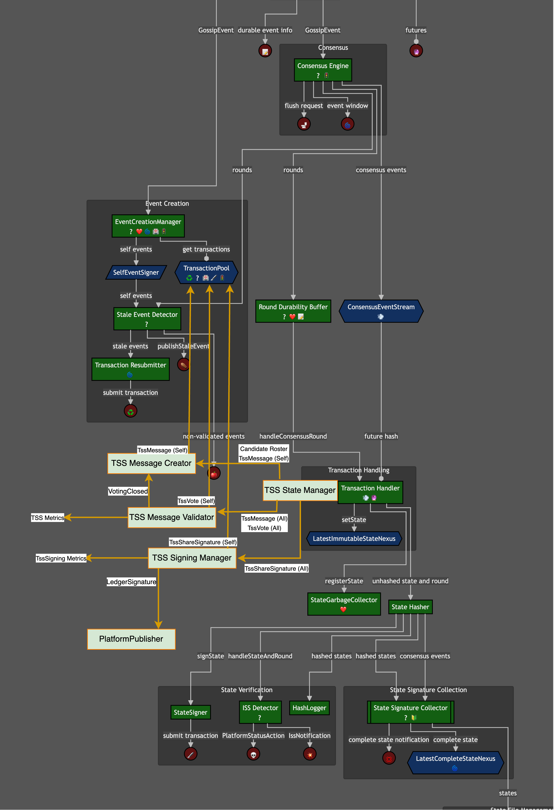

# TSS-Ledger-ID

---

## Summary

This proposal is for the integration of a threshold signature scheme into the consensus nodes to create a
private/public key pair for the ledger that can be used to sign blocks. The private key must be a secret that no one
knows. The public key is known by all and functions as the ledger id. The consensus nodes must be able to aggregate
their individual signatures on a message into a valid ledger signature that is verifiable by the ledger id. Part of our
goal is that users could write EVM smart contracts that can verify the block signatures.

| Metadata           | Entities                                   | 
|--------------------|--------------------------------------------|
| Designers          | Edward, Cody, Austin, Kore, Anthony, Artem |
| Functional Impacts | Services, DevOps                           |
| Related Proposals  | TSS-Library, TSS-Roster, TSS-Block-Signing |
| HIPS               | N/A                                        |

---

## Purpose and Context

The purpose of this proposal is to integrate a BLS based Threshold Signature Schemes (TSS) into consensus nodes to
give a network a ledger id and create a way of signing the root hash of blocks such that the signature can be
verified by the ledger id.

In this BLS based TSS, the network is assigned a durable BLS private/public key pair where the public key is the ledger
id and the private key is a secret that no one knows. Each node in the network is given a number of shares  
proportional to its signing weight. Each share is a BLS key on the same elliptic curve as the ledger key. When the
network needs to sign a block root hash, each node uses its shares to sign the block root hash and gossips the
signature out to the network. When a node has collected a threshold number of signatures on the same block root hash,
it can aggregate the signatures into a ledger signature that is verifiable by the ledger id.

The TSS effort has been broken down into four separate proposals: TSS-Library, TSS-Roster, TSS-Ledger-ID, and
TSS-Block-Signing.

1. The `TSS-Library` proposal contains the cryptographic primitives and algorithms needed to implement TSS.
2. The `TSS-Roster` proposal introduces the data structure of a consensus `Roster` to replace the platform's concept of
   an `AddressBook` and modifies the life-cycle for when the platform receives new consensus rosters.
3. This proposal (`TSS-Ledger-ID`) depends on the first two proposals and is for the integration of a threshold
   signature scheme into the consensus node, delivering the ability for the ledger to sign a message with the
   ledger private key.
4. The `TSS-Block-Signing` proposal is everything needed to support the signing of blocks and generation of block
   proofs.

This  `TSS-Ledger-ID` proposal covers changes to the following elements:

* The process of generating the ledger key pair for new networks and existing networks.
* The process of transferring the ability of the ledger to sign a message from one set of consensus nodes to another.
* The new state data structures needed to store TSS Key material and the ledger id.
* The new components needed in the framework to support creating and transferring the ledger key.
* The modified startup process to initialize the signing capability.
* For each node, the creation of a new Elliptic Curve (EC) key called its `elGamalKey` that is used in creating shares.

### Goals

The following capabilities are the goals of this proposal:

1. `TSS Bootstrap on Existing Network` - Able to setup an existing network with a ledger public/private key pair.
2. `TSS Bootstrap for New Network` - Able to setup a new network with a ledger public/private key pair.
3. `Keying The Next Roster` - Able to transfer the ability to sign a message with the ledger private key from one
   set of consensus nodes to another.
4. Testing of the TSS signing capability with verification by an EVM smart contract using the ALT_BN128
   [precompiles that are available in the EVM](https://github.com/ethereum/EIPs/blob/master/EIPS/eip-1829.md).

### Non-Goals

The following are not goals of this proposal:

1. Achieving a fully dynamic address book life-cycle.

### Dependencies, Interactions, and Implications

Dependencies on the TSS-Library

* At minimum, the top-level API in the TSS-Library is defined and can be mocked for initial development.
* The complete implementation of the TSS-Library is required for the TSS-Ledger-ID proposal to be fully implemented.
* Consensus nodes must have their `elGamelKey` generated with the private key stored on disk and the public key
  stored in the roster prior to the TSS-Ledger-ID proposal being delivered.

Dependencies on the TSS-Roster

* At minimum, the `Roster` API is defined with an AddressBook wrapper for initial development and testing.
* Delivery of TSS-Ledger-ID will require that the TSS-Roster proposal is delivered in a prior release.

Impacts of TSS-Ledger-ID to Services Team

* The timing of submitting the candidate roster may need to be adjusted to allow enough time for the candidate
  roster to have key material generated.
* Services will need to know or detect when the candidate roster fails to be adopted due to not having enough key
  material generated.
* The node's public `elGamalKey` will need to be added to the address book.
    * This requires modification of the HAPI transactions that manage the address book.

Impacts to DevOps Team

* Each consensus node will need a new `elGamalKey` in addition to the existing RSA key.
    * EC Key generation will have to happen before a node can join the network.
* A new node added to an existing network will need to be given a state from an existing node after the network has
  adopted the address book containing the new node.

Implications Of Completion

* The consensus nodes will be able to create ledger signatures for use in block proofs.
* TSS-Block-Signing proposal becomes unblocked for development.

### Requirements

TSS Core Requirements

| Requirement ID | Requirement Description                                                                                                                |
|----------------|----------------------------------------------------------------------------------------------------------------------------------------|
| TSS-001        | The ledger MUST have a public/private signing key pair that does not change when the consensus roster changes.                         |
| TSS-002        | The ledger private key MUST be a secret that nobody knows.                                                                             |
| TSS-003        | The `ledger id` MUST be a public key that everyone knows and able to verify signatures from the ledger private key.                    |
| TSS-004        | The ledger signature MUST be produced through aggregating signatures from consensus nodes representing more than 1/2 consensus weight. |
| TSS-005        | There MUST be a way to bootstrap an existing network's consensus roster with the ledger public/private signing key                     |
| TSS-006        | There MUST be a way for a new network to generate a public/private signing key for the ledger.                                         |
| TSS-007        | There MUST be a way to rotate the ledger's public/private signing key.                                                                 |
| TSS-008        | The ledger signature SHOULD be verifiable by an EVM smart contract without excessive gas cost.                                         |
| TSS-009        | The TSS implementation SHOULD be able to switch elliptic curves.                                                                       |
| TSS-010        | The TSS algorithm SHOULD be able to model consensus weight with high precision.                                                        |
| TSS-011        | Minimize the number of steps a Node Operator needs to perform.                                                                         |

Block Signing Requirements

| Requirement ID | Requirement Description                                                                 |
|----------------|-----------------------------------------------------------------------------------------|
| TSSBS-001      | The initial block in the block stream MUST be signed and verifiable with the ledger id. |
| TSSBS-002      | On a new network, the initial block MUST be block 0                                     |

### Design Decisions

#### New Address Book Life-Cycle

The TSS-Ledger-ID proposal modifies the address book and roster lifecycle presented in TSS-Roster as follows:

1. The `Roster` format does not change.
2. The app must set the `candidate roster` early enough to allow the nodes to generate the key material for the new
   roster before the software upgrade.
3. If the `candidate roster` does not have enough key material after a software upgrade, it will not replace the
   `active roster` and remain the candidate roster. The platform will continue to attempt to key the candidate
   roster after software upgrade.
4. The app must detect whether or not the `candidate roster` became the `active roster`.
    * If the `candidate roster` becomes the `active roster`, the app rotates the CAB to the AAB.
    * If the `candidate roster` does not become the `active roster`, the CAB remains the CAB and the old AAB remains
      the AAB after the software upgrade.

#### TSS Algorithm

The threshold signature scheme chosen for our implementation is detailed in [Non-interactive distributed key
generation and key resharing (Groth21)](https://eprint.iacr.org/2021/339). This scheme is able to meet the
core requirements listed above. The rest of this proposal details the design of how to implement this scheme in the
consensus nodes. See the TSS-Library proposal for more details on the Groth21.

The Groth21 algorithm uses [Shamir Secret Sharing](https://en.wikipedia.org/wiki/Shamir%27s_secret_sharing) to hide the
private key of the ledger and distribute shares of it so that a threshold number of node signatures on a message can
generate the ledger signature on the same message. The threshold should be high enough to ensure at least 1 honest
share is required to participate in the signing since a threshold number of shares can also collude to recover the
ledger private key, if they so choose.

The Groth21 algorithm requires specific Elliptic Curve (EC)s with the ability to produce bilinear pairings. Each
node will need its own long-term EC key pair, called an `elGamalKey`, on the curve for use in the groth21 TSS
algorithm. Each node receives some number of shares in proportion to the consensus weight assigned to it. Each share
is an EC key pair on the same curve. All public keys of the shares are known, and aggregating a threshold number of
share public keys will produce the ledger id. Only the node has access to the private key of its own shares. Each
node must keep their private keys to themselves since a threshold number of share private keys can aggregate to
recover the ledger private key. An aggregate number of signatures on the same message from the share private keys
will aggregate to recover the ledger signature on the message.

Transferring the ability to generate ledger signatures from one set of consensus nodes to another is done by having
each node generate a `TssMessage` for each share that fractures the share into a number of subshares or `shares of
shares`. Each `share of a share` is encrypted with the public key of the node in the next consensus roster that it
belongs to so that only the intended node can use the `share of a share` to recover that node's share's private key.
The collection of `TssMessages` generated from nodes in the previous consensus roster forms the `key material` for
the new consensus roster. To bootstrap a network and generate the ledger private and public keys, each node creates
a random share for themselves and generates a `TssMessage` containing `shares of shares` for the total number of shares
needed in the consensus roster. The use of random shares at the outset creates a random ledger private key that nobody
knows.

This process of keying the candidate roster during an address book change takes an asynchronous amount of time
through multiple rounds of consensus to complete. This requires saving incremental progress in the state to ensure
that the process can resume from any point if a node or the network restarts. Switching to the candidate roster must
not happen until enough nodes have voted that they have verified a threshold number of TssMessages from the active
roster. Verification succeeds when a node is able to recover the ledger id from the collected TssMessages. A vote
consists of a bit vector where each bit corresponds to a share id and is set to 1 if the share id's TssMessage was
valid and used in the recovery of the ledger id.

##### Elliptic Curve Decisions

Our first implementation of Groth21 will use the ALT_BN128 elliptic curve which has precompiles in the EVM.  
If the Ethereum ecosystem creates precompiles for BLS12_381, we may switch over to that more secure curve.

##### New Elliptic Curve Node Keys

Each node will need a new `elGamalKey` pair in addition to the existing RSA key pair. The `elGamalKey` pair will be
used in the Groth21 algorithm to generate and decrypt `TSS-Messages`. These new EC Keys will not be used for
signing messages, only for generating the shares. It is the share keys that are used to sign messages. The public
keys of the `elGamalKeys` must be in the address book.

##### Groth21 Drawbacks

The Groth21 algorithm is not able to model arbitrary precision proportions of weight assigned to nodes in the
network. For example if each node in a 4 node network received 1 share, then every share has a weight of 1/4.
If there are a total of N shares, then the distribution of weight can only be modeled in increments of (1/N) * total
weight. The cost of re-keying the network in an address book change is quadratic in the number of shares. (See the
picture of TssMessages above.) This forces us to pick a number of total shares with a max value in the thousands.
This modeling of weight uses small integer precision.

##### Calculating Number of Shares from Weight

Given that we have a low resolution for modeling weight, the number of shares assigned to each node will be
calculated as follows:

* Let `M` be the max number of shares that any node can have.
* Let `maxweight` be the max weight assigned to any node.
* Let `weight(node)` be the weight assigned to the node.
* Let `numShares(node)` be the number of shares assigned to the node.
* then `numShares(node) = ceiling(M * weight(node) / maxweight)` where the operations are floating point.

##### Threshold for recovery of Signatures and Ledger Id.

The network must be able to tolerate up to 1/3 of the stake assigned to malicious nodes. The threshold for recovery
of ledger signatures and the ledger id must be strictly greater than the following values:

1. `floor(TS/3)+N` where `TS` is the total number of shares and `N` is the number of nodes with shares. (malicious
   stake threshold)

The integer threshold we will use is `ceiling(TS /2)`.

##### TSS Algorithm - Alternatives Considered

The list of options considered here were based off of prototypes developed by [Rohit Sinha](https://github.com/rsinha),
the Swirlds Labs cryptography expert. The Groth21 algorithm was chosen because it was efficient for use in smart
contract verification, and we could assign a multiplicity of shares to nodes to get close enough in modeling the
distribution of weight between nodes.

| Requirement | hinTS | Groth21 |
|-------------|-------|---------|
| TSS-001     | Yes   | Yes     |
| TSS-002     | Yes   | Yes     |
| TSS-003     | Yes   | Yes     |
| TSS-004     | Yes   | Yes     |
| TSS-005     | Yes   | Yes     |
| TSS-006     | Yes   | Yes     |
| TSS-007     | Yes   | Yes     |
| TSS-008     | No    | Yes     |
| TSS-009     | Yes   | Yes     |
| TSS-010     | Yes   | No      |

###### hinTS

The hinTS algorithm is a threshold signature scheme that is able to measure double precision distributions of weight
across nodes. The complicating factor with hinTS is that during an address book change over, a recursive proof needs
to be constructed to prove that the new roster is a descendent of the original genesis roster. Validation of this
recursive proof proved too expensive for EVM smart contracts.

#### TSS Bootstrap Process

The TSS bootstrap process is the process of generating the ledger public/private key pair for a new network or an
existing network. There are several options to consider in the TSS bootstrap process:

1. Do we allow block number and round number to be out of sync?
2. Do we need the initial block produced to be signed by the ledger id?
3. For new networks, do we need to produce a signed block 0?
4. For existing networks, does the TSS bootstrap roster sign blocks prior to its existence?

##### For New Networks

There will be a pre-genesis phase where the genesis roster is keyed and a random ledger id is created. This will
happen through running the platform without application transactions. After the platform keys the roster, the
platform restarts itself with a copy of the genesis state and adding to it the TSS key material and ledger
id. After platform restart, application transactions are accepted and the platform starts building the new hashgraph
from round 0. This process ensures that block 0 containing application transactions is signed by the ledger and
verifiable with the ledger id.

While this solution does not have the history of setting up the ledger id in the hashgraph after platform restart,
the nodes can cryptographically verify that the setup process took place correctly through using the TSS key material to
re-derive the ledger id. Each node can validate the TssMessages have come from a sufficient variety of nodes. With
the assumption that no greater than 1/3 of the nodes are malicious, the threshold of 1/2 ensures that the malicious
nodes will not be able to recover the ledger id if they collude together.
nodes will not be able to recover the ledger id if they collude together.

The process of the platform restarting itself after performing a pre-genesis keying phase is new startup logic.  
This should not involve an interruption of the containing process. While we are in the pre-genesis phase the
platform will not accept application transactions. Once the platform has restarted itself with a keyed roster, it
will accept application transactions when it becomes active.

##### For Existing Networks

Given the requirement of TSSBS-001, the setup of the TSS Key Material must happen before the software upgrade that
enables block streams. In order to reduce risk and density of complex software changes, giving the nodes
their `elGamalKeys` and changing the roster life-cycle through the TSS-Roster effort should be completed and
delivered in a software release prior to the delivery.

The schedule of delivery of capability is explored in a later section in this proposal.

The setup of the bootstrap key material will be observable in the record stream prior to the Block Streams going live,
but this observability is not consequential. What matters is the cryptographic verification that the TSS
material can generate the ledger key.

##### TSS Bootstrap Process - Alternatives Considered

| N | Option                                                                                                        | 1-1 round to block                   | round # == block #                                   | Ledger signs initial block           | Ledger signs block 0                 | TSS keying in hashgraph history      | TSS keying in block history          | Minimal DevOps Impact                | Implementation Complexity                 | Notes                                                                              |
|---|---------------------------------------------------------------------------------------------------------------|--------------------------------------|------------------------------------------------------|--------------------------------------|--------------------------------------|--------------------------------------|--------------------------------------|--------------------------------------|-------------------------------------------|------------------------------------------------------------------------------------|
| 1 | TSS Setup in block history, initial block > 0 and not signed                                                  | YES | YES                 | NO    | NO    | YES | YES | YES | LOW      | Mainnet if Block Streams ships before Block Proofs                                 |
| 2 | TSS Setup not in block history, initial block > 0 and is signed                                               | YES | YES                 | YES | NO    | YES | NO    | YES | LOW      | Mainnet if Block Streams ships with Block Proofs                                   |
| 3 | TSS Setup not in block history, initial block == 0 and is signed                                              | YES |  NO, fixed offset | YES | NO    | YES | NO    | YES | LOW-MED | Cognitive burden to reason about block # and round # discrepancy.                  |
| 4 | TSS Setup in block history, initial block > 0, covers all prior rounds, and is signed                         | NO    | YES                 | YES | NO    | YES | YES | YES | MED     |                                                                                    |
| 5 | TSS Setup in block history, initial block == 0, covers all prior rounds, and is signed                        | NO    |  NO, fixed offset | YES | NO    | YES | YES | YES | MED     | Cognitive burden to reason about block # and round # discrepancy.                  |
| 6 | Retrospectively sign the initial blocks with TSS once it becomes available.                                   | YES | YES                 | YES | YES | YES | YES | YES | HIGH       | TSS Genesis Roster signs older blocks.  This is compatible with all other options. |
| 7 | Pre-Genesis: Separate app with genesis roster creates key material in state before network officially starts. | YES | YES                 | YES | YES | NO    | NO    | NO    | HIGH       | Applies to new networks only.  Use Option 1 or 2 for existing networks.            |
| 8 | Instead of separate app, detect genesis, key the state, network restart from round 0 with keyed state.        | YES | YES                 | YES | YES | NO    | NO    | YES | HIGH       | Applies to new networks only.  Use Option 1 or 2 for existing networks.            | 

Option 2 was chosen for existing networks and Option 8 was selected for new networks. This decision was made to
ensure that the first block in the block stream is signed by the ledger and that new networks always have block 0
signed.

---

## Changes

The changes are presented in the following order:

1. Public API
2. Core Behaviors
3. Component Architecture
4. Configuration
5. Metrics
6. Performance

### Public API

The public API changes consist of the following:

* The Ledger Signature API
* System Transactions
* State Data Structures

#### Ledger Signature API

The Ledger Signature API is the interface between the application and the platform by which the application submits
a message to be signed by the ledger, the nodes sign the message with their shares, and the platform aggregates the
signatures into a ledger signature. The ledger signature is then asynchronously returned to the application.

To request a ledger signature, the application invokes a new method on the `State`:

* `State::sign(byte[] message) throws NotReadyException`

To receive a ledger signature, the application registers a callback with the platform builder:

TODO: Move signing API to TSS-Block-Signing proposal.

* `PlatformBuilder::withLedgerSignatureCallback(Consumer<PairingSignature> ledgerSignatureConsumer)`

#### System Transactions

The following are new system transactions needed to key rosters and generate ledger signatures.

##### TssMessage System Transaction

TODO: Protobuf of data

##### TssVote System Transaction

TODO: Protobuf of data

##### TssShareSignature System Transaction

TODO: Protobuf of data

#### State Datastructures

The state needs to store the relevant ledger id, consensus rosters, key material, and partially constructed ledger
signatures.

##### Ledger Id

The `ledgerId` is the public ledger key able to verify ledger signatures. It is used by both the application and the
platform. This value should not change during address book changes and its value does not change unless the network
goes through a another TSS bootstrap process. Since its value is not expected to change, storing it in a singleton
Merkle Leaf by itself is appropriate.

TODO: Protobuf of data

##### Consensus Rosters

This proposal extends the roster data format where each `RosterEntry` has a new `elGamalKey` called a
`tssEcKey` that is used in the Groth21 algorithm.

TODO: Protobuf of data

##### Key Material (TSS Data Map)

The TSS Data Map is a combined map of all the key material for all rosters that are
tracked and the votes by nodes that have validated the key material.

TODO:  Separate the maps since the state API can handle them separate.

Keys in the TSS Data Map have the following structure: (KeyType, RosterHash, SequenceNumber).

1. KeyType - An enum that is one of TSS_MESSAGE or TSS_VOTE.
2. RosterHash - The hash of the consensus roster that the message or vote is related to.
3. SequenceNumber - The order in which the message or vote came to consensus.

The value associated with a TSS_MESSAGE key is the pair (ShareId, TssMessage)

1. ShareId - The id of the share that the message is related to.
2. TssMessage - the raw bytes of the TssMessage

TODO: protobuf for TssMessage (modify the TSS-Library proposal)

The value associated with a TSS_VOTE key is a bit vector with the following interpretation

* The order of bits from the least significant bit to the most significant bit corresponds to the numeric order of
  share ids from least to greatest.
* If a bit is set to 1, then the TssMessage for the corresponding ShareId was valid and contributed to a successful
  reconstruction of the ledger id.
* If a bit is set to 0, then the TssMessage for the corresponding ShareId was either invalid, was not received, or
  was not used in the reconstruction of the ledger id.
* If the sum of the bits is greater than the threshold, then the vote is a yes vote in favor of adopting the
  candidate roster.

TODO: protobuf for TssVote

Lifecycle Invariants

1. Inserts should only be made for candidate rosters that are going through the keying process.
2. When a roster is no longer stored in the state, the corresponding key material should be removed.
3. Every roster that has become active after the TSS bootstrap process must have sufficient key material to be
   able to recover the ledger id.

TODO: Protobuf of data

##### Partial Ledger Signatures

For a configured number of rounds, share signatures on a message are stored in the state until a threshold number of
them have been collected to produce the ledger id. Each time a signature on a message is added to the collection,
the round counter resets. Once the ledger id is produced, it is stored with the other signatures and no new
signatures are added to the collection. Once a configured number of rounds have passed after the last signature
added to a collection for a message, the signatures are removed from the state.

The partial ledger signatures are stored in a Map Merkle Leaf where the keys are the message hash and the values are
a tuple (List<ShareSignature>, LedgerSignature, lastRoundUpdated).

TODO: Protobuf of data

### Core Behaviors

The new behavior is related to the bootstrap process of creating the ledger id, transferring the ability to sign
messages from one roster to the next roster, and creating ledger signatures.

#### TSS Bootstrap for New Networks

At the start of a new network there will be a new pre-genesis phase to generate the key material for the genesis
roster and then restart the network from round 0 with the new key material and ledger id.

The following startup sequence is modified from existing practices.

1. Inversion of Control - The app hands a genesis state, genesis roster, and private keys to the platform.
2. The platform copies the genesis state and starts gossiping with peers without accepting user transactions.
3. The platform automatically begins to key the genesis roster with a ledger id.
4. Once the ledger id is created and a threshold number of nodes have voted to being ready to restart, the platform
   updates the state with the key material and ledger id and restarts from round 0.
5. Any nodes which failed to produce the key material for themselves will need to receive the key material through a
   reconnect.

#### TSS Bootstrap for Existing Networks

Prior to the release that enables the TSS bootstrap process for existing networks the following must have been  
delivered in a prior releases:

1. Each node must have their long term EC keys.
2. The TSS-Roster proposal must have been delivered to introduce the new candidate roster lifecycle.

On software upgrade with the first release that contains the code to perform the TSS bootstrap process:

1. Business as usual until the candidate roster is set.
2. Once set, the candidate roster has TSS key material generated for it from random shares that are generated for
   the existing roster, 1 share per node. This creates a random ledger id.
3. On the next software upgrade the candidate roster will be adopted and the ability to sign messages with the ledger
   private key will become active.

If the TSS-Ledger-ID is delivered in release N, then the TSS-Roster proposal and long term EC keys should be
delivered in release N-1. The ability to sign messages with the ledger private key will be active in release N+1.

#### Keying The Next Roster

Once a candidate roster is set, the platform goes through a process of keying the next roster and votes when it is
ready to restart and adopt the new roster.

#### Ledger Signing API

After the network has been upgraded with the TSS-Ledger-ID proposal, on the next software upgrade the platform will
be able to sign messages with the ledger private key. Ledger signatures take multiple rounds of consensus to
produce and are generated asynchronously through the `PlatformPublisher`. The App must register a consumer with
the platform to receive the ledger signatures when they are produced.

### Component Architecture

The following are new components or entities in the system:

1. RosterInitializer (Not Wired)
2. TSS State Manager (Not Wired)
3. TSS Message Creator (Wired)
4. TSS Message Validator (Wired)
5. TSS Signing Manager (Wired)

TODO: Move the Signing Manager to the TSS-Block-Signing proposal.

#### RosterInitializer

On software upgrade, the `RosterInitializer` is responsible for checking that there is enough key material for a
candidate roster to be adopted as the active roster. If there is not enough key material, the candidate roster is
not adopted and the active roster remains the active roster. If there is enough key material, the candidate roster
is adopted as the active roster and the active roster becomes the previous roster.

A roster rotation must be recorded in the state before the rest of the platform uses the state.

#### TSS State Manager

The TSS state manager is executed on the transaction handling thread and is capable of reading and writing the state
during round handling. The logic will be encapsulated in a class with a well-defined API, but this will not be a
full-fledged wiring component outside the consensus round handler.

Responsibilities:

1. Handle `TssMessage` system transactions
    - handled in consensus order
    - insert into the TSS data map if it is legal to do so
        - don’t insert multiple messages for the same node
        - don’t insert any messages if voting window has closed
    - if inserted into the TSS data map, ensure that the message is forwarded to the TSS Message Validator
    - if it is a self TSS message, forward the message to the TSS Message creator.
2. Handle `TssVote` system transactions
    - handled in consensus order
    - insert into TSS data map if it is legal to do so
        - don’t insert multiple votes for the same node
        - don’t insert once voting is closed
    - after insertion, re-tally votes and decide if voting is now closed
    - if voting is closed as the result of a new vote,
        - if the “no” votes win, then the candidate roster will never be adopted
        - if the “yes” votes win, the candidate roster is now officially confirmed, and will be adopted at the next
          upgrade boundary
3. When a new candidate roster is set.
    - inform the TSS message creator that there is a new candidate roster
    - inform the TSS message validator that there is a new candidate roster
4. Update Metrics
    - indicate whether there is a candidate roster
    - the current number of TSS messages collected for the candidate roster
    - the current number of votes collected for the candidate roster
        - keep different metrics both for “no” votes and “yes” votes
5. On First Round After Restart (After PCES Replay and Reconnect)
    - if there is no candidate roster, take no action
    - if voting is closed, take no action
    - if this node’s TSSMessages are not recorded in the TSSData map, send a message to the TSS message creator (so
      it can resubmit the node’s TSS message)
    - if this node’s vote is not recorded in the TSS data map, inform the TSS message validator that we still need to do
      validation.

#### TSS Message Creator

The TSS message creator is responsible for generating a node’s TSSMessages. This runs as its own asynchronous thread
since this may be a computationally expensive operation.

Internal Elements:

1. TSS Message Manager
2. active roster field
3. candidate roster field

Inputs:

1. Active Roster (Constructor)
2. Candidate Roster (Wire)
3. Self TSS Message (Wire)
4. Voting Closed Notification (Wire)

Input Invariants:

1. Self TSS Messages must be received after the candidate roster is set.
2. The candidate roster is not set if the voting is already closed.

`On Active Roster`:

1. Set this roster as the active roster.
    1. If the candidate roster is set and the candidate roster is not the active roster, then (re)start the TSS Message
       Manager with the active roster and candidate roster.
    2. If the candidate roster is set and the candidate roster is the active roster, then clear the candidate roster,
       clear the TTS Message List, and stop the TSS Message Manager

`On Candidate Roster`:

1. If the internal candidate roster is set and equal to the input candidate roster, do nothing.
2. else, set the internal candidate roster.
3. if the active roster is set, (re)start the TSS Message Manager with the active roster and candidate roster.

`On Self TSS Message`:

1. If the TSS Message Manager is active, forward the message to the TSS Message Manager.
2. else log an error indicating that the TSS Message was received before the candidate roster was set.

`On Voting Closed Notification`:

1. Stop the TSS Message Manager.

##### TSS Message Manager

1. Keep a list of Self TSS Messages that have been received.
2. `On Start`:
    1. Wait the configured time period to receive any previously sent Self TSS Messages (relevant for restarts)
    2. For each share assigned to this node in the active roster that we do not have a Self TSS message for, generate a
       TSS Message from the share for the candidate roster and submit a signed system transaction with the TSS Message.
    3. If a TSS Message does not come back through consensus within a configured time period, resubmit the TSS Message.

3. `On TSS Message`:
    1. verify the signature on the self TSS Message, log an error if the signature is invalid.
    2. stop resending the TSS Message that matches the one we received and added to the internal list.

#### TSS Message Validator

The TSS message validator is responsible for validating TSS messages and for submitting votes as to the validity of the
candidate roster. The TSS message validator gets its input from the TSS state manager in the form of a candidate roster
that we want to adopt, and as a sequence of TSS messages that have reached consensus.

Internal Elements:

1. active roster field
2. candidate roster field
3. TSS Messages List
4. TSS Vote List

Inputs:

1. Active Roster (Constructor)
2. Candidate Roster (Wire)
3. TSS Message List and TSS Vote List (Constructor)
4. TSS Message (Wire)
5. TSS Vote (Wire)

Input Invariants

1. Existing messages and votes in state are loaded via constructor.
2. TSS Messages for the candidate roster must be received after the candidate roster is set.
3. TSS Votes for the candidate roster must be received after the candidate roster is set.
4. The TSS Message must exist before for its TSS Vote is received.

`On Candidate Roster`:

1. If the input candidate roster is equal to the active roster, do nothing.
2. If the input candidate roster is equal to the internal candidate roster, do nothing.
3. Set the internal candidate roster, clear the TSS Message List.

`On TSS Message`:

1. If the vote bit vector is passing for a yes vote, do nothing.
2. If the vote bit vector has already recorded a yes or no for the share in the TSS Message, report duplicate in
   metrics, do nothing else.
3. append the TSS Message to the TSS Message List.
4. If the active and candidate rosters are set, validate the TSS Message List
5. If the TSS Message List is able to recover the Ledger Id, send vote vector indicating which TSS Messages were used.

`On TSS Vote`:

1. If voting is closed or the vote is a duplicate of an existing vote, do nothing.
2. Add the vote to the total and check if the threshold is met.
3. If the threshold is met, send the voting closed notification to the TSS Message Creator.

##### Validate TSS Message List

1. For the votes already cast in the vote vector
    1. sum all the yes votes into a total count.
    2. If the count is greater than or equal to the threshold in the candidate roster, do nothing and return.
2. For each TSS message in the TSS Message list
    1. If the TSS Message has a yes entry in the vote vector, do nothing.
    2. otherwise, validate the message.
    3. If the message is valid, update the vote vector and increment the count of yes votes.
    4. If the count of yes votes is greater than or equal to the threshold in the candidate roster, then send the
       vote vector as a system transaction and exit the validation process.

#### TSS Signing Manager

The TSS Signing Manager is responsible for computing a node's private shares from the TSS Messages and for
generating ledger signatures by submitting a node's share signature to be gossiped to the rest of the network and
accumulating a threshold number of share signatures to recover the ledger signatures. Each recovered ledger
signature is published to interested parties through the `PlatformPublisher`.

Public API:

1. State API: void sign(byte[] message) throws NotReadyException
2. `PlatformPublisher` provides a consumer for ledger signatures

Internal Elements:

1. Map<RosterHash, Roster> rosters
2. Map<RosterHash, List<TssMessage>> tssMessages
3. Map<RosterHash, Pair<List<Private Share Keys>, List<Public Share Keys>>> shares
4. Map<MessageHash, RosterHash> messageRosterMap
5. Map<MessageHash, List<PairingSignature>> messageSignatures
6. activeRosterHash
7. current round

Inputs:

1. Rosters in state (Constructor)
2. TssMessages in state (Constructor)
3. Active Roster (Constructor)
4. Share Signatures in state (Constructor)
5. TssShareSignature (Wire)
6. message (Wire)
7. EventWindow (Wire)

Input Invariants:

1. TssShareSignature received must be for previous signMessage(byte[] message) calls.

`On Message`:

1. Use the private shares of the active roster to create TssShareSignatures from the node and gossip them out.
2. Construct an empy list of PairingSignatures for the message.

`On TssShareSignature`:

1. get the hash of the message the signature is for.
2. get the roster that signed the message.
3. validate the share signature
4. Add the signature to the collection for the message.
5. If a threshold number have been collected, compute the ledger signature and publish it on the output wire.

`On EventWindow`:

1. Update the current round.
2. cleanup the message signatures for any collections that are older than the configured number of rounds.

### Configuration

The following are new configuration:

1. `tss.maxSharesPerNode` - The maximum number of shares that can be assigned to a node.
2. `tss.signatureRounds` - The number of rounds that share signatures are kept in the state before being removed.
3. `tss.tssMessageTimeout` - The time period that a TSS Message is resent if it is not confirmed by consensus.

### Metrics

The following metrics should be added to the platform:

1. When a candidate roster is set.
2. The number of TSS Messages collected for a candidate roster.
3. The number of votes collected for a candidate roster.
4. The time it takes to generate a ledger signature.
5. The time it takes to compute shares from the key material.
6. The number of TSS Messages that are resubmitted.

### Performance

The `TSS State Manager` routes TSS related system transactions to the relevant components and updates the TSS
related data structures in the state. The routing should be a negligible impact provided the receiving components
receive the messages and handles them on their own thread. The state updates should be simple crud operations,
adds and deletes to data structures. The merkle leaves with updated state will need to be rehashed.

---

## Test Plan

### Unit Tests

Apart from the obvious unit testing of methods and classes, the following scenarios should be unit tested:

* Failure Scenarios
    * Bad TssMessages
    * Failure to reach threshold number of votes
    * Bad TssShareSignatures
* Turtle Tests
    * Reconnect
    * Down nodes during bootstrap and re-keying
    * Multi-release migration
    * Signing API, constructing signatures across software upgrade.

### Integration Tests

If Turtle is not available, then the turtle tests will become integration tests.

Additional Integration Tests:

* TSS bootstrap for New Networks
* TSS bootstrap for Existing Networks
    * multiple software upgrades.

### Performance Tests

The following need performance profiles:

1. How long does it take to generate the key material for a new candidate roster as a function of roster size?
2. How long does it take to generate the ledger signatures?
3. How much space is being used in the state for all TSS related data structures?

---

## Implementation and Delivery Plan

How should the proposal be implemented? Is there a necessary order to implementation? What are the stages or phases
needed for the delivery of capabilities? What configuration flags will be used to manage deployment of capability?

---

## Open Questions

1. De we need to complete ledger signature collection before freeze and restart?