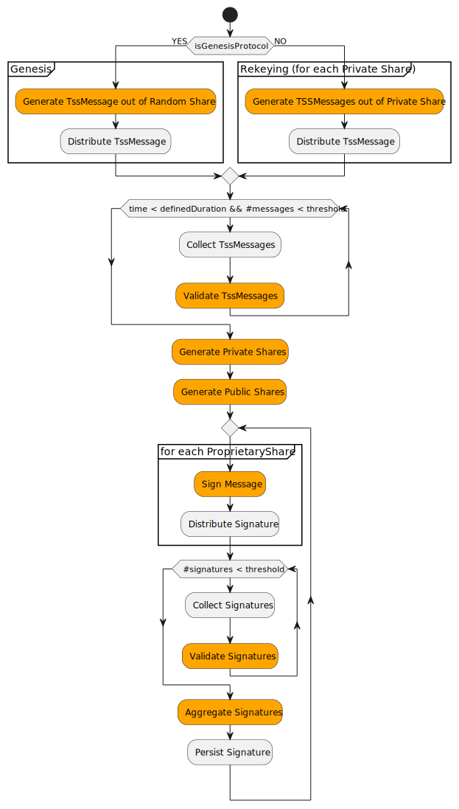

# TSS-Library

## Summary

Provide necessary components for signing messages using a TSS scheme.

|      Metadata      |                        Entities                        |
|--------------------|--------------------------------------------------------|
| Designers          | Austin, Cody, Edward, Rohit, Maxi, <br/> Platform team |
| Functional Impacts | Platform team. Release engineering. DevOps             |
| Related Proposals  | TSS-Roster, TSS-Ledger-Id                              |
| Version            | 2                                                      |

## Purpose and Context

A threshold signature scheme (TSS) aims to enable a threshold number of participants (shareholders) to securely and efficiently generate succinct aggregate signatures.
In our TSS implementation, a static public key should be produced that doesn't change even when the number of participants in the scheme varies,
and it can be used to verify the aggregate of a set of partial signatures produced by a threshold number of private shares.

This is important for producing proofs that are easily consumable and verifiable by external entities.

This proposal covers the implementation of all necessary components to provide the consensus node and future library users with
the functionality to sign and verify blocks using a Threshold Signature Scheme (TSS) and EC Cryptography.

The related proposal, TSS-Ledger-Id, provides an overview of the process and background for TSS and how it impacts the platform’s functionality.

This proposal assumes no relation with the platform and defines a generic component that any consumer can integrate.
It only assumes that there exists a channel to connect participants, where the identity of the message sender has been previously validated.

The process of sending messages through that channel and receiving the responses is outside the scope of this proposal.
Additionally, participants will need access to each other's public key. While the generation of the public/private keys is included in this proposal,
the distribution aspect, the loading, and the in-memory interpretation from each participant are outside the scope of this proposal.

### Glossary

- **TSS (Threshold Signature Scheme)**: A cryptographic signing scheme in which a minimum number of parties (reconstruction threshold) must collaborate
  to produce an aggregate signature that can be used to sign messages and an aggregate public key that can be used to verify that signature.
- **Groth 21**: Publicly verifiable secret sharing and resharing schemes that enable secure and efficient distribution and management of secret shares,
  with many possible use cases supporting applications in distributed key generation and threshold signatures.
  Uses Shamir's secret sharing, ElGamal, and Zero-Knowledge Proofs.
- **Distribute key generation**: Aims to solve the problem of getting n parties able to cryptographically sign and verify signatures in the presence of some corruption threshold in a decentralized network.
  To do so, this algorithm generates a public key and a private key. The private key is distributed as key-splits (shares) such that no single party knows the private key.
- **Shamir’s Secret Sharing**: In Shamir’s SS, a secret `s` is divided into `n` shares by a dealer, and shares are sent to shareholders secretly.
  The secret `s` is shared among `n` shareholders in such a way that:
  (a) any party with at least `t` shares can recover the secret, and (b) any party with fewer than `t` shares cannot obtain the secret.
- **ElGamal**: On a message, the ElGamal signature scheme produces a signature consisting of two elements `(r, s)`, where `r` is a random number, and `s` is computed from the message, a signer's secret key, and `r`.
- **SNARK**: A proof system for proving arbitrary statements (circuits / programs).
- **Zero-Knowledge Proofs**: A proof system where one can prove possession of certain information, e.g., a secret key, without revealing that information or any interaction between the prover and verifier.
- **NIZK**: A non-interactive zero-knowledge proof for an statement. In TSS we use NIZK proofs for encoding the correctness of the secret sharing.
- **EC (Elliptic Curve)**: `Elliptic` is not elliptic in the sense of an `oval circle`. In the field `Fp`, an `EC` is like a non-connected cloud of points where
  all points satisfy an equation, and all operations are performed modulo `p`. Some elliptic curves are pairing-friendly.
- **Bilinear Pairings**: These are mathematical functions used in cryptography to map two elements of different groups (in EC, the group is an elliptic curve) to a single value in another group
  in a way that preserves specific algebraic properties.
- **Fields**: Mathematical structures where addition, subtraction, multiplication, and division are defined and behave as expected (excluding division by zero).
- **Groups**: Sets equipped with an operation (like addition or multiplication) that satisfies certain conditions (closure, associativity, identity element, and inverses).
- **Share**: Represents a piece of the necessary public/private elements to create signatures. In TSS,
  a threshold number of shares is needed to produce an aggregate signature that the ledger public key can later verify.
- **Polynomial Commitment**: A process that enables evaluations of a polynomial at specific points to be verified without revealing the entire polynomial.
- **Participant**: Any party involved in the distributed key generation protocol.
- **Participant Directory**: An address book of participants of the distributed key generation protocol.

### Goals

- **Usability**: Design user-friendly libraries with a public API that are easy to integrate with other projects, such as consensus node and other library users.
- **EVM support**: Generated signature and public keys should be compatible with EVM precompiled functions
  so that signature validation can be done on smart contracts without incurring an excessive gas cost.
- **Security**: Our produced code should be able to pass internal and external security audits.
- **Flexibility**: Minimize the impact of introducing support for other elliptic curves.
- **Independent Release**: When applicable, the new libraries should have the release cycle separate from the platform.
  They should be implemented in a way that is easy for both platform and block node to depend on.

### Non-Goals

- Implement support for elliptic curve cryptography in Java.
- Support any system/architecture other than: Windows amd64, Linux amd64 and arm64, and MacOS amd64 and arm64.
- Creation of the building artifacts and plugins for rust code.
- This proposal covers the implementation of a tool similar to ssh-keygen to generate those keys, but the generation, persistence, distribution
  and loading of those keys is outside the scope of this proposal.

## Changes

### Core Behaviors

The proposed TSS solution is based on Groth21.

Groth21 is a non-interactive, publicly verifiable secret-sharing scheme where a dealer can construct a Shamir secret sharing of a field element
and confidentially yet verifiably distribute shares to multiple receivers.
It includes a distributed resharing protocol that preserves the public key but creates a fresh secret sharing of the secret key and hands it to a set of receivers,
which may or may not overlap with the original set of shareholders.

#### Overview

Participants can hold one or more shares, each of which can be used to sign a message.
The goal is to generate an aggregate signature which is valid if a threshold number of individual signatures are combined.

Each participant brings their own Elliptic Curve (EC) key pair (private and public). They share their public keys with all other participants while securing their private keys.
Before the protocol begins, all participants agree on the cryptographic parameters (type of curve and what group of the pairing will be used for public keys and signatures).
When the protocol is initialized, a participant directory is built. This directory includes the number of participants, each participant’s EC public key, and the shares they own.

Each participant generates portions of a secret share and distributes them among the other participants using the following process:

1. A random private key is created and mathematically split into a known number of total shares.
   * Using Shamir's Secret Sharing and interpolation polynomials.
2. Each portion is encrypted with the share owner's public key, ensuring only the intended recipient can read it.
3. A message is created that includes all encrypted values so that only the intended recipients can decrypt their respective portions of the secret share.

(e.g.: for a directory of 10 participants and 10 shares distributing 1 share each with a threshold value of 6, Participant 1 will generate a message out of a random key,
that will contain 10 portions of that key, each one encrypted under each participants' public key)
This setup allows participants to share secret information securely. The message also contains additional information necessary for its validation (Such as a polynomial commitment and a NIZK proof).

Upon receiving a threshold number of messages, each participant:

1. Validates the message and decrypts the information encrypted with their public key.
2. Aggregates the decrypted information to generate a private key for each owned share.
3. Retrieves a public key for each share in the system to validate signatures.

(e.g.: for a directory of 5 participants and 10 shares with a threshold value of 6 where Participant 1 has 2 shares;
Participant 1 will collect at least 6 valid messages from all participants, take the first and second portions of each message, decrypt and aggregate them respectively, so they become the first and second owned secret share )

Individual signing can then begin. Participants use the private information of their shares to sign messages.

An aggregate signature is created when signatures from at least the threshold number of parties are combined. This aggregate signature can be validated using the combined value of the public shares in the directory.

The process restarts whenever the number of participants or the shares assigned to each change. However, the initially generated group public key remains unchanged to maintain consistency.
New secret information for shares is created using existing data, ensuring the aggregate signature can still be verified with the original group public key.

#### Implementation details

Before starting, all participants should agree on a `SignatureSchema` they will use.
The `SignatureSchema` defines the type of Curve and which Group of the Pairing is used for PublicKey Generation.

##### Input

* Participant's persistent EC Private key (Private to each participant)
* Number of participants (Public)
* Number of shares per participant (Public)
* A threshold value
* All participants' persistent EC public keys (Public)
* A predefined `SignatureSchema` (Public / Constant for all the network)

```
`Share`: An abstract concept having a unique identifier and an owner
|-  `PrivateShare`: Represents a share owned by the executor of the scheme. Contains a secret value (EC Private key) used for signing.
|-  `PublicShare`: Represents a share in the system. It contains public information that can be used to validate each signatures.
```

##### Bootstrap Stage

Given

A participants directory:

```
e.g:
P   # shares
-----------------------------
P₁  5        P₁_EC_PublicKey
P₂  2        P₂_EC_PublicKey
P₃  1        P₃_EC_PublicKey
P₄  2        P₄_EC_PublicKey

```

A threshold value:
`e.g: t = 5`

First, a `shareId`: `sid` is generated for each share. It's a unique, contiguous starting from 1 identifier for each existent share. It is deterministic because the function we use to generate it is deterministic.
It is necessary to assure they are values that: a) are unique per share, b) non-0, and c) can be used as input for the polynomial (They are from the same field of the selected curve)

And an ownership map: `ShareId`->`Participant`:

```
e.g:
sid₁	sid₂	sid₃	sid₄	sid₅	sid₆	sid₇	sid₈	sid₉	sid₁₀
P₁  	P₁  	P₁  	P₁  	P₁  	P₂  	P₂  	P₃  	P₄  	P₄
```

##### 1. Create TssMessage

`TssMessage`: A data structure for distributing encrypted shares of a secret among all participants in a way that only the intended participant can see its part of the share.
It includes auxiliary information used to validate its correctness and assemble an aggregate public key, i.e., a commitment to a secret share polynomial and a NIZK proof.

###### Generation of the shares

In the bootstrap process, each participant creates a random EC Private Key `k` out of the Field of the `SignatureScheme` (the secret being shared).

```
`k`  -  A random EC Private Key for the participant
`n`  -  The number of total shares across all participants
`sidᵢ`- The shareId of the share i
`Xₖ` -  A polynomial with certain properties given a specific secret k
`sᵢ` -  A point in the polynomial Xₖ for sidᵢ
```

Then, each shareholder will produce `n` (n=total number of shares) values `Xₛ` by evaluating a polynomial Xₖ at each `ShareId`: `sidᵢ` in the ownership map.

The polynomial `Xₖ` is a polynomial with degree `t-1` (t=threshold) with the form:
`Xₖ = k + a₁x + ...aₜ₋₁xᵗ⁻¹`[ having: `a₁...aₜ₋₁`: random coefficients from `SignatureScheme.publicKeyGroup` and `k`'s EC field element. x is a field element, thus allowing the polynomial to be evaluated for each share id]

Each `sᵢ = Xₖ(sidᵢ)` constitutes a point on the polynomial.

Once the `sᵢ` value has been calculated for each `ShareId`: `sidᵢ`, the value: `Cᵢ` will be produced by encrypting the `sᵢ` using the `sidᵢ` owner's public key.


The TssMessage will contain all the encrypted values for all shares.

###### Generation of the Polynomial Commitment

Secret sharing poses a problem for the receiver: did it get a correct share?
The dealer may send a bad share that does not correspond to the dealing, or send so many fake shares to different receivers that the aggregate does not correspond to a real dealing.
We include a Feldman commitment to the polynomial as a mechanism to detect this form of bad dealing.

```
g = a point generator of `SignatureScheme.publicKeyGroup`
aₒ...aₜ₋₁ = coefficients of the polynomial being commited to.
```

For each coefficient in the polynomial `Xₖ` `a₍ₒ₎` to `a₍ₜ₋₁₎`, compute a commitment value by calculating: `gᵢ * aᵢ ` (g multiplied by polynomial coefficient `a₍ᵢ₎` )

###### Generation of the NIZKs proofs

Generate a NIZK proof that these commitments and the encrypted shares correspond to a valid sharing of the secret according to the polynomial.

Given the input:

* witness: private data for the proof, including the actual share and the randomness used in the encryption process and private shares(sᵢ).

* statement: The information to prove (sidᵢs,public_keys, polynomial_commitment, encrypted_shares )

* rng: source of randomness

1. Serialize statement
2. Initialize a pseudorandom number generator using the `SHA256` hash of (1)
3. `x` = Random out of the random generator in (2)
4. Generate random values `α`, `ρ` from the `SignatureScheme.field` out of rng
5. `g` = `SignatureScheme.publicKeyGroup.generator`
   5.1    `F = g^ρ`
   5.2    `A = g^α`
6. Calculate `Y` by transforming elements of the statement (public keys, sids) multiplied by `ρ`, then adding `A`
7. Serialize (`x`, `F`, `A`, `Y`)
8. Recompute the pseudorandom number generator seed using the hash of (7)
9. `x'` = Random out of the random generator in (8)
10. `z_r` = `x'` * `witness.randomness` + `ρ`
11. `z_a` = `x'` + `α` + Sum(`sᵢ` * `x`.pow(`sidᵢ`))

Return the proof composed of `F`, `A`, `Y`, `z_r`, and `z_a`

##### Outside of scope

Using an established channel, each participant will broadcast a single message to be received by all participants
while waiting to receive other participants' messages. This functionality is critical for the protocol to work but needs to be handled outside the library.
Each participant will validate the received message against the commitment and the NIZKs proof. Invalid messages need to be discarded.

##### Validation of TssMessage

The validation is produced over the content of the message and does not include the sender's identity, which is assumed to be provided by the external channel.
Each message can be validated against the commitment and the proof by:
* Checking that the encrypted shares correspond to the commitments.
* and, that the commitments are consistent with the public values and the generated proof.

Given the input:

* statement: The proven information (sidᵢs, public_keys, polynomial_commitment, encrypted_shares )
* proof: NIZKs Proofs received in the TssMessage
* generator `g`:  a point generator of `SignatureScheme.publicKeyGroup`

1. Serialize statement
2. Initialize a pseudorandom number generator using the `SHA256` hash of (1)
3. `x` = Random out of the random generator in (2)
4. Serialize (`proof.F`, `proof.A`, `proof.Y`)
5. Initialize a pseudorandom number generator using the `SHA256` hash of (4)
6. `x'` = Random out of the random generator in (5)
7. `lhs` = (`statement.ciphertext_rand` raised to the power of `x'`) multiplied by `proof.F`
8. `rhs` = generator multiplied by `proof.z_r`
9. If `lhs` != `rhs`: Return False
10. `inner` = 0
11. For each pair (`i`:index ; `k`:commitment value)  in `statement.polynomial_commitment`:

    11.1.  `term` = For each `sid` in `statements.sids`: sum (`sid` raised to the power of `i`) multiplied by (`x` raised to the power of `sid`)

    11.2.  `inner` += `k` multiplied by `term`

12. `lhs` = (`inner` multiplied by `x'`) add `proof.A`

13. `rhs` = `g` multiplied by `proof.z_a`

14. If `lhs` != `rhs`: Return False

15. `inner` = 0

16. For each (`ciphertext_value`, `sid`) pair in Zip(`statements.ciphertext_values`;`statements.sids`):

    16.1.  `term` =`ciphertext_value` multiplied by (`x` raised to the power of `sid`)

    16.2.  `inner` =`inner` + `term`

17. `lhs` = (`inner` multiplied by `x'`) add `proof.Y`

18. `rhs` = `g` multiplied by  `proof.z_a`

19. If `lhs` != `rhs`: Return False

20. `inner` = 0

21. For each (`public_key`, `sid`) pair in Zip(`statements.public_keys`;`statements.sids`):

    21.1.  `term` = `public_key` multiplied by (`proof.z_r` * (`x` raised to the power of `sid`))

    21.2.  `inner` =`inner` + `term`

22. `rhs` = `inner` + (`g` multiplied by `proof.z_a`)

23. If `lhs` != `rhs`: Return False

24. Return True

##### Generating Participant's Private Shares & Ledger Id

Given Participant's persistent EC PrivateKey and precisely `t` number of validated messages (t=threshold)
each participant will decrypt all `Cᵢ` to generate an aggregated value `sᵢ` that will become a  `SecretShare(sidᵢ, sᵢ)` for each `ShareId`: `sidᵢ` owned by the participant.

**Note:** All participants must choose the same set of valid `TssMessages` and have a threshold number of valid messages.


Also, we will extract a `PublicShare` for each `ShareId`: `sidᵢ` in the directory from the list of valid messages.
The PublicShare for share `s` is computed by evaluating each polynomial commitment in the common set of messages at `sidᵢ` and then aggregating the results.

At this point, the participant executing the scheme can start signing, sharing signatures, and validating individual signatures produced by other parties in the scheme.

##### Rekey Stage

This Section describes the rekey process executed each time some of the scheme’s parameters change, such as the number of participants or the number of shares assigned to each participant.
This rekeying process may also be conducted for reasons other than parameter changes; to rotate shares, for example.

The rekeying process is similar to the bootstrap process, but it starts with the previous list of owned private `SecretShare`.
The main difference with the genesis stage is that every participant generates a `TssMessage` out of each previously owned `SecretShare`.


Once finished, the list of `SecretShare`s will be updated but the previously generated aggregate public key remains the same.

##### Sign Stage

After genesis or rekeying stages, the library can sign any message.
Using each `SecretShare` owned by the participant, a message can be signed, producing a `TssSignature`

Multiple signatures can be aggregated to create an aggregate `TssSignature`. An aggregate `TssSignature` can be validated against the LedgerId (public key)  if
`t` (t=threshold) valid signatures are aggregated. If the threshold is met and the signature is valid, the library will respond with true; if not, it will respond with false.

#### Security Considerations

As long as an adversary Participant knows fewer than a threshold number of decryption keys, they cannot recover enough information to start forging threshold signatures.
Adversarial participants may learn the shares of the participants whose keys they have compromised, but more is needed to recover the secret.
For security, adversarial parties might choose low or zero entropy values for protocol inputs such as shareIds, but here will still be sufficient entropy in the overall protocol from honest nodes.

#### Summary diagram

The following diagram exposes the steps necessary for bootstrapping and using the library. In orange are all the steps where the library is involved.
The rest of the steps need to happen but are outside the scope of the described library.



### Architecture

To implement the functionality detailed in the previous section, the following code structure is proposed:


1. **TSS Lib**: The consensus node will use the TSS library to create shares, create TSS messages to send to other nodes,
   assemble shared public keys (ledgerId), and sign block hashes.
2. **Pairings Signatures Library**: This library provides cryptographic objects (PrivateKey, PublicKey, and Signature)
   and operations for the block node and consensus node to sign and verify signatures. The consensus node uses this library indirectly through the TSS Library.
3. **Pairings API**: An API definition for the cryptography primitives
   and arithmetic operations required to work with a specific EC curve and the
   underlying Groups, Fields, and Pairings. This API minimizes the impact of
   changing to different curve implementations.
4. **Bilinear Pairings Impl**: An implementation of the Bilinear Pairings API that will be loaded at runtime using Java’s service provider (SPI) mechanism.
   Multiple implementations can be provided to support different types of curves and
   the Java service provider approach facilitates easily changing between
   implementations and dependencies.
5. **Native Support Lib**: Provides a set of generic functions loading native libraries in different system architectures when packaged in a jar
   using a predefined organization so they can be accessed with JNI.
6. **[Arkworks](https://github.com/arkworks-rs)**: A Rust ecosystem for cryptography. Our implementation uses it as the library responsible for elliptic curve cryptography.
7. **EC-Key Utils** is a utility module that enables the node operator to generate a bootstrap public/private key pair.

### Module organization and repositories


1. **hedera-cryptography**: This is a separate repository for hosting cryptography-related libraries.  It is necessary to facilitate our build process, which includes Rust libraries. It also provides independent release cycles between consensus node code and other library users.
2. **hedera-common-nativesupport**: Gradle module that enables loading into memory compiled native libraries so they can be used with JNI.
3. **hedera-cryptography-tss**: Gradle module for the TSS Library.  This library's only client is the consensus node, so it will be in the `hedera-services` repository, under a newly created `hedera-cryptography` folder in `hedera-services`.
4. **hedera-cryptography-signatures**: Gradle module for the Bilinear Pairings Signature Library.
5. **hedera-cryptography-pairings-api**: Gradle module for the Bilinear Pairings API. Minimizes the impact of adding or removing implementations.
6. **hedera-cryptography-altbn128**: Gradle module that will implement the Bilinear Pairings API using alt-bn128 elliptic curve.  That curve has been chosen due to EVM support. The arkworks rust library will provide the underlying cryptography implementation. The module will include Java and Rust code that will be compiled for all supported system architectures and distributed in a jar with a predefined structure.

### Handling of multilanguage modules and native code distribution

The software provided by this approach will require multi-language modules (rust + java). Rust code must be compiled into binary libraries and accessed through JNI.
Given the immature state of development, Project Panama is not considered for this proposal; but Project Panama may be considered for future development.

There are two possible ways of loading libraries and accessing them through JNI
1) Libraries are installed on the system as shared object(SO) libraries and found via the classpath and system library path.
2) Distributed with the application jars, unpacked, and loaded at runtime.

We want to ensure that dependent software does not require the installation of any additional dependencies other than those distributed in the jars, so we are choosing option 2.

In multilanguage projects, Rust code will be compiled first using `Cargo` into a binary library and then packaged in the same jar.
While developing and on a developer’s machine, Rust code will be built for the architecture executing the build and packaged in the library’s jar, accessing the JNI wrapping code.
Once the code is merged to develop, the CI/CD pipeline compiles the Rust code into a binary library for each of the multiple supported platforms, packages it into a jar, and publishes it to Maven.
The dependency from the Maven repo will contain the Java code and the binary library cross-compiled for all supported architectures.

We will provide a library `hedera-common-nativesupport` that will help load and use native code through JNI.
The low-level details of the build logic for this to work are outside the scope of this proposal.
A high overview is mentioned for the benefit of readers and will be provided by the DevOps Team alongside the RE Team.

### Libraries Specifications

#### Hedera Cryptography Pairings API

##### Overview

This API will expose general arithmetic operations to work with Bilinear Pairings and EC curves that implementations must provide.

##### Public API

###### `Curve`

**Description**: Represents the different types of elliptic curves. Implementations of this API should decide if they provide any, one, or many curves.

**Link**: [Curve.java](pairings-api%2FCurve.java)

**Note**: This enum should list all possible types so changes in the implementation don't change the API, but as of now, the number is limited.

###### `BilinearPairing`

**Description**: This class provides access to each group (G₁, G₂) for a specific Pairing and the FiniteField associated with the curve.
It provides an initialization method to load all necessary dependencies for the library to work. Callers are requested to invoke that method before start using the library.

**Link**:  [BilinearPairing.java](pairings-api%2FBilinearPairing.java)

###### `Field`

**Description**: This is a factory interface responsible for creating FieldElement, which are scalars belonging to the field represented by this instance.

**Link**: [Field.java](pairings-api%2FField.java)

###### `FieldElement`

**Description**: An interface representing an element within a field, providing methods for basic arithmetic operations.

**Link**: [FieldElement.java](pairings-api%2FFieldElement.java)

###### `Group`

**Description**:  An interface to define methods that obtain elements belonging to the group(s) supported by an implementation.

**Link**: [Group.java](pairings-api%2FGroup.java)

###### `GroupElement`

**Description**: An interface representing an element within a group, providing methods for basic group operations.

**Link**: [GroupElement.java](pairings-api%2FGroupElement.java)

###### `PairingResult`

**Description**: An interface representing the result of a pairing operation, with methods to compare it to other group elements.

**Link**: [PairingResult.java](pairings-api%2FPairingResult.java)

##### Examples:

###### Get a Pairing instance for a given curve

```java
static {
    //This will get an initialized instance of the pairing
    BilinearPairing pairing = BilinearPairingService.instanceOf(Curve.ALT_BN128);
}
```

###### Work with the field associated to the pairing

```java
static {
    final Field field = pairing.getField();
    final FieldElement indexElement = field.elementFromLong(10L);
    final FieldElement randomElement = field.randomElement(new SecureRandom());
    final FieldElement otherElement = indexElement.power(BigInteger.valueOf(100));
    final byte[] seed = new byte[getSeedSize()];
    random.nextBytes(seed);
    final FieldElement anotherElement = field.randomElement(seed);
    final FieldElement resultAddition = randomElement.add(anotherElement);
    final FieldElement resultMultiplication = randomElement.multiply(anotherElement);
}
```

###### Work with the groups associated to the pairing

```java
static {
    final Group group1 = pairing.getGroup1();
    final Group group2 = pairing.getGroup2();

    final Group g2 = group1.getOppositeGroup();
    final GroupElement g1Generator = group1.getGenerator();
    final GroupElement g2Generator = group2.getGenerator();
    final GroupElement zero = group1.zeroElement();

    final byte[] serialization = zero.toBytes();

    final GroupElement element =  group1.elementFromBytes(/*Some byte array representing a group element*/);
    g1Generator.isSameGroup(g2Generator); //false
}
```

#### Hedera Cryptography Pairings Signatures Library

##### Overview

This module provides cryptography primitives to create EC PublicKeys, EC PrivateKeys, and Signatures.

##### Public API

###### `SignatureSchema`

**Link**: [SignatureSchema.java](signature-lib%2FSignatureSchema.java)

**Description**: A pairings signature scheme can be implemented with different types of curves and group assignment configurations.
For example, two different configurations might consist of a BLS_12_381 curve using G1 of the pairing to generate public key elements or G2 for the same purpose.

###### `PairingPrivateKey`

**Link**: [PairingPrivateKey.java](signature-lib%2FPairingPrivateKey.java)

**Description**: A private key generated using the pairings API

###### `PairingPublicKey`

**Link**: [PairingPublicKey.java](signature-lib%2FPairingPublicKey.java)

**Description**: A public key generated using the pairings API

###### `PairingSignature`

**Link**: [PairingSignature.java](signature-lib%2FPairingSignature.java)

**Description**: A signature generated with the private key that can be verified with the public key

###### `GroupAssignment`

**Link**: [GroupAssignment.java](signature-lib%2FGroupAssignment.java)

**Description**: An enum to clarify which group public keys and signatures are in, for a given SignatureSchema

##### Implementation Note

The serialization of the elements in this module adds a byte to represent the combination of Curve type and group assignment.

##### Examples

###### Generating a SignatureSchema

```java
SignatureSchema signatureSchema = SignatureSchema.from(Curve.ALT_BN128, GroupAssignament.G1_PUBLIC_KEYS);
```

###### Generating a Private Key

```java
PairingPrivateKey privateKey = PairingPrivateKey.create(signatureSchema, new SecureRandom());
```

###### Generating a Public Key

```java
PairingPublicKey publicKey = PairingPublicKey.create(privateKey);
```

###### Generating a Signature

```java
byte[] message = new byte[]{};
PairingSignature signature = PairingPrivateKey.sign(message );
```

###### Verifying a Signature

```java
static{
    signature.verify(publicKey, message);
}
```

##### Constraints

This module will not depend on hedera-services artifacts, so it cannot include logging, metrics, configuration, or any other helper module from that repo.

##### Dependencies

hedera-cryptography-pairings-api and runtime implementation

#### Hedera Cryptography TSS Library

##### Overview

This library implements the Groth21 TSS-specific primitives.

##### Constraints

Once built, this library will depend on artifacts constructed in other repositories.
This library accepts Integer.MAX_VALUE -1 participants.

##### Public API:

###### `TssService`

**Description**: This class handles all tss specific operations.

**Link**: [TssService.java](tss%2FTssService.java)

###### `TssParticipantDirectory`

**Description**: This class holds all information about the participants in the scheme. Including: participants' EC public keys, public shares, private shares, number of shares.

**Link**: [TssParticipantDirectory.java](tss%2FTssParticipantDirectory.java)

###### `TssMessage`

**Description**: This class is used in the exchange of secret information between participants. Contains an encrypted message, a polynomial commitment, and a cryptographic proof that can be used to validate this message.

**Link**:[TssMessage.java](tss%2FTssMessage.java)

###### `TssShareId`

**Description**: This class represents the unique identification of a share in the system. It contains a FieldElement that can be used as input in the polynomial.

**Link**:[TssShareId.java](tss%2FTssShareId.java)

###### `TssPrivateShare`

**Description**: A record that contains a share ID, and the corresponding private key.

**Link**:[TssPrivateShare.java](tss%2FTssPrivateShare.java)

###### `TssPublicShare`

**Description**: A record that contains a share ID, and the corresponding public key.

**Link**:[TssPublicShare.java](tss%2FTssPublicShare.java)

###### `TssShareSignature`

**Description**: Represents a signature created from a TSSPrivateShare.

**Link**:[TssShareSignature.java](tss%2FTssShareSignature.java)

##### Examples:

###### 1. Bootstrapping

```java
TssService service = new TssService(signatureScheme, new Random());
PairingPrivateKey persistentParticipantKey = Requirements.loadECPrivateKey();
List<PairingPublicKey> persistentPublicKeys = Requirements.loadECPublicKeys();
TssParticipantDirectory participantDirectory =
        TssParticipantDirectory.createBuilder()
        .self(/*Identification, different for each participant*/ 0, persistentParticipantKey)
        .withParticipant(/*Identification:*/0, /*Number of Shares*/5, persistentPublicKeys.get(0))
        .withParticipant(/*Identification:*/1, /*Number of Shares*/2, persistentPublicKeys.get(1))
        .withParticipant(/*Identification:*/2, /*Number of Shares*/1, persistentPublicKeys.get(2))
        .withParticipant(/*Identification:*/3, /*Number of Shares*/1, persistentPublicKeys.get(3))
        .withThreshold(5)
       .build(signatureScheme);
//One can then query the directory
int n = participantDirectory.getTotalNumberOfShares();
List<TssShareId> privateShares = participantDirectory.getOwnedSharesIds();
List<TssShareId> shareIds = participantDirectory.getShareIds();
```

###### 1. Create TssMessage

```java
//Creates a TssMessage out of a randomly generated share
TssMessage message = service.generateTssMessage(participantDirectory);
```

###### 2. Validation of TssMessage

```java
static {
    List<TssMessage> messages = Requirements.receiveTssMessages();
    for(TssMessage m : messages){
        service.verifyTssMessage(participantDirectory, m);
    }
}
```

###### 3. Processing of TssMessage

```java
    Set<TssMessage> agreedValidMessages = /*Some previously agreed upon same set of valid messages for all participants*/;
    //Get Private Shares
    List<TssPrivateShare> privateShares = service.decryptPrivateShares(participantDirectory, agreedValidMessages);
    //Get Public Shares
    List<TssPublicShare> publicShares = service.computePublicShare(participantDirectory, agreedValidMessages);

```

###### Sign

```java
   byte[] message = Requirements.messageToSign();
   List<TssShareSignature> signatures = service.sign(privateShares, message);

```

###### Aggregate Signatures

```java
static {
    List<TssShareSignature> signatures = Requirements.loadSignatures();

    //Validation of individual signatures
    List<TssShareSignature> validSignatures = new ArrayList<>(signatures.size());
    for (TssShareSignature signature : signatures) {
        if (service.verifySignature(participantDirectory, publicShares, signature)) {
            validSignatures.add(signature);
        }
    }

    //Producing an aggregate signature
    PairingSignature aggregateSignature = service.aggregateSignatures(validSignatures);
}
```

#### Hedera Common Native Support

##### Overview

This library provides classes that assist other modules to load native libraries packaged in dependency jars.

##### Constraints

This module will not depend on hedera-services artifacts, so it cannot include logging, metrics, configuration, or any other helper module from that repo.

##### Public API

###### `OperatingSystem`

**Description**: An enum class listing all supported OS.

**Link**: [OperatingSystem.java](native%2FOperatingSystem.java)

###### `Architecture`

**Description**: An enum class listing all supported architectures.

**Link**: [Architecture.java](native%2FArchitecture.java)

###### `LibraryLoader`

**Description**: Helper class that will load a library for the current O.S/Architecture

##### Example

```java
static {
    try {
        LibraryLoader.load("libhedera_bls_jni");
    } catch (IOException e){
        //Handle library loading problems
    }
}
```

##### Implementation details

Loading a library for a system architecture where no description is provided will result in a runtime exception.

Under the hood, LibraryLoader will make use of a class similar to:
https://github.com/hashgraph/full-stack-testing/blob/c3fd5602525145be132770116f5bb5a1a1922dea/fullstack-core/fullstack-base-api/src/main/java/com/hedera/fullstack/base/api/resource/ResourceLoader.java

#### Hedera Cryptography alt-bn128

##### Overview

Implementation module of the parings API for alt-bn128 pairings friendly curve.
The underlying cryptography primitives will be provided by `arkwrorks` accessed through custom Rust code and Java JNI interface.

###### Code Organization Structure:

```
hedera-cryptography-altbn128
    ├── main
    │   ├── java
    │   │   └── **
    │   └── rust
    │   │   └── **
    └── test
        └── java
            └── **
```

###### Generated resources folder structure

Rust code will be compiled first and the build process will create the following folder structure where binaries files will be placed and then distributed.
They will be arranged by platform identifier, as returned by `System.getProperty("os.name")` and `System.getProperty("os.arch")`.

```
resources/software
    ├── LIBRARY_VERSION (Contains the version number or information for the original native library)
    ├── darwin
    │   ├── amd64
    │   │   ├── native_lib.dylib **
    │   │   └── jni_bindings.dylib
    │   └── arm64
    │   │   ├── native_lib.dylib **
    │   │   └── jni_bindings.dylib
    ├── linux
    │   ├── amd64
    │   │   ├── native_lib.so **
    │   │   └── jni_bindings.so
    │   ├── arm
    │   │   ├── native_lib.so **
    │   │   └── jni_bindings.so
    │   └── arm64
    │   │   ├── native_lib.so **
    │   │   └── jni_bindings.so
    └── windows
        └── amd64
            ├── native_lib.dll **
            └── jni_bindings.dll

** NOTE: native_lib is only required if not statically linked to the native JNI binding library
```

## Test Plan

Since cryptographic code is often difficult to test due to its complexity and the lack of a test oracle,
we should design our test cases based on the cryptographic properties that these implementations should satisfy.

**Properties**:

Protection of private keys. Our scheme protects the secrecy of the group’s and members’ private keys; otherwise, private keys can generate only one group signature.

Unforgeability of group signature. Our scheme ensures that (a) a subset containing t, or more than t, members can work
together to generate a valid group signature, and (b) fewer than t members cannot generate a valid group signature.

Fixed length of threshold signature. Our scheme ensures that the size of a threshold signature is fixed (i.e., not depending on the number of signers).

Efficiency of verification. Verifying a group signature is based on the group’s public key and may be computed efficiently in an EVM context.

* Generation of Private and Public Key Pairs: Tests the generation of key pairs for correctness by having the implementation under test produce 10 key
  pairs. The private key provided is used to compute the public key, Q’. The calculated value Q’ is then compared to the supplied public key, Q.
* Public Key Validation: Generate 12 key pairs for each supported curve, modify some public keys to introduce errors, and verify that we can detect those errors.
* Signature Generation: Ten preconfigured known messages per curve supported are supplied. Generate a signature for each message. The message, public key, and signature components are returned.
  The signatures are compared against previous known signatures.
* Signature Verification: For each curve supported, 15 pseudorandom messages, a public key, Q, and a signature component (r, s) are supplied. Modify some of the provided values and verify that signature verification fails.
* Perform a Signature verification via EVM code of a signature produced with the library.
* Some ideas:
* [Cryptographic-Algorithm-Validation-Program](https://csrc.nist.gov/CSRC/media//Projects/Cryptographic-Algorithm-Validation-Program/documents/dss/ECDSAVS.pdf):
* https://csrc.nist.gov/CSRC/media/Events/lightweight-cryptography-workshop-2019/documents/papers/systematic-testing-of-lightweight-crypto-lwc2019.pdf

The proposal is to move forward with the implementation while creating a work group to discuss and collect ideas for testing and validating these features.

### Unit Tests

One of the components that can be unit-tested is native support. SPI loading and failing. JNI wrapping.
Limitations: nativesupport-library tests must be executed in different environments to provide comprehensive code validation.

### Performance Testing

JMH benchmarks should be provided for signature generation and aggregation.
TssMessage validation, and public key aggregation.

We should know that variance (min, max, average, median) time it takes to do the following:

Genesis for a 4, 10, 20, 40, and 100 participants.
Rekeying for a 4, 10, 20, 40, and 100 participants.
Shares Amounts distributed randomly: 200, 500, 1000, 2000, 5000
we need to test each configuration 100 times to get confident mins, maxes, and a good average and median

## Security Audit

After this proposal is accepted we will invite security team to define the necessary steps for auditing the code.

## Alternatives Considered

- As mentioned before, Java Foreign Function Interface is still immature so it was not considered for this proposal.
- Using JCA through Bouncy Castle implementation was analyzed. BC provides support for EC-Curves, but it does not support Pairings which are required for BLS signatures.
  [beacon-chain](https://github.com/harmony-dev/beacon-chain-java/tree/master) implemented the support using bouncy castle + [Milagro](https://incubator.apache.org/projects/milagro.html)
  but Milagro project is reported to have little coverage, not audited. Milagro podling has been retired on 2024-03-21.

## Implementation and Delivery Plan by stages

**Stage 1**
* Preconditions:
1. hedera-cryptography repository.
2. Gradle multilanguage module with rust compilation plugin.
3. CI/CD pipelines for building artifacts in hedera-cryptography.
* Define the Test plan.
* Define a security plan.
* Implementation of nativesupport library.
* Implementation of Pairings API using JNI, arkworks, and alt-bn128.
* Implementation of Pairings Signatures library.
* Implementation of TSS library public interface (TBD: include mock implementation).
* Execute Test Plan and validation.
* Execute Security Audits.
* Implementation of EC-key utility.

**Stage 2**
* Preconditions:
1. CI/CD pipelines to reference built artifacts in hedera-cryptography from hedera-services.
2. Implementation of the public interface for the TSS library.
* Implementation of TSS library.
* Execute Test Plan and validation.
* Execute Security Audits.

## External References

- https://eprint.iacr.org/2021/339
- https://crypto.stanford.edu/pbc/notes/elliptic
- https://andrea.corbellini.name/2015/05/17/elliptic-curve-cryptography-a-gentle-introduction/
- https://www.iacr.org/archive/asiacrypt2001/22480516.pdf
- https://hackmd.io/@benjaminion/bls12-381#Motivation
- https://www.johannes-bauer.com/compsci/ecc/
