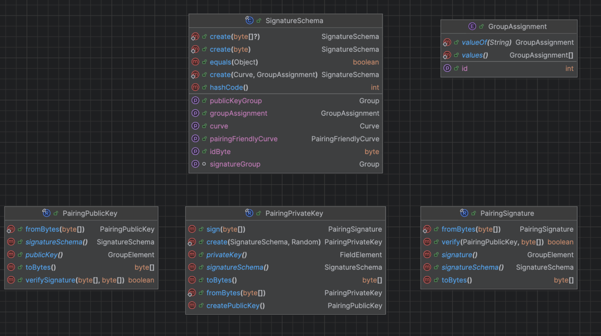

# TSS-Library

## Summary

Provide necessary components for signing messages using a TSS scheme.

| Metadata           | Entities                                               | 
|--------------------|--------------------------------------------------------|
| Designers          | Austin, Cody, Edward, Rohit, Maxi, <br/> Platform team | 
| Functional Impacts | Platform team. Release engineering. DevOps             |
| Related Proposals  | TSS-Roster, TSS-Ledger-Id                              |


## Purpose and Context
A threshold signature scheme (TSS) aims to enable a threshold number of participants (shareholders) to securely and efficiently generate succinct aggregate signatures.
In our TSS implementation, a static public key should be produced that doesn't change even when the number of participants in the scheme varies,
and it can be used to verify the aggregate of a set of partial signatures produced by a threshold number of private shares.

This is important for producing proofs that are easily consumable and verifiable by external entities.

This proposal covers the implementation of all necessary components to provide the consensus node and block node with
the functionality to sign and verify blocks using a Threshold Signature Scheme (TSS) and EC Cryptography.

The related proposal, TSS-Ledger-Id, provides an overview of the process and background for TSS and how it impacts the platform’s functionality.

This proposal assumes no relation with the platform and defines a generic components that any consumer can integrate.
It only assumes that there exists a channel to connect participants, where the identity of the message sender has been previously validated.

The process of sending messages through that channel and receiving the responses is outside the scope of this proposal.
Additionally, participants will need access to each other's public key. While the generation of the public/private keys is included in this proposal,
the distribution aspect, the loading, and the in-memory interpretation from each participant are outside the scope of this proposal.

### Glossary
- **TSS (Threshold Signature Scheme)**: A cryptographic signing scheme in which a minimum number of parties (reconstruction threshold) must collaborate
  to produce an aggregate signature that can be used to sign messages and an aggregate public key that can be used to verify that signature.
- **Groth 21**: Publicly verifiable secret sharing and resharing schemes that enable secure and efficient distribution and management of secret shares,
  with many possible use cases supporting applications in distributed key generation and threshold signatures.
  Uses Shamir's secret sharing, ElGamal, and Zero-Knowledge Proofs.
- **Shamir’s Secret Sharing**: In Shamir’s SS, a secret `s` is divided into `n` shares by a dealer, and shares are sent to shareholders secretly.
  The secret `s` is shared among `n` shareholders in such a way that:
  (a) any party with at least `t` shares can recover the secret, and (b) any party with fewer than `t` shares cannot obtain the secret.
- **ElGamal**: On a message, the ElGamal signature scheme produces a signature consisting of two elements `(r, s)`, where `r` is a random number, and `s` is computed from the message, a signer's secret key, and `r`.
- **SNARK**: they mean a proof system for proving arbitrary statements (circuits / programs).
- **Zero-Knowledge Proofs**: A proof system where one can prove possession of certain information, e.g., a secret key, without revealing that information or any interaction between the prover and verifier.
- **NIZK**: A non-interactive zero-knowledge proof for an statement. In TSS we use NIZK proofs for encoding the correctness of the secret sharing.
- **EC (Elliptic Curve)**: `Elliptic` is not elliptic in the sense of an `oval circle`. In the field `Fp`, an `EC` is like a non-connected cloud of points where
  all points satisfy an equation, and all operations are performed modulo `p`. Some elliptic curves are pairing-friendly.
- **Bilinear Pairings**: These are mathematical functions used in cryptography to map two elements of different groups (in EC, the group is an elliptic curve) to a single value in another group
  in a way that preserves specific algebraic properties.
- **Fields**: Mathematical structures where addition, subtraction, multiplication, and division are defined and behave as expected (excluding division by zero).
- **Groups**: Sets equipped with an operation (like addition or multiplication) that satisfies certain conditions (closure, associativity, identity element, and inverses).
- **Share**: Represents a piece of the necessary public/private elements to create signatures. In TSS,
  a threshold number of shares is needed to produce an aggregate signature that the ledger public key can later verify.
- **Polynomial Commitment**: It enables verification of evaluations of the polynomial at specific points without revealing the entire polynomial.
- **Participant**: Any party involved in the distributed key generation protocol. Their goal is to generate a public key and provide a set of receivers with matching secret shares of the secret key. 
  The set of participants that act as dealers and the set of participants acting as receivers may be identical, overlapping or disjoint.
- **Participant Directory**: An address book of Participants of the distributed key generation protocol.

Each scheme participant will receive its persistent EC private key from an external source and all participants' EC public keys.

### Goals
- **Usability**: Design user-friendly libraries with a public API that are easy to integrate with other projects, such as consensus node and block node.
- **EVM support**: Generated signature and public keys should be compatible with EVM precompiled functions
  so that signature validation can be done on smart contracts without incurring an excessive gas cost.
- **Security**: Our produced code should be able to pass internal and external security audits.
- **Flexibility**: Minimize the impact of introducing support for other elliptic curves.
- **Independent Release**: When applicable, the new libraries should have the release cycle separate from the platform.They should be implemented in a way that is easy for both platform and block node to depend on.

### Non-Goals
- Implement support for elliptic curve cryptography in Java.
- Support any system/architecture other than: Windows amd64, Linux amd64 and arm64, and MacOS amd64 and arm64.

## Changes

### Core Behaviors

The proposed TSS solution is based on Groth21.

Groth21 is a non-interactive, publicly verifiable secret-sharing scheme where a dealer can construct a Shamir secret sharing of a field element
and confidentially yet verifiably distribute shares to multiple receivers.
It includes a distributed resharing protocol that preserves the public key but creates a fresh secret sharing of the secret key and hands it to a set of receivers,
which may or may not overlap with the original set of shareholders.


#### Overview
This proposal covers the implementation of a tool similar to ssh-keygen to generate those keys, but the generation, persistence, distribution
and loading of those keys is outside the scope of this proposal.

Participants can hold one or more shares, each of which can be used to sign a message.
The goal is to generate an aggregate signature which is valid if a threshold number of individual signatures are combined.

Each participant brings their own Elliptic Curve (EC) key pair (private and public). They share their public keys with all other participants while securing their private keys.
Before the protocol begins, all participants agree on the cryptographic parameters.
A participant directory is needed when initiating the protocol for the first time.
This directory includes the number of participants, each participant’s EC public key, and the shares they own.

Each participant generates a random private key and distributes it among the others.
This allows for verification and aggregation of signatures produced by all shares.
A value derived from this random private key is created for each share using mathematical functions. Each value is encrypted with the share owner's public key, ensuring only the intended recipient can read it.
When a message is created, all encrypted values are included. Only the intended receivers can decrypt their respective portions of the secret element.
This setup allows participants to share secret information securely.
The message also contains additional information necessary for signature validation.

Upon receiving a threshold number of messages, each participant decrypts the information encrypted with their public key, aggregates it, and generates a private key for each owned share.
They also retrieve a public key for each share in the system to validate signatures.
Individual signing can now begin. Participants use the private information of their shares to sign messages.

When signatures from at least threshold number of parties are combined, an aggregate signature is created. This aggregate signature can be validated using the combined value of the public shares in the directory.
The process restarts whenever the number of participants or the shares assigned to each change.
However, the initially generated group public key remains unchanged to maintain consistency. New secret information for shares is created using existing data, ensuring that the aggregate signature can still be verified with the original group public key.

#### Implementation details
Before starting, all participants should agree on a `SignatureSchema` they will use.
The `SignatureSchema` defines the type of Curve and which Group of the Pairing is used for PublicKey Generation.

##### Input
* Participant's persistent EC Private key (Private to each participant)
* Number of participants (Public)
* Number of shares per participant (Public)
* A threshold value
* All participants' persistent EC public keys (Public)
* A predefined `SignatureSchema` (Public / Constant for all the network)

```
`Share`: An abstract concept having a unique identifier and an owner
|-  `PrivateShare`: Represents a share owned by the executor of the scheme. Contains a secret value (EC Private key) used for signing.
|-  `PublicShare`: Represents a share in the system. It contains public information that can be used to validate each signature and, when combined, to validate aggregate signatures.   
```

#####  Bootstrap Stage
Given

A participants directory:
```
e.g:
P   # shares
-----------------------------
P₁  5        P₁_EC_PublicKey
P₂  2        P₂_EC_PublicKey
P₃  1        P₃_EC_PublicKey
P₄  2        P₄_EC_PublicKey

```

A threshold value:
`e.g: t = 5`

First, a `shareId`: `sid` is generated for each share. It's a unique identifier for each existent share. It is deterministic because the function we use to generate it is deterministic.
It is necessary to assure they are values that: a) are unique per share, b) non-0, and c) can be used as input for the polynomial (They are from the same field of the selected curve)


And an ownership map: `ShareId`->`Participant`:

```
e.g:
sid₁	sid₂	sid₃	sid₄	sid₅	sid₆	sid₇	sid₈	sid₉	sid₁₀
P₁  	P₁  	P₁  	P₁  	P₁  	P₂  	P₂  	P₃  	P₄  	P₄  
```

##### 1. Create TssMessage
`TssMessage`: A data structure for distributing encrypted shares of a secret among all participants in a way that only the intended participant can see its part of the share.
It includes auxiliary information used to validate its correctness and assemble an aggregate public key ie: a commitment to a secret share polynomial and a NIZK proof.

###### Generation of the shares
In the bootstrap process, each participant creates a random EC Private Key `k` out of the Field of the `SignatureScheme` (the secret being shared).

```
`k`  -  A random EC Private Key for the participant
`n`  -  The number of total shares across all participants
`s`  -  One of the total shares
`sidₛ`- The shareId of the share s
`Xₖ` -  A polynomial with certain properties given a specific secret k
`xₛ` -  A point in the polynomial Xₖ for sidₛ
```

Then, each shareholder will produce `n` (n=total number of shares) values `Xₛ` by evaluating a polynomial Xₖ at each `ShareId`: `sidₛ` in the ownership map.

The polynomial `Xₖ` is a polynomial with degree `t-1` (t=threshold) with the form:
`Xₖ = k + a₁x + ...aₜ₋₁xᵗ⁻¹`[ having: `a₁...aₜ₋₁`: random coefficients from `SignatureScheme.publicKeyGroup` and `k`'s EC field element. x is a field element, thus allowing the polynomial to be evaluated for each share id]

Each `sₛ = Xₖ(sidₛ)` constitutes a point on the polynomial.

Once the `sₛ` value has been calculated for each `ShareId`: `sidₛ`, the value: `Cₛ` will be produced by encrypting the `sₛ` using the `sidₛ` owner's public key.


The TssMessage will contain all the encrypted values for all shares.

###### Generation of the Polynomial Commitment
Secret sharing poses a problem for the receiver: did it get a correct share? 
The dealer may give her a bad share that does not correspond to the dealing, or give so many fake shares to different receiver that they do not correspond to a real dealing. 
We include a Feldman commitment to the polynomial.

```
 g = a point generator of `SignatureScheme.publicKeyGroup`
 aₒ...aₜ₋₁ = coefficients of the polynomial being commited to.
```
For each coefficient in the polynomial `Xₖ` `a₍ₒ₎` to `a₍ₜ₋₁₎`, computes a commitment value by calculating: `gᵢᵃ⁽ⁱ⁾ ` (g elevated to the polynomial coefficient `a₍ᵢ₎` )

###### Generation of the NIZKs proofs

Generate a NIZK proof that these commitments and the encrypted shares correspond to a valid sharing of the secret according to the polynomial.

Given the input:

* witness: structure with secrets that include private shares(sᵢ) and randomness used during the encryption.

* statement: The information to proof (sidᵢs,public_keys, polynomial_commitment, encrypted_shares )

* rng: source of randomness

1. Serialize statement
2. Initialize a pseudorandom number generator using the `SHA256` hash of (1)
3. `x` = Random out of the random generator in (2)  
4. Generate random values `α`, `ρ` from the `SignatureScheme.field` out of rng
5. `g` = `SignatureScheme.publicKeyGroup.generator`
  5.1    `F = g^ρ`
  5.2    `A = g^α`
6. Calculate `Y` by transforming element of the statements (public keys, sids) multiplied by `ρ`, then adding `A`
    
7. Serialize (`x`, `F`, `A`, `Y`)
8. Recompute the pseudorandom number generator seed using the hash of (7)
9. `x'` = Random out of the random generator in (8)
    
10. `z_r` = `x'` * `witness.randomness` + `ρ`
11. `z_a` = `x'` + `α` + Sum(`sᵢ` * `x`.pow(`sidᵢ`))
    
Return the proof composed of `F`, `A`, `Y`, `z_r`, and `z_a`

###### A TssMessage class diagram


##### Outside of scope
Using an established channel, each participant will broadcast a single message to be received by all participants
while waiting to receive other participants' messages. This functionality is critical for the protocol to work but needs to be handled outside the library.
Each participant will validate the received message against the commitment and the NIZKs proof. Invalid messages needs to be discarded.

##### 2. Validation of TssMessage
The validation is produced over the content of the message and does not include the sender's identity, which is assumed to be provided by the external channel.
Each message can be validated against the commitment and the proof by:
* Checking that the encrypted shares correspond to the commitments.
* and, that the commitments are consistent with the public values and the generated proof.


##### 3. Processing of TssMessage
Given Participant's persistent EC PrivateKey and precisely `t` number of validated messages (t=threshold)
each participant will decrypt all `Mₛ` to generate an aggregated value `xₛ` that will become a  `SecretShare(sidₛ, xₛ)` for each `ShareId`: `sidₛ` owned by the participant.

**Note:** All participants must choose the same set of valid `TssMessages’ and have a threshold number of valid messages.


Also, we will extract a `PublicShare` for each `ShareId`: `sidₛ` in the directory from the list of valid messages.
The PublicShare for share `s` is computed by evaluating each polynomial commitment in the common set of messages at `sidₛ` and then aggregating the results.

At this point, the participant executing the scheme can start signing, sharing signatures, and validating individual signatures produced by other parties in the scheme.


#####  Rekey Stage
This Section describes the rekey process executed each time some of the scheme’s parameters change, such as the number of participants or the number of shares assigned to each participant.
The rekeying process can happen, too, if the parameters are the same as the genesis procedure.


The rekeying process is similar to the bootstrap process, but it starts with the previous list of owned private `SecretShare`.
The main difference with the genesis stage is that every participant generates a `TssMessage` out of each previously owned `SecretShare`.


Once finished, the list of `SecretShare`s will be updated but the previously generated aggregate public key remains the same.


#####  Sign Stage
After genesis or rekeying stages, the library can sign any message.
Using each `SecretShare` owned by the participant, a message can be signed, producing a `TssSignature`

Multiple signatures can be aggregated to create an aggregate `TssSignature`. An aggregate `TssSignature` can be validated against the LedgerId if
`t` (t=threshold) valid signatures are aggregated. If the threshold is met and the signature is valid, the library will respond with true; if not, it will be false.


#### Summary diagram
The following diagram exposes the steps necessary for bootstrapping and using the library. In orange are all the steps where the library is involved.
The rest of the steps need to happen but are outside the scope of the described library.


### Architecture
To implement the functionality detailed in the previous section, the following code structure is proposed:


1. **TSS Lib**: The consensus node will use the TSS library to create shares, create TSS messages to send to other nodes,
   assemble shared public keys (ledgerId), and sign the block node Merkle tree hash.
2. **Bilinear Pairings Signature Library**: This library provides cryptographic objects (PrivateKey, PublicKey, and Signature)
   and operations for the block node and consensus node to sign and verify signatures. The consensus node uses this library indirectly through the TSS Library.
3. **Bilinear Pairings API**: Layer of abstraction to be included at compilation time providing the cryptography primitives
   and the arithmetic operations for working with a specific EC curve and the underlying Groups, Fields, and Pairings
   and minimizes the impact of changing or including different curve implementations.
4. **Bilinear Pairings Impl**: This is an implementation of the Bilinear Pairings API that will be loaded at runtime using Java’s SPI.
   Multiple implementations can be provided to support different types of curves. It allows changing or switching dependencies.
5. **Native Support Lib**: Provides a set of generic functions loading native libraries in different system architectures when packaged in a jar
   using a predefined organization so they can be accessed with JNI.
6. **Arkworks[https://github.com/arkworks-rs]**:  arkworks is a Rust ecosystem for zkSNARK programming.
   Our implementation uses it as the library responsible for elliptic curve cryptography.
7. **EC-Key Utils** is a utility module that enables the node operator to generate a bootstrapping public/private key pair.

### Module organization and repositories

1. **hedera-cryptography**: This is a separate repository for hosting cryptography-related libraries.
   It is necessary to facilitate our build process, which includes Rust libraries. It also provides independent release cycles between consensus node code and block node code.
2. **swirlds-native-support**: Gradle module that enables loading into memory compiled native libraries so they can be used with JNI.
3. **swirlds-crypto-tss**: Gradle module for the TSS Library.
   This library's only client is the consensus node, so it will be in the hedera-services repository, under the `platform-sdk` folder.
4. **swirlds-crypto-signatures**: Gradle module for the Bilinear Pairings Signature Library.
5. **swirlds-crypto-pairings-api**: Gradle module for the Bilinear Pairings API. Minimizes the impact of adding or removing implementations.
6. **swirlds-crypto-alt128**: Gradle module that will implement the Bilinear Pairings API using alt-128 elliptic curve.
   That curve has been chosen due to EVM support. The arkworks rust library will provide the underlying cryptography implementation.
   The module will include Java and Rust codes that will be compiled for all possible system architectures and distributed in a jar under a predefined structure.

### Libraries Specifications
#### Swirlds Crypto Pairings API
##### Overview
This API will expose general arithmetic operations to work with Bilinear Pairings and EC curves that implementations must provide.

##### Public API

###### `Curve`
**Description**: Represents the different types of elliptic curves. Implementations of this API should decide if they provide any, one, or many curves.

**Link**: [Curve.java](pairings-api%2FCurve.java)

**Note**: This enum should list all possible types so changes in the implementation don't change the API, but as of now, the number is limited.

###### `BilinearPairing`

**Description**: This class provides access to each group (G₁, G₂) for a specific Pairing and the FiniteField associated with the curve.

**Link**:  [BilinearPairing.java](pairings-api%2FBilinearPairing.java)

###### `Field`
**Description**: This is a factory interface responsible for creating FieldElement, which are scalars belonging to the field represented by this instance.

**Link**: [Field.java](pairings-api%2FField.java)

###### `FieldElement`

**Description**: An interface representing an element within a field, providing methods for basic arithmetic operations.

**Link**: [FieldElement.java](pairings-api%2FFieldElement.java)

###### `Group`

**Description**: This class provides methods to obtain elements belonging to the group represented by the instance.

**Link**: [Group.java](pairings-api%2FGroup.java)

###### `GroupElement`

**Description**: An interface representing an element within a group, providing methods for basic group operations.

**Link**: [GroupElement.java](pairings-api%2FGroupElement.java)

###### `PairingResult`

**Description**: An interface representing the result of a pairing operation, with methods to compare it to other group elements.

**Link**: [PairingResult.java](pairings-api%2FPairingResult.java)


#### Swirlds Crypto Pairings Signature Library
##### Overview
This module provides cryptography primitives to create EC PublicKeys, EC PrivateKeys, and Signatures.

##### Public API
###### `SignatureSchema`
**Link**: [SignatureSchema.java](signature-lib%2FSignatureSchema.java)

**Description**: A pairings signature scheme can be implemented with different types of curves and group assignment configurations.
For example, two different configurations might consist of a BLS_12_381 curve using G1 of the pairing to generate public key elements or G2 for the same purpose.
###### `PairingPrivateKey`
**Link**: [PairingPrivateKey.java](signature-lib%2FPairingPrivateKey.java)

**Description**: A private key generated using the pairings API

###### `PairingPublicKey`
**Link**: [PairingPublicKey.java](signature-lib%2FPairingPublicKey.java)

**Description**: A public key generated using the pairings API
###### `PairingSignature`
**Link**: [PairingSignature.java](signature-lib%2FPairingSignature.java)

**Description**: A signature generated with the private key that can be verified with the public key

###### `GroupAssignment`
**Link**: [GroupAssignment.java](signature-lib%2FGroupAssignment.java)

**Description**: An enum to clarify which group public keys and signatures are in, for a given SignatureSchema


##### Implementation Note
The serialization of the elements in this module adds a byte to represent the combination of Curve type and group assignment.

##### Examples
###### Generating a SignatureSchema
```java
SignatureSchema signatureSchema = SignatureSchema.from(Curve.ALT_BN128, GroupAssignament.G1_PUBLIC_KEYS);
```
###### Generating a Private Key
```java
   PairingPrivateKey pk = PairingPrivateKey.create(signatureSchema, new SecureRandom());
   
```
###### Generating a Public Key
```java
   PairingPublicKey pbk = PairingPublicKey.create(pk);
   
```
###### Generating a Signature
```java
    byte[] message = new byte[]{};
    PairingSignature s = PairingSignature.sign(pk, message );
   
```
###### Verifying a Signature
```java
static{
    s.verify(pbk, message);
}
```
##### Constraints
This module will not depend on hedera-services artifacts, so it cannot include logging, metrics, configuration, or any other helper module from that repo.
##### Dependencies
swirlds-cryptography-pairings-API and runtime implementation
##### Other considerations
We analyzed the possibility of implementing [JCA](https://docs.oracle.com/en/java/javase/11/security/java-cryptography-architecture-jca-reference-guide.html#GUID-9A793484-AE6A-4513-A603-BFEAE887DD8B) (Java-Cryptography-architecture).
Some unknowns are worth investigating in a follow-up task:
* Should we parametrize the EC curve with: [`java.security.spec.EllipticCurve`](https://docs.oracle.com/javase/1.5.0/docs/api/java/security/spec/EllipticCurve.html)? Implications?
* What is the serialization format supported by arkworks?  Raw Key Bytes are formatted with PKCS#8 for private keys and X.509 for public keys.
  Should we define a custom format for bytes serialized with arkworks? Should we reformat? What do we do with our custom content?

#### Swirlds Crypto TSS Library
##### Overview
This library implements the Groth21 TSS-specific primitives.

##### Constraints
Once built, this library will depend on artifacts constructed in other repositories.
This library would accept Integer.MAX_VALUE -1 participants.

##### Public API:
###### `TssService`
**Description**: This class handles all tss specific operations.

**Link**: [TssService.java](tss%2FTssService.java)

###### `TssParticipantDirectory`
**Description**: This class holds all information about the participants in the scheme. Including: participants' EC public keys, public shares, private shares, number of shares. 

**Link**: [TssParticipantDirectory.java](tss%2FTssParticipantDirectory.java)

###### `TssMessage`
**Description**: This class is used in the exchange of secret information between participants. Contains an encrypted message, a polynomial commitment, and a cryptographic proof that can be used to validate this message.

**Link**:[TssMessage.java](tss%2FTssMessage.java)

###### `TssShareId`
**Description**: This class represents the unique identification of a share in the system. It a FieldElement, so it can be used as input in the polynomial.

**Link**:[TssShareId.java](tss%2FTssShareId.java)

###### `TssPrivateShare`
**Description**: A record that contains a share ID, and the corresponding private key.

**Link**:[TssPrivateShare.java](tss%2FTssPrivateShare.java)

###### `TssPublicShare`
**Description**: A record that contains a share ID, and the corresponding public key.

**Link**:[TssPublicShare.java](tss%2FTssPublicShare.java)

###### `TssShareSignature`
**Description**: Represents a signature created from a TSSPrivateShare.

**Link**:[TssShareSignature.java](tss%2FTssShareSignature.java)

##### Examples:
###### 1. Bootstrapping
```java
   TssService service = new TssService(signatureScheme, new Random());
   PairingPrivateKey persistentParticipantKey = Requirements.loadECPrivateKey();
   List<PairingPublicKey> persistentPublicKeys = Requirements.loadECPublicKeys();
   TssParticipantDirectory participantDirectory =
           TssParticipantDirectory.createBuilder()
           .self(/**/ 0, persistentParticipantKey)
           .withParticipant(/*Identification:*/0, /*Number of Shares*/5, persistentPublicKeys.get(0))
           .withParticipant(/*Identification:*/1, /*Number of Shares*/2, persistentPublicKeys.get(1))
           .withParticipant(/*Identification:*/2, /*Number of Shares*/1, persistentPublicKeys.get(2))
           .withParticipant(/*Identification:*/3, /*Number of Shares*/1, persistentPublicKeys.get(3))
           .withThreshold(5)     
          .build(signatureScheme);
   
   //One can then query the directory
   int n = participantDirectory.getTotalNumberOfShares();
   List<TssShareId> privateShares = directory.getOwnedSharesIds();
   List<TssShareId> shareIds = directory.getShareIds();
```
###### 1. Create TssMessage
```java
   //Creates a TssMessage out of a randomly generated share 
   TssMessage m = service.generateTssMessage(directory);
```

###### 2. Validation of TssMessage
```java
static {
    List<TssMessage> messages = Requirements.receiveTssMessages();
    for(TssMessage m : messages){
        service.validate(participantDirectory, m);
    }
}
```
###### 3. Processing of TssMessage
```java
    Set<TssMessage> agreedValidMessages = /*Some previously agreed upon same set of valid messages for all participants*/
    //Get Private Shares    
    List<TssPrivateShare> privateShares = service.decryptPrivateShares(participantDirectory, agreedValidMessages);
    //Get Public Shares
    List<TssPrivateShare> publicShares = service.computePublicShare(participantDirectory, agreedValidMessages);

```
######  Sign
```java
   byte[] message = Requirements.messageToSign();
   List<TssShareSignature> signatures = service.sign(privateShares, message);

```

######  Aggregate Signatures

```java
static {
    List<TssShareSignature> signatures = Requirements.loadSignatures();

    //Validation of individual signatures
    List<TssShareSignature> validSignatures = new ArrayList<>(signatures.size());
    for (TssShareSignature s : signatures) {
        if (service.verify(participantDirectory, publicShares, s)) {
            validSignatures.add(s);
        }
    }

    //Producing an aggregate signature
    PairingSignature aggregateSignature = service.aggregate(participantDirectory, validSignatures);
}
```

#### Swirlds Crypto Pairings Impl
##### Overview
This module will be a multilanguage module following the structure:
```
 swirlds-crypto-pairings-impl-X
 |-src
    |-main
    | |-java
    | | |-com...
    | |-rust
    |   |-...
    |-test
      |-java
      | |-com...
      |-rust
        |-...
```
Support for release engineering will be needed.
This module should include Cargo for compiling rust source to binary files,
It should be built in a way that the rust code is compiled for every supported architecture and only after that, packaged into the jar following the structure:
```
 |-WEB-INF
    |-arch64
      |-macos
        |-lib.dylib
    |-amd64
      |-macos
        |-lib.dylib
      |-linux
        |-lib.so
      |-windows
        |-lib.dll
    |-x86
      |-linux
        |-lib.so
      |-windows
        |-lib.dll
```
It will unzip and load the correct library packaged inside the jar and access it using JNI calls.
The API interface is through JNI. Once built, this should become a runtime dependency.

#### Swirlds Native Support
##### Overview
Our implementation of the `swirlds-cryptography-pairings-api` will use native compiled libraries under the hood accessed with JNI.
Given the non-GA state of Project Panama, this proposal does not consider it, but it has not been discarded for future change proposals.

While dealing with native code using JNI, there are two possible ways of making the library accessible to Java code:
1. Make it available in the classpath: The library must be previously installed in the executing environment
   and reference its location in the classpath env variable.
2. Distribute it as an application dependency. The caveat here is that:

   a. The distributed library must be compiled in every possible architecture on which the application will be executed.

   b. The library must be unpackaged from the jar as it cannot be accessed while compressed.

Two key points we are considering in the development of this solution are:
a) ensuring that it is compatible with the Java module system.
b) Ensure that dependent software does not require the installation of any additional dependencies other than what is distributed in the jars.

That is why the native-support library will help load the native library by implementing option 2.
For this to work, the native support library must be included as a dependency in the module accessing the JNI wrapping code.
The native libraries will be accessed assuming the following structure in the module declaring the dependency:

```
 native-library-client.jar
 |-WEB-INF
    |-arch64
      |-macos
        |-libhedera_bls_jni.dylib
    |-amd64
      |-macos
        |-libhedera_bls_jni.dylib
      |-linux
        |-libhedera_bls_jni.so
      |-windows
        |-libhedera_bls_jni.dll
    |-x86
      |-linux
        |-libhedera_bls_jni.so
      |-windows
        |-libhedera_bls_jni.dll
  ...
```

lib folder is organized in subfolders by the platform identifier, as returned by `System.getProperty("os.arch")` and `System.getProperty("os.name")`

##### Constraints
This module will not depend on hedera-services artifacts, so it cannot include logging, metrics, configuration, or any other helper module from that repo.

##### Public API
###### `OSs`
**Description**: An enum class listing all supported os.

###### `Archs`
**Description**: An enum class listing all supported architectures.

###### `LibraryDescriptionEntry`
**Description**: Given that the compilation of a native library produces files with different names under different OS and architectures, we need a way to assemble a catalog for all possible forms our library will take.

A record of 3 elements that defines the name of the binary file of the library to load in a specific system architecture and OS.

**Example**:
```java
    LibraryDescriptionEntry entry = new LibraryDescriptionEntry(OSs.MAC_OS, Archs.ARC_64, "libhedera_bls_jni.dylib");
```
###### `LibraryDescription`
**Description**: A description of the library in all possible systems.
```java
    static final LibraryDescription LIB_HEDERA_BLS = new LibraryDescription(new LibraryDescriptionEntry(OSs.MAC_OS, Archs.ARC_64, "libhedera_bls_jni.dylib"), new LibraryDescriptionEntry(OSs.LINUX,  Archs.AMD_64, "libhedera_bls_jni.so") /*,... Others*/);
```
If the library name is the same for all system architectures with the only change of the extension, one can configure:
```java
  //For any system architecture load libhedera_bls_jni.dylib, libhedera_bls_jni.so or libhedera_bls_jni.dll depending on the os  
  static final LibraryDescription LIB_HEDERA_BLS = new LibraryDescription("libhedera_bls_jni");
```


###### `LibraryLoader`
**Description**: Helper class that will load a library for the correct system:

```java
class AnySystemReferencedClass{
    static {
        LibraryLoader.load(LIB_HEDERA_BLS);
    }
}
```
The method will fail with a runtime exception if no description matches the current system architecture.
The result of this invocation will be that the library will be packaged from the contained jar in the expected structure into a temporal folder and loaded into memory.   

## Test Plan
Since cryptographic code is often difficult to test due to its complexity and the lack of a test oracle,
we should design our test cases based on the cryptographic properties that these implementations should satisfy.


**Properties**:

Protection of private keys. Our scheme protects the secrecy of the group’s and members’ private keys; otherwise, private keys can generate only one group signature.

Unforgibility of group signature. Our scheme ensures that (a) any t or more than t members can work
together to generate a valid group signature, and (b)fewer than t members cannot generate a valid group signature.

Fixed length of threshold signature. Our scheme ensures that the size of a threshold signature is fixed (i.e., not depending on the number of signers).

Efficiency of verification. Verifying a group signature is based on the group’s public key.

* Generation of Private and Public Key Pairs: Tests the generation of key pairs for correctness by having the IUT produce 10 key
  pairs. The private key provided is used to compute the public key, Q’. The calculated value Q’ is then compared to the supplied public key, Q.
* Public Key Validation: Generate 12 key pairs for each supported curve, modify some public keys to introduce errors, and determine whether it can detect them.
* Signature Generation: Ten preconfigured known messages per curve supported are supplied. Generate a signature for each message. The message, public key, and signature components are returned.
  The signatures are compared against previous known signatures.
* Signature Verification: For each curve supported, 15 pseudorandom messages, a public key, Q, and a signature component (r, s) are supplied if some of the provided values are modified so that signature verification should fail.

Some ideas:
* [Cryptographic-Algorithm-Validation-Program](https://csrc.nist.gov/CSRC/media//Projects/Cryptographic-Algorithm-Validation-Program/documents/dss/ECDSAVS.pdf):
* https://csrc.nist.gov/CSRC/media/Events/lightweight-cryptography-workshop-2019/documents/papers/systematic-testing-of-lightweight-crypto-lwc2019.pdf

The proposal is to move forward with the implementation while creating a work group to discuss and collect ideas for testing and validating these features.
**Questions**:
* What other properties are not mentioned here?

### Unit Tests
One of the components that can be unit-tested is native support. SPI loading and failing. JNI wrapping.
Limitations: native-support-library tests must be executed in different environments to provide comprehensive code validation.

### Performance Testing
JMH benchmarks should be provided for signature generation and aggregation.
TssMessage validation, and public key aggregation.

## Security Audit
After this proposal is accepted we will invite security team to define the necessary steps for auditing the code.

## Implementation and Delivery Plan

1. Stage 1
    * Preconditions
        * A new repository
        * CI/CD pipelines to reference built artifacts in hedera-services
    * Implementation of the public interface for the TSS library
    * Implementation of the public API for Pairings API
    * Implementation of native-support library
    * Work on the test plan and validation
    * Enable a mock implementation for the TSS library so it can be used on the platform side.
    * Define Test plan
    * Define security plan
2. Stage 2
    * Preconditions
        * Gradle multilanguage module with rust compilation plugin
    *  Implementation of Pairings API using JNI, arkworks, and alt-bn1238
    *  Implementation of EC-key utility.
3. Stage 3
    * Enable dynamic loading of Pairings API implementation using SPI.

## External References
- https://eprint.iacr.org/2021/339
- https://crypto.stanford.edu/pbc/notes/elliptic
- https://andrea.corbellini.name/2015/05/17/elliptic-curve-cryptography-a-gentle-introduction/
- https://www.iacr.org/archive/asiacrypt2001/22480516.pdf
- https://hackmd.io/@benjaminion/bls12-381#Motivation
- https://www.johannes-bauer.com/compsci/ecc/

