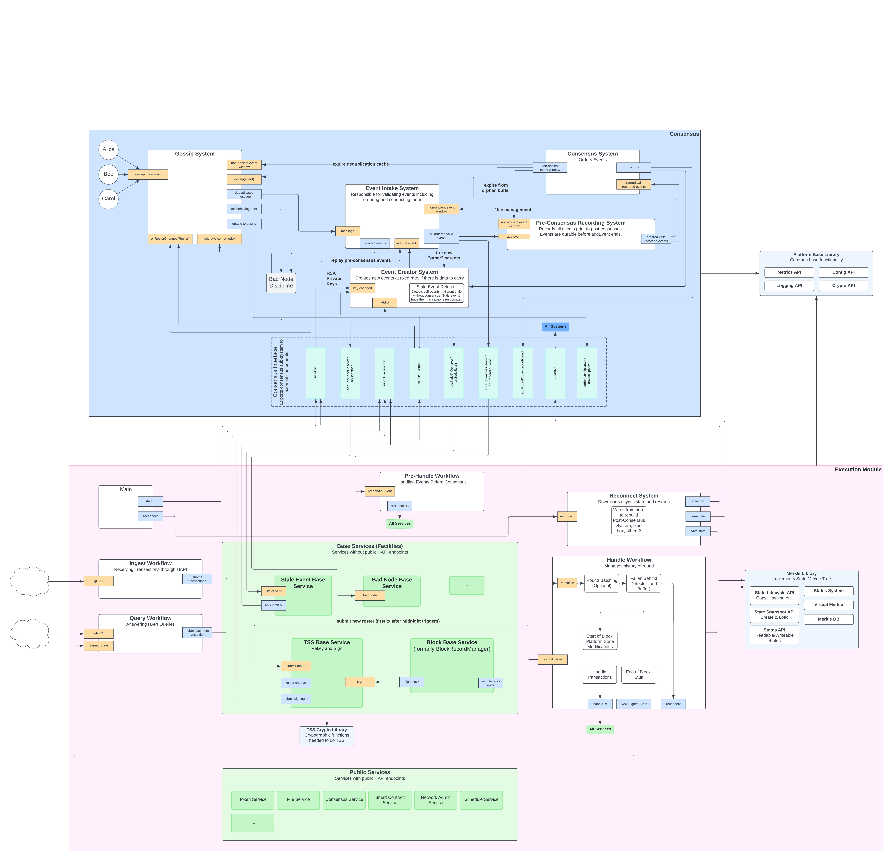
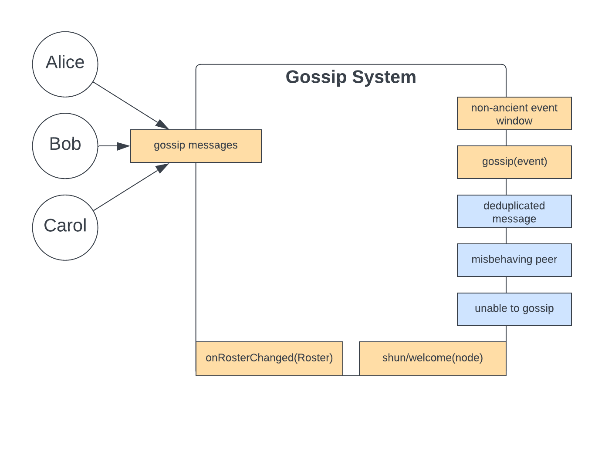

# Consensus Layer of the Consensus Node

---

## Summary

Update the architecture for the consensus node to reduce complexity, improve performance, and improve stability. This
design document defines the next iteration of the consensus node architecture, especially as related to consensus.

| Metadata           | Entities                                                 | 
|--------------------|----------------------------------------------------------|
| Designers          | Richard Bair, Jasper Potts, Oleg Mazurov, Austin Littley |
| Functional Impacts | Consensus Node                                           |

---

## Purpose and Context

Much of the motivation for this design can come down to paying down technical debt and simplifying the overall design.
While the current design is full of amazing high quality solutions to various problems, it is also more complex than
necessary, leading to hard-to-find or predict bugs, performance problems, or liveness (stability) issues while under
load. In addition, the separation of the "platform" and "services" in the consensus node is somewhat arbitrary, based
on an abstract concept of what the "platform" was long before Hedera was even created. This work is also necessary to
prepare for more autonomous node operation, and community nodes.

Principally:
1. This design defines several high-level modules, made up of internal "components". Whereas the current implementation
   only has a logical grouping of components into systems, this design has concrete modules providing a strong
   modularization and isolation with strict contracts between modules, leading to an overall simpler to understand
   system, less prone to "spaghetti".
2. Each module has very well-defined inputs and outputs.
3. Assumptions and requirements that led to tight coupling between modules have been revisited, and where possible,
   eliminated.
4. The concepts of "platform" vs. "services" is less important in this design than the difference between "consensus"
   and "execution". The Consensus module takes transactions and produces rounds. Everything required to make that happen
   (gossip, event validation, hashgraph, event creation, etc.) is part of the Consensus module. It is a library, and
   instances of the classes and interfaces within this library are created and managed by the Execution module. The
   Consensus module has no state, no main method, and minimal dependencies.
5. The Execution module is a mixture of what we have called "services" and some parts of "platform". The services code
   has a `HandleWorkflow` and the platform has a number of classes that handle "post-consensus" responsibilities such
   as managing the merkle tree, making fast copies of it, hashing it, etc. These responsibilities will be merged into
   the `HandleWorkflow`, dramatically simplifying the interface and boundary between "consensus"/"platform" and
   "execution"/"services".
6. Backpressure, or dealing with a system under stress, will be radically redesigned based on
   [PID](https://en.wikipedia.org/wiki/Proportional%E2%80%93integral%E2%80%93derivative_controller) controller logic,
   and known as "dynamic throttles". The key concept is that we primarily throttle using information from _the entire
   network_, rather than throttling only based on information available to the Consensus module like we do today.

The purpose of this document is not to describe the implementation details of each of the different modules. Nor does
it go into great detail about the design of the execution layer (which is primarily documented elsewhere). Instead,
it provides an overview of the whole system, with an emphasis on the Consensus module, and how the Consensus module
interacts with the Execution module.

For example, the responsibility for reconnect moves in this design from Consensus to Execution. The details on how the
"app-base" module in the services code will be updated to support reconnect is not covered in this document, but the
high-level description of why reconnect is moved to Execution, and how it impacts Consensus, will be covered.

### Dependencies, Interactions, and Implications

This document supports existing features implemented in new ways, and it provides for new features (such as the dynamic
address book) which have not been implemented. After acceptance, a long series of changes will be required to modify
the existing codebase to meet this new design. This will not happen overnight, nor will it block progress on all other
initiatives. Instead, this plan provides the blueprint for our new node architecture, which we will work towards
implementing with every change we make going forward. This blueprint will also provide the framework within which we
will evaluate all other feature designs and implementations.

## Design

TODO: THIS IMAGE MUST BE UPDATED

The consensus node is made up of two parts, a Consensus layer, and an Execution layer. Each layer is represented by
JPMS modules. The Consensus layer will actually be made up of two different modules -- an API module and an
implementation module, though unless the distinction is important, this document will usually refer to just "the
Consensus Module". The API module will define an `Interface` corresponding to the dotted-line box in the Consensus layer
blue box. The Execution implementation module will have a compile-time dependency on the Consensus layer's API module,
and a runtime dependency on the Consensus layer's implementation module.

Each submodule will likewise be defined by a pair of JPMS modules -- an API module and an implementation module. By
separating the API and implementation modules, we make it possible to supply multiple implementation modules (which is
useful for various testing or future maintenance tasks), and we also support circular dependencies between modules.

### Initialization of the Consensus Module

When Execution starts, it will (at the appropriate time in its startup routine) create an instance of Consensus, and
`initialize` it with appropriate arguments, which will be defined in detail in further documents. Critically,
Consensus **does not maintain state**. Execution is wholly responsible for the definition and management of state. To
start Consensus from a particular moment in time, Execution will need to initialize it with some information such as the
judges of the round it wants to start from. It is by using this `initialize` method that Execution is able to create
a Consensus instance that starts from genesis, or from a particular round.

Likewise, if a node needs to reconnect, Execution will `destroy` the existing Consensus, and create a complete new one,
and `initialize` it appropriately with information from the starting round, after having downloaded data and
initializing itself with the correct round. Reconnect therefore is the responsibility of Execution. Consensus does not
have to consider reconnect at all.

### Gossip

The Gossip module is responsible for gossiping messages between peers. The actual gossip implementation is not described
here, except to say, that it will be possible to define and implement both event-aware and event-agnostic gossip
implementations either to a fully connected network or where the set of peers is a subset of the whole. Nor does this
document dictate whether raw TCP, UDP, HTTP2, gRPC, or other network protocols are used. This will be left to the design
documents for Gossip.

Gossip is the only part of Consensus that communicates over the network with gossip peers. When Gossip is initialized,
it is supplied a "roster". This roster contains the full set of nodes participating in gossip, along with their metadata
such as RSA signing keys, IP addresses, and so forth. The Gossip module decides which peers to gossip with (using
whatever algorithm it chooses).

#### Events

Gossip is event-oriented, meaning that it is given events to gossip, and emits events it receives through gossip. An
implementation of Gossip could be based on a lower-level implementation based on bytes, but at the module level, it
works in terms of events.

When the Gossip module receives events through gossip, it *may* choose to perform some deduplication before sending
them to Event Intake, but it is not required to do so.

Some gossip algorithms send events in *topological order*. A peer may still receive events out of order, because
different events may arrive from different peers at different times. To support topological ordering, events received by
Gossip are not retained by Gossip, they are simply passed directly to Event Intake, which after verification, also
orders events in topological order and recorded durably to disk, and then send back to the Gossip module to be sent out
to its gossip peers.

**The key design principle here is that a node will only send valid events through gossip**. If invalid events are
ever received, you may know the node that sent them to you is dishonest. Validating events increases latency at each
"hop", but allows us to identify dishonest gossip peers and discipline them accordingly.

During execution, for all nodes that are online and able to keep up, events are received "live" and processed
immediately and re-gossiped. However, if a node is offline and then comes back online, or is starting back up after
reconnect, it may be missing events. In this case, the node will need to ask its peers for any events it is missing.

For this reason, every honest node needs to buffer some events, so when its peer asks it for events, it is able to
give them. Events can be "non-ancient", "ancient", or "expired". Although the definition for these is subject to
configuration, we will here use some example values. Non-ancient events are those events that are either not yet
in a consensus round, or are in one of the last 26 consensus rounds. Expired events are those that are in a round
that is older than the last most recent 500 consensus rounds. And ancient events are those that are in a round between
26 and 500.

The Gossip module must cache all non-expired events. Note that it must be a fixed number of rounds that defines
"expired", because otherwise it is possible for a quiescent network to never recover (see the documentation for
the tipset algorithm, and other-parent selection, for specifics on why this is true). This number must also be large
enough in case rounds/sec increases dramatically, because reconnect requires a certain amount of time (not rounds) for
catchup. As long as this number is large enough to meet the requirements regardless of the rounds/sec, and as long as it
is fixed in number of rounds, then it will work.

#### Peer Discipline

If a peer is misbehaving, the Gossip module will notify the Sheriff module that one of its peers is misbehaving. For
example, if a peer is not responding to requests, even after repeated attempts to reconnect with it, it may be "bad".
Or if the peer is sending events that exceed an acceptable rate, or exceed an acceptable size, then it is "bad". Or if
the events it sends cannot be parsed, or are signed incorrectly, or in other ways fail validation, then it is "bad".
There may be additional rules by the Gossip module or others (such as Event Intake detecting branching) that could lead to
a peer being marked as "bad". A "bad" node may be dishonest, or it may be broken. The two cases may be
indistinguishable, so punishment must be adjusted based on the severity of the attack.

If the Sheriff decides that the peer should be penalized, then it will instruct the Gossip module to "shun" that peer.
"Shunning" is a unilateral behavior that one node can take towards another, where it terminates the connection and
refuses to work further with that node. If the Sheriff decides to welcome a peer back into the fold, it can instruct the
Gossip module to "welcome" the peer back.

#### Falling Behind

It may be that during gossip, the Gossip module finds that it cannot continue. Perhaps all connections have failed, or
perhaps the node is so far behind that none of its peers are able to supply any events. In this case, the node is unable
to operate, and must reconnect. Gossip will make a call through the Consensus module interface to notify Execution that
gossip is "down". Execution will then initiate reconnect.

Fundamentally, Execution is responsible for reconnect, but it cannot differentiate between a quiescent network or a
behind node just by looking at the lack of rounds coming from Consensus. So Consensus **must** tell Execution if it
knows that it cannot proceed in creating rounds because the node itself is bad, vs. a quiescent network which is
able to create rounds (if there were any transactions).

#### Roster Changes

At runtime, it is possible that the roster will change dynamically (as happens with the dynamic address book feature).
Roster changes at the gossip level may influence which peers the module will work with. As with all other modules using
rosters, Gossip may need a deterministic understanding of which roster applies to which round. It will receive this
information from Hashgraph in the form of round metadata.

### Event Intake

The Event Intake System is responsible for receiving events, validating them, and emitting them in *topological order*.
It also makes sure they are durably persisted before emission so as to add resilience to the node in case of certain
catastrophic failure scenarios.

#### Validation

One of the core responsibilities of Event Intake is to validate the events it has received. While this document does
not specify the validation pipeline, it will define some of the primary steps involved in validation, so as to motivate
the purpose of this module. That is, the following description is non-normative, but important for understanding the
context within which this module operates.

Event Intake receives events from gossip, or from the Event Creator module (i.e. a "self-event"). An "event" is actually
a wrapper around the base protobuf event type (`EventCore`) that includes the core event data along with metadata that
is not represented in protobuf or transmitted through gossip. One field populated in the metadata will be the byte[]
that represents the protobuf-serialized form of the `EventCore`. Since gossip read this from the wire, there is no work
to produce this `byte[]`, and since the `byte[]` will be needed for Gossip, we need to keep it anyway. But we will also
hash this `byte[]` to produce the event hash, and store this hash in the metadata.

After hashing, Event Intake will deduplicate events. It has a hash->event map allowing it to cheaply verify whether the
event is a duplicate. If it is, the duplicate is discarded. Otherwise, the event is checked for "syntactic" correctness.
For example, are all required fields populated, etc. While the Gossip system has already checked to ensure the payload
of the event (its transactions) are limited in size and count, Event Intake will also check this as a safety measure in
the event of bugs (if this check fails here, a noisy log statement should be produced, since this should never happen).

If an event is valid, then we finally check the signature. Since validation and deduplication and hashing are
significantly less expensive than signature verification, we wait on signature verification until the other steps are
completed. The operating principle is that we want to fail fast and limit work for further stages in the pipeline.

If an event has a very old birth-round that is ancient, it is dropped. If a node sends a large number of ancient events,
it may end up being disciplined (the exact rules around this will be defined in subsequent design docs for the
Event Intake module).

#### Self Events

Events are not only given to the Event Intake system through gossip. Self events (those events created by the node
itself) are also fed to Event Intake. These events **may** bypass some steps in the pipeline. For example, self-events
do not need validation. Likewise, when replaying events from the pre-consensus event buffer, those checks are not needed
(since they have already been proved valid and are in topological order).

#### Peer Discipline

During the validation process, if an event is invalid, it is rejected, and this information is passed to the Sheriff
module so the offending node may be disciplined. Note that the node to be disciplined will be the node that sent this
bad event to us, not the origin node. This information (which node sent the event) must be captured by Gossip and
passed to Event Intake as part of the event metadata.

#### Topological Ordering

Events are buffered if necessary to ensure that each parent event has been emitted from Event Intake before any child
events. A simple map (the same used for deduplication) can be used here. Given some event, for each parent, look up the
parent by its hash. If each parent is found in the map, then emit the event. Otherwise, remember the event so when the
missing parent is received, the child may be emitted. The current implementation uses what is known as the "orphan
buffer" for this purpose.

Since Event Intake will also maintain some buffers, it needs to know about the progression of the hashgraph,
so it can evict old events. In this case, the "orphan buffer" holds events until either the parent events have
arrived, or the events have become ancient due to the advancement of the "non-ancient event window" and the event is
dropped from the buffer. This document does not prescribe the existence of the orphan buffer or the method by which
events are sorted and emitted in topological order, but it does describe a method by which old events can be dropped.

#### Assigning Generations

Several algorithms, including the hashgraph consensus algorithm and the tipset algorithm, require events to be part of
a "generation". We use what is known as "local generation". Each node, when it starts, assigns "1" as the generation
of the first event it encounters per event creator. The absolute numbers for the generations are not important, but
their relative values are critical. The next generation will be the max generation of all parents, plus 1. So if Alice
builds an event with parents `a4` and `b7`, the new event will be `a8`. Different nodes may assign different generations
to the same events. The generation will be part of the event metadata, **not** part of `EventCore` (that is, it is not
in the part of the event that is gossiped).

Event Intake is responsible for assigning generations to events.

#### Branch Detection

The Event Intake module inspects events to determine whether any given event creator is "branching" the hashgraph. A
"branch" happens when two or more different events from the same creator have the same "self-event" parent. Any node
that branches (known affectionately as a "Dirty Rotten Brancher") will be reported to the Sheriff. Branching is a sign
of either a dishonest node, or a seriously broken node. In either case, it may be subject to "shunning", and will be
reported to the Execution layer for further observation and, if required, action (such as canceling rewards for
stakers to that node).

#### Persistence

Event Intake is also responsible to durably persist pre-consensus events **before** they are emitted, but after they
have been ordered. This system is known as the "Pre-Consensus Event Stream", or PCES. The current implementation
requires coordination between the PCES and the Hashgraph component to know when to flush, and the PCES needs to know
when rounds are signed so it knows when to prune files from the PCES.

Instead, the PCES could be implemented as a single large cyclic buffer. As valid, ordered events are made available,
they will be written to the head of this buffer, and **only then** emitted from Event Intake. The buffer will be large
enough so the node can recover from a saved state + buffered pre-consensus events. Typically, this would be configured
to be some value several multiples in size larger than the state saving timeframe and maximum event/sec rate, so as to
provide a solid guarantee of data availability. By using a sufficiently large circular buffer, there is no need to
coordinate with the Hashgraph module or the Execution layer.

(NOTE: The actual implementation of persistence is to be defined in subsequent design documents).

#### Emitting Events

When the Event Intake module emits valid, topologically sorted events, it sends them to:
- The Gossip module, to be sent to gossip peers
- The Event Creator module, for "other parent" selection
- The Execution layer as a "pre-handle" event
- The Hashgraph module for consensus

The call to each of these systems is "fire and forget". Specifically, there is no guarantee to Execution that it will
definitely see an event via `pre-handle` prior to seeing it in `handle`. Technically, Consensus always calls
`pre-handle` first, but that thread may be parked arbitrarily long by the system and the `handle` thread may actually
execute first. This is extremely unlikely, but must be defended against in the Execution layer.

It is essential for events to be durably persisted before being sent to the Hashgraph, and self-events must be
persisted before being gossiped. While it may not be necessary for all code paths to have durable pre-consensus events
before they can handle them, to simplify the understanding of the system, we simply make all events durable before
distributing them. This leads to a nice, clean, simple understanding that, during replay, the entire system will
behave predictably.

#### Roster Changes

Since Event Intake must validate events, and since event validation requires knowing the roster (to verify the event
source is in the roster, and the gossip source is in the roster, and the signature of the event creator is correct),
Event Intake must know about changes to the roster. It is imperative that Event Intake maintain a history of rosters,
so it can support peers that are farther behind in consensus than it is.

### Hashgraph Module

The Hashgraph module orders events into rounds, and assigns timestamps to events. It is given ordered, persisted
events from Event Intake. Sometimes when an event is added, it turns out to be the last event that was needed to cause
an entire "round" of events to come to consensus. When this happens, the Hashgraph module emits a `round`. The round
includes metadata about the round (the list of judge hashes, the round number, etc.) along with the events that were
included in the round, in order, with their consensus-assigned timestamps.

Rounds are immutable. They are sent "fire and forget" style from the Hashgraph module to other modules that require
them. Some modules only really need the metadata, or a part of the metadata. Others require the actual round data.
We will pass the full round info (metadata + events) to all listeners, and they can pull from it what they need.

#### Roster Changes

When the roster changes, the Hashgraph algorithm must be made aware. It needs roster information to be able to come
to consensus. While several modules must respond to roster changes, it is the Hashgraph module that "owns" the roster.
Each round has an associated roster -- the roster that was used to come to consensus on that round. While the
Hashgraph owns the roster, it does not _determine_ the roster, this happens in the Execution layer.

At runtime, there is a service in Execution that exposes to the world API for adding nodes to, or removing nodes from,
the address book. At some point in time, Execution will decide the time is right to construct a new consensus roster,
and pass that roster to the consensus system. **This must be deterministic**. Each node in the network must assign the
same roster to the same rounds. However, Consensus and Execution run in completely different threads, and possibly,
in different processes.

With this architecture, we introduce a new concept into `EventCore`. `EventCore` has a `payload`, which is a `byte[]`
that the Execution layer can use to carry whatever payload is meaningful to it. The consensus layer needs an analogous
section of the `EventCore` into which messages particular to Consensus can be placed. This section will be called
`repeated control_messages`. A `ControlMessage` is a protobuf message used to control, in some way, the consensus
system.

TODO: I'm seriously thinking of having "system_transactions" and "user_transactions" instead of "control_messages" and
"payload".

`ControlMessage` has a one-of, among which is `RosterChangeMessage`. This message will have the new roster, and be
signed by the network as a whole. Each honest node will submit a `RosterChangeMessage`, and the Hashgraph module will
recognize these messages. When it encounters the **first** such message for a given roster in a round that has come to
consensus, the very next round will use that new activated roster.

### Event Creator Module

Every node in the network participating in consensus is permitted to create events to gossip to peers. These events
are used both for transmitting user transactions, and as the basis of the hashgraph algorithm for "gossiping about
gossip". Therefore, the Event Creator has two main responsibilities:

1. Create events with "other parent(s)" so as to help the hashgraph progress consensus
2. Fill events with transactions to be sent to the network through Gossip

#### Creating Events

The Event Creator is configured with a `maximum_event_creation_frequency`, measured in events/sec. This is a network
wide setting. If any node creates events more rapidly than this setting, then the node will be reported to the Sheriff.
An event is not necessarily created at this frequency, but will be created at no more than this frequency.

When it is time to potentially create an event, the Event Creator will determine whether it *should* create the event.
It may consider whether there are any transactions to send, or whether creating an event will help advance the
hashgraph. It may decide that creating the event would be bad for the network, and veto such creation. Or it may decide
that creating the event should be permitted.

If the event is to be created, the Event Creator will decide which nodes to select as "other parents". Today, we have
exactly one "other parent" per event, but multiple "other parents" is shown to effectively reduce latency and network
traffic. While the implementation of Event Creator may choose to support only a single "other parent", the module is
designed and intended to support multiple "other parents".

TODO: How do we apply network settings!!!! It must be similar to the roster changes, it must be done in consensus and
reported through the "round" mechanism. Because network settings are handled in Execution, but communicated back to
Consensus. OR, whatever mechanism we settle on for communication of rounds, must also apply to config changes.

#### Filling Events

Events form a large amount of the network traffic between nodes. Each event has some overhead in terms of metadata,
such as the hashes of the parent events and cryptographic signatures. Thus, for bandwidth and scalability reasons, it is
more desirable to have fewer, large events rather than many small events. On the other hand, events should be created
frequently enough to reduce the overall latency experienced by a transaction. The Event Creator is designed so as to
find the optimal balance between event creation frequency and size. The particular algorithm that does so (the Tipset
algorithm, or "Enhanced Other Parent Selection" algorithm) is not defined here, but can be found in the design
documentation for Event Creator.

When new transactions are created, they are buffered here in the Event Creator until the next possible event is
available. If the event creator cannot accept additional transactions (i.e. there is a backlog too great for it), then
it can refuse and return an error to the Execution layer, which will then be responsible for either retrying later, or
indicating to the client that it is busy and the client should retry later.

Newly created events are sent to Event Intake, which then validates them, assigns generations, durably persists them,
etc., before sending them out through Gossip and so forth.

#### Stale Self-Events

The Event Creator needs to know about the state of the hashgraph for several reasons. If it uses the Tipset algorithm,
then it needs a way to evict events from its internal caches that are ancient. And it needs to report "stale"
self-events to the Execution layer. A stale self-event is a self-event that became ancient without ever coming to
consensus. If the Event Creator determines that a self-event has become stale, then it will notify the Execution layer.
Execution may look at each transaction within the self-event, and decide that some transactions (such as those that have
expired or will soon expire) should be dropped while others (such as those not close to expiration) should be
resubmitted in the next event.

### Sheriff Module

When misbehavior is found for a node, it is reported to the Sheriff. This module keeps track of the different types of
misbehavior each node is accused of, and uses this information to determine whether to "shun" or "welcome" a node. It
also sends this information to the Execution layer, so it may record misbehavior in state, if it so chooses, or publish
misbehavior to other nodes in the network, allowing the network as a whole to observe and report dishonest or broken
nodes.

A node may "shun" another node, by refusing to talk with it via Gossip. If a node were to be shunned by all its
gossip peers, then it has been effectively removed from the network, as it can no longer submit events that will be
spread through the network, and will therefore not contribute to consensus. Should a malicious node attempt to attack
its peers, if those peers discover this attack and simply shun the node, then taking no other action, the malicious
node is prevented from causing further harm to the network.

It may be that a node is misbehaving due to a bug, or environmental issue, rather than due to malicious intent. For
example, a broken node with network trouble may attempt to create many connections, as each prior connection having
failed for some reason. But it could also be malicious intent. Unable to tell the difference, the Sheriff may decide to
shun the node for some time period, and then "welcome" it back by allowing it to form connections again. It is up to
the Sheriff's algorithms to decide on the correct response to different behaviors. These algorithms are not defined
here, but will be defined within the Sheriff's design documentation.

### Public API

There are no changes to the public API as a result of this design.

---

## Implementation and Delivery Plan

How should the proposal be implemented? Is there a necessary order to implementation? What are the stages or phases
needed for the delivery of capabilities? What configuration flags will be used to manage deployment of capability? 
