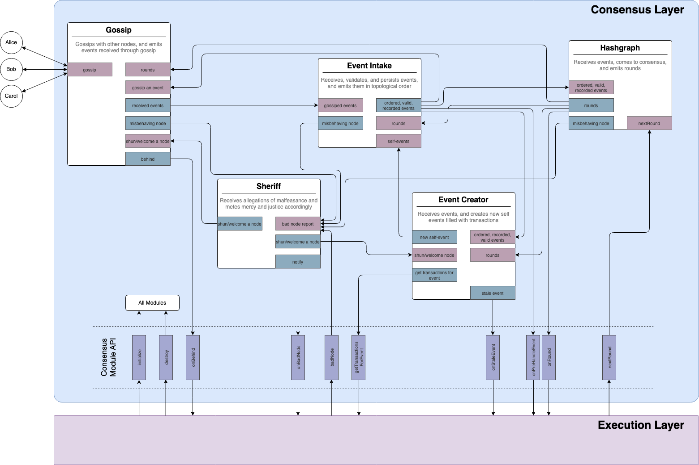
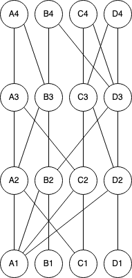
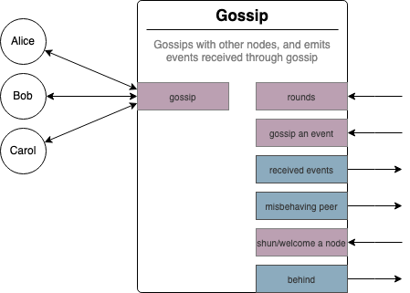
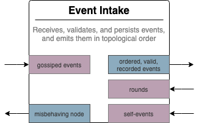
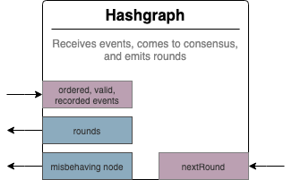
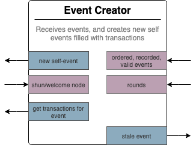
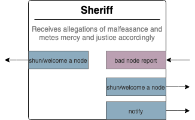
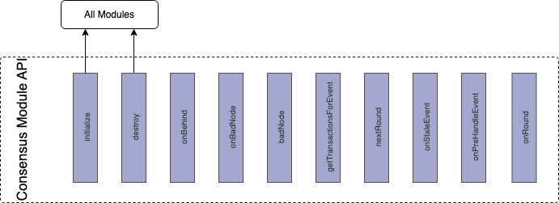

# Consensus Layer of the Consensus Node

---

## Summary

Update the architecture for the consensus node to reduce complexity, improve performance, and improve stability.

|      Metadata      |                         Entities                         |
|--------------------|----------------------------------------------------------|
| Designers          | Richard Bair, Jasper Potts, Oleg Mazurov, Austin Littley |
| Functional Impacts | Consensus Node                                           |

---

## Assumptions

1. The proposed design assumes that the work to
   [use a birth-round based definition of ancient](https://github.com/hashgraph/hedera-services/issues/13817) has been
   completed

## Purpose and Context

Much of the motivation for this design can come down to paying down technical debt and simplifying the overall design.
While the current design is full of amazing high quality solutions to various problems, it is also more complex than
necessary, leading to hard-to-find or predict bugs, performance problems, or liveness (stability) issues while under
load. This work is also necessary to prepare for autonomous node operation, and community nodes.

1. This design defines several high-level modules providing strong encapsulation and isolation with strict contracts
   between modules, leading to an overall simpler and more correct system.
2. Assumptions and requirements that led to tight coupling between modules have been revisited, and where possible,
   eliminated.
3. The two fundamental modules are "consensus" and "execution". The Consensus module takes transactions and produces
   rounds. Everything required to make that happen (gossip, event validation, hashgraph, event creation, etc.) is part
   of the Consensus module. It is a library, and instances of the classes and interfaces within this library are created
   and managed by the Execution module. The Consensus module does not persist state in the merkle tree, has no main
   method, and has minimal dependencies.
4. The Execution module is a mixture of what we have called "services" and some parts of "platform". The responsibility
   for reconnect, state saving, lifecycle, etc. will be merged with modules making up the base of the application,
   dramatically simplifying the interaction between "consensus" and "execution".
5. Maintaining high availability under unpredictable conditions ("liveness under stress"), will be designed based on a
   combination of network and individual (per-node) actions. Each node individually will do its best to deal
   gracefully when under stress, and the network as a whole will cooperate to reduce load when enough nodes in the
   network are under stress. This network-wide throttling is based on "dynamic network throttles".

The purpose of this document is not to describe the implementation details of each of the different modules. Nor does
it go into great detail about the design of the Execution module (which is primarily documented elsewhere). Instead,
it provides an overview of the whole system, with an emphasis on the Consensus module, and how the Consensus module
interacts with the Execution module.

This document supports existing features implemented in new ways, and it provides for new features (such as the dynamic
address book) which have not been implemented. After acceptance, a long series of changes will be required to modify
the existing codebase to meet this new design. This will not happen overnight, nor will it block progress on all other
initiatives. Instead, this plan provides the blueprint for our new node architecture, which we will work towards
implementing with every change we make going forward. This blueprint will also provide the framework within which we
will evaluate all other feature designs and implementations.

## Design

A group of consensus nodes together form a _consensus network_. The network, as a whole, takes as input _transactions_
and each node in the network produces as output a _blockchain_ represented as a _block stream_. Each node in the network
maintains _state_. The job of a node is to (a) work with other nodes to come to _consensus_ on which transactions to
include, (b) order those transactions and assign a _consensus timestamp_ to each transaction, (c) handle each
transaction, transitioning state from _S_ to _S'_, (d) produce blocks containing a history of inputs and state
transitions, (e) work with other nodes to sign each block, and (f) export the block.

As a decentralized network, each node can make no assumptions about the other nodes in the network. Other nodes may be
faster, or slower. They may have superior or inferior network connections. They may be far away from each other or
colocated. Each of those parameters may change over time. They may be running modified software or the official builds.
They may be honest, or dishonest. Each node must assume that just more than 2/3 of the other nodes are honest, but must
also assume that any particular node, other than itself, may be dishonest.

The network must also _as a whole_ remain resilient and operational regardless of the transaction load supplied to the
network. Nodes that are unable to keep up with the transaction load must be able to fail gracefully and rejoin the
network if conditions improve. If a sufficiently large number of nodes are unable to keep up with the transaction load,
then the network as a whole must collaborate to _throttle_ transaction ingestion to a level that will permit the network
to remain stable.

The design of the consensus node _does not require_ careful tuning for particular execution environments in order
to remain live and responsive. Indeed, it is a hard requirement that tuning _cannot be required_. It is infeasible to
test the exact configuration of a decentralized network, by definition, and therefore cannot be required for stable
operation.

The consensus node is made up of two parts, a Consensus layer, and an Execution layer. The Consensus layer takes as
input transactions and produces as output an ordered list of rounds. Each round contains the ordered and timestamped
list of transactions produced by the hashgraph consensus algorithm. The Execution layer is responsible for executing
transactions, transitioning state, producing blocks, signing blocks, and exporting blocks.

Each layer is represented by JPMS modules. The Consensus layer will actually be made up of two different modules -- an
API module and an implementation module, though unless the distinction is important, this document will usually refer
to just "the Consensus Module". The API module will define an `Interface` corresponding to the dotted-line box in the
Consensus layer blue box. The Execution implementation module will have a compile-time dependency on the Consensus
layer's API module, and a runtime dependency on the Consensus layer's implementation module.

Each submodule will likewise be defined by a pair of JPMS modules -- an API module and an implementation module. By
separating the API and implementation modules, we make it possible to supply multiple implementation modules (which is
useful for testing or future maintenance tasks), and we also support circular dependencies between modules.

### Foundational Concepts

This design relies on several foundational concepts based on the hashgraph consensus algorithm. The term "hashgraph"
refers to a data structure, while the "hashgraph consensus algorithm" refers to the particular consensus algorithm
making use of a hashgraph for the purposes of consensus. The algorithm itself is only superficially described here,
sufficient only to understand the overall system architecture.

A hashgraph is a directed acyclic graph (or DAG), made up of _events_. Each event maintains references to "parent"
events. When the hashgraph consensus algorithm runs, it collects events into _consensus rounds_. One or more rounds is
grouped together by the Execution layer, executed, and used to form a block in the blockchain.

Each event contains an ordered list of _transactions_.

Nodes create events. Each event in the hashgraph has a _creator_. The creator is the node that created the event. Each
event also has a _birth round_. This is the most recent round number known by the creator at the time it created the
event. When a node creates an event, it fills that event with some, or all, of the transactions it knows about. Each
creator creates a single event at a time, with some interval between event creations (say, every 50ms), and some maximum
network-wide configuration for the number of events per second per creator. Each event will have as a "self-parent" the
previous event created by that creator, assuming the creator remembers its previous event, and that event isn't ancient.
Each event will additionally have one or more "other parent" events created by other creators, apart from the edge cases
of network genesis and single node networks, where there may be zero other parents.

Any given node has a system clock, and this clock provides the node with the current _wall clock time_. This is the
current "real" time, as the node understands it. Since we cannot trust the clock of any particular node, we cannot trust
the wall clock time of the creator to be accurate. The creator may lie. During the execution of the hashgraph consensus
algorithm, each node will deterministically assign a _consensus time_ to each event (and thus by extension to each of
the transactions within the event).

Each node has a _roster_ listing all other nodes, their public cryptographic keys, their consensus weights (since the
network is a proof-of-stake network, different nodes may have different "weights" when voting for consensus), etc. The
cryptographic keys are used to verify that an event created by a creator was truly created by that creator. The roster
can change over time, so it is vital that the correct roster be used for verifying each event. The correct roster to use
for verifying an event is the roster that was active during that event's birth round.

The hashgraph can be organized visually in a simple series of "swim lanes", running vertically, one per creator. Each
"other parent" is a line from an event to a swimlane for another creator. Newer events are on the top of the hashgraph.

For example, in the above diagram, each event has exactly 2 parents: the self-parent, and one other-parent. Event `B3`
has as a self-parent `B2`, and an other-parent of `A2`. Events `A1`, `A2`, `A3`, and `A4` are all events created by node
`A`, while `B1`, `B2`, `B3`, and `B4` are created by node `B`, and so on.

Each node has its own copy of the hashgraph. Since events are being gossiped asynchronously throughout the network,
newer events (those at the top of the graph) may be known to some nodes, and not to others. Broken or dishonest nodes
may work to prevent some events from being known to all nodes, and thus there may be some differences in the hashgraph
of each node. But the hashgraph algorithm will, with probability 1, come to consensus given just over 2/3 of the nodes
are honest.

#### The Road to Finality

A transaction is submitted to a node in the network. This node, upon verifying the integrity of the transaction, will
include this transaction in a future event it creates. This new event is assigned a _birth round_ matching the most
recent round number of the hashgraph on the node that created the event. This birth round is used to determine which
roster should be used to verify the event, and lets other nodes in the network know how far along in processing the
hashgraph this node was at the time the event was created.

The event is then gossiped, or distributed throughout the network. Each node that receives this event validates it and
inserts it into their own copy of the hashgraph. Eventually, the hashgraph algorithm runs on each node (which may
happen at different wall clock times!) and the event will either become stale, or be included in a round. Every honest
node will always come to the same conclusion, and either determine that the event is stale, or include the event in the
same round.

Each round is then passed to the Execution layer, where the transactions in the round are executed, and the state is
transitioned accordingly. For example, hbars may be transferred from one account to another. At the end of some
deterministic number of rounds, the Execution layer will create a block. The block hash will be signed and all the
nodes together will work to sign the block (using an algorithm known as TSS). The block is then exported from the
node. In cases where a block signature can't be created in time, then validity will propagate backwards from a signature
on a future block.

Once the block is exported from the node, the transaction execution is truly final. Since the network together signed
the block, users have an iron-clad guarantee that the contents of the block represent the consensus result of executing
those transactions. Since they are included in a blockchain, there is an immutable, cryptographic proof of execution.

### Liveness Under Stress

A node is under stress when it is unable to process events fast enough to keep up with the other nodes in the network.
The network is under stress when a sufficient number of nodes are under stress. When the network is under stress, all
nodes together must work to reduce the number of transactions allowed into the network, to give the network a chance
to recover. The method by which this is done will be covered in another design document related to "dynamic throttling".

The Consensus Layer performs work on events. The more events, the more work. If events are unbounded, then a node
under stress will eventually run out of memory and crash. If there are no events, then there is virtually no CPU or
memory used by Consensus. It is therefore critical that the number of events be bounded within any given node,
even if the node is running slower than other nodes in the network. Each node must maintain _at least_ all non-ancient
events, and should maintain additional non-expired events (though these could be stored on disk to remove them from
the memory requirement of the node). In addition, _birth round filtering_ prevents a node from accepting very old or far
future events (see [Birth-Round Filtering](#birth-round-filtering)).

#### CPU Pressure

From a high level, either Execution or Consensus can be the primary bottleneck in handling events.

##### Consensus Bottlenecks

Let us suppose that we have a node, Alice. Perhaps initially Alice is able to receive and process events at the same
speed as other nodes in the network. Perhaps the network load increases past some point that Alice can handle.  At this
point, other nodes are receiving, creating, gossiping, and coming to consensus on rounds faster than Alice. Remember:

1. Birth-round filtering limits the number of events received by Alice to coincide with the pace at which Alice is
   handling consensus.
2. The Tipset algorithm only creates events when doing so will advance consensus. It relies on events that have already
   passed through Birth-round filtering.

As the other nodes progress farther than Alice, they begin to send events with newer and newer birth rounds. At some
point, they get too far ahead and begin delivering events that are too far in the future and fail to pass Alice's
birth-round filter. This prevents Alice from being overwhelmed by events.

Further, since events are coming more slowly to Alice, she will also create her own events more slowly.

Further, since events are coming more slowly to Alice, her Event Creator will update more slowly. When the tipset
algorithm is consulted for an "other parent", it will find after a short time that there are no other parents it can
select that will advance consensus. This will cause it to stop creating events until enough events from other creators
have been processed. This natural slowing of event creation provides a virtuous cycle: as each stressed node slows down
the event creation rate, it starts to create events with more and more transactions within each event and at a slower
rate. This will lead to fewer overall events, allowing it to do less work. If the node is still not able to keep up,
eventually it will refuse to accept any additional transactions from users. If enough nodes in the network are stressed,
then the overall transaction ingestion rate of the network will be reduced, further reducing the amount of work each
node has to do. Eventually, an equilibrium is reached.

If the rate at which the network is creating events slows, Alice will be able to catch up by retrieving all required
events through gossip, and will be able to process them and catch up. Or, in the last extremity where Alice has fallen
too far behind, Alice will wait for some time and reconnect.

##### Slow Execution

Under normal circumstances, the Execution layer is always the actual bottleneck. The cost of processing a few hundreds
of events pales in comparison to the cost of processing tens of thousands of transactions. Execution must therefore
provide some backpressure on Consensus. In this design, we propose that the Hashgraph module **never** runs the
consensus algorithm until it is told to do so from the Execution module.

The TCP Sliding Window is a classic technique for controlling backpressure in networking. The receiver controls the rate
of transmission by signalling to the sender how many bytes can be sent before receiving a new update from the receiver.
The same technique is used for backpressure in the HTTP2 protocol. We will use the same concept here.

Execution will instruct Consensus each time it needs additional rounds processed. It could indicate any number of
additional rounds. For each round, it will produce the appropriate roster, even if the roster doesn't change between
rounds. (And if we have any other dynamic configuration, it is also provided in like manner). Execution is therefore
responsible for dictating the rate at which rounds can be produced, providing natural backpressure. In addition, by
sending the roster information for each round, a quick and efficient mechanism is provided for deterministically
changing the roster for any given round. This is very useful for punishing malicious nodes.

By keeping Consensus tied to Execution in this way, if one node's Execution runs slowly compared to other nodes in the
network, that node will naturally handle consensus slower than the others, and will therefore eventually fall behind
and need to reconnect. Indeed, from the perspective of the rest of the consensus module, or from the other nodes in
the network, the behavior of the node in stress is **exactly the same** whether Consensus or Execution are the reason
for falling behind.

##### A Silly Example

Suppose we have a 4 node network, where 1 node is a Raspberry PI and the other 3 nodes are 64-core 256GB machines. In
this network, at 10 TPS, all 4 nodes may be able to process events and handle transactions without any problems. If the
transaction load were to increase to 10,000 TPS, then the Raspberry PI may not be able to keep up with this workload,
while the other 3 machines might. The healthy machines will continue to accept transactions and create new events, while
the machine under stress is unable to create new consensus rounds fast enough, since consensus is stalled waiting for
the Execution layer to finish processing previous rounds. As time goes on, the slow machine cannot receive all events
from other nodes, since the events are too far in the future. If this occurs, the slow machine will begin to fall
behind.

It may be that the load decreases back to a manageable level, and the Raspberry PI is able to successfully "catch up"
with the other nodes. Or, it may be that the load continues long enough that the Raspberry PI falls fully behind. At
this point, the only recourse is for the node to reconnect. This it will do, using an exponential backoff algorithm, so
that if the PI is continually falling behind, it will wait a longer and longer time before it attempts to reconnect
again.

Eventually, the PI may encounter a quieter network, and successfully reconnect and rejoin the network. Or the node
operator may decide to upgrade to a more capable machine so it can rejoin the network and participate. In either case,
the node was able to gracefully handle slow execution without having to take any direct or extraordinary action.

### Lifecycle of the Consensus Module

When Execution starts, it will (at the appropriate time in its startup routine) create an instance of Consensus, and
`initialize` it with appropriate arguments, which will be defined in detail in further documents. Critically,
Consensus **does not persist state in the merkle tree**. Execution is wholly responsible for the management of the
state. To start Consensus from a particular moment in time, Execution will need to initialize it with some information
such as the judges of the round it wants to start from. It is by using this `initialize` method that Execution is able
to create a Consensus instance that starts from genesis, or from a particular round.

Likewise, if a node needs to reconnect, Execution will `destroy` the existing Consensus instance, and create a new one,
and `initialize` it appropriately with information from the starting round, after having downloaded necessary data and
initializing itself with the correct round. Reconnect therefore is the responsibility of Execution. Consensus does not
have to consider reconnect at all.

## Modules

### Gossip

The Gossip module is responsible for gossiping messages between neighbors. The actual gossip implementation is not
described here, except to say that it will be possible to define and implement both event-aware and event-agnostic
gossip implementations either to a fully connected network or where the set of neighbors is a subset of the whole. This
document does not dictate whether raw TCP, UDP, HTTP2, gRPC, or other network protocols are used. This will be left to
the design documents for Gossip.

Gossip is the only part of Consensus that communicates over the network with gossip neighbors. When Gossip is
initialized, it is supplied a roster. This roster contains the full set of nodes participating in gossip, along with
their metadata such as RSA signing keys, IP addresses, and so forth. The Gossip module decides which neighbors to gossip
with (using whatever algorithm it chooses).

#### Events

Gossip is event-oriented, meaning that it is given events to gossip, and emits events it receives through gossip. An
implementation of Gossip could be based on a lower-level implementation based on bytes, but at the module level, it
works in terms of events.

When the Gossip module receives events through gossip, it *may* choose to perform some deduplication before sending
them to Event Intake, but it is not required to do so.

Some gossip algorithms send events in *topological order*. A neighbor may still receive events out of order, because
different events may arrive from different neighbors at different times. Events received by Gossip are not immediately
retransmitted to its neighbors. **An honest node will only send valid events through gossip**. If invalid events are
ever received, you may know the node that sent them to you is dishonest. Validating events increases latency at each
"hop", but allows us to identify dishonest gossip neighbors and discipline them accordingly. For this reason, events
received by Gossip are sent to Event Intake, which eventually send valid, ordered events _back_ to Gossip for
redistribution.

During execution, for all nodes that are online and able to keep up, events are received "live" and processed
immediately and re-gossiped. However, if a node is offline and then comes back online, or is starting back up after
reconnect, it may be missing events. In this case, the node will need to ask its neighbors for any events it is missing.

For this reason, every honest node needs to buffer some events, so when its neighbors ask it for events, it is able to
send them. The Gossip module **may** cache all non-expired events, but **must** cache all non-ancient events.
Non-expired events are crucial, because such events allow a node that is moderately far behind its neighbors to catch
back up without incurring the high cost of a reconnect. This may occur during normal operation, if a node is
experiencing stress, but is particularly likely just after having performed a reconnect. A recently reconnected node may
be several minutes behind its neighbors, but still be able to catch the rest of the way up by receiving those older
events through gossip.

#### Neighbor Discipline

If a neighbor misbehaves, the Gossip module will notify the Sheriff module that one of its neighbors is misbehaving. For
example, if a neighbor is not responding to requests, even after repeated attempts to make a TCP connection with it, it
may be "bad". Or if the neighbor is sending events that exceed an acceptable rate, or exceed an acceptable size, then it
is "bad". Or if the events it sends cannot be parsed, or are signed incorrectly, or in other ways fail validation, then
it is "bad". There may be additional rules by the Gossip module or others (such as Event Intake detecting branching)
that could lead to a neighbor being marked as "bad". A "bad" node may be dishonest, or it may be broken. The two cases
may be indistinguishable, so punishment must be adjusted based on the severity of the behavior.

If the Sheriff decides that the neighbor should be penalized, then it will instruct the Gossip module to "shun" that
neighbor. "Shunning" is a unilateral behavior that one node can take towards another, where it terminates the connection
and refuses to work further with that neighbor. If the Sheriff decides to welcome a neighbor back into the fold, it can
instruct the Gossip module to "welcome" the neighbor back.

#### Falling Behind

When a node is operating, it receives events from its neighbors through gossip. If the node for some reason is unable to
receive and process events fast enough, it may start to "fall behind" the other nodes. Perhaps Bob is processing round
200 while Alice is still on round 100. If Alice continues to fall farther and farther behind, the time may come when she
can no longer get old events from her neighbors. From the perspective of the neighbor, the events Alice says she needs
may have expired, and Bob may no longer be holding those events.

If this happens, then Alice has "fallen behind" and must reconnect. There is no longer any chance that she can get the
events she needs through gossip alone. Gossip will detect this situation and make a call through the Consensus module
interface to notify Execution that the node is behind. Execution will then initiate reconnect.

#### Roster Changes

At runtime, it is possible that the roster will change dynamically (as happens with the dynamic address book feature).
Roster changes at the gossip level may influence which neighbors the module will work with. As with all other modules
using rosters, Gossip may need a deterministic understanding of which roster applies to which round. It will receive
this information from Hashgraph in the form of round metadata.

### Event Intake

The Event Intake System is responsible for receiving events, validating them, and emitting them in *topological order*.
It also makes sure they are durably persisted before emission, which prevents branching during upgrades, and adds
resilience to the node in case of certain catastrophic failure scenarios.

#### Validation

One of the core responsibilities of Event Intake is to validate the events it has received. While this document does
not specify the validation pipeline, it will define some of the primary steps involved in validation, so as to motivate
the purpose of this module. That is, the following description is non-normative, but important for understanding the
context within which this module operates.

Event Intake receives events from gossip, or from the Event Creator module (i.e. "self-events"). Event Intake is
responsible for computing some pieces of metadata pertaining to the event, such as the event hash. Event Intake also
deduplicates events, and checks for "syntactic" correctness. For example, it verifies that all required fields are
populated. While the Gossip system has already checked to ensure the payload of the event (its transactions) are
limited in size and count, Event Intake will also check this as an additional safety measure.

If an event is valid, then we finally check the signature. Since validation and deduplication and hashing are
significantly less expensive than signature verification, we wait on signature verification until the other steps are
completed. The operating principle is that we want to fail fast and limit work for further stages in the pipeline.

If an event has a very old birth-round that is ancient, it is dropped. If a node sends a large number of ancient events,
it may end up being disciplined (the exact rules around this will be defined in subsequent design docs for the
Event Intake module).

If an event builds upon a parent with a newer birth-round than itself, then it is invalid and discarded.

#### Topological Ordering

Events are buffered if necessary to ensure that each parent event has been emitted from Event Intake before any child
events. A simple map (the same used for deduplication) can be used here. Given some event, for each parent, look up the
parent by its hash. If each parent is found in the map, then emit the event. Otherwise, remember the event so when the
missing parent is received, the child may be emitted. The current implementation uses what is known as the "orphan
buffer" for this purpose.

Since Event Intake will also maintain some buffers, it needs to know about the progression of the hashgraph,
so it can evict old events. In this case, the "orphan buffer" holds events until either the parent events have
arrived, or the events have become ancient due to the advancement of the "non-ancient event window" and the event is
dropped from the buffer. This document does not prescribe the existence of the orphan buffer or the method by which
events are sorted and emitted in topological order, but it does describe a method by which old events can be dropped.

#### Birth-Round Filtering

When an event is created, it is assigned a "birth round". This is the most recent consensus round on the node at the
time the event is created. Two different nodes in the same network might be working on very different moments in the
hashgraph timeline. One node, Alice, may be working on round 100 while a better-connected or faster node, Bob is working
on round 200. When Alice creates an event, it will be for birth-round 100, while an event created by Bob at the same
instant would be for birth-round 200.

It is not possible for any one node to get much farther ahead of all other nodes, since the only way to have a newer
birth-round is to advance the hashgraph, and that requires >2/3 of the network by stake weight. Therefore, in this
example, Alice is not just 100 rounds behind Bob, she must be 100 rounds behind at least 2/3 of the network by
stake weight, or, Bob is lying. He may create events at round 200, but not actually have a hashgraph that has advanced
to that round.

Each event must be validated using the roster associated with its birth-round. If Alice is far behind Bob, and she
receives an event for a birth-round she doesn't have the roster for, then she cannot validate the event. If the Event
Intake module receives a far-future event which cannot be validated, then the event will be dropped.

#### Self Events

Events are not only given to the Event Intake system through gossip. Self events (those events created by the node
itself) are also fed to Event Intake. These events **may** bypass some steps in the pipeline. For example, self-events
do not need validation. Likewise, when replaying events from the pre-consensus event buffer, those checks are not needed
(since they have already been proved valid and are in topological order).

#### Neighbor Discipline

During the validation process, invalid events are rejected, and this information is passed to the Sheriff module so the
offending node may be disciplined. Note that the node to be disciplined will be the node that sent this bad event, not
the creator. This information (which node sent the event) must be captured by Gossip and passed to Event Intake as part
of the event metadata.

#### Branch Detection

The Event Intake module inspects events to determine whether any given event creator is "branching" the hashgraph. A
"branch" happens when two or more different events from the same creator have the same "self-event" parent. Any node
that branches (known affectionately as a "Dirty Rotten Brancher") will be reported to the Sheriff. Branching is a sign
of either a dishonest node, or a seriously broken node. In either case, it may be subject to "shunning", and will be
reported to the Execution layer for further observation and, if required, action (such as canceling rewards for
stakers to that node).

Pre-consensus branch detection and remediation can happen quickly, but to _prove_ a node is a DRB, the check will
have to happen in the Hashgraph module. When determining to take system-wide action, only the actually proven bad
behavior post-consensus should be used.

#### Persistence

Event Intake is also responsible to durably persist pre-consensus events **before** they are emitted, but after they
have been ordered. This system is known as the "Pre-Consensus Event Stream", or PCES. The current implementation
requires coordination between the PCES and the Hashgraph component to know when to flush, and the PCES needs to know
when rounds are signed so it knows when to prune files from the PCES.

It is essential for events to be durably persisted before being sent to the Hashgraph, and self-events must be
persisted before being gossiped. While it may not be necessary for all code paths to have durable pre-consensus events
before they can handle them, to simplify the understanding of the system, we simply make all events durable before
distributing them. This leads to a nice, clean, simple understanding that, during replay, the entire system will
behave predictably.

#### Emitting Events

When the Event Intake module emits valid, topologically sorted events, it sends them to:
- The Gossip module, to be sent to gossip neighbors
- The Event Creator module, for "other parent" selection
- The Execution layer as a "pre-handle" event
- The Hashgraph module for consensus

The call to each of these systems is "fire and forget". Specifically, there is no guarantee to Execution that it will
definitely see an event via `pre-handle` prior to seeing it in `handle`. Technically, Consensus always calls
`pre-handle` first, but that thread may be parked arbitrarily long by the system and the `handle` thread may actually
execute first. This is extremely unlikely, but must be defended against in the Execution layer.

### Hashgraph Module

The Hashgraph module orders events into rounds, and assigns timestamps to events. It is given ordered, persisted
events from Event Intake. Sometimes when an event is added, it turns out to be the last event that was needed to cause
one or more entire "rounds" of events to come to consensus. When this happens, the Hashgraph module emits a `round`.
The round includes metadata about the round (the list of judge hashes, the round number, the roster, etc.) along with
the events that were included in the round, in order, with their consensus-assigned timestamps.

Rounds are immutable. They are sent "fire and forget" style from the Hashgraph module to other modules that require
them. Some modules only really need the metadata, or a part of the metadata. Others require the actual round data.
We will pass the full round info (metadata + events) to all listeners, and they can pull from it what they need.

#### Roster and Configuration Changes

When the roster (or any other network-wide configuration impacting Consensus) changes, Consensus must be updated in a
deterministic manner. This section discusses specifically how rosters are updated, but configuration in general would
use a similar path.

Execution may hold many rounds. It will have a round that is currently being signed, one that is being hashed (which
happens before signing), one that is being handled, and any number of rounds it is holding awaiting execution. It is
very likely this "awaiting execution" buffer will be a very small number, perhaps as small as 1. This number of rounds
held in buffer is completely under the control of Execution. Consensus does not concern itself with rounds once they
are handed to Execution.

Consensus **only produces rounds on demand**. Execution will ask Consensus to produce the next round. Only then does
Consensus begin inserting events into the hashgraph and executing the hashgraph consensus algorithm. When any one event
is added to the hashgraph, it may produce 0 or more consensus rounds. Events are added until at least one consensus
round is produced.

The Execution module is responsible for defining the roster. When it asks Consensus for a new round, it also supplies
the new roster. The Hashgraph module will decide in what round the new roster becomes active. Let us define `N` as the
number of rounds from the latest consensus round at which the candidate roster will become active. This number will be
configured with the same value for all nodes in the network.

For example, suppose Execution has just finished handling round 10, and has buffered up round 11. The most recent round
that the Hashgraph module produced was round 11. Suppose `N` is 10. If the call to `nextRound` from Execution at the
end of round 10 were to supply a new Roster (`R`). The Hashgraph module will assign `R` to become active as of round 22
(`latest_consensus_round + N + 1`). It will then work on producing consensus round 12. Once produced, metadata
indicating that `R` will be used for rounds starting at 22 is passed to Gossip, Event Intake, Event Creator, and
Execution. The roster used for round 22 may also be included in this metadata.

There is a critical relationship between the value of N, the latency for adopting a new roster, and the number of future
events held in memory on the node. Remember that each event has a birth-round. Let us define another variable called
`Z`, such that `Z <= N`. Any event with `birth_round > latest_consensus_round + z` is considered a "far future" event,
and will be either dropped by the birth-round filtering logic in Event Intake, or simply never sent in the first place.
Any event with `birth_round > latest_consensus_round` is just a "future" event.

The smaller the value of `Z`, the fewer events are held in memory on the node. Larger values of `Z` means more events in
memory, but it also means more "smoothing" in gossip and in handling any performance spikes. On the other hand, the
larger the value of `N`, the larger the latency between the round we know about a new roster, and the round at which it
can be actually used. Ideally, the value of `N` would be small, like 3, but we may find that 3 is too small a number for
`Z`.

Each node may select its own value of `Z`, so long as it is less than or equal to `N`. But all nodes must use the same
value for `N`, or they will ISS since they will assign different rosters to different rounds. The value of `N` is not
defined here, but will need some investigation. Unfortunately, this number appears to require "just being chosen" and
cannot be deterministically dynamically computed based on network conditions.

#### State

The Hashgraph module also includes a `state` section in the metadata of the round. This is used by the Execution layer
to persist the Consensus state, for reconnect and for restart. In the state are the judges for the round, and possibly
other information. When `initialize` is called, this same state is made available again to the Consensus node.

### Event Creator Module

Every node in the network participating in consensus is permitted to create events to gossip to neighbors. These events
are used both for transmitting user transactions, and as the basis of the hashgraph algorithm for "gossiping about
gossip". Therefore, the Event Creator has two main responsibilities:

1. Create events with "other parent(s)" so as to help the hashgraph progress consensus
2. Fill events with transactions to be sent to the network through Gossip

#### Creating Events

The Event Creator is configured with a `maximum_event_creation_frequency`, measured in events/sec. This is a network
wide setting. If any node creates events more rapidly than this setting, then the node will be reported to the Sheriff.
An event is not necessarily created at this frequency, but will be created at no more than this frequency.

When it is time to potentially create an event, the Event Creator will determine whether it *should* create the event.
It may consider whether there are any transactions to send, or whether creating an event will help advance the
hashgraph. It may decide that creating the event would be bad for the network, and veto such creation. Or it may decide
that creating the event should be permitted.

If the event is to be created, the Event Creator will decide which nodes to select as "other parents". Today, we have
exactly one "other parent" per event, but multiple "other parents" is shown to effectively reduce latency and network
traffic. While the implementation of Event Creator may choose to support only a single "other parent", the module is
designed and intended to support multiple "other parents".

#### Filling Events

Events form a large amount of the network traffic between nodes. Each event has some overhead in terms of metadata,
such as the hashes of the parent events and cryptographic signatures. Thus, for bandwidth and scalability reasons, it is
more desirable to have fewer, large events rather than many small events. On the other hand, events should be created
frequently enough to reduce the overall latency experienced by a transaction. The Event Creator is designed so as to
find the optimal balance between event creation frequency and size. The particular algorithm that does so (the Tipset
algorithm, or "Enhanced Other Parent Selection" algorithm) is not defined here, but can be found in the design
documentation for Event Creator.

When it is time to create a new event, a call is made to Execution to fill the event with user transactions. Newly
created events are sent to Event Intake, which then validates them, assigns generations, durably persists them, etc.,
before sending them out through Gossip and so forth.

#### Stale Self-Events

The Event Creator needs to know about the state of the hashgraph for several reasons. If it uses the Tipset algorithm,
then it needs a way to evict events from its internal caches that are ancient. And it needs to report "stale"
self-events to the Execution layer. A stale self-event is a self-event that became ancient without ever coming to
consensus. If the Event Creator determines that a self-event has become stale, then it will notify the Execution layer.
Execution may look at each transaction within the self-event, and decide that some transactions (such as those that have
expired or will soon expire) should be dropped while others (such as those not close to expiration) should be
resubmitted in the next event.

### Sheriff Module

When misbehavior is found for a node, it is reported to the Sheriff. This module keeps track of the different types of
misbehavior each node is accused of, and uses this information to determine whether to "shun" or "welcome" a node. It
also sends this information to the Execution layer, so it may record misbehavior in state, if it so chooses, or publish
misbehavior to other nodes in the network, allowing the network as a whole to observe and report dishonest or broken
nodes.

A node may "shun" another node, by refusing to talk with it via Gossip. If a node were to be shunned by all its
gossip neighbors, then it has been effectively removed from the network, as it can no longer submit events that will be
spread through the network, and will therefore not contribute to consensus. Should a malicious node attempt to attack
its neighbors, if those neighbors discover this attack and simply shun the node, then taking no other action, the
malicious node is prevented from causing further harm to the network.

It may be that a node is misbehaving due to a bug, or environmental issue, rather than due to malicious intent. For
example, a broken node with network trouble may attempt to create many connections, as each prior connection having
failed for some reason. But it could also be malicious intent. Unable to tell the difference, the Sheriff may decide to
shun the node for some time period, and then "welcome" it back by allowing it to form connections again. It is up to
the Sheriff's algorithms to decide on the correct response to different behaviors. These algorithms are not defined
here, but will be defined within the Sheriff's design documentation.

### Public API

The public API of the Consensus module forms the interface boundary between Consensus and Execution.

#### initialize

Called by the Execution layer when it creates a new Consensus instance. This call will include any required arguments
to fully initialized Consensus. For example, it will include any initial state corresponding to the current round
at which Consensus should begin work (such as the correct set of judges for that particular round). Each module within
Consensus supports some kind of initialization API that will be called. For example, each module must be initialized
with the initial roster for the starting round.

#### destroy

Called by the Execution layer when it destroys an existing Consensus instance. This is particularly needed to shut down
network connections held by Gossip, but could be used to stop executors, background tasks, etc. as necessary.

#### onBehind

Called by Consensus to notify Execution that the Consensus system is very far behind in processing relative to its
neighbors (most likely because it cannot find a neighbor that contains any of the events needed for advancing consensus).
Execution will use this call to initiate a reconnect procedure.

#### onBadNode

Called by Consensus to notify Execution of information about bad nodes. This can include both when a node goes "bad",
or when it is back in the good graces of the Sheriff.

#### badNode

Called by Execution to notify Consensus of information about bad nodes. The information to be passed here pertains to
coordinated enforcement decisions that the network has come to consensus on.

#### getTransactionsForEvent

Called by the Event Creator module of Consensus to give the Execution layer a chance to provide transactions for an
event. Note that, in the current system, the control is inverted -- transactions are submitted by Execution to
Consensus, which buffers them and includes them in events. As per this new design, Consensus will reach out to Execution
to ask it for all transactions that should be included in the next event, allowing the Execution layer (the application)
to decide which transactions to include.

#### nextRound

Called by the Execution layer when it is ready to receive another round from the Consensus layer. This call may contain
a new roster, if one is prepared and ready for use.

#### onStaleEvent

Called by Consensus to notify Execution when an event has become stale, giving Execution a chance to inspect the
transactions of that stale event, and resubmit those transactions in the next `onNewEvent` if they are still valid.

#### onPreHandleEvent

Called by Consensus once for each event emitted in topological order from Event Intake, giving Execution a chance to
perform some work before the event even comes to consensus.

#### onRound

Called by Consensus once for each round that comes to consensus.
