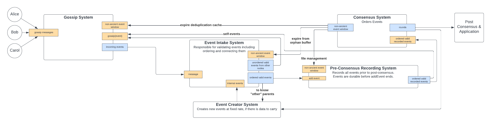
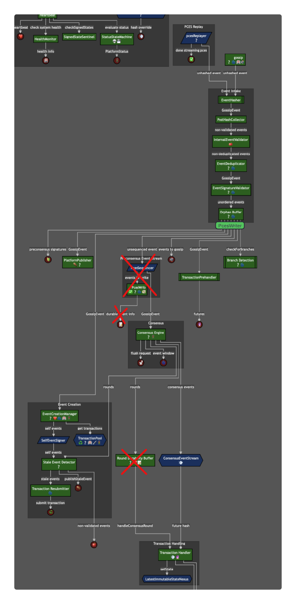

# Durably Persist Self-Events Before Gossip

---

## Summary

If a self-event is gossiped and the node is shutdown before the self-event is persisted to disk, then the node will
branch in the hashgraph on restart by building a new self-event on the same self-event parent it had previously used.
In other words, _a node must only tell the world of a self-event **after** it has recorded this information!_

This proposal ensures self-events are persisted to disk before they are gossiped. It simplifies the relationship
between the consensus engine and the PCES writer, removing the need for the PCES sequencer, the `RoundDurabilityBuffer`,
and the responsibility of the consensus engine to tell the PCES writer when to flush, while introducing negligible
additional latency.

|      Metadata      |       Entities        |
|--------------------|-----------------------|
| Designers          | Cody, Richard, Jasper |
| Functional Impacts | Platform              |
| Related Proposals  | N/A                   |
| HIPS               | N/A                   |

---

## Purpose and Context

Nodes in the network create new "self-events" on a regular basis. These self-events carry transactions that were
submitted to the node, and advance the hashgraph. When a node creates a self-event, it must build upon the previous
self-event and some "other parent" event (see the hashgraph algorithm for more details). There are two types of
branching. If a node builds two self-events on the same self-event parent, that is considered to be a branch. If a node
creates an event with no self parent and there is a non-ancient self event that could have been a self parent, that is
is also considered to be a branch. Branching in the hashgraph is considered an attack on consensus. It can be detected
deterministically and the offending node punished accordingly, protecting the integrity of the hashgraph. Therefore,
no honest node should ever branch.

Today even honest nodes can accidentally branch (in practice the probability low but not unheard of). This happens
when a node gossips a self-event and is shutdown before the event has been persisted to disk in the
Pre-Consensus Event Stream (PCES). On restart, the PCES is replayed to populate the system with missing events,
and other events that occurred since the node went down are retrieved via gossip. But there is a time between when
the node starts up and sends a new self-event and when it receives its old self-event from other nodes. During this
time, the node will build a new self-event on the same parent as the previous self-event (or with no self parent),
causing a branch.

This happens today most frequently on update boundaries when **every node** deterministically shuts down and then
starts back up. In theory it can also happen when individual nodes are restarted.

### Requirements

1. There must not be any significant impact in time-to-consensus. If there is an observed impact, all product
   stakeholders must agree that the impact is negligible
2. Self-events must be persisted before they are gossiped or handled by Hashgraph
3. Persistence must be durable even if the JVM crashes. If the host OS crashes, we accept the possibility of the loss
   of a few seconds of events. But such loss should be minimized through whatever technical mechanisms are available
   (as long as they don't compromise performance).

### Design Decisions

The flushing mechanism used by the PCES writer supports batched flushing. Each flush operation is relatively expensive,
so an explicit "flush" wire was added from the hashgraph to the PCES writer to indicate when it should flush a round.
This flush operation has to complete before the associated round can be handled, so there is also a wire from the
PCES writer to the `RoundDurabilityBuffer` to prevent handling of a round until all events within the round have been
written to disk.

We propose to remove these extra complications (PCES Sequencer, `RoundDurabilityBuffer`, consensus control of flush,
"keystone" events). Through experimentation, we have determined that the `FileChannel` API is fast enough to make the
writing of each event a synchronous operation. This means we can send events directly from event intake into the PCES,
and directly from PCES into consensus and, for self-events, into the gossip engine.

This allows us to remove the flush call and the PCES Sequencer, while also closing the loophole causing branching.

#### Alternatives Considered

##### Force the PCES to flush after the last self event is created when freezing

If the PCES is forced to flush after the last self event is created when freezing, then the PCES will be in a consistent
state when restarted. However, this does not solve the problem if a deterministic crash affects all nodes, and it does
not get us closer to the end-state of a simpler system.

##### Other Methods For Writing

We also explored several other APIs for writing events to disk (for example, memory mapped files). Of all the APIs we
explored, the `FileChannel` API was the fastest and simplest to use.

---

## Changes

### Architecture and/or Components

At a high level, the architecture remains the same: events are created by the "Event Creator System", they are gossiped
by the "Gossip System", events are handled by the "Event Intake System", persisted by the
"Pre-Consensus Recording System", and come to consensus in the "Consensus System".

In this case, we are only interested in _self events_. These are created by the `Event Creator System` and passed to
the `Event Intake System`. Here, they are ordered and validated and sent to the `Preconsensus Recording System`. Here,
they will be immediately persisted and then sent to the `Consensus System` and to the `Gossip System`.

In the short term, we will not send any events to the gossip system before they pass through the PCES system. When we
eventually deploy gossip algorithms that call for out of order transmission (e.g. chatter), we may decide to expose
other events (i.e. events not created by ourselves) to gossip before they pass through the orphan buffer.

### Impact on Wiring

#### PCES Writer

PCES Writer will be changed to use `FileChannel`. All writes will be synchronous. The PCES writer will accept an event
as input, and will return that same event once it has been written to disk. The `flush` API will be removed
(or, at least, no longer used by the consensus engine. It may be required for clean shutdown,
which will be handled by another issue).

#### Asynchronous writing changes

Currently, PCES writing happens asynchronously. That is, an event is inserted into the PCES writer, and while
the event is in the process of being written, other parts of the system utilize it. When it comes time to handle
transactions in a round, we pause if the keystone event for that round has not yet been made durable on disk.

After this change is made, no part of the system after event intake will utilize an event until it has been made
durable by the PcesWriter, except for Gossip. Gossip will only have to wait for self-events to be persisted.

#### PcesSequencer removal

The `PcesSequencer` will no longer be necessary and can be removed. There will also be no need for keystone events
within rounds.

#### RoundDurabilityBuffer removal

The `RoundDurabilityBuffer` will no longer be necessary and can be removed.

#### Diagram Changes

In this image, several existing components are crossed out. This represents a component being removed. The data will
still flow along the same pathways, but with no component on that wire.

](inlinePces.png)

### Performance

It may be that a little more latency will exist now that self events must be persisted before they are gossiped. There
is also some theoretical new latency for each event because it is written to disk before being sent to consensus. In
both cases it is expected to be negligible. If the additional latency for self-events is significant, it can present
marked impacts on stability of the system during gossip.

---

## Test Plan

### Integration Tests

- Verify that self-events are persisted before they are gossiped
- Verify that the system can handle a deterministic crash of all nodes without branching
- Verify that the system can handle a hard crash of a single node without creating a branch

### Performance Tests

- Verify that the additional latency is negligible
- Verify that the system remains stable under load testing
