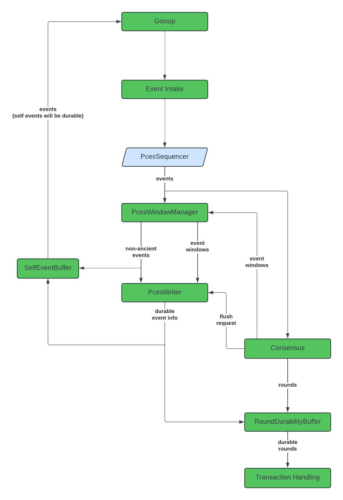

# Requirements

It should never be possible for an honest node to accidentally create a branching event.

# Proposal

## Changes to the PcesWriter

The PcesWriter now automatically initiates a flush every time it sees a self event (in addition to the regular flushes).

## Changes to Gossip

Gossip no longer receives events directly from the orphan buffer, instead it gets them from the SelfEventBuffer.

## PcesWindowManager

The "PcesWindowManager" is a new component. The functionality of the window manager is currently encapsulated within
the PCES writer, but we will need to split it out for this change.

The job of the window manager is simple. It gets as input a stream of events from the PCES sequencer, as well as event
window updates. It has two outputs: event windows (these simply pass through), and a stream of events that are
non-ancient with respect to the most recent event window. If it gets an event that is ancient with respect to the
most recent event window, it will not forward that event to its output.

The events that come out of the window manager will be fed into two locations: the SelfEventBuffer (described below)
and the PcesWriter.

The reason why this component is necessary is a bit nuanced. We never want to gossip a self event that we don't record
in our preconsensus event stream. Currently, the PcesWriter will discard ancient events without writing them to a PCES
file. If that happens to a self event, we don't want to gossip it to any of our peers. Such an event is guaranteed to
be a stale event, but without the window manager it is plausible to construct a scenario where a node forgets about a
self event and ends up branching accidentally. The window manager enables us to filter out any such events before
they can be gossiped.

## SelfEventBuffer

The "SelfEventBuffer" is a new component that is responsible for holding self events until those events become durable.

The self event buffer receives as input a stream of all events coming out of the PcesWindowManager, including events
created by other nodes. Its output is also a stream of events. When it receives an event created by another node,
it immediately passes that through to the output. When it receives a self event, it stores that in an internal buffer
until that event is durable in the PCES.

Also as input, the self event buffer receives updates from the PcesWriter on the current durability status. It uses
this to decide when/how to let self events through the buffer.

A special edge case -- the self event buffer should not hold onto self events received through gossip. Such a thing
is only plausible if a node's PCES files are either corrupted or lost, or after a very bizarre reconnect. By holding
onto self events that were not received through gossip, we never disrupt the topological ordering of events (since
it's impossible for other nodes to have built upon those events). But if we hold onto a self event that was received
through gossip, we may inadvertently send events to gossip out of topological order. Additionally, if somehow don't
know about a self event, holding that event in the self event buffer will not help us to avoid branching.

As a debugging feature, we should log a rate limited error message if the self event buffer comes in contact with
a self event that was received through gossip. Such an incident need not crash the node, but it is something that
will possibly deserve investigation.

## Feature Flag

Until we decide we want to always leave this feature enabled, it should sit behind a feature flag. If not enabled,
self events should reach gossip using the same pathway they do today.

# Risks

This new component risks increasing the time it takes for an event to reach consensus, since we are adding a delay
between the creation of a self event and the time when the event becomes eligible to be gossiped.

# Future Work

An idea has been pitched where we make the PcesWriter super, super fast (possibly by memory-mapped files). In such a
scenario, we might be able to remove the self event buffer entirely, and feed gossip from the events that come
out of the writer.

# Test Plan

## Unit Tests

Create an exhaustive set of unit tests for the PcesWindowManager. This is a simple component, so we should be able
to fully exercise all of its code paths and all corner cases. Note that some existing PcesWriter tests may need to be
modified.

Create an exhaustive set of unit tests for the SelfEventBuffer. This is a simple component, so we should be able
to fully exercise all of its code paths and all corner cases.

## Integration Tests

No new tests are required. We can remove the artificially high observing time (for the tests configured this way), and
we should no longer see branches (since honest nodes will never be able to branch).

## Performance Tests

The only way to truly get a picture of how this will perform is to test on a mainnet-sized network. We should pay
attention to C2C on nodes that are not under duress. This should have no impact on the performance of nodes that are
falling behind the rest of the network.

Note that at scale performance tests might not be a prerequisite for this merging since this feature will be able to
be disabled via a feature flag. However, performance tests are non-negotiable prior to this feature being enabled
in any production environment.