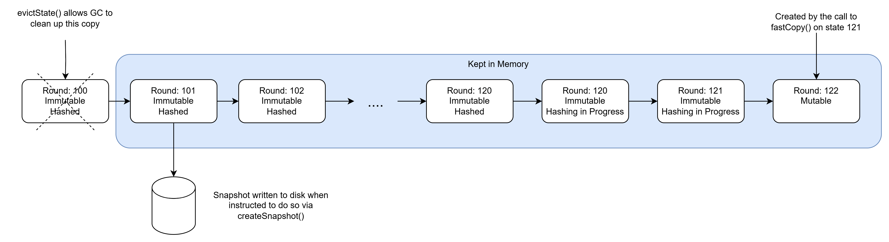

# Lifecycle management for the State

## Summary

This proposal describes a possible implementation of state lifecycle management that could work equally well for both the Consensus Node and the Block Node.

| Metadata           | Entities                                   |
|--------------------|--------------------------------------------|
| Designers          | [@imalygin](https://github.com/imalygin) |
| Functional Impacts | Consensus Node, Block Node                 |

## Purpose and Context

There is an initiative to create self-contained State modules (`swirlds-state-api` and `swirlds-state-impl`) that would have minimal dependencies, and specifically, they should not depend on `swirlds-platform-core`. Part of this initiative is the implementation of a state lifecycle management mechanism that could be used by both the Consensus Node and the Block Node.

### Requirements

- Add an interface representing state lifecycle management and its implementation.
- Update the current State API to be coherent with this State Lifecycle API.
- Implement this set of APIs and migrate the existing code to use it.

## Design & Architecture

### Java classes

- `com.swirlds.state.State` has the following lifecycle-related methods:
  - `State copy()`: creates a copy of the state, which is mutable. The source of the copy becomes immutable.
  - `void computeHash()`: computes the hash of the immutable state.
  - `void createSnapshot(Path targetPath)`: creates a snapshot of the state at the specified path.
  - `State loadSnapshot(Path sourcePath)`: loads the snapshot from the specified path.

These methods correspond to the state lifecycle as follows:

[](state-lifecycle.svg)

Note that the `loadSnapshot` method doesn't really belong to `com.swirlds.state.State`, as it's a method of the class, and in some cases, we may need to load the snapshot before we have an instance of the state. 
This method should be moved to a separate class that will be responsible for managing the state lifecycle.

`SwirldStateManager` needs refactoring. The current implementation has two sets of responsibilities:
  - Keeping track of the references to the latest immutable state and the latest mutable state. This includes creating a copy of the state and updating the references. 
  This functionality belongs to `swirlds-state-api`.   
  
  - Handling Platform-related events (belongs to `swirlds-platform-core`):
    - Handling consensus rounds.
    - Sealing consensus rounds.
    - Keeping the `freeze time` parameter up-to-date.
    - Providing state for signing.
    - Initializing the state by extracting it from the signed state.

These two sets of responsibilities should be separated. The `swirlds-state-impl` should not have any details related to the platform. However, it should provide all necessary levers for the platform to interact with the state and its lifecycle.

Therefore, `swirlds-state-api` needs a `StateManager` interface with an implementation `StateManagerImpl` in `swirlds-state-impl`  that will have the following responsibilities:
- Create an empty state
- Keeping track of the references to the latest immutable state and the latest mutable state.
- Tracking states that existed before the latest immutable state. These should be available for lookup by their round number.
- Restricts mutability of the state to a single object. That is, only one state object should be mutable only once.
- Evicting old states from memory that are no longer needed. `evictState` method *must* fail if the state is still mutable.
- Loading snapshots from the disk.

Additionally, there should be a configuration parameter that limits the number of states kept in memory. When the limit is reached, the oldest state should be evicted.
Currently, we rely on the implicit garbage collection. We have a reference count mechanism to achieve this.
We want to get rid of this mechanism and rely on the explicit eviction mechanism.

The following diagram illustrates an example of the states in memory throughout their lifecycles:

[](multi-state-management.png)

The interface will look something like this:

```java
public interface StateManager {
    State createEmptyState();
    
    State getLatestImmutableState();
    
    State getMutableState();
    
    State getState(long round);
    
    void evictState(long round);
    
    State loadSnapshot(Path sourcePath);
}
```

Note that the loaded snapshot should be treated as one of the immutable states and should be available via `getState`.

### Metrics

We need to monitor the number of states that are kept in memory to ensure there is no memory leak.

### Performance impact

There is only one important performance consideration—the number of states that are kept in memory. However, this can be mitigated by the configuration parameter that limits the number of states kept in memory. In the absence of this parameter, it should be carefully tested and monitored to prevent memory leaks.

## Testing

This functionality should be covered by a combination of unit tests and integration tests. Additionally, we need to ensure that no functionality is broken after refactoring `SwirldStateManager` and replacing it with `StateManager`.