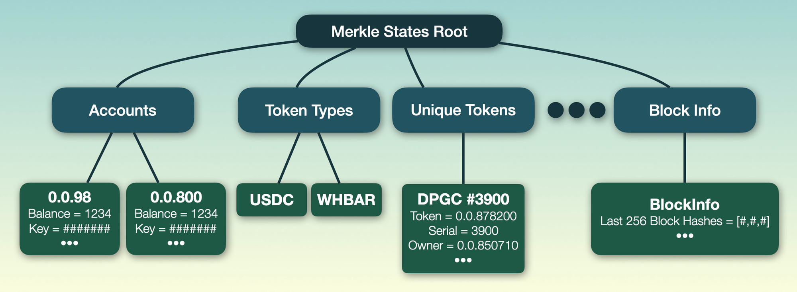

# State Refactor for State Proofs

State Proofs require these key things

* Fully specified schema for State. To be able to prove state you have to be able to understand and parse it.
* State available off consensus nodes as State Proof production needs state and can not scale solely on the consensus node. There is too much state to prove and it changes too fast
* Small simple proofs that can be sent in a few KB as input to a smart contract

To make this possible our design is to make these changes

* to record all state changes to the new block stream to allow a live state to be maintained offline from a consensus node
* Simplify and restrict state complexity so it can be specified, explained and understood
* Convert the merkle tree to 100% binary base 2 so state proof merkle paths are as small as possible.
* Move all state data to protobuf format so it can have a tight schema, be read in many languages and have a forwards/backwards compatibility story
* Make saved state snapshots 100% specified and protobuf format so they can be specified and read by other software

# New State Merkle Tree Design

So the new merkle tree design will be simplified to a single root node which contains a list of named states. Each state is one of 3 types: Map, Queue or Singleton.



> ***Simplify, Simplify & Simplify some more***

Needs to be the philosophy here, we have to make the merkle tree as simple as possible. Remove as much legacy code as possible and all unused code. The reason we need it simple is what ever we expose today will be backed into API and very hard to change in the future. For example what goes into a internal node hash. Is it just the hash of the two 48 byte hashes or is it the hash of two complex serialized objects wrapped in a parent serialized object each with lots of fluff.

The state should be 100% binary with all stored data on leaves only. All internal nodes are virtual just the hash of 2 hashes. This means all merkle paths are just a list of sibling hash and left/right pairs.

## Merkle Tree to Protobuf

### Writing to protobuf

A new method is to be added to `MerkleNode`:

```java
/**
 * Serialize this node and all its child nodes to the specified output
 * buffer in protobuf format. If a node needs to store anything aside
 * the buffer, like large binary data, it should be written to the
 * specified artifacts directory. This directory will be preserved, so
 * when a node is deserialized, directory content will be available.
 * All files written outside of the directory will be discared.
 */
void protoSerialize(WriteableSequentialData out, Path artifactsDir);
```

Artifacts dir is where a node may store additional files beyond the main state file `SignedState.pbj` For example, MerkleDb will copy (hard-link) its files to that dir rather than writing all data to the state file.

`AbstractMerkleInternal` may provide default implementation for this method by writing all child nodes (as protobuf messages, with tags and lengths) to the stream. Each child will be serialized along with its index in the parent to avoid relying on any order in the stream.

If an internal node needs to store any data beyond its children (do we really want to support it?), the corresponding class may have custom implementation of the method above, delegate to super to write children, then write its own data.

To write children, another helper method is needed in `MerkleNode`:

```java
/**
 * Returns the size, in bytes, of this object, when it is serialized to
 * protobuf format using {@link #protoSerialize()} method, including
 * all children data.
 */
int getProtoSizeInBytes();
```

### Reading from protobuf

Today the tree is read using `MerkleDataInputStream`, which reads node class IDs from the stream, creates the corresponding objects, and calls `deserialize()` methods on them. To create objects by class IDs, a constructable registry is used, which is hated by everyone.

**New proposal:**

* Rather than creating objects first, and then calling `deserialize()` on them, each (de)serializable node class will provide a constructor that accepts an instance of `ReadableSequentialData` to read from. It would eliminate need of any registries
* Every internal node class will know what child nodes it may have, and their types. Typical internal node constructor will be a loop to read the next tag from the stream, find the child type for it, create a new object passing the same input stream, and insert that object as a child. Every internal node class (there must not be many) will be a “registry” on its own
* Leaf node classes will have custom deserialization code in their constructors

At the highest level, current

```java
MerkleNode root = merkleDataInputStream.readMerkleTree(dir)
```

will be replaced with something like

```java
MerkleNode root = new MerkleHederaState(protoInputStream, dir)
```

Since applications may have different node classes used as the root of the tree, such calls will be delegated to applications, similar to how genesis states are currently constructed. The example above is valid for `Hedera`, which will use `MerkleHederaState` as the root.

### Reading and writing states

Entry points today:

* Reading states: `SignedStateFileReader.readStateFile()`, calls `MerkleDataInputStream.readMerkleTree()`
* Writing states: `SignedStateFileWriter.writeStateFileToStream()`, calls `MerkleDataOuputStream.writeMerkleTree()`

New proposal:

* `SignedStateFileReader` creates a state file, creates a `ReadableSequentialData` stream for it, then creates a new `State` (or `MerkleHederaState`, or it can be a type parameter), passing the stream and the directory path to the constructor
* `SignedStateFileWriter` creates a state file, creates a `WritableSequentialData` stream for it, then calls `protoSerialize()`, passing the stream and the directory path to this method. This mechanism may be used to write any `MerkleNode`, not just full states

### Hedera states, schemas, and codecs

Current workflow:

* `Hedera` in its constructor registers all hedera services in services registry
* Each service registers all its schemas (currently no more than one), and each schema registers all its states
* For each state, multiple class IDs are registered in `ConstructableRegistry`: OnDiskKey, OnDiskKeySerializer, OnDiskValue, etc.
* After `Hedera` object is created, a platform is initialized
* As a part of platform initialization, if a saved state exists, it’s loaded using `MerkleDataInputStream.readMerkleTree()`
* The stream relies on constructable registry and all the class IDs above to create objects and call `deserialize()` on them

Problem:

* `ConstructableRegistry` must go away
* Class IDs must go away
* Without the registry and class IDs, when a state is loaded from a protobuf stream, what key/value codecs to use for the state?

Proposal:

* `Hedera` object contains a services registry (of type `ServicesRegistryImpl`). This registry can be used to store all known key and value codecs by service name + state key
* `PlatformBuilder` already have a mechanism to delegate genesis state creation to the app. A similar mechanism can be provided to delegate loading existing state from a stream to the app.
* `Hedera` will implement this mechanism by creating a `MerkleHederaState` object from a protobuf stream - see "Reading from protobuf" section above - and providing it access to all registered codecs using the services registry
* When `MerkleHederaState` reads its state children from the stream, it will first read state metadata (service name and state key from the label, state type may be hard-coded?), then find the codecs, and provide them to the state children
* For example: `TokenService.ACCOUNTS` state is loaded. Service name is `TokenService`, state key is `ACCOUNTS`, state type is “map”. Key and value codecs for this service/state are loaded. Using these codecs, a MerkleDb data source builder is created, then created a virtual map from the input stream and the builder

## Merkle States Root

There are two proposed changes to the current tree structure.

The **first change:**


Current `MerkleHederaState` must become a root, `PlatformState` will be moved to become its child, and then `State` will be removed.

The **second change** to the root that is required for optimal state proofs. It is necessary to turn the top level n-ary tree (root + named states) into a virtual binary tree inside containing all the named states as leaves. Ideally it will store those virtual internal nodes all in a single array of hashes. When serialized it can save out the array of hash and the protobuf messages for each of its children.

## Platform State as a Singleton

### Singleton State

A singleton is a node with 2 children:

* String label for State Name
* Protobuf message for child data

When writing to disk it should have a SingletonState protobuf message with 3 fields:

* Hash of children Hashes
* String label for State Name
* Protobuf message for child data. This field is problematic as it can be one of many kinds. It seems the best solution is probably using protobuf `any` type. The other option is `oneof` with all the singleton content types. See:
  * [https://github.com/protocolbuffers/protobuf/blob/main/src/google/protobuf/any.proto](https://github.com/protocolbuffers/protobuf/blob/main/src/google/protobuf/any.proto) ## Saved State Snapshot Changes

Currently [PlatformState](/platform-sdk/swirlds-platform-core/src/main/java/com/swirlds/platform/state/PlatformState.java) is a special case node of the merkle tree. As a part of the simplification effort **it should be refacored to a set of singleton states**. Also, some of the `PlatformState code` is no longer relevant, and needs to be removed. There is a prerequsite for the `PlatformState` to become a singleton - Platform State split

### Proposed Platform State split

* `RosterMap`
  * virtual map
  * average size - 1-3
  * map of round (roster hash) → roster
  * contains (in the short term)
    * `addressBook`
    * `previousAddressBook`
  * will eventually contain lots of address books
* `TssData`
  * virtual map
* `PlatformState`
  * singleton
  * contains
    * round number
    * consensus timestamp
    * software version used to create state
    * rounds non-ancient
    * consensus snapshot
    * freeze time
    * last frozen time
    * running hashes
      * CES running hash (high number field, deprecated soon)
    * birth round migration stuff (high number field, removed post migration)
      * first version in birth round mode
      * last round before birth round mode
      * lowest judge generation before birth round mode

### Proposed clean-up

Fields to be deleted without porting:

* epoch hash
  * we no longer support emergency reconnect
* next epoch hash
  * we no longer support emergency reconnect
* uptime data
  * this is a half baked feature and not currently utilized for anything. We should reconsider how we are going to store this data when we have time to revisit the concept (risk of choosing bad protobuf definitions is too high to make it worth preserving existing functionality)

### Refactoring

Once `PlatformState` is cleaned-up and `RosterMap` and `TssData` are extracted, these objects should be turned into **singleton state objects**. This requires protobuf defintions for these objects in `HAPI` module.

Once it's done, it should be possible to **reshape Merkle tree**:

- Move `PlatformState` from the root to `MerkleHederaState`
- Replace usage of existing root of `State` type with `MerkleHederaState`
  - It would be much easier to do, if they implemented the same interface (e.g. `RootNode`). Currently there is now direct relation between these classes.
- Make sure that the state migration happens properly during the version update

# Acceptance criteria

- `PlatformState` is split according to the design proposal and these objects are refactored into singleton state objects with corresponding PBJ definition
- Merkle tree is reshaped so that `MerkleHederaState` becomes root, `PlatformState` becomes its child, and current root object is deleted
- All the state objects are defined in terms of PBJ
- Root and named states are represented with a virtual binary tree instead of n-ary tree
