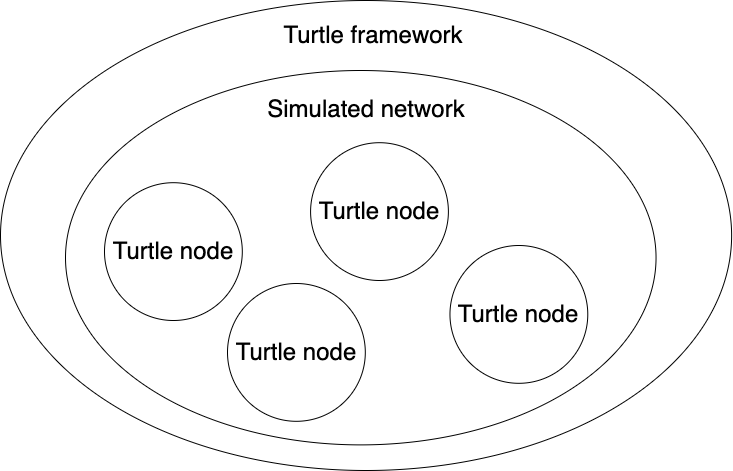
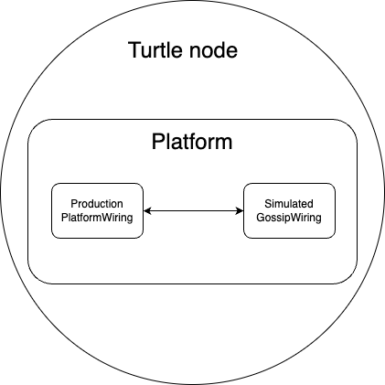
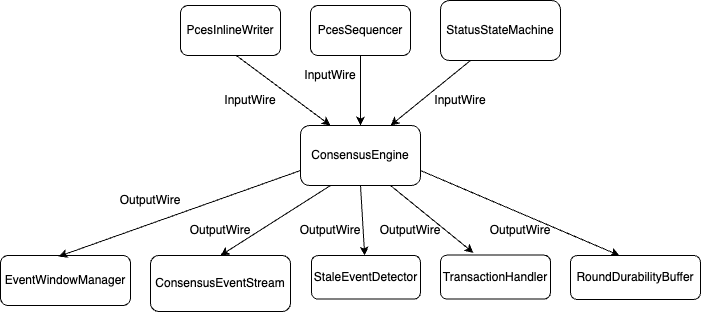
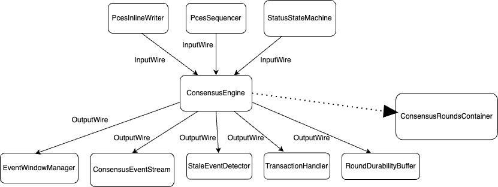
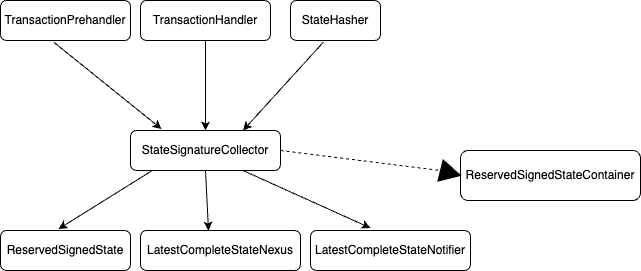

# Platform Tests Enhancement Proposal

## Summary

This design doc will serve as a proposal for enhancing the platform tests to include more comprehensive testing of the platform.
The goal is to provide a more robust testing experience with the option of adding future test cases covering the upcoming feature.

Currently we have several types of tests in the platform.

The first one is standard unit tests on class level that cover the functionality of the classes.

The second one is a more focused and specialized testing framework that builds ConsensusTests. It uses a special GraphGenerator that builds
a graph of events of different order and structure that is served as an input. Using mocked and fake components and wiring,
the events are consumed and processed, checking the validity of the consensus algorithm. These tests include a small combination
of components and functionalities but is relatively focused on a specific part of the platform - for the time being events and their consensus order.

The third type includes a Turtle framework that builds end to end scenarios aiming to mimic the real world platform execution and lifecycle. It is not
very developed but has a potential to be a powerful way to test integration scenarios.

The fourth one is a set of testing apps that cover specific pre-handle and handle scenarios. Each of these apps works in combination
with an instance of the platform and by executing them, we can test the platform's behaviour in a specific scenario. The aim, however is that
the Turtle framework to substitute the need of these different apps by covering their logic with a corresponding test case.

### Turtle Framework

The current structure of the framework consists of a simulated network that holds of a set of nodes. The network
keeps track of all submitted events by a given node, as well as a simulated gossip instance for each node. The network
allows submission of an event from the behalf of a given node and controlling the time that elapses in this simulated network.
You can move forward a specific amount of time that you want to advance in the simulated network. Then, all accumulated
events that have been submitted during that period will be gossiped and executed.

### Turtle Node

The turtle node is a representation of a real node that runs in the simulated turtle framework. Each node
builds its own Platform instance using the wiring mechanism used on production and all of the real components. One
exception is the Gossip instance, which is replaced by a simulated gossip instance. The reason is achieving time
control - how much the whole network to be running and advancing time in the platform execution.
This also saves time for execution and performing test cases.

### Current test workflow

The current test is building up a simulated network consisting of 4 nodes for a period of 5 minutes. However, there are no
assertions in the test and the data produced as a resource from executing the test is not cleaned up.

This document serves as a proposal to enhance the current structure of the tests, mainly to add proper initial assertions.

For a straight positive scenario that can be tested, we can perform some basic checks like the following:
- validate events are ordered properly in consensus as a result of the consensus algorithm
- validate state is properly signed by the platform

In order to achieve these assertions, we should collect the events produced by consensus for each node and the state signed by each node.
We can assert this behaviour at a predefined fixed period of time, to keep less memory footprint and stop the test as early as possible,
in case of mismatch between the expected and the actual results.

In addition, we should have proper validation logic to make these assertions. Since they might be common for a lot of the
turtle test cases, as well as some of the ConsensusTests, we can have common static validations extracted as some sort of validation utility.

To achieve getting the events and state produced by a given TurtleNode for a given period of time, we should make some changes to the
platform wiring mechanism, without affecting the production code.

When this refactoring is in place, we can enhance the components we are interested in, with these special output wires that can collect the output
data of the component. Similarly, in the future we can add more wires for other components that we might need to test.

#### ConsensusEngine wiring changes

ConsensusEngine is the main component that is responsible for the consensus algorithm. It is the component that consumes events and outputs them in consensus order.

Currently, we have the following structure of the ConsensusEngine wiring:

We can add an additional output wire that will collect the events produced by the consensus algorithm into a small test component that stores them.
This wire will be used only for testing purposes. Additionally, the assertion logic for the events might also be part of this component.

This will be a light-weight option to get real objects from the platform execution. The wiring will look like this:

#### StateSignatureCollector wiring changes

StateSignatureCollector is the component that is responsible for collecting hashed states and signatures from different nodes. After a majority
of the signatures are collected, the state is signed.

If we want to validate that the state is properly signed, we can solder a test output wire to the StateSignatureCollector, so that we collect signed states
in a test component and assert that they have been properly signed. The assertion logic might be inside the component for the sake of simplicity.

### Platform wiring adaptation

In order to allow plugging test output wires to the production setup, the `PlatformWiring` component should be adapted.

The easiest approach will be to expose the production output wires we are interested in and this will allow us
to solder the test output wires to them. This will not affect the production code and will allow us to collect all of the needed data
that is outputed from the component we are interested in.
