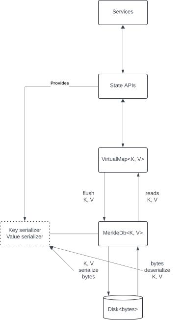
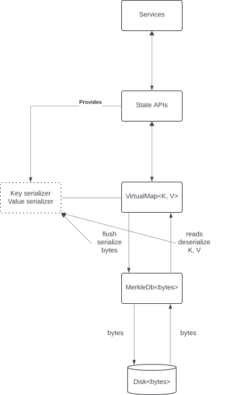

# Virtual Mega Map - binary MerkleDb proposal

---

## Summary

`Virtual Mega Map` is an effort to refactor Hedera ledger state to be a single virtual map instead of
the current N-ary merkle tree. This proposal is focused on the data source (`MerkleDb` data source)
part of it. The data source is not exposed to the application directly, it's used internally by
`VirtualMap`, which is in turn accessible from Hedera services code via the States APIs.

## Purpose and Context

Historically, virtual maps and MerkleDb databases were designed to store entities of particular
types. In Java code, `VirtualMap` class is defined like this:

```java
public final class VirtualMap<K extends VirtualKey, V extends VirtualValue>
        extends PartialBinaryMerkleInternal
        implements ExternalSelfSerializable, Labeled, MerkleInternal {
    // ...
}
```

`VirtualDataSource` and `VirtualDataSourceBuilder` interfaces are strictly typed, too:

```java
public final class MerkleDbDataSource<K extends VirtualKey, V extends VirtualValue>
        implements VirtualDataSource<K, V> {
    // ...
}
```

To store different entity types - accounts, tokens, smart contracts bytecode, etc. - multiple
`VirtualMap` instances were used, each backed by its own `MerkleDb` database instance. All these
virtual maps were different internal nodes in the whole merkle state tree.

With `Virtual Mega Map`, all data will be stored in a single huge virtual map. Since entities are of
different types, virtual maps (and `MerkleDb`) must be improved to be able to store multiple types.
There are several approaches how to implement this. A decision was made to change `MerkleDb`
databases to work with binary data (byte arrays) rather than with strongly typed objects. A similar
change will be done at the `VirtualMap` level, it will be tracked in a separate document.

This proposal is scoped to `VirtualDataSource` in general and `MerkleDbDataSource` in particular.
Expected `MerkleDbDataSource` class definition:

```java
public final class MerkleDbDataSource implements VirtualDataSource {
    // ...
}
```

## Architecture

### Diagrams

|              Current              |                Proposal                |
|-----------------------------------|----------------------------------------|
|  |  |

### Java classes

`VirtualDataSource` interface is changed to work with bytes:

* `loadLeafRecord()` now returns a `VirtualLeafBytes` (was: `VirtualLeafRecord`)
* `saveRecords()` now accepts streams of `VirtualLeafBytes` (was: streams of `VirtualLeafRecord`)

`VirtualLeafBytes` is a binary counterpart of the existing `VirtualLeafRecord`. It also contains a
path, a key, and a value, but the key and the value are immutable `Bytes` (PBJ type), not typed
`VirtualKey` and `VirtualValue` subclasses.

### Serialization

Virtual leaf records are serialized to bytes at the virtual map level before they get flushed to
disk:

* Copy flushes: in `VirtualRootNode`
* Reconnect flushes: in `AbstractHashListener`

Serialization is done using `KeySerializer` and `ValueSerializer`. These interfaces are moved from
MerkleDb to VirtualMap Java modules. Key and value serializer instances are now provided by the app
to virtual maps, not to MerkleDb data sources. Serializers implementation is not changed, they are
100% compatible with old versions to avoid data migration.

The only change is when the serializers are used. Previously they were called in MerkleDb code, when
data was written to disk. With the new approach, they are called in VirtualMap.

### Deserialization

All keys and values are stored as untyped bytes objects on disk. When they are read from disk,
MerkleDb returns them as bytes (`VirtualLeafBytes` objects) to the caller, usually `RecordAccessorImpl`.
At that level, the bytes are deserialized to Java key and value objects using the same serializers as
in the section above.

Previously, MerkleDb not only read data from disk, but also deserialized it to Java objects and return
them to callers.

### API changes

MerkleDb is a backing store for `VirtualMap`, however, it used to be accessed directly from the app
code for one particular reason: when a virtual map was created, the app provided MerkleDb data source
configuration to it. The configuration included key and value serializers and a few other params.

Now the serializers are moved to `VirtualMap`, while the data source will not need them anymore.
Application code has to be changed to provide the serializers to `VirtualMap` rather than to MerkleDb.

`KeySerializer` and `ValueSerializer` interfaces are moved from one package to another, but all
interface methods are the same. Application code needs to be updated to use the new package (and
another Java module).

## Compatibility and Migration

No data migration is expected at this point. Data on disk is stored in the same format (100% byte to
byte compatibility) as previously.

### Key and value serializer objects

When a new virtual map is created, it gets key and value serializers from the app. However, there
is a number of already created maps in the old states. They are not created from scratch, but loaded
from state snapshots. Such virtual maps rely on the MerkleDb to provide the serializers. Despite
MerkleDb no longer uses serializers, it can still load them from disk (from the MerkleDb configuration),
if available. When a virtual map is loaded from a state snapshot, and the snapshot is old (before
MerkleDb is switched to work with bytes), the map will query the data source for key and value serializers
to use. The steps will be:

* When a data source is loaded from a snapshot, it reads its table config from MerkleDb metadata. If key /
  value serializers are there, they are loaded. If not - no error
* When a virtual map is loaded from a snapshot, it checks its serialization version. Based on the version,
  it will either deserialize the serializers or not
* If the version is "old", and no serializers are available, the virtual map will get them from the data
  source, it's guaranteed to have them because of the version (if for some reason there are no serializers,
  an exception is thrown)
* When a virtual map is created from scratch, it will have the serializers set explicitly, it won't try to
  load them from the data source

### Key hash codes

MerkleDb uses key hash codes internally. They are literally results of `Object.hashCode()` calls on
virtual key objects. With this proposal, MerkleDb no longer has access to virtual keys, only key bytes.
Hash codes on the bytes may not be the same as hash codes of the corresponding key objects. If bytes
hash codes are used, it would result in data loss.

To fix it, all data source calls that deal with virtual keys accept key hash codes in addition to
key bytes:

```java
   VirtualLeafBytes loadLeafRecord(final Bytes keyBytes, final int keyHashCode) throws IOException;

    long findKey(final Bytes keyBytes, final int keyHashCode) throws IOException;
```

## Testing

This feature doesn't add any new functionality. There is no need to create new unit tests. The
existing unit tests must be updated according to API and class changes above:

* `VirtualDataSource` interface methods are changed to use bytes
* `VirtualDataSourceBuilder` interface methods are changed
* Many MerkleDb classes are changed to use bytes
* When a virtual map is created, it now needs key and value serializers. Previously it was only
  needed, if the map used MerkleDb data source, but not other data sources, e.g.
  `InMemoryDataSource`

MerkleDb unit tests are affected the most. Majority of virtual map unit tests require little to
no updates.

### Migration testing

No changes are expected to data files on disk. This has to be tested thoroughly. Existing state
snapshots, e.g. from mainnet, from old software versions can be used to start a node with
MerkleDb changes. The node must be able to start fine, and all data from the snapshots must be
accessible.

## Related changes

State validation tool uses some MerkleDb classes to validate data files on disk. Some of these
classes will be changed to use bytes rather than objects. Validation tool sources should be
updated accordingly.

## Performance

Performance impact has to be measured carefully. There are no flow changes in how data is stored
to disk or read back. However, there are changes to when and how virtual keys and values are
converted to bytes and vice versa.

Previously, during flush, an entity (virtual key and value) was stored in the node cache as a
Java object, passed to MerkleDb, and written to disk using key and value serializers. The
serializers wrote key and value bytes directly to the file. With the new approach, entities
are serialized to bytes before flush. It results in extra Java byte array allocations. Then
these byte arrays are written to the files.

MerkleDb has a read cache. It will be changed to contain byte arrays (`Bytes` objects) instead
of strictly typed virtual records. It will eliminate a need to create record copies every time
the cache is hit. This should improve object allocations a little bit.
