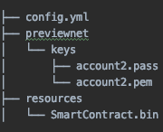

# Yahcli v0.0.1
A command line interface that is able to perform the following actions against a specified network.

1. Account Operations
    1. Get Balance
2. System File Operations
    1. Download all/specific file
    2. Upload a System File.
3. Fees Operations
    1. List Basic Transaction and Query fees of all/specific service.

## Getting Started
### Setting up your environment

Create a folder structure like this.<br>


The _config.yml_ should have contents like:

```
networks:
   previewnet:
     nodes:
       - { id: 0, account: 3, ipv4Addr: 35.231.208.148 }
```

You can add details of mulitple networks to this config file with appropriate ipv4Addresses.

_SmartContract.bin_ could be any smartContract bytecode that you want calculate transaction and query fees for.

Run the following command:
```
docker run -v $(pwd):/launch gcr.io/hedera-registry/yahcli:0.0.1 help
```

This will list the possible commands that you can execute using the current version deployed to _gcr.io/hedera-registry_

```
Usage: yahcli [-c=yahcli config YAML] [-f=fee to offer] [-n=target network]
                 [-p=payer] [COMMAND]
Perform operations against well-known entities on a Hedera Services network
 -c, --config=yahcli config YAML

 -f, --fixed-fee=fee to offer

 -n, --network=target network

 -p, --payer=payer
Commands:
 help      Displays help information about the specified command
 accounts  Perform account operations
 sysfiles  Perform system file operations
 fees      Perform system fee operations
``` 

For example, to download the feeSchedule from previewnet:
```
docker run -v $(pwd):/launch gcr.io/hedera-registry/yahcli:0.0.1 -p 2 -n previewnet sysfiles download fees
```

If you dont specify a destination directory, by default the file will be downloaded to `previewnet/sysfiles/`

